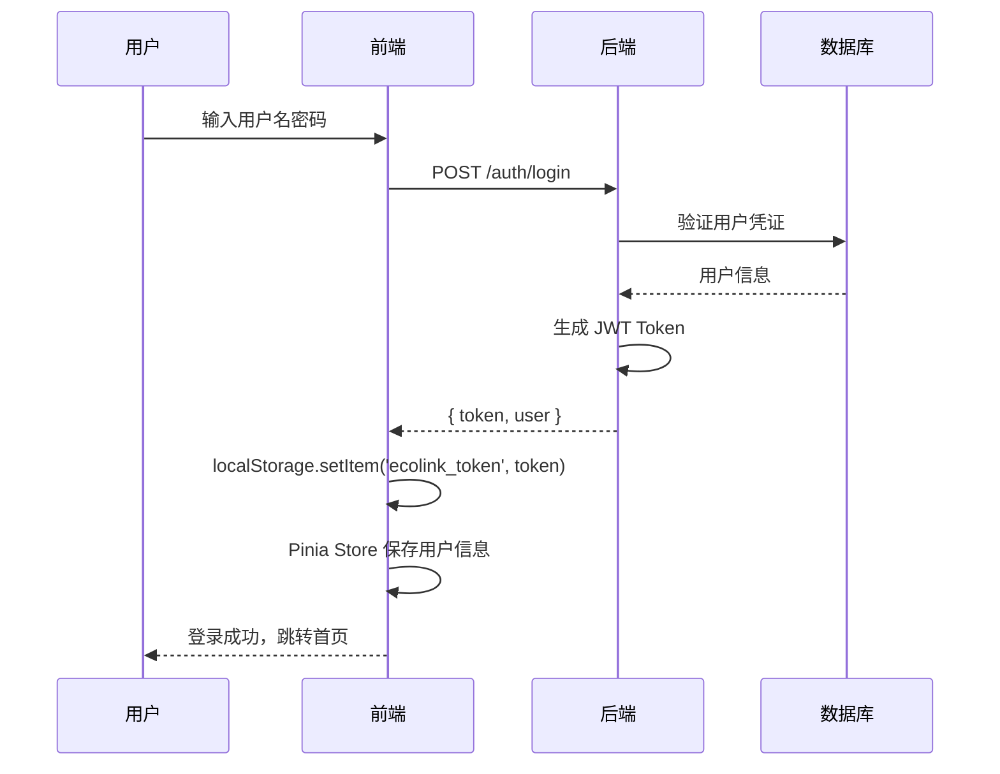

EcoLink 是一个专注于绿色生态农产品的 B2C 电商平台，采用前后端分离架构设计，为用户提供从商品浏览、购物车管理到订单支付的全链路购物体验，同时配备功能完善的后台管理系统。

Sources: [index.html](index.html#L7-L8) [package.json](package.json#L1-L4) [server/pom.xml](server/pom.xml#L1-L6)

## 项目定位与核心价值

本项目面向对健康有机食品有需求的用户群体，打造简洁直观的购物界面。系统支持商品多维度筛选、品牌分类导航、购物车批量操作、订单状态实时追踪等核心功能。后台管理模块提供销售数据可视化、库存预警、订单状态流转等运营支撑能力。

Sources: [src/router/index.ts](src/router/index.ts#L1-L40) [src/api/index.ts](src/api/index.ts#L1-L103)

## 技术栈全景

### 前端技术选型

| 层级 | 技术方案 | 版本 | 作用说明 |
|------|----------|------|----------|
| 核心框架 | Vue 3 | ^3.5.18 | 组合式 API (Composition API) 构建响应式界面 |
| 构建工具 | Vite | ^7.1.3 | 高速开发服务器与生产构建 |
| 类型系统 | TypeScript | ~5.9.2 | 编译时类型检查，提升代码质量 |
| 样式方案 | Tailwind CSS | ^4.1.14 | 原子化 CSS 快速实现设计系统 |
| 路由管理 | Vue Router | ^4.5.1 | SPA 路由与导航守卫 |
| 状态管理 | Pinia | ^3.0.3 | 轻量级 Store 状态管理 |
| HTTP 客户端 | Axios | ^1.13.1 | RESTful API 调用封装 |
| 图标方案 | Material Symbols | — | Google 矢量图标库 |

前端采用 Vite 开发服务器运行于 `3000` 端口，支持热模块替换与快速刷新。

Sources: [package.json](package.json#L1-L28) [vite.config.ts](vite.config.ts#L1-L14) [index.html](index.html#L9-L17)

### 后端技术选型

| 层级 | 技术方案 | 版本 | 作用说明 |
|------|----------|------|----------|
| 核心框架 | Spring Boot | 3.3.5 | 约定优于配置的开箱即用框架 |
| 安全框架 | Spring Security | — | 认证授权与 JWT 集成 |
| 持久化 | Spring Data JPA | — | ORM 映射与 Repository 自动化 |
| 数据库 | MySQL | 8.x | 关系型数据存储 |
| 迁移工具 | Flyway | — | 数据库版本化管理 |
| API 文档 | SpringDoc OpenAPI | 2.6.0 | Swagger UI 自动生成 |
| JWT 库 | jjwt | 0.12.6 | Token 生成与解析 |
| Java 版本 | JDK 17 | 17 | LTS 版本保证 |

后端服务默认运行于 `8080` 端口，API 统一前缀为 `/api/v1`。

Sources: [server/pom.xml](server/pom.xml#L1-L100) [server/src/main/resources/application.yml](server/src/main/resources/application.yml#L1-L36)

## 项目架构总览

```mermaid
graph TB
    subgraph 前端层["前端层 (Vue 3 + Vite)"]
        FE_VUE["Vue 3 应用"]
        FE_ROUTER["Vue Router<br/>路由守卫"]
        FE_STORES["Pinia Stores<br/>认证/购物车/Toast"]
        FE_API["API 模块<br/>HTTP + Mock 回退"]
    end

    subgraph 后端层["后端层 (Spring Boot)"]
        BE_CTRL["Controller 层<br/>业务入口"]
        BE_SERVICE["Service 层<br/>业务逻辑"]
        BE_REPO["Repository 层<br/>数据访问"]
        BE_SECURITY["Spring Security<br/>JWT 认证"]
    end

    subgraph 数据层["数据层"]
        MYSQL["MySQL 数据库"]
        FLYWAY["Flyway 迁移脚本"]
    end

    FE_VUE --> FE_ROUTER
    FE_VUE --> FE_STORES
    FE_VUE --> FE_API
    FE_API -->|"HTTP / Mock| BE_CTRL
    BE_CTRL --> BE_SERVICE
    BE_SERVICE --> BE_REPO
    BE_REPO --> MYSQL
    FLYWAY -.->|"版本化管理| MYSQL
    BE_SECURITY -->|"Token 验证| BE_CTRL"
```

Sources: [src/App.vue](src/App.vue#L1-L23) [src/main.ts](src/main.ts#L1-L8) [src/api/http.ts](src/api/http.ts#L1-L83)

## 目录结构

```
EcoLink/
├── index.html              # 单页应用入口
├── package.json            # 前端依赖配置
├── vite.config.ts          # Vite 构建配置
├── tsconfig.json           # TypeScript 配置
├── src/                    # 前端源代码
│   ├── main.ts             # 应用初始化
│   ├── App.vue             # 根组件
│   ├── index.css           # Tailwind 入口 + CSS 变量
│   ├── api/                # API 调用封装
│   │   ├── http.ts         # Axios 核心 + 拦截器
│   │   ├── index.ts        # 业务 API (商品/购物车/订单)
│   │   ├── admin.ts        # 后台管理 API
│   │   └── mock.ts         # Mock 数据回退
│   ├── components/         # 通用组件
│   │   ├── AppHeader.vue   # 页头导航
│   │   ├── AppFooter.vue   # 页脚
│   │   ├── AppToast.vue    # 通知提示
│   │   └── ProductCard.vue # 商品卡片
│   ├── views/              # 页面视图
│   │   ├── HomeView.vue    # 首页
│   │   ├── SearchView.vue  # 搜索结果
│   │   ├── ProductDetailView.vue  # 商品详情
│   │   ├── CartView.vue    # 购物车
│   │   ├── OrdersView.vue  # 订单列表
│   │   ├── PaymentView.vue # 支付页面
│   │   ├── ProfileView.vue # 个人中心
│   │   ├── LoginView.vue   # 登录
│   │   ├── RegisterView.vue # 注册
│   │   └── admin/          # 后台管理页面
│   ├── router/index.ts     # 路由配置 + 守卫
│   ├── stores/             # Pinia 状态库
│   │   ├── auth.ts         # 认证状态
│   │   ├── cart.ts         # 购物车状态
│   │   └── toast.ts        # 通知状态
│   └── types/api.ts        # API 类型定义
├── server/                 # 后端服务
│   ├── pom.xml             # Maven 依赖配置
│   └── src/main/
│       ├── java/com/ecolink/
│       │   ├── controller/      # REST 控制器
│       │   ├── service/         # 业务服务层
│       │   ├── repository/      # 数据访问层
│       │   ├── domain/          # 实体类
│       │   ├── dto/             # 数据传输对象
│       │   ├── security/        # 安全配置
│       │   ├── config/          # 框架配置
│       │   └── exception/       # 异常处理
│       └── resources/
│           ├── application.yml # 应用配置
│           └── db/migration/   # Flyway 迁移脚本
└── docs/wiki/              # 项目文档
```

Sources: [get_dir_structure](get_dir_structure#L1-L50) [server/src/main](server/src/main#L1-L25)

## 核心功能模块

### 客户端功能 (C端)

| 模块 | 功能描述 |
|------|----------|
| **商品浏览** | 首页商品展示、分类筛选、价格区间筛选、排序功能 |
| **商品搜索** | 关键词全文搜索、搜索历史记录 |
| **商品详情** | 多图展示、商品描述、库存状态、销售数据 |
| **购物车** | 添加/删除商品、数量修改、实时价格计算 |
| **订单管理** | 订单创建、地址选择、订单列表查看 |
| **支付流程** | 模拟支付、支付状态更新 |
| **个人中心** | 用户信息管理、收货地址管理、收藏夹 |
| **认证模块** | 用户注册、登录登出、JWT Token 管理 |

Sources: [src/router/index.ts](src/router/index.ts#L12-L32) [src/stores/auth.ts](src/stores/auth.ts#L1-L52)

### 后台管理功能 (Admin)

| 模块 | 功能描述 |
|------|----------|
| **仪表盘** | 实时统计数据、近期订单、热销商品展示 |
| **商品管理** | 商品 CRUD、上下架管理、库存预警 |
| **分类管理** | 分类增删改、排序调整、启用/禁用 |
| **订单管理** | 订单列表、状态流转、订单详情查看 |

后台路由统一挂载在 `/admin` 路径下，通过 `requiresAdmin` 路由元信息进行权限校验。

Sources: [src/router/index.ts](src/router/index.ts#L33-L55) [src/api/admin.ts](src/api/admin.ts#L1-L93)

## API 设计规范

系统采用 RESTful 风格设计，所有接口返回统一格式：

```typescript
interface ApiResponse<T> {
  code: number;      // 状态码，0 表示成功
  message: string;   // 提示信息
  data: T;           // 业务数据
  timestamp?: string; // 时间戳
}
```

| 端点前缀 | 说明 |
|----------|------|
| `/api/v1/auth/*` | 认证相关 (注册/登录/用户信息) |
| `/api/v1/products/*` | 商品相关 (列表/详情/分类) |
| `/api/v1/cart/*` | 购物车相关 |
| `/api/v1/orders/*` | 订单相关 |
| `/api/v1/addresses/*` | 收货地址相关 |
| `/api/v1/favorites/*` | 收藏夹相关 |
| `/api/v1/admin/*` | 后台管理接口 |

Sources: [src/api/http.ts](src/api/http.ts#L1-L83) [src/types/api.ts](src/types/api.ts#L1-L4)

## 认证机制

系统采用 **JWT (JSON Web Token)** 实现无状态认证：

1. 用户登录成功后，服务端签发包含用户信息的 Token
2. 前端将 Token 存储于 `localStorage` (`ecolink_token`)
3. 每次 API 请求通过 `Authorization: Bearer <token>` 头部携带
4. Token 有效期默认 **24 小时**，过期后自动跳转登录页



Sources: [src/stores/auth.ts](src/stores/auth.ts#L18-L25) [src/api/http.ts](src/api/http.ts#L11-L15)

## 设计系统

项目定义了完整的设计令牌 (Design Tokens)，基于绿色生态主题：

```css
:root {
  --ec-primary: #2e8a56;        /* 主色-森林绿 */
  --ec-primary-strong: #19663b;/* 主色-深绿 */
  --ec-accent: #ca8a04;        /* 强调色-琥珀金 */
  --ec-bg: #eef4ee;            /* 背景色 */
  --ec-surface: #ffffff;       /* 卡片表面 */
  --ec-text: #163120;          /* 主文本色 */
  --ec-text-light: #597165;    /* 次要文本 */
  --ec-border: #d3e1d6;        /* 边框色 */
}
```

Sources: [src/index.css](src/index.css#L15-L27)

## 快速开始

本项目需要同时启动前端开发服务器和后端服务：

**前置条件**：
- Node.js 18+
- JDK 17+
- MySQL 8.x

**启动步骤**：

```bash
# 1. 初始化数据库
# 创建 MySQL 数据库 ecolink，然后启动服务自动执行 Flyway 迁移

# 2. 启动后端
cd server
./mvnw spring-boot:run
# 服务运行于 http://localhost:8080

# 3. 启动前端
npm install
npm run dev
# 服务运行于 http://localhost:3000
```

Sources: [server/src/main/resources/application.yml](server/src/main/resources/application.yml#L1-L36) [package.json](package.json#L6-L7)

## 相关文档

- [快速开始](2-kuai-su-kai-shi) — 详细的环境配置与运行指南
- [系统架构总览](3-xi-tong-jia-gou-zong-lan) — 架构设计与模块划分
- [前端目录结构与模块划分](4-qian-duan-mu-lu-jie-gou-yu-mo-kuai-hua-fen) — 前端代码组织详解
- [Vue Router 路由与权限守卫](5-vue-router-lu-you-yu-quan-xian-shou-wei) — 路由配置与鉴权流程
- [Pinia 状态管理与认证存储](6-pinia-zhuang-tai-guan-li-yu-ren-zheng-cun-chu) — 状态管理设计
- [Axios 封装与 Mock 回退机制](7-axios-feng-zhuang-yu-mock-hui-tui-ji-zhi) — HTTP 层设计
- [后端分层架构设计](8-hou-duan-fen-ceng-jia-gou-she-ji) — Spring Boot 分层结构
- [JWT 认证与 Token 生成解析](10-jwt-ren-zheng-yu-token-sheng-cheng-jie-xi) — 安全认证机制
- [数据库表结构与 ER 模型](11-shu-ju-ku-biao-jie-gou-yu-er-mo-xing) — 数据模型设计