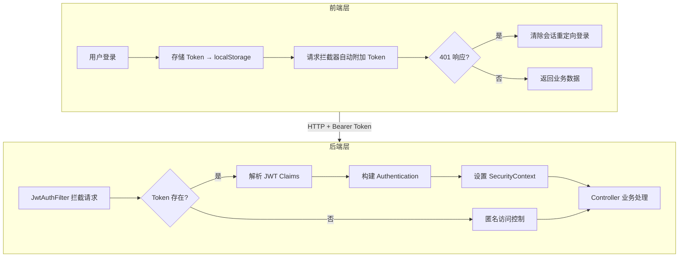
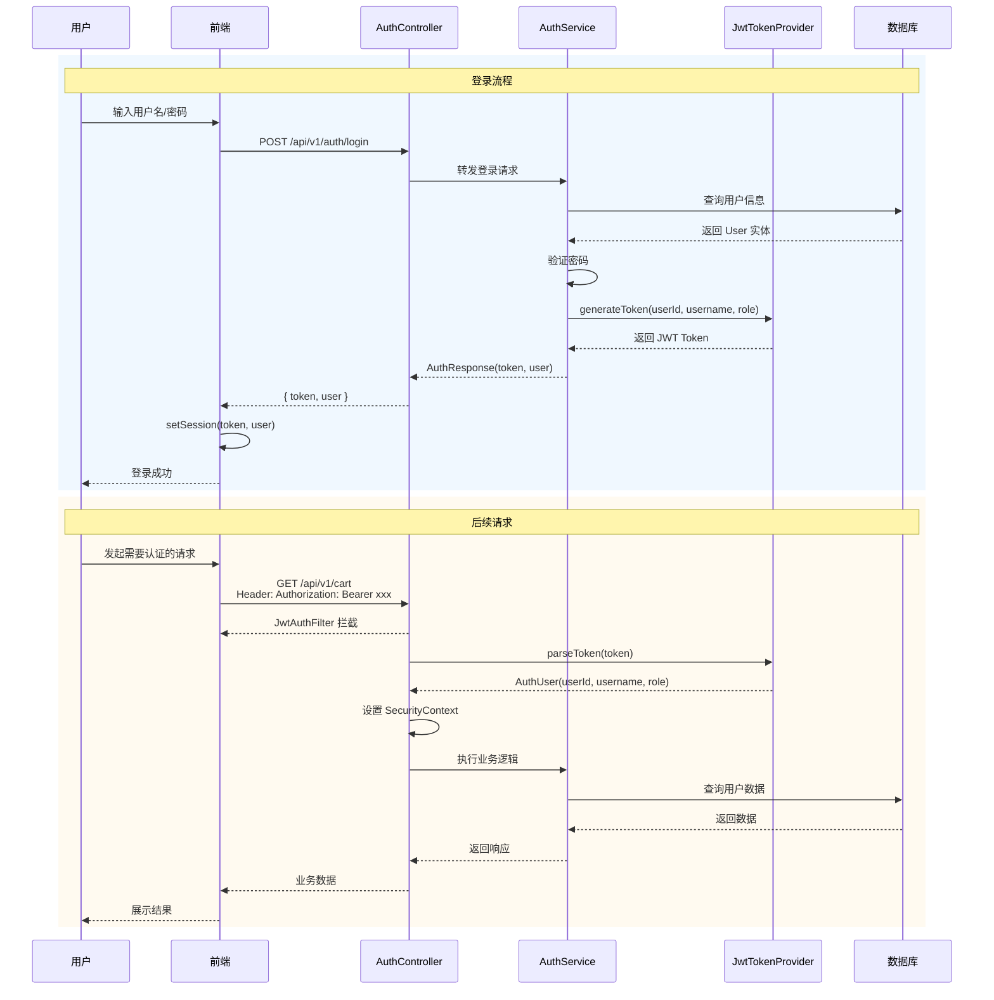

本文档深入解析 EcoLink 项目中 JWT（JSON Web Token）认证机制的实现原理，涵盖后端 Token 生成与验证、前端请求拦截、以及 Spring Security 集成等核心环节。通过理解这一认证架构，开发者能够掌握无状态身份验证的完整链路。

## 系统架构概览

EcoLink 采用**无状态 JWT + 有状态 Security Context**的混合认证模式。服务端通过 JWT 实现跨请求的用户身份传递，Spring Security 利用 Filter Chain 在每个请求中解析 Token 并重建安全上下文。这种设计既保证了分布式部署下的会话无状态性，又兼容了 Spring Security 的基于角色的权限控制体系。



## 核心组件详解

### 1. JWT 配置属性

`JwtProperties` 是 JWT 相关配置的统一管理类，通过 `@ConfigurationProperties` 注解绑定 `application.yml` 中的配置项：

```java
@Data
@Component
@ConfigurationProperties(prefix = "app.jwt")
public class JwtProperties {
    private String issuer;        // Token 签发者
    private String secret;        // HMAC 签名密钥（至少 32 字符）
    private int expireHours;      // 过期时间（小时）
}
```

| 配置项 | 来源 | 默认值 | 说明 |
|--------|------|--------|------|
| `app.jwt.issuer` | 环境变量/配置文件 | `ecolink` | Token 标识 |
| `app.jwt.secret` | 环境变量 | `ecolink-super-secret-key-for-local-dev-please-change` | HMAC-SHA 密钥 |
| `app.jwt.expire-hours` | 环境变量 | `24` | 有效期（小时） |

Sources: [JwtProperties.java](server/src/main/java/com/ecolink/server/security/JwtProperties.java#L1-L15)
Sources: [application.yml](server/src/main/resources/application.yml#L33-L35)

### 2. Token 生成与解析

`JwtTokenProvider` 是认证系统的核心服务类，负责 Token 的创建与验证：

```java
@Component
public class JwtTokenProvider {
    private final JwtProperties jwtProperties;

    public String generateToken(Long userId, String username, String role) {
        Instant now = Instant.now();
        Instant exp = now.plus(jwtProperties.getExpireHours(), ChronoUnit.HOURS);
        return Jwts.builder()
                .issuer(jwtProperties.getIssuer())
                .subject(String.valueOf(userId))           // userId 存储在 subject
                .claim("username", username)                // 自定义 claim
                .claim("role", role)                        // 角色信息
                .issuedAt(Date.from(now))                   // 签发时间
                .expiration(Date.from(exp))                 // 过期时间
                .signWith(secretKey())                     // HMAC-SHA 签名
                .compact();
    }

    public AuthUser parseToken(String token) {
        Claims claims = Jwts.parser()
            .verifyWith(secretKey())                       // 验证签名
            .build()
            .parseSignedClaims(token)                      // 解析 Claims
            .getPayload();
        // 从 Claims 中提取用户信息
        Long userId = Long.parseLong(claims.getSubject());
        String username = claims.get("username", String.class);
        String role = claims.get("role", String.class);
        return new AuthUser(userId, username, role);
    }
}
```

**Token 结构解析**：

| Claim | 来源 | 用途 |
|-------|------|------|
| `iss` | issuer 配置 | 标识 Token 签发方 |
| `sub` | userId | 用户唯一标识 |
| `username` | 用户名 | 显示/记录用途 |
| `role` | 用户角色 | 权限判断 |
| `iat` | 当前时间 | 计算 Token 生效时间 |
| `exp` | iat + expireHours | Token 失效时间 |

Sources: [JwtTokenProvider.java](server/src/main/java/com/ecolink/server/security/JwtTokenProvider.java#L1-L54)

### 3. 认证过滤器

`JwtAuthFilter` 继承自 `OncePerRequestFilter`，确保每个请求仅被拦截一次：

```java
@Component
public class JwtAuthFilter extends OncePerRequestFilter {
    private final JwtTokenProvider jwtTokenProvider;

    @Override
    protected void doFilterInternal(
            HttpServletRequest request,
            HttpServletResponse response,
            FilterChain filterChain) throws ServletException, IOException {
        
        String authHeader = request.getHeader(HttpHeaders.AUTHORIZATION);
        if (authHeader != null && authHeader.startsWith("Bearer ")) {
            String token = authHeader.substring(7);  // 提取 Token 字符串
            try {
                AuthUser authUser = jwtTokenProvider.parseToken(token);
                
                // 将项目角色转换为 Spring Security 角色格式
                String springRole = "ROLE_" + (authUser.role() != null ? authUser.role() : "USER");
                List<SimpleGrantedAuthority> authorities = 
                    List.of(new SimpleGrantedAuthority(springRole));
                
                // 构建 Spring Security 认证对象
                User principal = new User(authUser.id().toString(), "", authorities);
                UsernamePasswordAuthenticationToken authentication =
                    new UsernamePasswordAuthenticationToken(principal, null, authorities);
                authentication.setDetails(new WebAuthenticationDetailsSource().buildDetails(request));
                
                // 设置到 SecurityContext（线程本地存储）
                SecurityContextHolder.getContext().setAuthentication(authentication);
            } catch (Exception ignored) {
                // Token 无效时不抛出异常，交给后续鉴权流程处理
            }
        }
        filterChain.doFilter(request, response);  // 继续执行后续 Filter
    }
}
```

**关键设计点**：
- 异常被静默捕获 —— 无效 Token 不会中断请求链，而是降级为匿名访问
- 自动角色前缀转换 —— 项目中的 `ADMIN` 角色自动转换为 Spring Security 的 `ROLE_ADMIN`
- 线程本地存储 —— `SecurityContextHolder` 使用 `ThreadLocal` 保证线程安全

Sources: [JwtAuthFilter.java](server/src/main/java/com/ecolink/server/security/JwtAuthFilter.java#L1-L54)

### 4. 安全上下文工具类

`SecurityUtils` 提供从 SecurityContext 中提取当前用户信息的工具方法：

```java
public final class SecurityUtils {
    public static long currentUserId() {
        Authentication authentication = SecurityContextHolder.getContext().getAuthentication();
        if (authentication == null || !(authentication.getPrincipal() instanceof User user)) {
            throw new BizException(4010, "请先登录");
        }
        return Long.parseLong(user.getUsername());  // Principal.username 即为 userId
    }
}
```

Sources: [SecurityUtils.java](server/src/main/java/com/ecolink/server/security/SecurityUtils.java#L1-L19)

## Spring Security 配置

`SecurityConfig` 定义了完整的过滤器链和权限规则：

```java
@Configuration
public class SecurityConfig {
    @Bean
    public SecurityFilterChain securityFilterChain(HttpSecurity http) throws Exception {
        return http
            .csrf(AbstractHttpConfigurer::disable)                    // 禁用 CSRF（API 场景）
            .cors(Customizer.withDefaults())                          // 启用 CORS
            .sessionManagement(session -> 
                session.sessionCreationPolicy(SessionCreationPolicy.STATELESS))  // 无状态会话
            .authorizeHttpRequests(auth -> auth
                // 公开接口（无需认证）
                .requestMatchers(
                    "/swagger-ui/**",
                    "/v3/api-docs/**",
                    "/actuator/health",
                    "/api/v1/auth/**",        // 登录/注册
                    "/api/v1/categories/**",  // 分类查询
                    "/api/v1/products/**"     // 商品查询
                ).permitAll()
                // 管理员接口（需要 ADMIN 角色）
                .requestMatchers("/api/v1/admin/**").hasRole("ADMIN")
                // 其他接口需认证
                .anyRequest().authenticated()
            )
            .exceptionHandling(ex -> ex
                .authenticationEntryPoint((request, response, authException) -> {
                    response.setStatus(HttpServletResponse.SC_UNAUTHORIZED);
                    response.setContentType("application/json;charset=UTF-8");
                    response.getWriter().write("{\"code\":4010,\"message\":\"未登录或登录已过期\"}");
                })
            )
            // 将 JwtAuthFilter 添加到 UsernamePasswordAuthenticationFilter 之前
            .addFilterBefore(jwtAuthFilter, UsernamePasswordAuthenticationFilter.class)
            .build();
    }
}
```

**公开接口白名单**：

| 路径模式 | 用途 |
|----------|------|
| `/swagger-ui/**`, `/v3/api-docs/**` | API 文档（开发环境） |
| `/actuator/health` | 健康检查 |
| `/api/v1/auth/**` | 认证接口（登录/注册/获取当前用户） |
| `/api/v1/categories/**` | 分类列表 |
| `/api/v1/products/**` | 商品查询 |

Sources: [SecurityConfig.java](server/src/main/java/com/ecolink/server/config/SecurityConfig.java#L1-L79)

## 认证服务实现

`AuthService` 整合密码验证与 Token 生成：

```java
@Service
public class AuthService {
    // 登录流程
    public AuthResponse login(LoginRequest request) {
        User user = userRepository.findByUsername(request.username())
            .orElseThrow(() -> new BizException(4003, "账号或密码错误"));
        
        if (user.getStatus() != UserStatus.ACTIVE) {
            throw new BizException(4004, "账号已禁用");
        }
        if (!passwordEncoder.matches(request.password(), user.getPasswordHash())) {
            throw new BizException(4003, "账号或密码错误");
        }
        
        // 生成 JWT Token
        String token = jwtTokenProvider.generateToken(
            user.getId(), 
            user.getUsername(), 
            user.getRole()
        );
        return new AuthResponse(token, toUserMe(user));
    }
    
    // 注册流程
    @Transactional
    public AuthResponse register(RegisterRequest request) {
        if (userRepository.existsByUsername(request.username())) {
            throw new BizException(4002, "用户名已存在");
        }
        // 创建用户（默认角色为 USER）
        User user = new User();
        user.setUsername(request.username());
        user.setPasswordHash(passwordEncoder.encode(request.password()));
        user.setNickname(request.nickname());
        user.setPhone(request.phone());
        user.setStatus(UserStatus.ACTIVE);
        userRepository.save(user);
        
        // 立即登录并返回 Token
        String token = jwtTokenProvider.generateToken(
            user.getId(), 
            user.getUsername(), 
            user.getRole()
        );
        return new AuthResponse(token, toUserMe(user));
    }
}
```

**错误码对照表**：

| 错误码 | 含义 | HTTP 状态 |
|--------|------|-----------|
| 4002 | 用户名已存在 | 400 |
| 4003 | 账号或密码错误 | 400 |
| 4004 | 账号已禁用 | 400 |
| 4010 | 未登录或 Token 过期 | 401 |

Sources: [AuthService.java](server/src/main/java/com/ecolink/server/service/AuthService.java#L1-L72)

## 前端集成机制

### Token 存储与会话管理

Pinia Auth Store 负责前端会话状态管理：

```typescript
export const useAuthStore = defineStore('auth', () => {
  const token = ref(localStorage.getItem('ecolink_token') || '');
  const user = ref<UserMe | null>(null);

  const isLogin = computed(() => Boolean(token.value));
  const isAdmin = computed(() => user.value?.role === 'ADMIN');

  function setSession(newToken: string, newUser: UserMe) {
    token.value = newToken;
    user.value = newUser;
    localStorage.setItem('ecolink_token', newToken);
  }

  function clearSession() {
    token.value = '';
    user.value = null;
    localStorage.removeItem('ecolink_token');
  }

  return { token, user, isLogin, isAdmin, setSession, clearSession, ... };
});
```

Sources: [auth.ts](src/stores/auth.ts#L1-L52)

### Axios 请求拦截器

HTTP 客户端自动处理 Token 附加与 401 响应：

```typescript
const client = axios.create({
  baseURL: import.meta.env.VITE_API_BASE_URL || 'http://localhost:8080/api/v1',
  timeout: 15000,
});

// 请求拦截：自动附加 Bearer Token
client.interceptors.request.use((config) => {
  const token = localStorage.getItem('ecolink_token');
  if (token) {
    config.headers.Authorization = `Bearer ${token}`;
  }
  return config;
});

// 响应拦截：处理认证失效
client.interceptors.response.use(
  (response) => response,
  (error) => {
    if (error.response?.status === 401) {
      handleAuthExpired();
    }
    return Promise.reject(error);
  },
);

function handleAuthExpired() {
  localStorage.removeItem('ecolink_token');
  if (window.location.pathname !== '/login') {
    window.location.href = '/login';  // 重定向到登录页
  }
}
```

Sources: [http.ts](src/api/http.ts#L1-L83)

## 完整认证流程时序



## 依赖版本说明

项目使用 `jjwt 0.12.6`（2024 年最新稳定版）：

```xml
<properties>
    <jjwt.version>0.12.6</jjwt.version>
</properties>
<dependencies>
    <dependency>
        <groupId>io.jsonwebtoken</groupId>
        <artifactId>jjwt-api</artifactId>
        <version>${jjwt.version}</version>
    </dependency>
    <dependency>
        <groupId>io.jsonwebtoken</groupId>
        <artifactId>jjwt-impl</artifactId>
        <version>${jjwt.version}</version>
        <scope>runtime</scope>
    </dependency>
    <dependency>
        <groupId>io.jsonwebtoken</groupId>
        <artifactId>jjwt-jackson</artifactId>
        <version>${jjwt.version}</version>
        <scope>runtime</scope>
    </dependency>
</dependencies>
```

| 依赖 | 用途 |
|------|------|
| `jjwt-api` | API 接口定义 |
| `jjwt-impl` | 实现逻辑 |
| `jjwt-jackson` | JSON 序列化（Jackson 集成） |

Sources: [pom.xml](server/pom.xml#L1-L100)

## 进阶阅读

- 欲了解完整的安全策略配置，包括 CORS 和管理员权限控制，请参阅 [Spring Security 权限配置](18-spring-security-quan-xian-pei-zhi)
- 欲了解后端分层架构如何支撑认证服务，请参阅 [后端分层架构设计](8-hou-duan-fen-ceng-jia-gou-she-ji)
- 欲了解数据库中用户表的设计，请参阅 [数据库表结构与 ER 模型](11-shu-ju-ku-biao-jie-gou-yu-er-mo-xing)