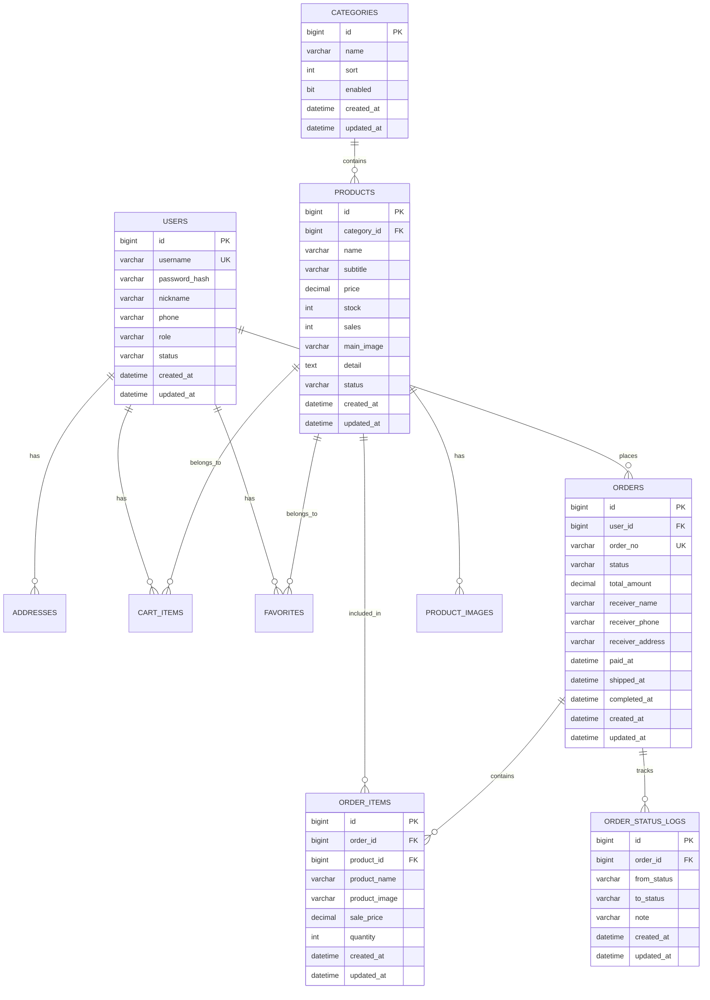
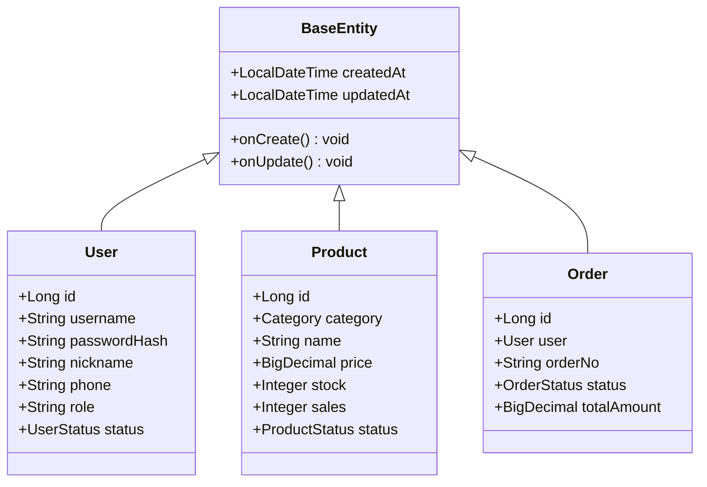
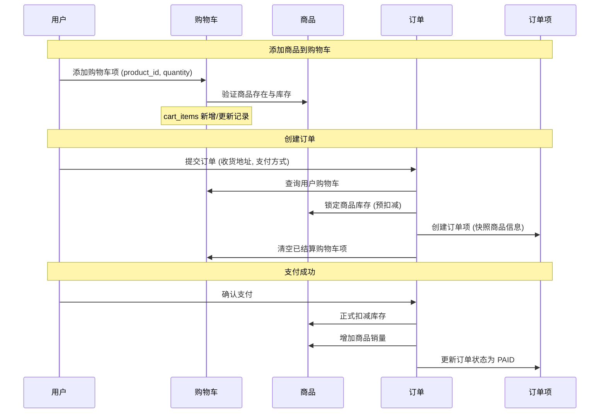

EcoLink 项目采用 MySQL 作为数据存储引擎，通过 Flyway 进行数据库版本化管理。本文档详细阐述系统核心实体的表结构设计、字段约束以及实体间的关联关系，为理解系统数据流提供坚实的理论基础。

Sources: [V1__schema.sql](server/src/main/resources/db/migration/V1__schema.sql#L1-L129), [application.yml](server/src/main/resources/application.yml#L1-L36)

## 数据库整体架构概览

EcoLink 数据库采用**星型模型**结构，以用户、商品、订单三大核心实体为中心，向外辐射出收藏、购物车、地址、评价等多个业务维度。这种设计既保证了数据的一致性，又为业务扩展预留了充足空间。



Sources: [Product.java](server/src/main/java/com/ecolink/server/domain/Product.java#L1-L46), [Order.java](server/src/main/java/com/ecolink/server/domain/Order.java#L1-L52)

## 核心实体详细设计

### 1. 用户表（users）

用户表是系统的基础认证单元，采用单表设计支持用户角色区分。系统通过 `role` 字段区分普通用户（USER）和管理员（ADMIN），通过 `status` 字段控制账号的启用状态。

| 字段名 | 数据类型 | 约束 | 说明 |
|--------|----------|------|------|
| id | BIGINT | PRIMARY KEY, AUTO_INCREMENT | 用户唯一标识 |
| username | VARCHAR(50) | NOT NULL, UNIQUE | 登录用户名 |
| password_hash | VARCHAR(255) | NOT NULL | BCrypt 加密后的密码 |
| nickname | VARCHAR(50) | NOT NULL | 用户昵称 |
| phone | VARCHAR(20) | NULLABLE | 手机号码 |
| role | VARCHAR(20) | NOT NULL, DEFAULT 'USER' | 角色标识（USER/ADMIN） |
| status | VARCHAR(20) | NOT NULL | 账号状态（ACTIVE/BANNED） |
| created_at | DATETIME | NOT NULL | 创建时间 |
| updated_at | DATETIME | NOT NULL | 更新时间 |

**设计要点**：密码存储采用 Spring Security 的 BCrypt 编码器，支持 `{bcrypt}$2a$10$...` 格式的加密字符串。同时支持 `{noop}` 前缀用于开发环境的明文测试。

Sources: [User.java](server/src/main/java/com/ecolink/server/domain/User.java#L1-L36), [V3__admin_role.sql](server/src/main/resources/db/migration/V3__admin_role.sql#L1-L8)

### 2. 分类表（categories）

分类表采用扁平化结构设计，通过 `sort` 字段实现人工排序，`enabled` 字段支持软删除功能。系统预置了四类商品分类：新鲜瓜果、时令蔬菜、肉禽蛋奶、地方特产。

| 字段名 | 数据类型 | 约束 | 说明 |
|--------|----------|------|------|
| id | BIGINT | PRIMARY KEY, AUTO_INCREMENT | 分类唯一标识 |
| name | VARCHAR(50) | NOT NULL | 分类名称 |
| sort | INT | NOT NULL, DEFAULT 0 | 排序权重 |
| enabled | BIT | NOT NULL, DEFAULT 1 | 是否启用 |
| created_at | DATETIME | NOT NULL | 创建时间 |
| updated_at | DATETIME | NOT NULL | 更新时间 |

Sources: [Category.java](server/src/main/java/com/ecolink/server/domain/Category.java#L1-L25), [V2__seed.sql](server/src/main/resources/db/migration/V2__seed.sql#L1-L6)

### 3. 商品表（products）

商品表是电商系统的核心实体，包含商品基本信息、价格库存、销售数据等多维度信息。表结构设计遵循**反范式化原则**，在订单详情中冗余存储商品快照（名称、图片、价格），确保历史订单数据的独立性。

| 字段名 | 数据类型 | 约束 | 说明 |
|--------|----------|------|------|
| id | BIGINT | PRIMARY KEY, AUTO_INCREMENT | 商品唯一标识 |
| category_id | BIGINT | NOT NULL, FK(categories) | 所属分类 |
| name | VARCHAR(120) | NOT NULL | 商品名称 |
| subtitle | VARCHAR(500) | NULLABLE | 商品副标题 |
| price | DECIMAL(10,2) | NOT NULL | 销售单价 |
| stock | INT | NOT NULL, DEFAULT 0 | 库存数量 |
| sales | INT | NOT NULL, DEFAULT 0 | 累计销量 |
| main_image | VARCHAR(500) | NULLABLE | 主图 URL |
| detail | TEXT | NULLABLE | 详细描述（富文本） |
| status | VARCHAR(20) | NOT NULL | 上下架状态 |
| created_at | DATETIME | NOT NULL | 创建时间 |
| updated_at | DATETIME | NOT NULL | 更新时间 |

**索引策略**：系统为 `products` 表创建了复合索引 `idx_products_category_status_price`，支持按分类、状态、价格区间的高效筛选查询。

Sources: [V1__schema.sql](server/src/main/resources/db/migration/V1__schema.sql#L21-L37), [Product.java](server/src/main/java/com/ecolink/server/domain/Product.java#L1-L46)

### 4. 商品图片表（product_images）

商品图片表采用**一对多关联**设计，支持单个商品配置多张展示图片。通过 `sort` 字段控制图片展示顺序，`main_image` 字段冗余存储于 products 表以优化列表页查询性能。

| 字段名 | 数据类型 | 约束 | 说明 |
|--------|----------|------|------|
| id | BIGINT | PRIMARY KEY, AUTO_INCREMENT | 图片唯一标识 |
| product_id | BIGINT | NOT NULL, FK(products) | 所属商品 |
| image_url | VARCHAR(500) | NOT NULL | 图片 URL |
| sort | INT | NOT NULL, DEFAULT 0 | 排序权重 |
| created_at | DATETIME | NOT NULL | 创建时间 |
| updated_at | DATETIME | NOT NULL | 更新时间 |

Sources: [ProductImage.java](server/src/main/java/com/ecolink/server/domain/ProductImage.java#L1-L26)

### 5. 购物车表（cart_items）

购物车表实现用户与商品的**多对多关联**，通过唯一约束 `uk_cart_items_user_product` 确保同一用户对同一商品只能有一条购物车记录。当用户修改数量时，系统直接更新该记录而非新增删除。

| 字段名 | 数据类型 | 约束 | 说明 |
|--------|----------|------|------|
| id | BIGINT | PRIMARY KEY, AUTO_INCREMENT | 购物车项唯一标识 |
| user_id | BIGINT | NOT NULL, FK(users) | 所属用户 |
| product_id | BIGINT | NOT NULL, FK(products) | 商品 ID |
| quantity | INT | NOT NULL | 购买数量 |
| created_at | DATETIME | NOT NULL | 创建时间 |
| updated_at | DATETIME | NOT NULL | 更新时间 |

**性能优化**：为 `user_id` 字段创建索引 `idx_cart_items_user`，加速用户购物车列表查询。

Sources: [CartItem.java](server/src/main/java/com/ecolink/server/domain/CartItem.java#L1-L29), [V1__schema.sql](server/src/main/resources/db/migration/V1__schema.sql#L72-L84)

### 6. 收藏表（favorites）

收藏表记录用户的商品收藏行为，与购物车表结构类似，采用 `uk_favorites_user_product` 唯一约束防止重复收藏。

| 字段名 | 数据类型 | 约束 | 说明 |
|--------|----------|------|------|
| id | BIGINT | PRIMARY KEY, AUTO_INCREMENT | 收藏唯一标识 |
| user_id | BIGINT | NOT NULL, FK(users) | 所属用户 |
| product_id | BIGINT | NOT NULL, FK(products) | 商品 ID |
| created_at | DATETIME | NOT NULL | 创建时间 |
| updated_at | DATETIME | NOT NULL | 更新时间 |

Sources: [Favorite.java](server/src/main/java/com/ecolink/server/domain/Favorite.java#L1-L26)

### 7. 收货地址表（addresses）

收货地址表支持用户管理多个收货地址，通过 `is_default` 字段标识默认地址。订单创建时优先使用默认地址，也可临时选择其他地址。

| 字段名 | 数据类型 | 约束 | 说明 |
|--------|----------|------|------|
| id | BIGINT | PRIMARY KEY, AUTO_INCREMENT | 地址唯一标识 |
| user_id | BIGINT | NOT NULL, FK(users) | 所属用户 |
| receiver_name | VARCHAR(50) | NOT NULL | 收货人姓名 |
| receiver_phone | VARCHAR(20) | NOT NULL | 收货人电话 |
| detail | VARCHAR(500) | NOT NULL | 详细地址 |
| is_default | BIT | NOT NULL, DEFAULT 0 | 是否默认 |
| created_at | DATETIME | NOT NULL | 创建时间 |
| updated_at | DATETIME | NOT NULL | 更新时间 |

Sources: [Address.java](server/src/main/java/com/ecolink/server/domain/Address.java#L1-L32)

### 8. 订单表（orders）

订单表是交易流程的核心载体，包含订单状态机、金额计算、物流时间戳等多个关键字段。订单号（order_no）全局唯一，采用分布式 ID 生成策略保证高并发下的唯一性。

| 字段名 | 数据类型 | 约束 | 说明 |
|--------|----------|------|------|
| id | BIGINT | PRIMARY KEY, AUTO_INCREMENT | 订单唯一标识 |
| user_id | BIGINT | NOT NULL, FK(users) | 下单用户 |
| order_no | VARCHAR(40) | NOT NULL, UNIQUE | 订单编号 |
| status | VARCHAR(20) | NOT NULL | 订单状态 |
| total_amount | DECIMAL(10,2) | NOT NULL | 订单总额 |
| receiver_name | VARCHAR(50) | NOT NULL | 收货人姓名 |
| receiver_phone | VARCHAR(20) | NOT NULL | 收货人电话 |
| receiver_address | VARCHAR(500) | NOT NULL | 收货人地址 |
| paid_at | DATETIME | NULLABLE | 支付时间 |
| shipped_at | DATETIME | NULLABLE | 发货时间 |
| completed_at | DATETIME | NULLABLE | 完成时间 |
| created_at | DATETIME | NOT NULL | 创建时间 |
| updated_at | DATETIME | NOT NULL | 更新时间 |

**订单状态枚举**：`UNPAID`（待支付）→ `PAID`（已支付）→ `SHIPPED`（已发货）→ `COMPLETED`（已完成）。用户可在待支付状态下取消订单，状态变更为 `CANCELLED`。

Sources: [Order.java](server/src/main/java/com/ecolink/server/domain/Order.java#L1-L52), [OrderStatus.java](server/src/main/java/com/ecolink/server/domain/enums/OrderStatus.java#L1-L10)

### 9. 订单项表（order_items）

订单项表记录订单中包含的商品明细，采用**反范式化设计**冗余存储下单时刻的商品快照信息。这种设计确保即使商品后续被修改或删除，历史订单数据依然完整可读。

| 字段名 | 数据类型 | 约束 | 说明 |
|--------|----------|------|------|
| id | BIGINT | PRIMARY KEY, AUTO_INCREMENT | 订单项唯一标识 |
| order_id | BIGINT | NOT NULL, FK(orders) | 所属订单 |
| product_id | BIGINT | NOT NULL, FK(products) | 商品 ID |
| product_name | VARCHAR(120) | NOT NULL | 商品名称快照 |
| product_image | VARCHAR(500) | NULLABLE | 商品图片快照 |
| sale_price | DECIMAL(10,2) | NOT NULL | 成交单价 |
| quantity | INT | NOT NULL | 购买数量 |
| created_at | DATETIME | NOT NULL | 创建时间 |
| updated_at | DATETIME | NOT NULL | 更新时间 |

Sources: [OrderItem.java](server/src/main/java/com/ecolink/server/domain/OrderItem.java#L1-L38)

### 10. 订单状态日志表（order_status_logs）

订单状态日志表实现**审计追踪**功能，记录订单状态流转的完整历史。每一次状态变更都会生成一条日志，包含变更前后状态、操作说明等信息，为售后纠纷处理提供依据。

| 字段名 | 数据类型 | 约束 | 说明 |
|--------|----------|------|------|
| id | BIGINT | PRIMARY KEY, AUTO_INCREMENT | 日志唯一标识 |
| order_id | BIGINT | NOT NULL, FK(orders) | 所属订单 |
| from_status | VARCHAR(20) | NULLABLE | 变更前状态 |
| to_status | VARCHAR(20) | NOT NULL | 变更后状态 |
| note | VARCHAR(255) | NULLABLE | 状态变更说明 |
| created_at | DATETIME | NOT NULL | 创建时间 |
| updated_at | DATETIME | NOT NULL | 更新时间 |

Sources: [OrderStatusLog.java](server/src/main/java/com/ecolink/server/domain/OrderStatusLog.java#L1-L32)

## 基类实体设计（BaseEntity）

系统所有业务实体均继承 `BaseEntity` 抽象类，统一实现创建时间、更新时间字段的自动维护。这种设计遵循 **DRY 原则**，避免代码重复，同时确保时间戳管理的一致性。



**JPA 生命周期钩子**：`@PrePersist` 在实体首次持久化前执行，自动填充 createdAt 和 updatedAt；`@PreUpdate` 在实体更新前执行，仅更新 updatedAt。

Sources: [BaseEntity.java](server/src/main/java/com/ecolink/server/domain/BaseEntity.java#L1-L34)

## 实体关联关系矩阵

下表汇总了 EcoLink 系统中所有实体间的一对多（1:N）关联关系，明确了外键约束和级联策略。

| 父实体 | 子实体 | 关联类型 | 外键字段 | 级联策略 | 唯一约束 |
|--------|--------|----------|----------|----------|----------|
| users | addresses | 1:N | user_id | 无 | 无 |
| users | cart_items | 1:N | user_id | 无 | uk(user_id, product_id) |
| users | favorites | 1:N | user_id | 无 | uk(user_id, product_id) |
| users | orders | 1:N | user_id | 无 | 无 |
| categories | products | 1:N | category_id | 无 | 无 |
| products | product_images | 1:N | product_id | 无 | 无 |
| orders | order_items | 1:N | order_id | 级联删除 | 无 |
| orders | order_status_logs | 1:N | order_id | 级联删除 | 无 |
| products | order_items | 1:N | product_id | 无 | 无 |

**级联策略说明**：orders 与 order_items、order_status_logs 之间配置了级联删除，确保订单删除时自动清理关联数据。其他实体间未配置级联，由业务层手动控制数据完整性。

Sources: [V1__schema.sql](server/src/main/resources/db/migration/V1__schema.sql#L1-L129)

## 数据库配置与迁移策略

EcoLink 后端采用 **Flyway** 作为数据库版本化管理工具，所有数据库变更通过 SQL 脚本形式管理，存放在 `server/src/main/resources/db/migration` 目录下。

```yaml
# application.yml 数据库配置
spring:
  datasource:
    url: ${DB_URL:jdbc:mysql://localhost:3306/ecolink?useUnicode=true&characterEncoding=utf8&serverTimezone=Asia/Shanghai}
    username: ${DB_USERNAME:root}
    password: ${DB_PASSWORD:root}
  jpa:
    hibernate:
      ddl-auto: validate  # 仅验证，不自动创建/更新表
  flyway:
    enabled: true
    locations: classpath:db/migration
```

**版本迁移脚本清单**：

| 版本 | 文件名 | 功能说明 |
|------|--------|----------|
| V1 | V1__schema.sql | 创建全部 10 张数据表及索引 |
| V2 | V2__seed.sql | 初始化分类、商品、用户、购物车数据 |
| V3 | V3__admin_role.sql | 添加用户角色字段，插入管理员账号 |
| V4 | V4__fix_admin_password.sql | 修复管理员密码编码格式 |

**开发提示**：JPA 的 `ddl-auto: validate` 设置确保 Hibernate 仅验证实体与表结构的一致性，不自动执行 DDL 操作。所有表结构变更必须通过 Flyway 脚本管理，避免环境不一致问题。

Sources: [application.yml](server/src/main/resources/application.yml#L1-L36), [V3__admin_role.sql](server/src/main/resources/db/migration/V3__admin_role.sql#L1-L8)

## 业务数据流转示意

以下 Mermaid 时序图展示了用户完成一次完整购物流程中，数据在各个表之间的流转过程：



## 下一步学习路径

完成数据库表结构与 ER 模型的学习后，建议继续深入以下关联主题：

- **[Flyway 数据库迁移管理](12-flyway-shu-ju-ku-qian-yi-guan-li)** — 深入了解 Flyway 的版本控制策略、脚本编写规范及团队协作流程
- **[Spring Data JPA 数据持久化](9-spring-data-jpa-shu-ju-chi-jiu-hua)** — 掌握 JPA 实体映射、Repository 接口设计及复杂查询实现
- **[订单创建与支付流程](15-ding-dan-chuang-jian-yu-zhi-fu-liu-cheng)** — 了解业务层如何基于数据库模型实现完整交易流程