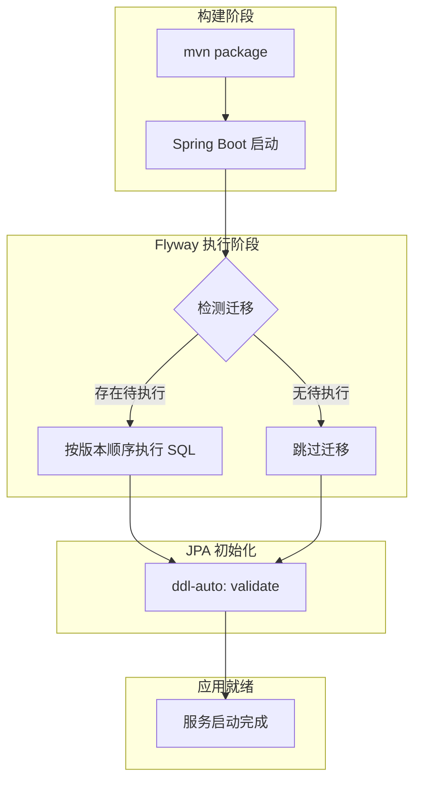
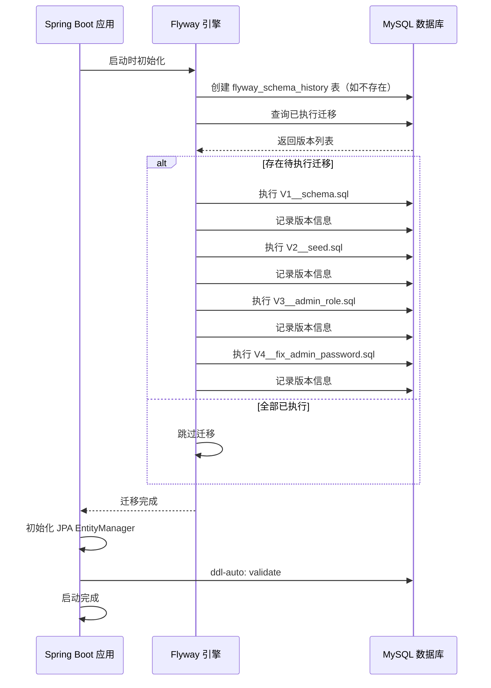

> **文档定位**：说明 EcoLink 项目中 Flyway 版本化数据库迁移的配置、脚本结构和执行机制  
> **同步依据**：`pom.xml` 依赖声明、`application.yml` 配置、`V1-V4` 迁移脚本、`SecurityConfig` 密码编码策略  
> **推荐用途**：理解数据库初始化流程、迁移脚本编写规范、故障排查

---

## 1. Flyway 集成概述

EcoLink 后端采用 **Flyway** 作为数据库版本化管理工具，通过 SQL 脚本实现数据库结构的声明式演进。该方案替代了传统的手动 SQL 执行或 Hibernate DDL 自动生成，具有以下核心优势：

| 特性 | 说明 |
|---|---|
| **版本化控制** | 迁移脚本按版本号顺序执行，确保环境一致性 |
| **幂等性设计** | 支持 `ON DUPLICATE KEY UPDATE` 等安全操作 |
| **自动化执行** | 应用启动时自动检测并执行待执行迁移 |
| **回滚支持** | 支持生成回滚脚本（需专业版或手动编写） |



**关键配置**：`JPA ddl-auto` 设置为 `validate`，确保 Hibernate 实体与数据库结构一致，仅由 Flyway 负责结构变更。

Sources: [application.yml](server/src/main/resources/application.yml#L15-L17) | [pom.xml](server/pom.xml#L43-L47)

---

## 2. 依赖配置

### 2.1 Maven 依赖声明

EcoLink 在 `pom.xml` 中引入两个 Flyway 模块：

```xml
<dependency>
    <groupId>org.flywaydb</groupId>
    <artifactId>flyway-core</artifactId>
</dependency>
<dependency>
    <groupId>org.flywaydb</groupId>
    <artifactId>flyway-mysql</artifactId>
</dependency>
```

| 模块 | 作用 |
|---|---|
| `flyway-core` | 核心迁移引擎，处理版本检测、脚本执行、记录管理 |
| `flyway-mysql` | MySQL 数据库特定适配器，支持方言和语法优化 |

**版本管理**：继承 Spring Boot Parent BOM，由 `spring-boot-starter-parent:3.3.5` 统一管理 Flyway 版本，确保与 Spring Boot 的兼容性。

Sources: [pom.xml](server/pom.xml#L43-L47)

### 2.2 配置文件

```yaml
spring:
  flyway:
    enabled: true                    # 启用 Flyway
    locations: classpath:db/migration  # 脚本路径
```

| 配置项 | 值 | 说明 |
|---|---|---|
| `spring.flyway.enabled` | `true` | 应用启动时自动执行迁移 |
| `spring.flyway.locations` | `classpath:db/migration` | 扫描 `resources/db/migration` 目录下的脚本 |

Sources: [application.yml](server/src/main/resources/application.yml#L18-L19)

---

## 3. 迁移脚本架构

### 3.1 脚本目录结构

```
server/src/main/resources/
├── application.yml
└── db/
    └── migration/
        ├── V1__schema.sql       # 表结构初始化
        ├── V2__seed.sql         # 种子数据导入
        ├── V3__admin_role.sql   # 角色字段与管理员账号
        └── V4__fix_admin_password.sql  # 密码格式修正
```

### 3.2 版本化命名规范

EcoLink 采用 **带描述的版本号命名**：`V<version>__<description>.sql`

| 版本 | 描述 | 执行时机 |
|---|---|---|
| `V1` | 初始化数据库 schema | 首次部署 |
| `V2` | 注入分类、商品、用户等种子数据 | V1 完成后 |
| `V3` | 补充用户角色字段和管理员账号 | V2 完成后 |
| `V4` | 修正管理员密码编码格式 | V3 完成后 |

### 3.3 迁移脚本演进图

```mermaid
flowchart LR
    subgraph V1["V1__schema.sql"]
        A1["创建 users 表"]
        A2["创建 categories 表"]
        A3["创建 products 表"]
        A4["创建订单/购物车相关表"]
        A5["创建索引"]
    end
    
    subgraph V2["V2__seed.sql"]
        B1["插入 4 个商品分类"]
        B2["插入 6 个商品"]
        B3["插入商品图片"]
        B4["插入 demo 用户"]
        B5["插入收货地址"]
        B6["插入购物车条目"]
    end
    
    subgraph V3["V3__admin_role.sql"]
        C1["ALTER TABLE 添加 role 字段"]
        C2["INSERT 管理员账号"]
    end
    
    subgraph V4["V4__fix_admin_password.sql"]
        D1["UPDATE 修正密码格式"]
    end
    
    V1 --> V2 --> V3 --> V4
```



Sources: [V1__schema.sql](server/src/main/resources/db/migration/V1__schema.sql) | [V2__seed.sql](server/src/main/resources/db/migration/V2__seed.sql) | [V3__admin_role.sql](server/src/main/resources/db/migration/V3__admin_role.sql) | [V4__fix_admin_password.sql](server/src/main/resources/db/migration/V4__fix_admin_password.sql)

---

## 4. 核心脚本详解

### 4.1 V1__schema.sql：表结构初始化

该脚本创建系统全部数据表，包括主表、关联表和索引：

| 表名 | 类型 | 功能 |
|---|---|---|
| `users` | 主表 | 用户账号管理 |
| `categories` | 主表 | 商品分类 |
| `products` | 主表 | 商品主信息 |
| `product_images` | 关联表 | 商品多图 |
| `favorites` | 关联表 | 用户收藏 |
| `addresses` | 关联表 | 收货地址 |
| `cart_items` | 关联表 | 购物车 |
| `orders` | 主表 | 订单 |
| `order_items` | 关联表 | 订单明细 |
| `order_status_logs` | 日志表 | 订单状态变更记录 |

**关键设计**：

- **复合唯一约束**：防止购物车、收藏中同一商品重复出现
- **复合索引**：优化商品筛选 (`category_id, status, price`) 和订单查询 (`user_id, created_at`)

```sql
-- 购物车唯一约束示例
CONSTRAINT uk_cart_items_user_product UNIQUE (user_id, product_id)

-- 订单查询索引示例
CREATE INDEX idx_orders_user_created_at ON orders(user_id, created_at);
```

Sources: [V1__schema.sql](server/src/main/resources/db/migration/V1__schema.sql#L1-L129)

### 4.2 V2__seed.sql：种子数据导入

该脚本注入初始业务数据，支持开发环境和测试环境快速初始化：

**分类数据**（4 个分类）：

| 分类名称 | 排序 |
|---|---|
| 新鲜瓜果 | 1 |
| 时令蔬菜 | 2 |
| 肉禽蛋奶 | 3 |
| 地方特产 | 4 |

**商品数据**（6 个商品）：

| 商品名称 | 分类 | 价格 | 库存 |
|---|---|---|---|
| 高山阳光青提 | 新鲜瓜果 | ¥29.90 | 500 |
| 农家五彩小番茄 | 新鲜瓜果 | ¥15.80 | 800 |
| 五谷散养土鸡蛋 | 肉禽蛋奶 | ¥38.00 | 300 |
| 正宗陈年金华火腿 | 地方特产 | ¥268.00 | 120 |
| 新疆吐鲁番无核白葡萄 | 新鲜瓜果 | ¥45.00 | 450 |
| 云南建水红提葡萄 | 新鲜瓜果 | ¥39.90 | 260 |

**初始用户**（使用 `noop` 明文编码）：

```sql
INSERT INTO users(username, password_hash, nickname, phone, status, created_at, updated_at) VALUES
('demo', '{noop}123456', '生态达人_886', '13800000000', 'ACTIVE', NOW(), NOW());
```

Sources: [V2__seed.sql](server/src/main/resources/db/migration/V2__seed.sql#L1-L33)

### 4.3 V3__admin_role.sql：角色与管理员账号

该脚本在 V2 基础上引入用户角色机制：

**字段扩展**：

```sql
ALTER TABLE users ADD COLUMN role VARCHAR(20) NOT NULL DEFAULT 'USER';
```

**管理员账号创建**：

```sql
INSERT INTO users (username, password_hash, nickname, phone, status, role, created_at, updated_at)
VALUES ('admin', '{bcrypt}$2a$10$dXJ3SW6G7P50lGmMkkmwe.20cQQubK3.HZWzG3YB1tlRy.fqvM/BG', '超级管理员', NULL, 'ACTIVE', 'ADMIN', NOW(), NOW())
ON DUPLICATE KEY UPDATE role = 'ADMIN';
```

| 字段 | 值 |
|---|---|
| 用户名 | `admin` |
| 初始密码 | `admin123`（BCrypt 编码） |
| 角色 | `ADMIN` |
| 状态 | `ACTIVE` |

**安全特性**：`ON DUPLICATE KEY UPDATE` 确保幂等性，重复执行不会创建重复记录。

Sources: [V3__admin_role.sql](server/src/main/resources/db/migration/V3__admin_role.sql#L1-L8)

### 4.4 V4__fix_admin_password.sql：密码格式修正

该脚本修正管理员密码编码格式以匹配当前认证逻辑：

```sql
UPDATE users SET password_hash = '{noop}admin123' WHERE username = 'admin';
```

**变更原因**：V3 使用 BCrypt 编码，V4 改为 `noop` 明文编码。这是为了与 `PasswordEncoderFactories.createDelegatingPasswordEncoder()` 的默认行为保持一致：

```java
@Bean
public PasswordEncoder passwordEncoder() {
    return PasswordEncoderFactories.createDelegatingPasswordEncoder();
}
```

**密码前缀对照表**：

| 前缀 | 编码类型 | 示例 |
|---|---|---|
| `{noop}` | 明文（仅开发环境） | `{noop}admin123` |
| `{bcrypt}` | BCrypt 哈希 | `{bcrypt}$2a$10$...` |
| `{sha256}` | SHA-256 | `{sha256}abc123...` |

Sources: [V4__fix_admin_password.sql](server/src/main/resources/db/migration/V4__fix_admin_password.sql#L1-L3) | [SecurityConfig.java](server/src/main/java/com/ecolink/server/config/SecurityConfig.java#L71-L73)

---

## 5. 迁移执行机制

### 5.1 执行时序



### 5.2 Flyway Schema History 表

Flyway 自动创建 `flyway_schema_history` 表记录迁移历史：

| 字段 | 说明 |
|---|---|
| `version` | 迁移版本号 |
| `description` | 脚本描述 |
| `type` | 迁移类型（SQL/UNDO） |
| `script` | 脚本名称 |
| `checksum` | 脚本校验和（用于检测篡改） |
| `installed_by` | 执行用户 |
| `installed_on` | 执行时间 |
| `success` | 是否成功 |

---

## 6. 最佳实践

### 6.1 脚本编写规范

| 规范 | 说明 | 示例 |
|---|---|---|
| **版本递增** | 每个变更使用新版本号 | `V1` → `V2` → `V3` |
| **描述清晰** | 版本号后使用双下划线分隔描述 | `V1__schema.sql` |
| **幂等设计** | 使用 `ON DUPLICATE KEY UPDATE` 或条件判断 | `INSERT ... ON DUPLICATE KEY UPDATE` |
| **事务包裹** | 必要时使用 `START TRANSACTION` | 多表关联操作 |
| **避免硬编码** | 优先使用外键关联而非 ID 硬编码 | `category_id` 外键 |

### 6.2 密码编码安全建议

当前 V4 使用 `{noop}` 明文编码，仅适用于开发环境。**生产环境建议**：

1. 移除 V4 脚本，使用 BCrypt 编码的管理员密码
2. 或在生产环境手动更新密码

```sql
-- 生产环境安全密码设置示例
UPDATE users SET password_hash = '{bcrypt}$2a$10$...有效BCrypt哈希...' WHERE username = 'admin';
```

### 6.3 多环境部署策略

| 环境 | Flyway 配置建议 |
|---|---|
| **开发环境** | `flyway.enabled: true`，使用 seed 数据快速初始化 |
| **测试环境** | `flyway.enabled: true`，CI/CD 自动执行 |
| **生产环境** | 建议 `flyway.enabled: false`，手动审核后执行 |

```yaml
# 生产环境配置示例
spring:
  flyway:
    enabled: false  # 禁用自动迁移，由 DBA 手动执行
```

---

## 7. 故障排查

### 7.1 常见问题

| 问题 | 原因 | 解决方案 |
|---|---|---|
| 启动报错：`Table 'ecolink.flyway_schema_history' doesn't exist` | Flyway 未正确初始化 | 检查 `flyway-core` 依赖是否引入 |
| 迁移重复执行：`Version ... is already applied` | 历史表记录与脚本不一致 | 检查 `flyway_schema_history` 表数据 |
| SQL 执行失败：`Duplicate entry` | 唯一约束冲突 | 添加 `ON DUPLICATE KEY UPDATE` |
| JPA 验证失败：`Schema validation failed` | Flyway 与 Hibernate 配置冲突 | 确认 `ddl-auto: validate` |

### 7.2 调试命令

```bash
# 查看 Flyway 迁移状态
SELECT * FROM flyway_schema_history ORDER BY installed_on DESC;

# 查看特定版本是否已执行
SELECT * FROM flyway_schema_history WHERE version = '1';
```

---

## 8. 相关文档

| 文档 | 说明 |
|---|---|
| [数据库表结构与 ER 模型](11-shu-ju-ku-biao-jie-gou-yu-er-mo-xing) | 数据表详细设计 |
| [Spring Data JPA 数据持久化](9-spring-data-jpa-shu-ju-chi-jiu-hua) | JPA 实体与 Repository 配置 |
| [环境配置与部署方案](23-huan-jing-pei-zhi-yu-bu-shu-fang-an) | 生产环境部署配置 |

---

## 下一步

完成 Flyway 迁移管理学习后，建议继续阅读：

- [数据库表结构与 ER 模型](11-shu-ju-ku-biao-jie-gou-yu-er-mo-xing) — 深入理解数据模型设计
- [Spring Data JPA 数据持久化](9-spring-data-jpa-shu-ju-chi-jiu-hua) — 掌握 JPA 实体映射与查询方法
- [后端分层架构设计](8-hou-duan-fen-ceng-jia-gou-she-ji) — 了解整体架构分层