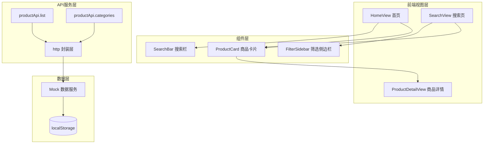

本文档详细介绍 EcoLink 生态电商系统中商品浏览与搜索过滤功能的完整实现，涵盖前端交互设计、后端数据过滤逻辑以及 API 接口契约。该功能是用户接触最频繁的核心购买路径，直接影响用户购物体验。

## 功能架构概览

商品浏览与搜索过滤系统采用多层级架构设计，从首页快捷入口到专业筛选页面形成完整的使用闭环。前端使用 Vue 3 Composition API 实现响应式状态管理，后端通过 Mock 服务模拟真实 API 行为，支持关键词搜索、分类筛选、价格区间过滤和多维度排序。



Sources: [SearchView.vue](src/views/SearchView.vue#L1-L266), [HomeView.vue](src/views/HomeView.vue#L1-L395), [mock.ts](src/api/mock.ts#L500-L540)

## 前端视图设计

### 首页商品展示

首页作为用户首次接触的入口，承担着商品曝光和搜索引导的双重职责。首页顶部设计了视觉冲击力强的横幅区域，包含产品理念宣传和便捷搜索入口。

```vue
<div class="mb-5 flex max-w-lg overflow-hidden rounded-xl bg-white/95 shadow-xl backdrop-blur-sm">
  <div class="flex flex-1 items-center px-4">
    <span class="material-symbols-outlined mr-2 text-slate-400">search</span>
    <input
      v-model.trim="keyword"
      placeholder="搜索有机蔬菜、当季水果、原产地特产..."
      type="text"
      @keydown.enter="goSearch"
    />
  </div>
  <button class="bg-primary px-6 text-sm font-bold text-white" @click="goSearch">搜索</button>
</div>
```

搜索触发后通过 `router.push` 携带关键词参数跳转至搜索结果页面：

```typescript
function goSearch() {
  router.push({ path: '/search', query: keyword.value ? { keyword: keyword.value } : {} });
}
```

Sources: [HomeView.vue](src/views/HomeView.vue#L40-L52), [HomeView.vue](src/views/HomeView.vue#L355-L360)

首页还包含六大商品分类快捷入口，使用动态图标映射机制：

```typescript
const categoryIconMap: Record<string, { icon: string; iconClass: string }> = {
  新鲜瓜果: { icon: 'nutrition', iconClass: 'bg-red-100 text-red-600' },
  时令蔬菜: { icon: 'spa', iconClass: 'bg-green-100 text-green-600' },
  肉禽蛋奶: { icon: 'egg', iconClass: 'bg-amber-100 text-amber-600' },
  地方特产: { icon: 'location_on', iconClass: 'bg-blue-100 text-blue-600' },
  优质粮油: { icon: 'grain', iconClass: 'bg-yellow-100 text-yellow-700' },
  茶饮冲调: { icon: 'local_cafe', iconClass: 'bg-emerald-100 text-emerald-700' },
};
```

分类卡片点击后携带 `categoryId` 参数跳转至搜索页实现分类过滤：

```typescript
const categoryCards = computed(() =>
  categories.value.map((item) => ({
    ...iconConf,
    name: item.name,
    to: `/search?categoryId=${item.id}`,
  })),
);
```

Sources: [HomeView.vue](src/views/HomeView.vue#L270-L285)

### 专业搜索筛选页面

`SearchView` 是商品浏览的核心页面，采用左侧筛选栏加右侧商品网格的双栏布局。筛选侧边栏提供分类筛选、价格区间设置和排序选项的完整交互。

```vue
<aside class="w-full shrink-0 md:w-64">
  <div class="sticky top-24 space-y-6 rounded-2xl border border-primary/5 bg-white p-5 shadow-sm">
    <!-- 分类筛选 -->
    <div class="space-y-3 border-t border-slate-100 pt-4">
      <p class="text-xs font-bold uppercase tracking-widest text-slate-400">分类</p>
      <label v-for="item in categories" :key="item.id" class="flex cursor-pointer items-center gap-2.5">
        <input v-model.number="categoryId" :value="item.id" type="radio" name="cat" />
        <span class="text-sm font-medium">{{ item.name }}</span>
      </label>
    </div>
    
    <!-- 价格区间 -->
    <div class="space-y-3 border-t border-slate-100 pt-4">
      <p class="text-xs font-bold uppercase tracking-widest text-slate-400">价格区间</p>
      <div class="flex items-center gap-2">
        <input v-model.number="minPrice" placeholder="¥ 最低" type="number" />
        <span>—</span>
        <input v-model.number="maxPrice" placeholder="¥ 最高" type="number" />
      </div>
      <button @click="loadProducts">应用筛选</button>
    </div>
  </div>
</aside>
```

Sources: [SearchView.vue](src/views/SearchView.vue#L15-L70)

页面头部包含关键词搜索框和排序下拉菜单：

```vue
<div class="flex items-center gap-3 border-b border-primary/10 px-5 py-3.5">
  <span class="material-symbols-outlined text-primary">search</span>
  <input
    v-model.trim="keyword"
    placeholder="搜索新鲜有机蔬菜、当季水果、原产地特产..."
    @keydown.enter="loadProducts"
  />
  <button @click="loadProducts">{{ loading ? '查询中' : '查询' }}</button>
</div>

<select v-model="sort" class="cursor-pointer">
  <option value="comprehensive">综合排序</option>
  <option value="latest">最新上架</option>
  <option value="price_asc">价格从低到高</option>
  <option value="price_desc">价格从高到低</option>
</select>
```

Sources: [SearchView.vue](src/views/SearchView.vue#L80-L105)

### 响应式筛选状态管理

筛选状态变更自动触发数据加载，使用 Vue `watch` 监听关键变量变化：

```typescript
const keyword = ref('');
const categoryId = ref(0);
const sort = ref('comprehensive');
const minPrice = ref<number | undefined>(undefined);
const maxPrice = ref<number | undefined>(undefined);

// 分类或排序变化时自动重新加载
watch([categoryId, sort], () => {
  loadProducts().catch(() => undefined);
});
```

同时支持从 URL query 参数同步状态，实现页面刷新后筛选条件保持不变：

```typescript
function syncFromQuery() {
  keyword.value = (route.query.keyword as string) || '';
  categoryId.value = Number(route.query.categoryId || 0);
}

async function loadProducts() {
  // ... 数据加载逻辑
  router.replace({
    path: '/search',
    query: {
      ...(keyword.value ? { keyword: keyword.value } : {}),
      ...(categoryId.value ? { categoryId: String(categoryId.value) } : {}),
    },
  });
}
```

Sources: [SearchView.vue](src/views/SearchView.vue#L167-L185), [SearchView.vue](src/views/SearchView.vue#L187-L210)

## 数据模型与类型定义

### API 类型接口

```typescript
// 商品列表项
export interface ProductItem {
  id: number;
  categoryId: number;
  categoryName: string;
  name: string;
  subtitle?: string;
  price: number;
  stock: number;
  sales: number;
  mainImage?: string;
  status?: string;
}

// 商品详情（扩展列表项）
export interface ProductDetail extends ProductItem {
  detail?: string;
  images: string[];
}

// 分类
export interface Category {
  id: number;
  name: string;
  sort?: number;
  enabled?: boolean;
}

// 分页结果
export interface PageResult<T> {
  list: T[];
  page: number;
  size: number;
  total: number;
}
```

Sources: [types/api.ts](src/types/api.ts#L23-L61)

## API 接口设计

### 商品查询接口

```typescript
export const productApi = {
  // 获取分类列表
  categories() {
    return http.get<Category[]>('/categories');
  },
  
  // 商品列表（支持多维筛选）
  list(params: {
    keyword?: string;      // 关键词搜索
    categoryId?: number;    // 分类筛选
    minPrice?: number;     // 最低价格
    maxPrice?: number;     // 最高价格
    sort?: string;         // 排序方式
    page?: number;         // 页码
    size?: number;         // 每页数量
  }) {
    return http.get<PageResult<ProductItem>>('/products', params);
  },
  
  // 商品详情
  detail(id: number) {
    return http.get<ProductDetail>(`/products/${id}`);
  },
};
```

Sources: [api/index.ts](src/api/index.ts#L15-L35)

## 过滤与排序实现

### Mock 服务端过滤逻辑

Mock 层实现了完整的商品过滤引擎，在内存中对商品数组进行链式处理：

```typescript
function listProducts(db: DemoDb, params: Record<string, unknown>) {
  const keyword = String(params.keyword || '').trim().toLowerCase();
  const categoryId = toNumber(params.categoryId, 0);
  const sort = String(params.sort || 'comprehensive');
  const page = Math.max(1, toNumber(params.page, 1));
  const size = Math.max(1, toNumber(params.size, 20));
  const minPrice = toNumber(params.minPrice, Number.NaN);
  const maxPrice = toNumber(params.maxPrice, Number.NaN);

  let rows = db.products.slice();

  // 关键词过滤：匹配名称、副标题、分类名
  if (keyword) {
    rows = rows.filter((item) => {
      const text = `${item.name} ${item.subtitle || ''} ${item.categoryName}`.toLowerCase();
      return text.includes(keyword);
    });
  }

  // 分类过滤
  if (categoryId) {
    rows = rows.filter((item) => item.categoryId === categoryId);
  }

  // 价格区间过滤
  if (!Number.isNaN(minPrice)) {
    rows = rows.filter((item) => Number(item.price) >= minPrice);
  }
  if (!Number.isNaN(maxPrice)) {
    rows = rows.filter((item) => Number(item.price) <= maxPrice);
  }

  // 排序处理
  if (sort === 'latest') {
    rows.sort((a, b) => b.id - a.id);
  } else if (sort === 'price_asc') {
    rows.sort((a, b) => Number(a.price) - Number(b.price));
  } else if (sort === 'price_desc') {
    rows.sort((a, b) => Number(b.price) - Number(a.price));
  } else {
    rows.sort((a, b) => b.sales - a.sales); // 综合排序按销量
  }

  // 分页处理
  const total = rows.length;
  const start = (page - 1) * size;
  const list = rows.slice(start, start + size) as ProductItem[];
  return { list: deepClone(list), page, size, total };
}
```

Sources: [mock.ts](src/api/mock.ts#L500-L540)

### 排序策略对比

| 排序方式 | 参数值 | 实现逻辑 | 适用场景 |
|---------|--------|---------|---------|
| 综合排序 | `comprehensive` | 按销量 `sales` 降序 | 默认排序，突出热卖商品 |
| 最新上架 | `latest` | 按商品 ID 降序 | 优先展示新品 |
| 价格升序 | `price_asc` | 按价格升序 | 满足价格敏感用户 |
| 价格降序 | `price_desc` | 按价格降序 | 满足品质导向用户 |

## 商品卡片组件

`ProductCard` 是通用的商品展示组件，支持快速加入购物车功能：

```vue
<template>
  <div class="overflow-hidden rounded-3xl border border-[#d4e2d7] bg-white shadow-[0_18px_35px_rgba(33,95,60,0.12)]">
    <RouterLink :to="`/product/${product.id}`" class="group relative block aspect-[5/4] overflow-hidden">
      
      <span class="absolute left-3 top-3 rounded-full bg-white/90 px-2 py-0.5 text-xs font-bold text-primary">
        销量 {{ product.sales }}
      </span>
    </RouterLink>
    <div class="p-4">
      <RouterLink :to="`/product/${product.id}`" class="line-clamp-1 text-base font-black">
        {{ product.name }}
      </RouterLink>
      <p class="mt-1 line-clamp-1 text-xs text-slate-500">{{ product.subtitle || '生态优选' }}</p>
      <div class="mt-3 flex items-center justify-between gap-2">
        <span class="text-2xl font-black text-primary">¥{{ Number(product.price).toFixed(2) }}</span>
        <button class="btn btn-soft !rounded-full" :disabled="adding" @click="addCart">
          <span class="material-symbols-outlined text-base">add_shopping_cart</span>
          <span class="text-xs">{{ adding ? '加入中' : '加入' }}</span>
        </button>
      </div>
    </div>
  </div>
</template>

<script setup lang="ts">
import { ref } from 'vue';
import { cartApi } from '@/api';
import type { ProductItem } from '@/types/api';

const props = defineProps<{ product: ProductItem }>();
const adding = ref(false);

async function addCart() {
  if (adding.value) return;
  adding.value = true;
  try {
    await cartApi.add({ productId: props.product.id, quantity: 1 });
  } catch (error) {
    toast.error((error as Error).message);
  } finally {
    adding.value = false;
  }
}
</script>
```

Sources: [ProductCard.vue](src/components/ProductCard.vue#L1-L52)

## 筛选参数速查表

| 参数名称 | 类型 | 说明 | 示例 |
|---------|------|------|------|
| `keyword` | string | 关键词模糊匹配商品名称、副标题、分类名 | `有机蔬菜` |
| `categoryId` | number | 按分类 ID 精确筛选，为 0 时不过滤 | `2` |
| `minPrice` | number | 最低价格阈值，筛选价格大于等于该值的商品 | `10` |
| `maxPrice` | number | 最高价格阈值，筛选价格小于等于该值的商品 | `100` |
| `sort` | string | 排序方式：`comprehensive`、`latest`、`price_asc`、`price_desc` | `price_asc` |
| `page` | number | 当前页码，从 1 开始 | `1` |
| `size` | number | 每页返回的商品数量 | `20` |

## 路由与页面导航

搜索页面路由配置支持 URL 参数同步：

```typescript
{ path: '/search', name: 'search', component: () => import('@/views/SearchView.vue') }
```

从首页跳转可携带多种参数：

```typescript
// 关键词搜索
router.push({ path: '/search', query: { keyword: '有机蔬菜' } });

// 分类筛选
router.push({ path: '/search', query: { categoryId: '2' } });

// 组合筛选
router.push({ path: '/search', query: { keyword: '水果', categoryId: '1' } });
```

Sources: [router/index.ts](src/router/index.ts#L9)

## 后续阅读

完成商品浏览与搜索过滤功能的学习后，建议继续深入以下关联模块：

- [购物车管理](14-gou-wu-che-guan-li) - 了解如何将搜索到的商品加入购物车
- [订单创建与支付流程](15-ding-dan-chuang-jian-yu-zhi-fu-liu-cheng) - 掌握商品选购后的下单流程
- [商品与分类管理](21-shang-pin-yu-fen-lei-guan-li) - 了解后台管理员如何管理商品和分类数据