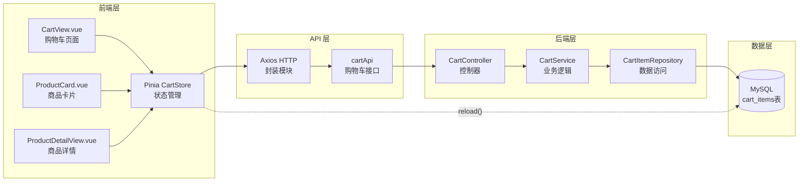
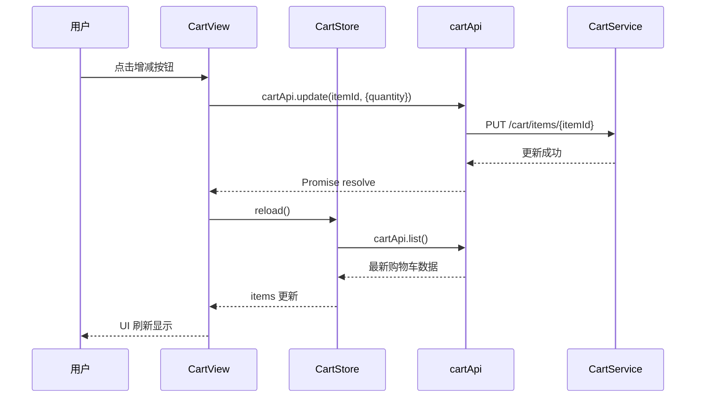

购物车模块是 EcoLink 电商平台的核心功能之一，负责管理用户选购商品的临时存储、数量调整、删除操作以及结算前的订单确认。本模块采用前后端分离架构，前端基于 Pinia 状态管理实现响应式购物车数据流，后端基于 Spring Boot 构建 RESTful API 提供数据持久化支持。

## 技术架构总览

购物车模块遵循**前后端分离 + 状态管理 + 服务端持久化**的分层架构模式。前端通过 Pinia Store 维护本地购物车状态，通过 Axios 与后端 API 通信；后端采用 Spring Data JPA 实现数据持久化，通过 Spring Security 保障用户数据隔离。



Sources: [src/stores/cart.ts](src/stores/cart.ts#L1-L24)
Sources: [src/views/CartView.vue](src/views/CartView.vue#L1-L245)
Sources: [server/src/main/java/com/ecolink/server/controller/CartController.java](server/src/main/java/com/ecolink/server/controller/CartController.java#L1-L36)
Sources: [server/src/main/java/com/ecolink/server/service/CartService.java](server/src/main/java/com/ecolink/server/service/CartService.java#L1-L107)

## 数据模型设计

### 前端类型定义

购物车相关的数据模型在 `src/types/api.ts` 中定义，采用 TypeScript Interface 描述数据形状。前端定义了 `CartItem` 接口表示单个购物车条目，`CartData` 接口表示完整的购物车数据结构。

```typescript
// 单个购物车条目
export interface CartItem {
  id: number;           // 购物车条目ID
  productId: number;    // 关联商品ID
  productName: string;  // 商品名称（冗余存储）
  productImage?: string;// 商品图片
  price: number;        // 单价（冗余存储快照价格）
  quantity: number;     // 数量
  stock: number;        // 实时库存
  subtotal: number;     // 小计金额
}

// 购物车完整数据
export interface CartData {
  items: CartItem[];
  totalAmount: number;
}
```

Sources: [src/types/api.ts](src/types/api.ts#L53-L67)

### 后端 DTO 设计

后端采用 Java Record 类型的 DTO 实现数据传输对象，与前端类型定义形成镜像结构。购物车相关的 DTO 包括请求和响应两类。

```java
// 添加购物车请求
public record AddCartItemRequest(
    @NotNull(message = "商品不能为空")
    Long productId,
    @NotNull(message = "数量不能为空")
    @Min(value = 1, message = "数量至少为 1")
    Integer quantity
) {}

// 更新购物车数量请求
public record UpdateCartItemRequest(
    @NotNull(message = "数量不能为空")
    @Min(value = 1, message = "数量至少为 1")
    Integer quantity
) {}

// 购物车条目响应
public record CartItemResponse(
    Long id,
    Long productId,
    String productName,
    String productImage,
    BigDecimal price,
    Integer quantity,
    Integer stock,
    BigDecimal subtotal
) {}

// 购物车完整响应
public record CartResponse(
    List<CartItemResponse> items,
    BigDecimal totalAmount
) {}
```

Sources: [server/src/main/java/com/ecolink/server/dto/cart/AddCartItemRequest.java](server/src/main/java/com/ecolink/server/dto/cart/AddCartItemRequest.java#L1-L12)
Sources: [server/src/main/java/com/ecolink/server/dto/cart/CartResponse.java](server/src/main/java/com/ecolink/server/dto/cart/CartResponse.java#L1-L10)

### 数据库表结构

购物车数据存储在 `cart_items` 表中，采用用户-商品唯一约束确保同一商品在用户购物车中只有一条记录。

```sql
CREATE TABLE cart_items (
    id BIGINT PRIMARY KEY AUTO_INCREMENT,
    user_id BIGINT NOT NULL,
    product_id BIGINT NOT NULL,
    quantity INT NOT NULL,
    created_at DATETIME NOT NULL,
    updated_at DATETIME NOT NULL,
    CONSTRAINT fk_cart_items_user FOREIGN KEY (user_id) REFERENCES users(id),
    CONSTRAINT fk_cart_items_product FOREIGN KEY (product_id) REFERENCES products(id),
    CONSTRAINT uk_cart_items_user_product UNIQUE (user_id, product_id)
);
CREATE INDEX idx_cart_items_user ON cart_items(user_id);
```

Sources: [server/src/main/resources/db/migration/V1__schema.sql](server/src/main/resources/db/migration/V1__schema.sql#L72-L84)

### 实体类映射

`CartItem` 实体类采用 JPA 注解映射数据库表结构，通过 `@ManyToOne` 关系维护与 User 和 Product 实体的关联。

```java
@Getter
@Setter
@Entity
@Table(name = "cart_items", uniqueConstraints = {
    @UniqueConstraint(columnNames = {"user_id", "product_id"})
})
public class CartItem extends BaseEntity {
    @Id
    @GeneratedValue(strategy = GenerationType.IDENTITY)
    private Long id;

    @ManyToOne(fetch = FetchType.LAZY)
    @JoinColumn(name = "user_id", nullable = false)
    private User user;

    @ManyToOne(fetch = FetchType.LAZY)
    @JoinColumn(name = "product_id", nullable = false)
    private Product product;

    @Column(nullable = false)
    private Integer quantity = 1;
}
```

Sources: [server/src/main/java/com/ecolink/server/domain/CartItem.java](server/src/main/java/com/ecolink/server/domain/CartItem.java#L1-L26)

## API 接口设计

购物车模块提供四个核心 RESTful API 端点，采用标准 HTTP 方法语义。所有接口均需要用户认证，通过 JWT Token 进行身份验证。

| 接口方法 | 端点路径 | 功能描述 | 请求体 | 响应数据 |
|---------|----------|----------|--------|----------|
| GET | `/api/v1/cart` | 获取当前用户的购物车列表 | 无 | `CartResponse` |
| POST | `/api/v1/cart/items` | 添加商品到购物车 | `AddCartItemRequest` | 操作成功消息 |
| PUT | `/api/v1/cart/items/{itemId}` | 更新购物车条目数量 | `UpdateCartItemRequest` | 操作成功消息 |
| DELETE | `/api/v1/cart/items/{itemId}` | 从购物车删除条目 | 无 | 操作成功消息 |

Sources: [server/src/main/java/com/ecolink/server/controller/CartController.java](server/src/main/java/com/ecolink/server/controller/CartController.java#L1-L36)

### 前端 API 封装

前端在 `src/api/index.ts` 中封装了 `cartApi` 对象，提供类型安全的接口调用方法。

```typescript
export const cartApi = {
  list() {
    return http.get<CartData>('/cart');
  },
  add(payload: { productId: number; quantity: number }) {
    return http.post('/cart/items', payload);
  },
  update(itemId: number, payload: { quantity: number }) {
    return http.put(`/cart/items/${itemId}`, payload);
  },
  remove(itemId: number) {
    return http.delete(`/cart/items/${itemId}`);
  },
};
```

Sources: [src/api/index.ts](src/api/index.ts#L47-L60)

## 状态管理设计

### Pinia Store 实现

购物车状态通过 Pinia 的 Composition API 风格 Store 进行管理。Store 维护购物车条目列表、总金额和总数量三个核心状态，并提供重新加载和清空方法。

```typescript
export const useCartStore = defineStore('cart', () => {
  const items = ref<CartItem[]>([]);
  const totalAmount = ref(0);
  const totalCount = computed(() => 
    items.value.reduce((sum, item) => sum + item.quantity, 0)
  );

  async function reload() {
    const data = await cartApi.list();
    items.value = data.items;
    totalAmount.value = data.totalAmount;
  }

  function clear() {
    items.value = [];
    totalAmount.value = 0;
  }

  return { items, totalAmount, totalCount, reload, clear };
});
```

Sources: [src/stores/cart.ts](src/stores/cart.ts#L1-L24)

### 状态更新流程

购物车状态的更新遵循**用户操作 → API 调用 → 数据刷新 → UI 更新**的响应式链路。当用户修改数量或删除商品时，组件首先调用相应的 API 接口，成功后触发 `reload()` 方法重新获取最新数据，Pinia Store 自动触发依赖该状态的组件重新渲染。



## 核心业务逻辑

### 添加购物车

后端 `add` 方法实现了购物车添加的核心逻辑：先检查商品是否存在，再检查库存是否充足，然后查找用户是否已有该商品的购物车记录。如果存在则累加数量，否则创建新记录。

```java
@Transactional
public void add(AddCartItemRequest request) {
    Long userId = SecurityUtils.currentUserId();
    Product product = productRepository.findById(productId)
        .orElseThrow(() -> new BizException(4041, "商品不存在"));
    
    if (request.quantity() > product.getStock()) {
        throw new BizException(4005, "库存不足");
    }
    
    // 查找是否已存在该商品的购物车记录
    CartItem item = cartItemRepository.findByUserIdAndProductId(userId, productId)
        .orElseGet(() -> {
            CartItem ci = new CartItem();
            ci.setUser(authService.getCurrentUserEntity());
            ci.setProduct(product);
            ci.setQuantity(0);
            return ci;
        });
    
    int target = item.getQuantity() + request.quantity();
    if (target > product.getStock()) {
        throw new BizException(4005, "库存不足");
    }
    item.setQuantity(target);
    cartItemRepository.save(item);
}
```

Sources: [server/src/main/java/com/ecolink/server/service/CartService.java](server/src/main/java/com/ecolink/server/service/CartService.java#L38-L59)

### 库存校验机制

系统采用双重库存校验策略：第一次校验在添加购物车时，第二次校验在更新数量时。这种设计防止了高并发场景下的超卖问题，同时 `update` 方法额外验证了购物车条目是否属于当前用户，确保数据安全隔离。

```java
@Transactional
public void update(Long itemId, UpdateCartItemRequest request) {
    Long userId = SecurityUtils.currentUserId();
    // 验证条目存在且属于当前用户
    CartItem item = cartItemRepository.findByIdAndUserId(itemId, userId)
        .orElseThrow(() -> new BizException(4043, "购物车条目不存在"));
    
    if (request.quantity() > item.getProduct().getStock()) {
        throw new BizException(4005, "库存不足");
    }
    item.setQuantity(request.quantity());
    cartItemRepository.save(item);
}
```

Sources: [server/src/main/java/com/ecolink/server/service/CartService.java](server/src/main/java/com/ecolink/server/service/CartService.java#L61-L70)

## 页面交互设计

### 购物车页面布局

`CartView.vue` 采用响应式双栏布局：左侧主区域展示购物车商品列表和推荐商品，右侧固定侧边栏显示订单摘要。这种布局在桌面端提供清晰的视觉层次，在移动端自动堆叠为单栏。

```mermaid
block-beta
    columns 3
    
    block:cart-area:3
        columns 3
        
        "进度指示器" 
        "购物车列表（全选/单选/增减/删除）"
        "猜你喜欢（推荐商品）"
    end
    
    block:sidebar:1
        columns 1
        "订单摘要"
        "价格明细"
        "结算按钮"
        "服务保障图标"
    end
    
    :cart-area ":lg:w-2/3" ":sidebar ":lg:w-1/3
```

Sources: [src/views/CartView.vue](src/views/CartView.vue#L25-L146)

### 结算流程集成

结算功能通过 `checkout` 方法实现完整的三步流程：首先验证用户已选择商品，然后获取用户默认收货地址，最后调用订单创建接口并跳转到支付页面。

```typescript
async function checkout() {
  if (selectedIds.value.length === 0) {
    toast.info('请选择要下单的商品');
    return;
  }
  loading.value = true;
  try {
    const addresses = await addressApi.list();
    const address = addresses.find((item) => item.isDefault) || addresses[0];
    if (!address) {
      router.push({ name: 'profile', query: { tab: 'address', redirect: '/cart' } });
      return;
    }
    const order = await orderApi.create({ addressId: address.id, cartItemIds: selectedIds.value });
    await reload();
    router.push(`/payment/${order.id}`);
  } catch (error) {
    toast.error((error as Error).message);
  } finally {
    loading.value = false;
  }
}
```

Sources: [src/views/CartView.vue](src/views/CartView.vue#L211-L234)

### 商品添加入口

购物车添加功能集成在多个页面：`ProductCard.vue` 组件提供卡片级别的快速添加按钮，`ProductDetailView.vue` 提供详情页的数量选择和添加功能。

```vue
// ProductCard.vue 中的添加逻辑
async function addCart() {
  if (adding.value) return;
  adding.value = true;
  try {
    await cartApi.add({ productId: props.product.id, quantity: 1 });
    emit('added'); // 通知父组件更新购物车状态
  } catch (error) {
    toast.error((error as Error).message);
  } finally {
    adding.value = false;
  }
}
```

Sources: [src/components/ProductCard.vue](src/components/ProductCard.vue#L32-L47)

## 数据查询优化

### JPA 查询方法

`CartItemRepository` 定义了针对购物车场景优化的查询方法，利用 Spring Data JPA 的命名查询约定自动实现。

```java
public interface CartItemRepository extends JpaRepository<CartItem, Long> {
    List<CartItem> findByUserIdOrderByUpdatedAtDesc(Long userId);
    Optional<CartItem> findByUserIdAndProductId(Long userId, Long productId);
    Optional<CartItem> findByIdAndUserId(Long id, Long userId);
    List<CartItem> findByIdInAndUserId(List<Long> ids, Long userId);
}
```

Sources: [server/src/main/java/com/ecolink/server/repository/CartItemRepository.java](server/src/main/java/com/ecolink/server/repository/CartItemRepository.java#L1-L15)

### 订单创建时的批量查询

`findItemsForCurrentUser` 方法支持订单创建时的批量查询场景。当传入空列表时返回用户全部购物车条目，当传入指定 ID 列表时仅返回选中的条目，实现灵活的结算数据获取。

```java
@Transactional(readOnly = true)
public List<CartItem> findItemsForCurrentUser(List<Long> itemIds) {
    Long userId = SecurityUtils.currentUserId();
    if (itemIds == null || itemIds.isEmpty()) {
        return cartItemRepository.findByUserIdOrderByUpdatedAtDesc(userId);
    }
    return cartItemRepository.findByIdInAndUserId(itemIds, userId);
}
```

Sources: [server/src/main/java/com/ecolink/server/service/CartService.java](server/src/main/java/com/ecolink/server/service/CartService.java#L79-L86)

## 后续学习路径

购物车模块与订单模块紧密衔接，完成购物车操作后，用户将进入[订单创建与支付流程](15-ding-dan-chuang-jian-yu-zhi-fu-liu-cheng)阶段。了解购物车的数据结构设计后，将更容易理解订单如何从购物车条目转换而来，以及支付环节如何与库存扣减联动。

如需深入了解商品浏览功能如何与购物车集成，请参考[商品浏览与搜索过滤](13-shang-pin-liu-lan-yu-sou-suo-guo-lu)。若对数据持久化层的设计细节感兴趣，可查阅 [Spring Data JPA 数据持久化](9-spring-data-jpa-shu-ju-chi-jiu-hua) 章节。