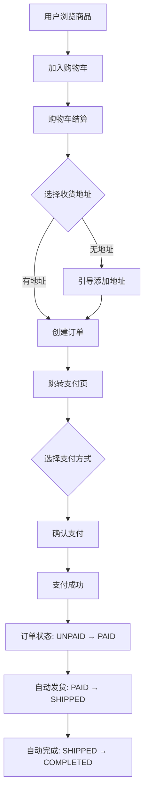
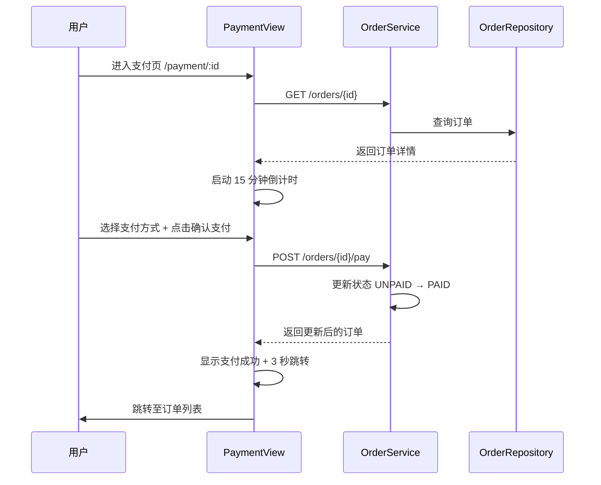
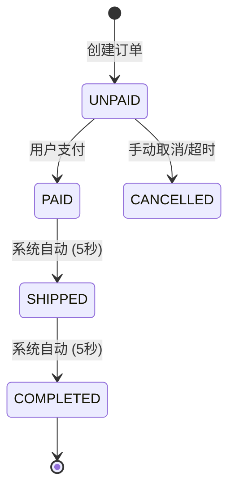

本页面详细阐述 EcoLink 电商系统中从购物车结算到支付完成的完整业务流程。该流程涉及前端购物车交互、订单实体创建、库存扣减与支付模拟确认等多个环节。

---

## 1. 业务流程总览

订单创建与支付流程是用户完成购物的核心路径，遵循「选品 → 结算 → 创建订单 → 支付 → 自动流转」的链路设计。以下为整体架构图：



**流程阶段划分**：

| 阶段 | 状态 | 触发条件 | 预期耗时 |
|------|------|----------|----------|
| 订单创建 | `UNPAID` | 用户结算购物车 | 即时 |
| 等待支付 | `UNPAID` | 订单已创建，待用户付款 | ≤ 15 分钟 |
| 支付完成 | `PAID` | 用户确认支付 | 即时 |
| 自动发货 | `SHIPPED` | 支付后 5 秒系统自动 | 5 秒 |
| 订单完成 | `COMPLETED` | 发货后 5 秒系统自动 | 5 秒 |

Sources: [OrderStatus.java](server/src/main/java/com/ecolink/server/domain/enums/OrderStatus.java#L1-L10), [OrderService.java](server/src/main/java/com/ecolink/server/service/OrderService.java#L46-L47)

---

## 2. 订单创建机制

### 2.1 前端结算流程

用户在 [购物车页面](14-gou-wu-che-guan-li) 勾选商品后点击「去结算」按钮，触发 `checkout()` 函数。该函数执行以下步骤：

1. **地址校验**：调用 `addressApi.list()` 获取用户地址列表，若无地址则跳转至个人中心添加
2. **订单创建**：调用 `orderApi.create()` 传入 `addressId` 和 `cartItemIds`
3. **页面跳转**：订单创建成功后自动跳转至支付页面 `/payment/${order.id}`

```typescript
// src/views/CartView.vue#L217-L232
async function checkout() {
  if (selectedIds.value.length === 0) {
    toast.info('请选择要下单的商品');
    return;
  }
  loading.value = true;
  try {
    const addresses = await addressApi.list();
    const address = addresses.find((item) => item.isDefault) || addresses[0];
    if (!address) {
      toast.info('请先添加收货地址，添加后将自动跳回结算');
      router.push({ name: 'profile', query: { tab: 'address', redirect: '/cart' } });
      return;
    }
    const order = await orderApi.create({ addressId: address.id, cartItemIds: selectedIds.value });
    await reload();
    toast.success('订单创建成功，正在前往支付');
    router.push(`/payment/${order.id}`);
  } catch (error) {
    toast.error((error as Error).message);
  } finally {
    loading.value = false;
  }
}
```

Sources: [CartView.vue](src/views/CartView.vue#L217-L232)

### 2.2 后端订单创建逻辑

后端 `OrderService.createOrder()` 是订单创建的核心方法，采用 `@Transactional` 注解确保数据一致性：

```java
// server/src/main/java/com/ecolink/server/service/OrderService.java#L34-L80
@Transactional
public OrderResponse createOrder(CreateOrderRequest request) {
    Address address = addressService.findByIdForCurrentUser(request.addressId());
    List<CartItem> cartItems = cartService.findItemsForCurrentUser(request.cartItemIds());
    if (cartItems.isEmpty()) {
        throw new BizException(4006, "购物车为空");
    }

    BigDecimal total = BigDecimal.ZERO;
    for (CartItem ci : cartItems) {
        // 库存校验
        if (ci.getQuantity() > ci.getProduct().getStock()) {
            throw new BizException(4005, "商品库存不足: " + ci.getProduct().getName());
        }
        total = total.add(ci.getProduct().getPrice().multiply(BigDecimal.valueOf(ci.getQuantity())));
    }

    // 创建订单实体
    Order order = new Order();
    order.setUser(authService.getCurrentUserEntity());
    order.setOrderNo(generateOrderNo());
    order.setStatus(OrderStatus.UNPAID);
    order.setTotalAmount(total);
    order.setReceiverName(address.getReceiverName());
    order.setReceiverPhone(address.getReceiverPhone());
    order.setReceiverAddress(address.getDetail());
    orderRepository.save(order);

    // 创建订单项并扣减库存
    for (CartItem ci : cartItems) {
        OrderItem item = new OrderItem();
        item.setOrder(order);
        item.setProduct(ci.getProduct());
        item.setProductName(ci.getProduct().getName());
        item.setProductImage(ci.getProduct().getMainImage());
        item.setSalePrice(ci.getProduct().getPrice());
        item.setQuantity(ci.getQuantity());
        orderItemRepository.save(item);

        // 扣减库存 + 累加销量
        ci.getProduct().setStock(ci.getProduct().getStock() - ci.getQuantity());
        ci.getProduct().setSales(ci.getProduct().getSales() + ci.getQuantity());
    }

    writeStatusLog(order, null, OrderStatus.UNPAID, "订单创建");
    cartService.removeItems(cartItems); // 清空已结算的购物车项
    return toResponse(order, orderItemRepository.findByOrderIdOrderByIdAsc(order.getId()));
}
```

**关键设计点**：

| 操作 | 说明 |
|------|------|
| 库存校验 | 遍历购物车商品，验证每件商品库存是否充足 |
| 订单号生成 | 使用 `ECO` + 时间戳 + 4 位随机数，格式如 `ECO17352096000001234` |
| 快照机制 | 订单项记录下单时的商品名称、图片、价格，而非引用商品表 |
| 库存扣减 | 在订单创建时立即扣减，避免超卖 |
| 购物车清空 | 使用 `deleteAll()` 批量删除已结算的购物车项 |

Sources: [OrderService.java](server/src/main/java/com/ecolink/server/service/OrderService.java#L34-L80)

### 2.3 创建订单请求结构

```typescript
// src/api/index.ts#L62-L66
export const orderApi = {
  create(payload: { addressId: number; cartItemIds: number[] }) {
    return http.post<OrderData>('/orders', payload);
  },
  // ...
};
```

| 字段 | 类型 | 必填 | 说明 |
|------|------|------|------|
| `addressId` | `number` | 是 | 用户选择的收货地址 ID |
| `cartItemIds` | `number[]` | 否 | 指定要结算的购物车项 ID，为空时结算全部 |

Sources: [index.ts](src/api/index.ts#L62-L66), [CreateOrderRequest.java](server/src/main/java/com/ecolink/server/dto/order/CreateOrderRequest.java#L1-L12)

---

## 3. 支付流程实现

### 3.1 前端支付页面

支付页面 (`PaymentView.vue`) 承担以下职责：

- **订单信息展示**：显示订单号、商品清单、收货信息
- **支付方式选择**：支持微信支付、支付宝、银行卡三种方式
- **支付倒计时**：15 分钟超时限制
- **支付确认**：调用支付接口并处理结果



**支付倒计时实现**：

```typescript
// src/views/PaymentView.vue#L139-L159
const countdown = ref(15 * 60);

function startCountdown() {
  timer = setInterval(() => {
    if (countdown.value <= 0) {
      if (timer) clearInterval(timer);
      return;
    }
    countdown.value--;
  }, 1000);
}

async function confirmPay() {
  if (!order.value) return;
  paying.value = true;
  try {
    order.value = await orderApi.pay(order.value.id);
    paySuccess.value = true;
    toast.success('支付成功');
    if (timer) clearInterval(timer);
    // 3 秒后跳转订单列表
    successTimer = setInterval(() => {
      if (redirectSeconds.value <= 1) {
        if (successTimer) clearInterval(successTimer);
        router.replace('/orders?tab=PAID');
        return;
      }
      redirectSeconds.value--;
    }, 1000);
  } catch (error) {
    toast.error((error as Error).message);
  } finally {
    paying.value = false;
  }
}
```

Sources: [PaymentView.vue](src/views/PaymentView.vue#L139-L159)

### 3.2 后端支付确认

支付接口 `POST /api/v1/orders/{id}/pay` 执行状态变更：

```java
// server/src/main/java/com/ecolink/server/service/OrderService.java#L91-L101
@Transactional
public OrderResponse pay(Long id) {
    Long userId = SecurityUtils.currentUserId();
    Order order = orderRepository.findByIdAndUserId(id, userId)
        .orElseThrow(() -> new BizException(4044, "订单不存在"));
    if (order.getStatus() != OrderStatus.UNPAID) {
        throw new BizException(4007, "订单状态不允许支付");
    }
    OrderStatus from = order.getStatus();
    order.setStatus(OrderStatus.PAID);
    order.setPaidAt(LocalDateTime.now());
    orderRepository.save(order);
    writeStatusLog(order, from, OrderStatus.PAID, "模拟支付成功");
    return toResponse(order, orderItemRepository.findByOrderIdOrderByIdAsc(order.getId()));
}
```

**状态校验逻辑**：

- 仅 `UNPAID` 状态的订单允许支付
- 非本人订单无法操作（通过 `userId` 校验）
- 记录状态变更日志便于追溯

Sources: [OrderService.java](server/src/main/java/com/ecolink/server/service/OrderService.java#L91-L101)

---

## 4. 订单状态自动流转

EcoLink 采用定时任务实现订单状态的自动流转，无需人工干预：

```java
// server/src/main/java/com/ecolink/server/service/OrderService.java#L103-L119
@Transactional
@Scheduled(fixedDelay = 5000) // 每 5 秒执行一次
public void autoFlow() {
    LocalDateTime now = LocalDateTime.now();
    
    // PAID → SHIPPED：支付后 5 秒自动发货
    List<Order> paidOrders = orderRepository.findByStatusAndPaidAtBefore(
        OrderStatus.PAID, now.minusSeconds(5));
    for (Order order : paidOrders) {
        order.setStatus(OrderStatus.SHIPPED);
        order.setShippedAt(now);
        writeStatusLog(order, OrderStatus.PAID, OrderStatus.SHIPPED, "系统自动发货");
    }

    // SHIPPED → COMPLETED：发货后 5 秒自动完成
    List<Order> shippedOrders = orderRepository.findByStatusAndShippedAtBefore(
        OrderStatus.SHIPPED, now.minusSeconds(5));
    for (Order order : shippedOrders) {
        order.setStatus(OrderStatus.COMPLETED);
        order.setCompletedAt(now);
        writeStatusLog(order, OrderStatus.SHIPPED, OrderStatus.COMPLETED, "系统自动完成");
    }
}
```

**状态流转图**：



| 状态 | 枚举值 | 触发方式 | 时间戳字段 |
|------|--------|----------|------------|
| 待付款 | `UNPAID` | `POST /orders` | `createdAt` |
| 待发货 | `PAID` | `POST /orders/{id}/pay` | `paidAt` |
| 已发货 | `SHIPPED` | `@Scheduled` 定时任务 | `shippedAt` |
| 已完成 | `COMPLETED` | `@Scheduled` 定时任务 | `completedAt` |
| 已取消 | `CANCELLED` | 手动取消（本期未实现） | — |

Sources: [OrderService.java](server/src/main/java/com/ecolink/server/service/OrderService.java#L103-L119)

---

## 5. 订单数据模型

### 5.1 实体关系

```
┌─────────────────┐       ┌─────────────────┐       ┌─────────────────┐
│      User       │       │      Order      │       │   OrderItem     │
├─────────────────┤       ├─────────────────┤       ├─────────────────┤
│ id (PK)         │──┐    │ id (PK)         │──┐    │ id (PK)         │
│ username        │  │    │ user_id (FK)    │←─┘    │ order_id (FK)   │←─┐
│ ...             │  └──→│ order_no        │       │ product_id (FK) │←─┼─┐
└─────────────────┘       │ status          │       │ product_name    │  │ │
                          │ total_amount    │       │ product_image   │  │ │
                          │ receiver_name   │       │ sale_price      │  │ │
                          │ receiver_phone  │       │ quantity        │  │ │
                          │ receiver_address│       └─────────────────┘  │ │
                          │ paid_at         │                             │ │
                          │ shipped_at      │       ┌─────────────────┐  │ │
                          │ completed_at    │       │    Product      │←─┘ │
                          └─────────────────┘       ├─────────────────┤────┘
                                                      │ id (PK)         │
                                                      │ name            │
                                                      │ price           │
                                                      │ stock           │
                                                      │ sales           │
                                                      └─────────────────┘
```

### 5.2 订单响应结构

```typescript
// src/types/api.ts#L98-L111
export interface OrderData {
  id: number;
  orderNo: string;
  status: OrderStatus;
  totalAmount: number;
  receiverName: string;
  receiverPhone: string;
  receiverAddress: string;
  paidAt?: string;
  shippedAt?: string;
  completedAt?: string;
  createdAt: string;
  items: OrderItem[];
}
```

Sources: [api.ts](src/types/api.ts#L98-L111)

---

## 6. API 端点汇总

| 方法 | 路径 | 功能 | 认证 |
|------|------|------|------|
| `POST` | `/api/v1/orders` | 创建订单 | ✅ |
| `GET` | `/api/v1/orders` | 查询用户订单列表 | ✅ |
| `GET` | `/api/v1/orders/{id}` | 查询订单详情 | ✅ |
| `POST` | `/api/v1/orders/{id}/pay` | 确认支付 | ✅ |

Sources: [OrderController.java](server/src/main/java/com/ecolink/server/controller/OrderController.java#L1-L41)

---

## 7. 错误处理机制

| 错误码 | 场景 | HTTP 状态 |
|--------|------|-----------|
| `4005` | 商品库存不足 | 400 |
| `4006` | 购物车为空 | 400 |
| `4007` | 订单状态不允许支付 | 400 |
| `4044` | 订单不存在 | 404 |

```java
// 库存不足示例
if (ci.getQuantity() > ci.getProduct().getStock()) {
    throw new BizException(4005, "商品库存不足: " + ci.getProduct().getName());
}

// 订单状态校验示例
if (order.getStatus() != OrderStatus.UNPAID) {
    throw new BizException(4007, "订单状态不允许支付");
}
```

Sources: [OrderService.java](server/src/main/java/com/ecolink/server/service/OrderService.java#L46-L47), [OrderService.java](server/src/main/java/com/ecolink/server/service/OrderService.java#L94-L95)

---

## 8. 下一步

完成本章节学习后，建议继续阅读：

- [订单状态自动流转机制](16-ding-dan-zhuang-tai-zi-dong-liu-zhuan-ji-zhi) — 深入了解定时任务实现细节
- [RESTful API 设计规范](17-restful-api-she-ji-gui-fan) — 了解本系统 API 设计原则
- [购物车管理](14-gou-wu-che-guan-li) — 复习订单创建的前置流程