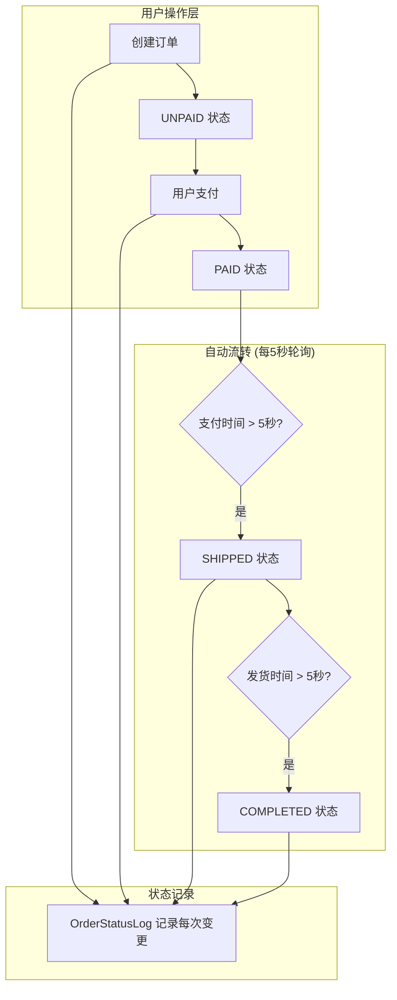
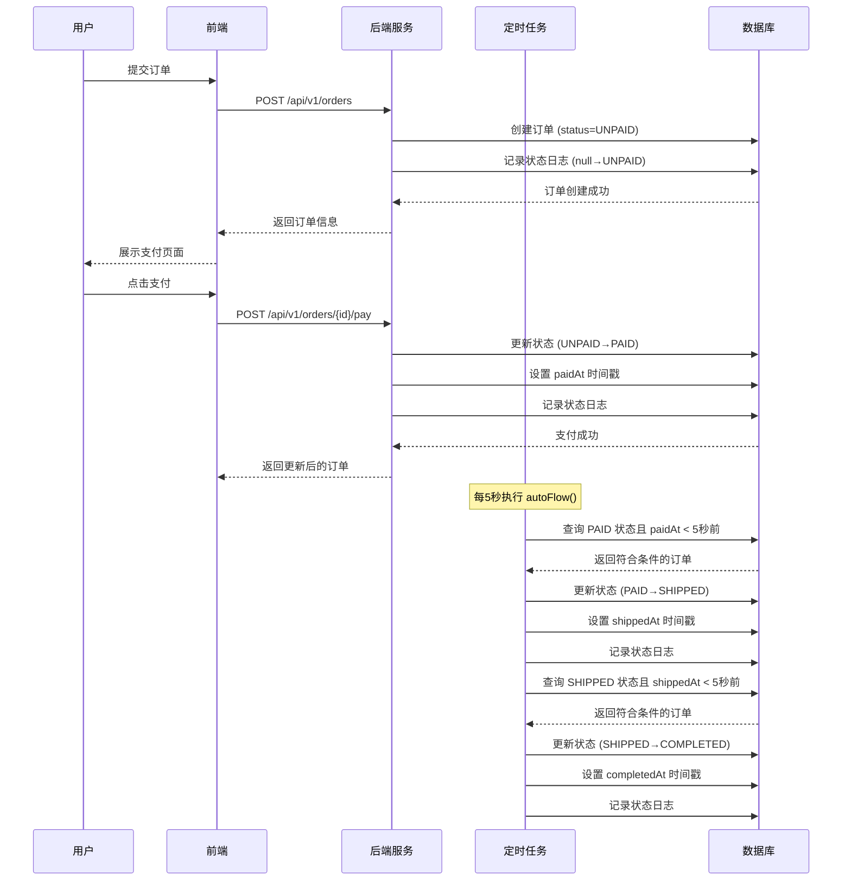

EcoLink系统的订单状态自动流转是一套基于Spring Scheduler定时任务的事件驱动机制，实现订单从创建到完成的全自动生命周期管理。该机制确保了订单状态变更的实时性和一致性，无需人工干预即可完成从支付到交付的完整流程。

## 订单状态定义

EcoLink系统定义了五种订单状态，覆盖订单完整生命周期的各个阶段。

| 状态枚举 | 中文描述 | 触发时机 | 可执行操作 |
|---------|---------|----------|------------|
| `UNPAID` | 待付款 | 订单创建时 | 支付 / 取消 |
| `PAID` | 待发货 | 用户支付成功 | 系统自动发货 |
| `SHIPPED` | 待收货 | 商家发货/系统自动 | 查看物流 |
| `COMPLETED` | 已完成 | 确认收货/系统自动 | 评价/再次购买 |
| `CANCELLED` | 已取消 | 用户取消/超时 | 无 |

订单状态枚举定义于 `OrderStatus.java`，采用标准Java枚举实现，便于类型安全和状态合法性校验。

```java
public enum OrderStatus {
    UNPAID,    // 待支付
    PAID,      // 已支付（待发货）
    SHIPPED,   // 已发货（待收货）
    COMPLETED, // 已完成
    CANCELLED  // 已取消
}
```

Sources: [OrderStatus.java](server/src/main/java/com/ecolink/server/domain/enums/OrderStatus.java#L1-L10)

## 状态流转架构

订单状态流转采用**定时轮询 + 时间触发**的混合模式，核心逻辑封装在 `OrderService.autoFlow()` 方法中。



### 核心定时任务实现

`autoFlow()` 方法使用 `@Scheduled(fixedDelay = 5000)` 注解，每5秒执行一次订单状态检查和流转处理：

```java
@Transactional
@Scheduled(fixedDelay = 5000)
public void autoFlow() {
    LocalDateTime now = LocalDateTime.now();
    
    // 第一阶段：PAID → SHIPPED
    List<Order> paidOrders = orderRepository.findByStatusAndPaidAtBefore(
        OrderStatus.PAID, now.minusSeconds(5));
    for (Order order : paidOrders) {
        OrderStatus from = order.getStatus();
        order.setStatus(OrderStatus.SHIPPED);
        order.setShippedAt(now);
        orderRepository.save(order);
        writeStatusLog(order, from, OrderStatus.SHIPPED, "系统自动发货");
    }

    // 第二阶段：SHIPPED → COMPLETED
    List<Order> shippedOrders = orderRepository.findByStatusAndShippedAtBefore(
        OrderStatus.SHIPPED, now.minusSeconds(5));
    for (Order order : shippedOrders) {
        OrderStatus from = order.getStatus();
        order.setStatus(OrderStatus.COMPLETED);
        order.setCompletedAt(now);
        orderRepository.save(order);
        writeStatusLog(order, from, OrderStatus.COMPLETED, "系统自动完成");
    }
}
```

Sources: [OrderService.java](server/src/main/java/com/ecolink/server/service/OrderService.java#L95-L120)

该实现的核心设计要点：

1. **时间窗口设置**：使用 `minusSeconds(5)` 确保订单在当前状态停留至少5秒后才会触发下一状态转换，模拟真实业务场景中订单处理的时间间隔
2. **事务保障**：方法级别添加 `@Transactional` 注解，确保状态变更和日志记录的原子性
3. **分批处理**：通过查询获取符合条件的订单列表后批量处理，避免逐条查询的性能开销

## 状态变更日志机制

系统为每次订单状态变更记录详细日志，存储于 `order_status_logs` 表，用于追溯和审计。

### 日志实体设计

```java
@Entity
@Table(name = "order_status_logs")
public class OrderStatusLog extends BaseEntity {
    @ManyToOne(fetch = FetchType.LAZY)
    @JoinColumn(name = "order_id", nullable = false)
    private Order order;

    @Enumerated(EnumType.STRING)
    @Column(name = "from_status", length = 20)
    private OrderStatus fromStatus;

    @Enumerated(EnumType.STRING)
    @Column(name = "to_status", nullable = false, length = 20)
    private OrderStatus toStatus;

    @Column(length = 255)
    private String note;  // 变更说明，如"订单创建"、"模拟支付成功"、"系统自动发货"
}
```

Sources: [OrderStatusLog.java](server/src/main/java/com/ecolink/server/domain/OrderStatusLog.java#L1-L32)

### 日志写入方法

```java
private void writeStatusLog(Order order, OrderStatus from, OrderStatus to, String note) {
    OrderStatusLog log = new OrderStatusLog();
    log.setOrder(order);
    log.setFromStatus(from);
    log.setToStatus(to);
    log.setNote(note);
    orderStatusLogRepository.save(log);
}
```

Sources: [OrderService.java](server/src/main/java/com/ecolink/server/service/OrderService.java#L122-L129)

日志记录涵盖以下关键节点：

| 操作 | 触发时机 | fromStatus | toStatus | note |
|------|----------|------------|----------|------|
| 订单创建 | `createOrder()` | null | UNPAID | "订单创建" |
| 支付成功 | `pay()` | UNPAID | PAID | "模拟支付成功" |
| 系统发货 | `autoFlow()` | PAID | SHIPPED | "系统自动发货" |
| 系统完成 | `autoFlow()` | SHIPPED | COMPLETED | "系统自动完成" |

## 订单实体时间戳设计

订单实体 `Order` 包含多个时间戳字段，用于支撑状态流转的时间判断逻辑。

```java
@Getter
@Setter
@Entity
@Table(name = "orders")
public class Order extends BaseEntity {
    @Enumerated(EnumType.STRING)
    @Column(nullable = false, length = 20)
    private OrderStatus status = OrderStatus.UNPAID;

    @Column(name = "paid_at")
    private LocalDateTime paidAt;

    @Column(name = "shipped_at")
    private LocalDateTime shippedAt;

    @Column(name = "completed_at")
    private LocalDateTime completedAt;
}
```

Sources: [Order.java](server/src/main/java/com/ecolink/server/domain/Order.java#L1-L52)

时间戳字段与状态流转的对应关系：

- **paidAt**：记录用户支付时间，用于计算是否满足自动发货条件
- **shippedAt**：记录发货时间，用于计算是否满足自动完成条件
- **completedAt**：记录订单完成时间，标识订单生命周期结束

## 前端状态展示

前端 `OrdersView.vue` 组件通过可视化步骤条展示订单当前进度，增强用户对订单状态的感知。

### 步骤状态计算逻辑

```javascript
const orderSteps = [
  { key: 'UNPAID', label: '待支付' },
  { key: 'PAID', label: '已支付' },
  { key: 'SHIPPED', label: '已发货' },
  { key: 'COMPLETED', label: '已完成' },
];

function stepStateClass(status: OrderStatus, step: OrderStatus) {
  const order = ['UNPAID', 'PAID', 'SHIPPED', 'COMPLETED'];
  const currentIndex = order.indexOf(status);
  const stepIndex = order.indexOf(step);
  if (currentIndex >= stepIndex) {
    return 'bg-primary text-white shadow-md shadow-primary/20';
  }
  return 'bg-white text-slate-400 ring-1 ring-slate-200';
}
```

Sources: [OrdersView.vue](src/views/OrdersView.vue#L45-L65)

### 状态样式映射

| 状态 | 标签样式 | 含义 |
|------|----------|------|
| UNPAID | `bg-amber-100 text-amber-700` | 待付款（警示黄） |
| PAID | `bg-blue-100 text-blue-700` | 待发货（准备蓝） |
| SHIPPED | `bg-primary/15 text-primary` | 待收货（主题色） |
| COMPLETED | `bg-emerald-100 text-emerald-700` | 已完成（成功绿） |

Sources: [OrdersView.vue](src/views/OrdersView.vue#L88-L99)

## 管理员状态操作

后台管理系统提供手动状态调整能力，允许管理员在必要时介入订单状态流转。

```java
@PutMapping("/{id}/status")
public ApiResponse<Void> updateStatus(@PathVariable long id,
                                      @Valid @RequestBody StatusReq req) {
    Order order = orderRepository.findById(id)
            .orElseThrow(() -> new BizException(4040, "订单不存在"));
    OrderStatus newStatus = OrderStatus.valueOf(req.status());
    order.setStatus(newStatus);
    if (newStatus == OrderStatus.SHIPPED) order.setShippedAt(LocalDateTime.now());
    if (newStatus == OrderStatus.COMPLETED) order.setCompletedAt(now);
    orderRepository.save(order);
    return ApiResponse.ok(null);
}
```

Sources: [AdminOrderController.java](server/src/main/java/com/ecolink/server/controller/admin/AdminOrderController.java#L74-L85)

管理员可手动将订单设置为任意状态，系统会自动更新对应的时间戳字段（发货时间、完成时间），但**不会触发自动流转定时任务**的后续逻辑。

## 完整流程时序



## 数据库表结构

订单相关的两张核心表结构如下：

```sql
-- 订单主表
CREATE TABLE orders (
    id BIGINT PRIMARY KEY AUTO_INCREMENT,
    user_id BIGINT NOT NULL,
    order_no VARCHAR(40) NOT NULL UNIQUE,
    status VARCHAR(20) NOT NULL,
    total_amount DECIMAL(10,2) NOT NULL,
    receiver_name VARCHAR(50) NOT NULL,
    receiver_phone VARCHAR(20) NOT NULL,
    receiver_address VARCHAR(500) NOT NULL,
    paid_at DATETIME,
    shipped_at DATETIME,
    completed_at DATETIME,
    created_at DATETIME NOT NULL,
    updated_at DATETIME NOT NULL
);

-- 订单状态变更日志表
CREATE TABLE order_status_logs (
    id BIGINT PRIMARY KEY AUTO_INCREMENT,
    order_id BIGINT NOT NULL,
    from_status VARCHAR(20),
    to_status VARCHAR(20) NOT NULL,
    note VARCHAR(255),
    created_at DATETIME NOT NULL,
    updated_at DATETIME NOT NULL
);
```

Sources: [V1__schema.sql](server/src/main/resources/db/migration/V1__schema.sql#L76-L120)

## 扩展阅读

如需深入了解相关模块，建议阅读以下章节：

- [订单创建与支付流程](15-ding-dan-chuang-jian-yu-zhi-fu-liu-cheng) — 了解用户发起支付的前置流程
- [管理员订单管理](22-ding-dan-guan-li-yu-zhuang-tai-cao-zuo) — 了解后台订单操作界面
- [数据库表结构与ER模型](11-shu-ju-ku-biao-jie-gou-yu-er-mo-xing) — 查看完整数据模型设计