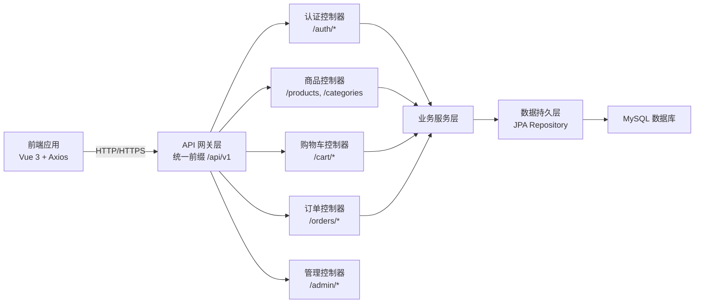

本文档阐述 EcoLink 电商系统的 RESTful API 设计规范，涵盖 URL 结构、请求响应格式、错误处理、认证机制等核心设计原则，帮助开发者理解前后端 API 契约。

## 整体架构

EcoLink 采用前后端分离架构，API 遵循 RESTful 设计原则，使用统一的响应封装格式和清晰的资源路径组织。



## URL 设计规范

### 版本控制与前缀

所有 API 统一使用 `/api/v1` 前缀进行版本控制，便于后续 API 升级和共存。Base URL 配置在环境变量中管理。

```typescript
// src/api/http.ts#L6-L7
const client = axios.create({
  baseURL: import.meta.env.VITE_API_BASE_URL || 'http://localhost:8080/api/v1',
```

Sources: [src/api/http.ts](src/api/http.ts#L6-L7)

### 资源命名规范

资源使用复数名词，通过嵌套路径表达资源归属关系。路径参数使用 `{id}` 占位符表示特定资源实例。

| 资源类型 | URL 路径 | 说明 |
|---------|---------|------|
| 认证 | `/auth/register`, `/auth/login` | 认证操作使用动作语义 |
| 用户 | `/users/me` | 当前用户使用 me 特殊标识 |
| 商品 | `/products`, `/products/{id}` | 商品集合与单个商品 |
| 分类 | `/categories` | 分类列表（只读） |
| 购物车 | `/cart`, `/cart/items/{itemId}` | 购物车与购物车项 |
| 订单 | `/orders`, `/orders/{id}`, `/orders/{id}/pay` | 订单及支付操作 |
| 收藏 | `/favorites`, `/favorites/{productId}` | 收藏功能 |
| 地址 | `/addresses`, `/addresses/{id}` | 收货地址管理 |
| 后台 | `/admin/dashboard`, `/admin/products` | 管理功能前缀 `/admin` |

```java
// server/src/main/java/com/ecolink/server/controller/AuthController.java#L13-L15
@RestController
@RequestMapping("/api/v1")
public class AuthController {
    
    @PostMapping("/auth/register")
    public ApiResponse<AuthResponse> register(@Valid @RequestBody RegisterRequest request) {
        return ApiResponse.ok(authService.register(request));
    }
}
```

Sources: [AuthController.java](server/src/main/java/com/ecolink/server/controller/AuthController.java#L13-L15)

## HTTP 方法映射

遵循 RESTful 方法语义，使用适当的 HTTP 方法表达操作类型。

| 方法 | 用途 | 示例 |
|-----|------|------|
| `GET` | 查询资源 | `GET /products?categoryId=1` |
| `POST` | 创建资源 | `POST /orders` |
| `PUT` | 更新资源 | `PUT /cart/items/{itemId}` |
| `DELETE` | 删除资源 | `DELETE /favorites/{productId}` |

```java
// server/src/main/java/com/ecolink/server/controller/CartController.java#L18-L43
@RestController
@RequestMapping("/api/v1/cart")
public class CartController {
    // GET - 查询购物车列表
    @GetMapping
    public ApiResponse<CartResponse> list() {
        return ApiResponse.ok(cartService.list());
    }

    // POST - 添加购物车项
    @PostMapping("/items")
    public ApiResponse<Void> add(@Valid @RequestBody AddCartItemRequest request) {
        cartService.add(request);
        return ApiResponse.okMessage("加入购物车成功");
    }

    // PUT - 更新购物车项数量
    @PutMapping("/items/{itemId}")
    public ApiResponse<Void> update(@PathVariable Long itemId, @Valid @RequestBody UpdateCartItemRequest request) {
        cartService.update(itemId, request);
        return ApiResponse.okMessage("购物车更新成功");
    }

    // DELETE - 删除购物车项
    @DeleteMapping("/items/{itemId}")
    public ApiResponse<Void> delete(@PathVariable Long itemId) {
        cartService.delete(itemId);
        return ApiResponse.okMessage("删除成功");
    }
}
```

Sources: [CartController.java](server/src/main/java/com/ecolink/server/controller/CartController.java#L18-L43)

## 请求格式规范

### 请求体格式

POST 和 PUT 请求使用 JSON 格式提交数据，必须设置 `Content-Type: application/json` 头。

```java
// server/src/main/java/com/ecolink/server/dto/auth/LoginRequest.java
public record LoginRequest(
    @NotBlank(message = "用户名不能为空")
    String username,
    @NotBlank(message = "密码不能为空")
    String password
) {}
```

Sources: [LoginRequest.java](server/src/main/java/com/ecolink/server/dto/auth/LoginRequest.java#L1-L11)

### 查询参数规范

列表类接口支持分页和过滤参数，使用 `@RequestParam` 注解声明可选参数。

```java
// server/src/main/java/com/ecolink/server/controller/ProductController.java#L26-L36
@GetMapping("/products")
public ApiResponse<PageResult<ProductItemResponse>> products(
    @RequestParam(required = false) String keyword,
    @RequestParam(required = false) Long categoryId,
    @RequestParam(required = false) BigDecimal minPrice,
    @RequestParam(required = false) BigDecimal maxPrice,
    @RequestParam(defaultValue = "comprehensive") String sort,
    @RequestParam(defaultValue = "1") int page,
    @RequestParam(defaultValue = "12") int size
) {
    return ApiResponse.ok(productService.listProducts(keyword, categoryId, minPrice, maxPrice, sort, page, size));
}
```

Sources: [ProductController.java](server/src/main/java/com/ecolink/server/controller/ProductController.java#L26-L36)

```typescript
// src/api/index.ts#L21-L30
export const productApi = {
  list(params: {
    keyword?: string;
    categoryId?: number;
    minPrice?: number;
    maxPrice?: number;
    sort?: string;
    page?: number;
    size?: number;
  }) {
    return http.get<PageResult<ProductItem>>('/products', params);
  },
```

Sources: [src/api/index.ts](src/api/index.ts#L21-L30)

## 响应格式规范

### 统一响应封装

所有 API 响应使用统一的 `ApiResponse<T>` 封装格式，包含状态码、消息、数据和时间戳。

```java
// server/src/main/java/com/ecolink/server/common/ApiResponse.java
public record ApiResponse<T>(
    int code,
    String message,
    T data,
    LocalDateTime timestamp
) {
    public static <T> ApiResponse<T> ok(T data) {
        return new ApiResponse<>(0, "OK", data, LocalDateTime.now());
    }

    public static <T> ApiResponse<T> ok(String message, T data) {
        return new ApiResponse<>(0, message, data, LocalDateTime.now());
    }

    public static ApiResponse<Void> okMessage(String message) {
        return new ApiResponse<>(0, message, null, LocalDateTime.now());
    }

    public static ApiResponse<Void> fail(int code, String message) {
        return new ApiResponse<>(code, message, null, LocalDateTime.now());
    }
}
```

Sources: [ApiResponse.java](server/src/main/java/com/ecolink/server/common/ApiResponse.java#L1-L27)

### TypeScript 类型定义

前端定义对应的响应类型，确保类型安全。

```typescript
// src/types/api.ts#L1-L6
export interface ApiResponse<T> {
  code: number;
  message: string;
  data: T;
  timestamp?: string;
}

export interface PageResult<T> {
  list: T[];
  page: number;
  size: number;
  total: number;
}
```

Sources: [src/types/api.ts](src/types/api.ts#L1-L11)

### 响应状态码约定

| code | 含义 | 使用场景 |
|-----|------|---------|
| 0 | 成功 | 正常响应 |
| 4001 | 参数校验失败 | 请求参数不合法 |
| 4010 | 认证过期 | Token 失效或未提供 |
| 4040 | 资源不存在 | 查找的实体不存在 |
| 5000 | 服务器内部错误 | 未预期的异常情况 |

### 分页响应格式

列表接口返回分页结果，包含数据列表和分页元数据。

```json
{
  "code": 0,
  "message": "OK",
  "data": {
    "list": [...],
    "page": 1,
    "size": 12,
    "total": 156
  },
  "timestamp": "2024-01-15T10:30:00"
}
```

## 错误处理机制

### 全局异常处理

使用 `@RestControllerAdvice` 统一处理各类异常，返回结构化的错误响应。

```java
// server/src/main/java/com/ecolink/server/exception/GlobalExceptionHandler.java
@RestControllerAdvice
public class GlobalExceptionHandler {

    @ExceptionHandler(BizException.class)
    public ApiResponse<Void> handleBiz(BizException ex) {
        return ApiResponse.fail(ex.getCode(), ex.getMessage());
    }

    @ExceptionHandler(MethodArgumentNotValidException.class)
    public ApiResponse<Void> handleValidation(MethodArgumentNotValidException ex) {
        FieldError fieldError = ex.getBindingResult().getFieldErrors().stream().findFirst().orElse(null);
        String msg = fieldError == null ? "参数校验失败" : fieldError.getDefaultMessage();
        return ApiResponse.fail(4001, msg);
    }

    @ExceptionHandler(HttpMessageNotReadableException.class)
    public ApiResponse<Void> handleUnreadable(HttpMessageNotReadableException ex) {
        return ApiResponse.fail(4001, "请求体格式错误");
    }

    @ExceptionHandler(Exception.class)
    public ApiResponse<Void> handleUnexpected(Exception ex) {
        return ApiResponse.fail(5000, "服务器内部错误: " + ex.getMessage());
    }
}
```

Sources: [GlobalExceptionHandler.java](server/src/main/java/com/ecolink/server/exception/GlobalExceptionHandler.java#L1-L41)

### 自定义业务异常

业务异常使用 `BizException` 类，携带错误码和消息。

```java
// server/src/main/java/com/ecolink/server/exception/BizException.java
public class BizException extends RuntimeException {
    private final int code;

    public BizException(int code, String message) {
        super(message);
        this.code = code;
    }

    public int getCode() {
        return code;
    }
}
```

Sources: [BizException.java](server/src/main/java/com/ecolink/server/exception/BizException.java#L1-L15)

## 认证与授权机制

### JWT Token 认证

API 使用 Bearer Token 方式进行身份认证，Token 在登录成功后返回，后续请求通过 Authorization 头传递。

```typescript
// src/api/http.ts#L8-L13
client.interceptors.request.use((config) => {
  const token = localStorage.getItem('ecolink_token');
  if (token) {
    config.headers.Authorization = `Bearer ${token}`;
  }
  return config;
});
```

Sources: [src/api/http.ts](src/api/http.ts#L8-L13)

### 认证过期处理

后端返回 4010 状态码时，前端自动清除本地 Token 并跳转登录页。

```typescript
// src/api/http.ts#L17-L23
client.interceptors.response.use(
  (response) => response,
  (error) => {
    if (error.response?.status === 401) {
      handleAuthExpired();
    }
    return Promise.reject(error);
  },
);

function handleAuthExpired() {
  localStorage.removeItem('ecolink_token');
  if (window.location.pathname !== '/login') {
    window.location.href = '/login';
  }
}
```

Sources: [src/api/http.ts](src/api/http.ts#L17-L23)

### 业务级认证错误

对于 Token 有效但业务认证失败的场景，使用业务错误码处理。

```typescript
// src/api/http.ts#L41-L45
if (body.code === 4010) {
  handleAuthExpired();
}
throw new Error(body.message || '请求失败');
```

Sources: [src/api/http.ts](src/api/http.ts#L41-L45)

## Mock 回退机制

前端实现了网络异常时的 Mock 数据回退，确保在无后端环境下仍能进行开发调试。

```typescript
// src/api/http.ts#L27-L37
async function request<T>(method: 'get' | 'post' | 'put' | 'delete', url: string, data?: unknown, params?: unknown): Promise<T> {
  const useMock = import.meta.env.VITE_ENABLE_MOCK !== 'false';

  let response;
  try {
    response = await client.request<ApiResponse<T>>({ method, url, data, params });
  } catch (networkError: unknown) {
    if (isAxiosNetworkError(networkError) && useMock) {
      return mockRequest<T>(method, url, data, params);
    }
    // ... 错误处理
  }
}
```

Sources: [src/api/http.ts](src/api/http.ts#L27-L37)

## 后台管理 API 规范

后台管理 API 使用 `/api/v1/admin` 前缀，与用户端 API 分离，便于权限控制和性能优化。

```java
// server/src/main/java/com/ecolink/server/controller/admin/AdminProductController.java#L21-L22
@RestController
@RequestMapping("/api/v1/admin/products")
public class AdminProductController {
```

Sources: [AdminProductController.java](server/src/main/java/com/ecolink/server/controller/admin/AdminProductController.java#L21-L22)

### 仪表盘统计接口

```typescript
// src/api/admin.ts#L8-L14
export const adminApi = {
  /** 仪表盘统计 */
  dashboard() {
    return http.get<AdminDashboardStats>('/admin/dashboard');
  },
```

Sources: [src/api/admin.ts](src/api/admin.ts#L8-L14)

## 字段命名规范

API 字段采用 **camelCase** 命名法，与 JavaScript/TypeScript 变量命名习惯保持一致。

```typescript
// src/types/api.ts#L47-L53
export interface ProductItem {
  id: number;
  categoryId: number;
  categoryName: string;
  name: string;
  subtitle?: string;
  price: number;
  stock: number;
  sales: number;
  mainImage?: string;
  status?: string;
}
```

Sources: [src/types/api.ts](src/types/api.ts#L47-L53)

## 订单状态枚举

订单状态使用标准化枚举值，便于状态流转和前端渲染。

```typescript
// src/types/api.ts#L58
export type OrderStatus = 'UNPAID' | 'PAID' | 'SHIPPED' | 'COMPLETED' | 'CANCELLED';
```

Sources: [src/types/api.ts](src/types/api.ts#L58)

## 后续学习路径

掌握 API 设计规范后，建议继续学习以下内容：

| 主题 | 文档 | 说明 |
|-----|------|------|
| 权限配置 | [Spring Security 权限配置](18-spring-security-quan-xian-pei-zhi) | 了解如何配置 API 访问权限 |
| 跨域策略 | [CORS 跨域与安全策略](19-cors-kua-yu-yu-an-quan-ce-lue) | 理解跨域请求处理机制 |
| 认证实现 | [JWT 认证与 Token 生成解析](10-jwt-ren-zheng-yu-token-sheng-cheng-jie-xi) | 深入理解 JWT 认证流程 |