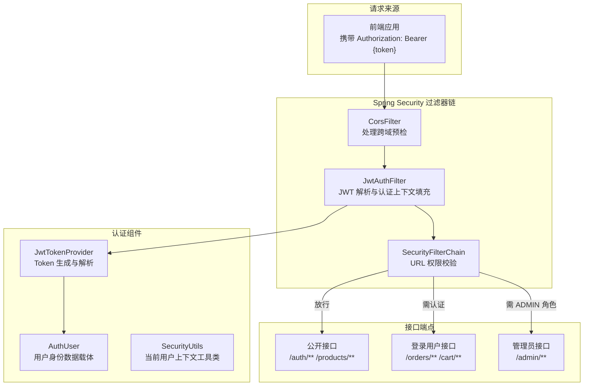
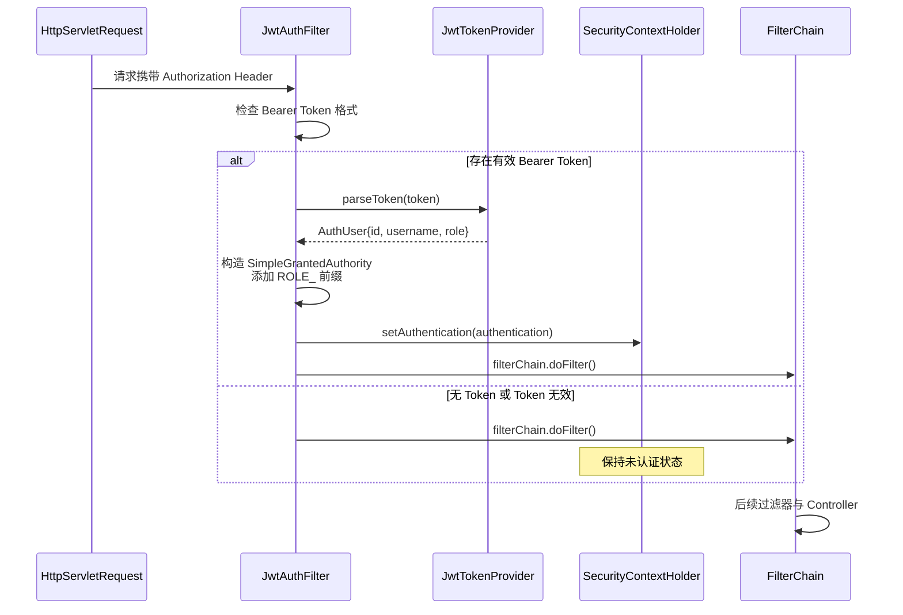
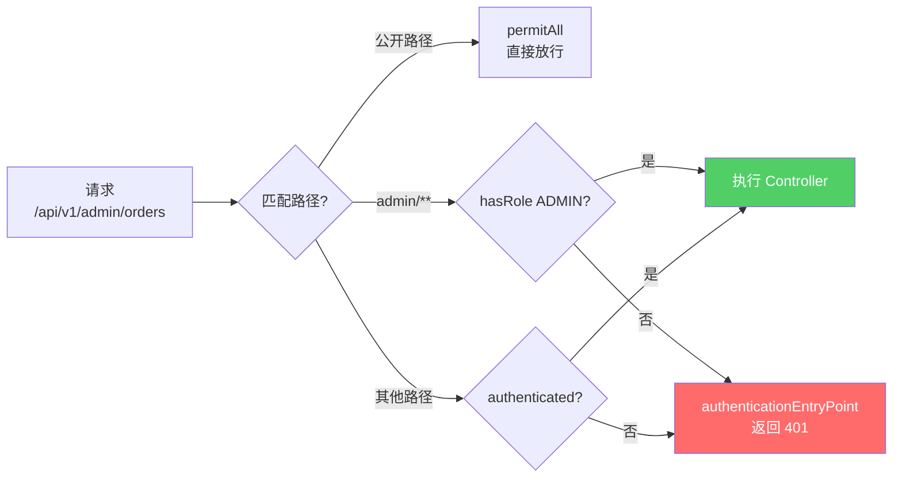

> 文档定位：详解 EcoLink 后端安全架构的核心配置、认证过滤器链与基于角色的权限控制  
> 同步依据：`SecurityConfig.java`、`JwtAuthFilter.java`、`JwtTokenProvider.java`、`AuthUser.java`、`SecurityUtils.java`  
> 推荐用途：毕业论文"系统安全设计"章节、团队技术分享、权限模块二次开发参考

## 1. 安全架构总览

EcoLink 采用 **Spring Security 6 + JWT 无状态认证** 的组合方案，通过过滤器链在请求到达 Controller 之前完成身份验证与权限校验。系统仅区分两种角色：`USER`（普通用户）与 `ADMIN`（管理员），权限粒度控制在 URL 路径级别。



Sources: [SecurityConfig.java](server/src/main/java/com/ecolink/server/config/SecurityConfig.java#L1-L79), [JwtAuthFilter.java](server/src/main/java/com/ecolink/server/security/JwtAuthFilter.java#L1-L54)

## 2. 核心配置文件

`SecurityConfig` 是整个安全模块的入口类，通过 `@Configuration` 注解注册为 Spring Bean，并定义 `SecurityFilterChain` Bean 组合配置各个安全策略。

```java
@Configuration
public class SecurityConfig {
    private final JwtAuthFilter jwtAuthFilter;

    @Value("${app.cors.allowed-origins}")
    private String allowedOrigins;

    public SecurityConfig(JwtAuthFilter jwtAuthFilter) {
        this.jwtAuthFilter = jwtAuthFilter;
    }

    @Bean
    public SecurityFilterChain securityFilterChain(HttpSecurity http) throws Exception {
        http.csrf(AbstractHttpConfigurer::disable)  // 禁用 CSRF（前后端分离项目标准做法）
                .cors(Customizer.withDefaults())
                .sessionManagement(session -> session.sessionCreationPolicy(SessionCreationPolicy.STATELESS))  // 无状态会话
                .authorizeHttpRequests(auth -> auth
                        .requestMatchers(
                                "/swagger-ui/**",
                                "/v3/api-docs/**",
                                "/actuator/health",
                                "/api/v1/auth/**",
                                "/api/v1/categories/**",
                                "/api/v1/products/**"
                        ).permitAll()
                        .requestMatchers("/api/v1/admin/**").hasRole("ADMIN")
                        .anyRequest().authenticated()
                )
                .exceptionHandling(ex -> ex
                        .authenticationEntryPoint((request, response, authException) -> {
                            response.setStatus(HttpServletResponse.SC_UNAUTHORIZED);
                            response.setContentType("application/json;charset=UTF-8");
                            response.getWriter().write("{\"code\":4010,\"message\":\"未登录或登录已过期\",\"data\":null}");
                        })
                )
                .addFilterBefore(jwtAuthFilter, UsernamePasswordAuthenticationFilter.class);
        return http.build();
    }
}
```

### 2.1 安全策略配置解析

| 配置项 | 设置值 | 说明 |
|--------|--------|------|
| CSRF | `disable` | 前后端分离项目无需 CSRF 防护，令牌机制由 JWT 实现 |
| 会话策略 | `STATELESS` | 不创建 HttpSession，每次请求独立验证 |
| 公开路径 | `permitAll()` | 认证文档、分类、商品等无需登录即可访问 |
| 管理员路径 | `hasRole("ADMIN")` | 仅 ROLE_ADMIN 角色可访问后台接口 |
| 其他路径 | `authenticated()` | 需要有效认证即可访问 |
| 认证入口点 | 401 JSON 响应 | 未认证时返回统一错误结构 |

Sources: [SecurityConfig.java](server/src/main/java/com/ecolink/server/config/SecurityConfig.java#L34-L60)

## 3. JWT 认证过滤器

`JwtAuthFilter` 继承自 `OncePerRequestFilter`，确保每个请求仅执行一次过滤。过滤器注册在 `UsernamePasswordAuthenticationFilter` 之前执行，保证在 Spring Security 进行权限校验前已完成身份解析。

### 3.1 过滤器执行流程



### 3.2 过滤器核心代码

```java
@Component
public class JwtAuthFilter extends OncePerRequestFilter {
    private final JwtTokenProvider jwtTokenProvider;

    @Override
    protected void doFilterInternal(
            @NonNull HttpServletRequest request,
            @NonNull HttpServletResponse response,
            @NonNull FilterChain filterChain)
            throws ServletException, IOException {
        String authHeader = request.getHeader(HttpHeaders.AUTHORIZATION);
        if (authHeader != null && authHeader.startsWith("Bearer ")) {
            String token = authHeader.substring(7);
            try {
                AuthUser authUser = jwtTokenProvider.parseToken(token);
                // 根据角色设置 GrantedAuthority
                String springRole = "ROLE_" + (authUser.role() != null ? authUser.role() : "USER");
                List<SimpleGrantedAuthority> authorities = List.of(new SimpleGrantedAuthority(springRole));
                User principal = new User(authUser.id().toString(), "", authorities);
                UsernamePasswordAuthenticationToken authentication =
                        new UsernamePasswordAuthenticationToken(principal, null, principal.getAuthorities());
                authentication.setDetails(new WebAuthenticationDetailsSource().buildDetails(request));
                SecurityContextHolder.getContext().setAuthentication(authentication);
            } catch (Exception ignored) {
                // token 无效时不抛出异常，交给后续鉴权流程处理
            }
        }
        filterChain.doFilter(request, response);
    }
}
```

**关键设计点**：

- **异常吞没**：Token 解析失败时不抛出异常，由后续权限校验流程统一处理未认证情况
- **角色前缀转换**：数据库存储 `USER`/`ADMIN`，Spring Security 要求 `ROLE_USER`/`ROLE_ADMIN` 格式
- **Principal 载体**：使用 Spring Security 内置 `User` 类作为认证主体，`getUsername()` 返回用户 ID

Sources: [JwtAuthFilter.java](server/src/main/java/com/ecolink/server/security/JwtAuthFilter.java#L28-L52)

## 4. JWT Token 管理

`JwtTokenProvider` 负责 Token 的生成与解析，基于 `jjwt` 库实现签名与验签。

### 4.1 Token 生成

```java
public String generateToken(Long userId, String username, String role) {
    Instant now = Instant.now();
    Instant exp = now.plus(jwtProperties.getExpireHours(), ChronoUnit.HOURS);
    return Jwts.builder()
            .issuer(jwtProperties.getIssuer())
            .subject(String.valueOf(userId))
            .claim("username", username)
            .claim("role", role)
            .issuedAt(Date.from(now))
            .expiration(Date.from(exp))
            .signWith(secretKey())
            .compact();
}
```

### 4.2 Token 解析

```java
public AuthUser parseToken(String token) {
    Claims claims = Jwts.parser().verifyWith(secretKey()).build()
            .parseSignedClaims(token).getPayload();
    Long userId = Long.parseLong(claims.getSubject());
    String username = claims.get("username", String.class);
    String role = claims.get("role", String.class);
    if (role == null) {
        role = "USER";
    }
    return new AuthUser(userId, username, role);
}
```

### 4.3 Token 载荷结构

| 字段 | 来源 | 说明 |
|------|------|------|
| `sub` | 用户 ID | 作为 Token 主键标识 |
| `username` | 用户名 | 用于展示 |
| `role` | 角色 | USER 或 ADMIN |
| `iss` | 签发者 | 配置值 ecolink |
| `iat` | 签发时间 | 自动生成 |
| `exp` | 过期时间 | 配置值，默认 24 小时 |

Sources: [JwtTokenProvider.java](server/src/main/java/com/ecolink/server/security/JwtTokenProvider.java#L25-L48)

## 5. 用户身份数据载体

`AuthUser` 采用 Java Record 语法定义轻量级数据传输对象，仅用于在过滤器与 Token 提供者之间传递用户身份信息。

```java
public record AuthUser(Long id, String username, String role) {}
```

Record 的不可变特性确保了身份信息在传输过程中不会被意外修改，同时减少了样板代码。

Sources: [AuthUser.java](server/src/main/java/com/ecolink/server/security/AuthUser.java#L1-L4)

## 6. 当前用户上下文工具

`SecurityUtils` 提供静态方法用于在 Service 层便捷获取当前登录用户 ID，避免在业务代码中直接依赖 `SecurityContextHolder`。

```java
public final class SecurityUtils {
    private SecurityUtils() {}

    public static long currentUserId() {
        Authentication authentication = SecurityContextHolder.getContext().getAuthentication();
        if (authentication == null || !(authentication.getPrincipal() instanceof User user)) {
            throw new BizException(4010, "请先登录");
        }
        return Long.parseLong(user.getUsername());
    }
}
```

**使用示例**：

```java
// AuthService.java 中的用法
public User getCurrentUserEntity() {
    long userId = SecurityUtils.currentUserId();
    return userRepository.findById(userId).orElseThrow(
        () -> new BizException(4040, "用户不存在")
    );
}
```

Sources: [SecurityUtils.java](server/src/main/java/com/ecolink/server/security/SecurityUtils.java#L11-L17)

## 7. 密码加密策略

系统使用 Spring Security 提供的委托式密码编码器，支持多种编码算法并存：

```java
@Bean
public PasswordEncoder passwordEncoder() {
    return PasswordEncoderFactories.createDelegatingPasswordEncoder();
}
```

该配置默认采用 `bcrypt` 编码，新密码存储格式为 `{bcrypt}...`，同时兼容历史密码。`AuthService` 在注册与登录时使用此编码器：

```java
// 注册时：明文密码 → Hash
user.setPasswordHash(passwordEncoder.encode(request.password()));

// 登录时：比对输入密码与存储 Hash
if (!passwordEncoder.matches(request.password(), user.getPasswordHash())) {
    throw new BizException(4003, "账号或密码错误");
}
```

Sources: [SecurityConfig.java](server/src/main/java/com/ecolink/server/config/SecurityConfig.java#L62-L65), [AuthService.java](server/src/main/java/com/ecolink/server/service/AuthService.java#L36-L51)

## 8. 角色与数据库关联

用户角色存储在 `users` 表的 `role` 字段中，默认值为 `USER`，管理员账户角色为 `ADMIN`：

```java
@Column(nullable = false, length = 20)
private String role = "USER";
```

在 `AuthService.login()` 与 `register()` 方法中，角色信息被提取并写入 JWT Token：

```java
String token = jwtTokenProvider.generateToken(user.getId(), user.getUsername(), user.getRole());
```

Sources: [User.java](server/src/main/java/com/ecolink/server/domain/User.java#L29-L30), [AuthService.java](server/src/main/java/com/ecolink/server/service/AuthService.java#L41-L54)

## 9. 配置属性

JWT 与安全相关的配置集中在 `application.yml` 的 `app` 节点下：

```yaml
app:
  cors:
    allowed-origins: ${CORS_ALLOWED_ORIGINS:http://localhost:3000,http://localhost:5173}
  jwt:
    issuer: ecolink
    secret: ${JWT_SECRET:ecolink-super-secret-key-for-local-dev-please-change}
    expire-hours: 24
```

| 配置项 | 默认值 | 说明 |
|--------|--------|------|
| `cors.allowed-origins` | `localhost:3000,localhost:5173` | 允许的跨域来源 |
| `jwt.issuer` | `ecolink` | Token 签发者标识 |
| `jwt.secret` | 内置开发密钥 | HMAC 签名密钥（生产环境需替换） |
| `jwt.expire-hours` | `24` | Token 有效期（小时） |

Sources: [application.yml](server/src/main/resources/application.yml#L29-L35)

## 10. 权限校验决策流程



## 11. 关键组件清单

| 组件 | 职责 | 源码位置 |
|------|------|----------|
| `SecurityConfig` | 安全过滤器链配置 | `config/SecurityConfig.java` |
| `JwtAuthFilter` | JWT 解析与认证上下文填充 | `security/JwtAuthFilter.java` |
| `JwtTokenProvider` | Token 生成与解析 | `security/JwtTokenProvider.java` |
| `JwtProperties` | JWT 配置属性绑定 | `security/JwtProperties.java` |
| `AuthUser` | 用户身份数据传输对象 | `security/AuthUser.java` |
| `SecurityUtils` | 当前用户上下文工具类 | `security/SecurityUtils.java` |

## 12. 相关章节推荐

深入理解权限配置需要结合以下相关章节：

- **[JWT 认证与 Token 生成解析](17-restful-api-she-ji-gui-fan)** — Token 生成与解析的完整生命周期
- **[CORS 跨域与安全策略](19-cors-kua-yu-yu-an-quan-ce-lue)** — 跨域配置与安全策略的协同
- **[RESTful API 设计规范](17-restful-api-she-ji-gui-fan)** — 公开接口与认证接口的设计边界

## 13. 来源说明

### 代码依据

- [SecurityConfig.java](server/src/main/java/com/ecolink/server/config/SecurityConfig.java) — 安全过滤器链配置
- [JwtAuthFilter.java](server/src/main/java/com/ecolink/server/security/JwtAuthFilter.java) — JWT 认证过滤器
- [JwtTokenProvider.java](server/src/main/java/com/ecolink/server/security/JwtTokenProvider.java) — Token 管理组件
- [JwtProperties.java](server/src/main/java/com/ecolink/server/security/JwtProperties.java) — JWT 配置属性
- [AuthUser.java](server/src/main/java/com/ecolink/server/security/AuthUser.java) — 身份数据载体
- [SecurityUtils.java](server/src/main/java/com/ecolink/server/security/SecurityUtils.java) — 上下文工具类
- [AuthService.java](server/src/main/java/com/ecolink/server/service/AuthService.java) — 认证服务层
- [User.java](server/src/main/java/com/ecolink/server/domain/User.java) — 用户实体与角色字段
- [application.yml](server/src/main/resources/application.yml) — 安全配置属性