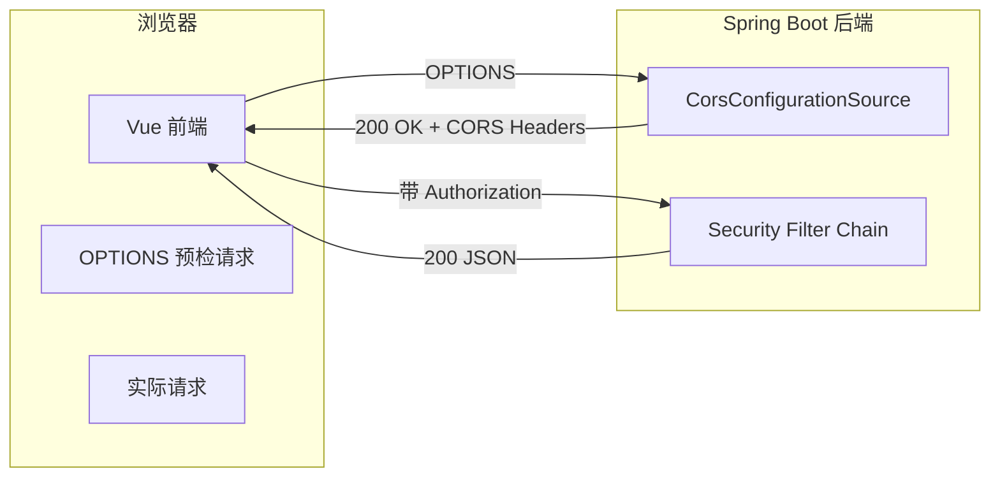
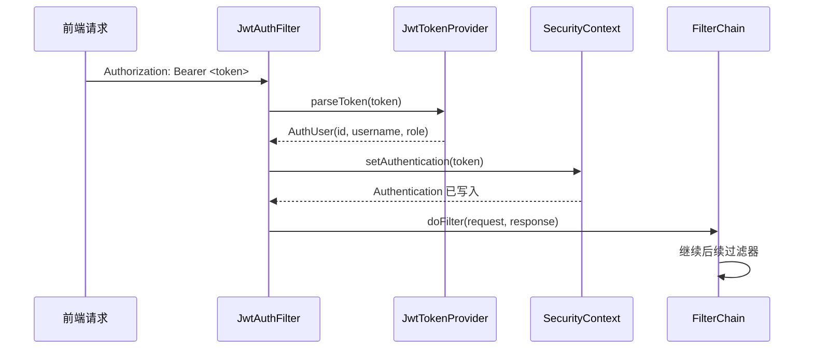
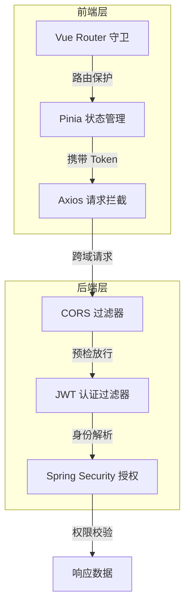

> **文档定位**：阐述 EcoLink 系统的跨域资源共享（CORS）配置、认证机制与多层防护策略  
> **同步依据**：Spring Security 配置、CORS 过滤器、JWT 认证过滤器、前端 HTTP 客户端、Pinia 认证状态管理  
> **推荐用途**：毕业论文"系统安全设计"、"跨域问题处理"章节

## 1. 跨域问题概述

跨域问题是浏览器同源策略（Same-Origin Policy）的产物。当前端页面（`http://localhost:5173`）通过 JavaScript 请求后端接口（`http://localhost:8080`）时，由于协议、域名、端口三者不一致，浏览器会阻止默认响应，除非服务器明确授权。

EcoLink 作为一个前后端分离的项目，采用以下跨域策略：

- **后端主动配置**：Spring Security 中的 CORS 配置源（`CorsConfigurationSource`）明确声明允许的来源、方法、头部
- **前端不依赖 Vite 代理**：与部分项目使用 Vite 开发服务器代理不同，EcoLink 前端直接请求后端端口，由后端处理 CORS 预检请求



Sources: [SecurityConfig.java](server/src/main/java/com/ecolink/server/config/SecurityConfig.java#L34-L79)

## 2. 后端 CORS 配置详解

### 2.1 配置来源

CORS 配置值通过 Spring Boot 的外部化配置机制注入，支持通过环境变量或 `.env` 文件覆盖默认值：

```yaml
# application.yml
app:
  cors:
    allowed-origins: ${CORS_ALLOWED_ORIGINS:http://localhost:3000,http://localhost:5173}
```

| 配置方式 | 示例 | 适用场景 |
|---|---|---|
| 默认值 | `http://localhost:5173` | 开发环境 Vite 默认端口 |
| 环境变量 | `CORS_ALLOWED_ORIGINS=http://example.com` | 生产环境单域名 |
| 逗号分隔多值 | `http://example.com,https://admin.example.com` | 多域名支持 |

Sources: [application.yml](server/src/main/resources/application.yml#L29-L31)

### 2.2 CorsConfigurationSource Bean

`SecurityConfig` 类中定义的 `corsConfigurationSource` 方法创建了完整的 CORS 配置：

```java
@Bean
public CorsConfigurationSource corsConfigurationSource() {
    CorsConfiguration config = new CorsConfiguration();
    // 允许的来源列表
    config.setAllowedOrigins(
        Arrays.stream(allowedOrigins.split(","))
              .map(String::trim)
              .toList()
    );
    // 允许的 HTTP 方法
    config.setAllowedMethods(List.of("GET", "POST", "PUT", "DELETE", "OPTIONS"));
    // 允许所有请求头（支持前端自定义头）
    config.setAllowedHeaders(List.of("*"));
    // 允许携带凭证（Cookie、Authorization Header）
    config.setAllowCredentials(true);
    
    UrlBasedCorsConfigurationSource source = new UrlBasedCorsConfigurationSource();
    source.registerCorsConfiguration("/**", config);
    return source;
}
```

配置项说明：

| 配置方法 | 值 | 说明 |
|---|---|---|
| `setAllowedOrigins` | 来源列表 | 必须与浏览器页面地址完全一致，包括协议和端口 |
| `setAllowedMethods` | GET, POST, PUT, DELETE, OPTIONS | 允许的 HTTP 方法，不包含 PATCH |
| `setAllowedHeaders` | `*` | 允许所有请求头，前端无需额外配置 |
| `setAllowCredentials` | true | 允许请求携带 Cookie 和 Authorization 头 |
| `registerCorsConfiguration` | `/**` | 匹配所有路径，全局生效 |

Sources: [SecurityConfig.java](server/src/main/java/com/ecolink/server/config/SecurityConfig.java#L62-L79)

### 2.3 Security Filter Chain 集成

CORS 在 Spring Security 过滤器链中的位置至关重要。EcoLink 的配置顺序确保了 CORS 处理优先于认证逻辑：

```java
@Bean
public SecurityFilterChain securityFilterChain(HttpSecurity http) throws Exception {
    http.csrf(AbstractHttpConfigurer::disable)  // 禁用 CSRF（API 项目常见做法）
        .cors(Customizer.withDefaults())         // 启用 CORS
        .sessionManagement(session -> session
            .sessionCreationPolicy(SessionCreationPolicy.STATELESS))  // 无状态会话
        .authorizeHttpRequests(auth -> auth
            .requestMatchers("/api/v1/auth/**", "/api/v1/categories/**", "/api/v1/products/**")
                .permitAll()
            .requestMatchers("/api/v1/admin/**")
                .hasRole("ADMIN")
            .anyRequest().authenticated())
        .addFilterBefore(jwtAuthFilter, UsernamePasswordAuthenticationFilter.class);
    return http.build();
}
```

关键点：
- **CSRF 禁用**：因为使用 JWT Token 作为认证凭证，CSRF Token 机制不适用
- **无状态会话**：每次请求独立验证，不依赖服务端 Session
- **CORS 在认证之前**：确保 OPTIONS 预检请求不会被 JWT 拦截

Sources: [SecurityConfig.java](server/src/main/java/com/ecolink/server/config/SecurityConfig.java#L34-L60)

## 3. JWT 无状态认证机制

### 3.1 Token 结构设计

EcoLink 使用 JJWT（Java JWT）库生成和解析 Token，Token 中携带的声明（Claims）如下：

| 声明 | 来源 | 用途 |
|---|---|---|
| `sub` | `JwtTokenProvider.generateToken()` | 用户 ID，作为 Token 主键 |
| `username` | 用户注册/登录名 | 展示用途 |
| `role` | USER / ADMIN | 权限判断 |
| `iss` | ecolink | Token 签发者标识 |
| `iat` | 签发时间戳 | Token 创建时刻 |
| `exp` | 当前时间 + 24 小时 | 过期时间 |

```java
public String generateToken(Long userId, String username, String role) {
    Instant now = Instant.now();
    Instant exp = now.plus(jwtProperties.getExpireHours(), ChronoUnit.HOURS);
    return Jwts.builder()
            .issuer(jwtProperties.getIssuer())
            .subject(String.valueOf(userId))
            .claim("username", username)
            .claim("role", role)
            .issuedAt(Date.from(now))
            .expiration(Date.from(exp))
            .signWith(secretKey())
            .compact();
}
```

Sources: [JwtTokenProvider.java](server/src/main/java/com/ecolink/server/security/JwtTokenProvider.java#L25-L37)

### 3.2 JwtAuthFilter 过滤器

`JwtAuthFilter` 继承自 `OncePerRequestFilter`，确保每个请求只执行一次认证逻辑：

```java
@Override
protected void doFilterInternal(
        @NonNull HttpServletRequest request,
        @NonNull HttpServletResponse response,
        @NonNull FilterChain filterChain) throws ServletException, IOException {
    String authHeader = request.getHeader(HttpHeaders.AUTHORIZATION);
    if (authHeader != null && authHeader.startsWith("Bearer ")) {
        String token = authHeader.substring(7);
        try {
            AuthUser authUser = jwtTokenProvider.parseToken(token);
            // 将角色转换为 Spring Security 格式：USER -> ROLE_USER
            String springRole = "ROLE_" + (authUser.role() != null ? authUser.role() : "USER");
            List<SimpleGrantedAuthority> authorities = List.of(new SimpleGrantedAuthority(springRole));
            User principal = new User(authUser.id().toString(), "", authorities);
            
            UsernamePasswordAuthenticationToken authentication =
                    new UsernamePasswordAuthenticationToken(principal, null, principal.getAuthorities());
            authentication.setDetails(new WebAuthenticationDetailsSource().buildDetails(request));
            SecurityContextHolder.getContext().setAuthentication(authentication);
        } catch (Exception ignored) {
            // Token 无效时不抛出异常，交给后续鉴权流程处理
        }
    }
    filterChain.doFilter(request, response);
}
```

认证流程说明：



Sources: [JwtAuthFilter.java](server/src/main/java/com/ecolink/server/security/JwtAuthFilter.java#L28-L52)

### 3.3 Token 解析与角色映射

解析 Token 时，系统将数据库中的 `USER` / `ADMIN` 角色自动映射为 Spring Security 的 `ROLE_USER` / `ROLE_ADMIN`：

```java
public AuthUser parseToken(String token) {
    Claims claims = Jwts.parser()
            .verifyWith(secretKey())
            .build()
            .parseSignedClaims(token)
            .getPayload();
    Long userId = Long.parseLong(claims.getSubject());
    String username = claims.get("username", String.class);
    String role = claims.get("role", String.class);
    if (role == null) {
        role = "USER";
    }
    return new AuthUser(userId, username, role);
}
```

Sources: [JwtTokenProvider.java](server/src/main/java/com/ecolink/server/security/JwtTokenProvider.java#L39-L48)

## 4. 前端安全实现

### 4.1 Axios HTTP 客户端封装

前端通过 Axios 封装统一的 HTTP 请求逻辑，核心安全特性包括：

```typescript
const client = axios.create({
  baseURL: import.meta.env.VITE_API_BASE_URL || 'http://localhost:8080/api/v1',
  timeout: 15000,
});

// 请求拦截器：自动注入 Token
client.interceptors.request.use((config) => {
  const token = localStorage.getItem('ecolink_token');
  if (token) {
    config.headers.Authorization = `Bearer ${token}`;
  }
  return config;
});

// 响应拦截器：处理 401 未授权
client.interceptors.response.use(
  (response) => response,
  (error) => {
    if (error.response?.status === 401) {
      handleAuthExpired();
    }
    return Promise.reject(error);
  },
);

function handleAuthExpired() {
  localStorage.removeItem('ecolink_token');
  if (window.location.pathname !== '/login') {
    window.location.href = '/login';
  }
}
```

Sources: [http.ts](src/api/http.ts#L1-L33)

### 4.2 Pinia 认证状态管理

Pinia 中的 `auth` store 负责管理登录状态和用户信息：

```typescript
export const useAuthStore = defineStore('auth', () => {
  const token = ref(localStorage.getItem('ecolink_token') || '');
  const user = ref<UserMe | null>(null);

  const isLogin = computed(() => Boolean(token.value));
  const isAdmin = computed(() => user.value?.role === 'ADMIN');

  function setSession(newToken: string, newUser: UserMe) {
    token.value = newToken;
    user.value = newUser;
    localStorage.setItem('ecolink_token', newToken);
  }

  function clearSession() {
    token.value = '';
    user.value = null;
    localStorage.removeItem('ecolink_token');
  }

  // ...登录、注册、获取用户信息方法
});
```

Sources: [auth.ts](src/stores/auth.ts#L1-L51)

### 4.3 统一响应处理

前端对业务错误码的处理集中在 `http.ts` 的 `request` 函数中：

```typescript
async function request<T>(method, url, data?, params?): Promise<T> {
  // ...网络请求...
  const body = response.data;
  
  // 业务错误码判断
  if (body.code !== 0) {
    if (body.code === 4010) {
      handleAuthExpired();  // 登录过期
    }
    throw new Error(body.message || '请求失败');
  }
  return body.data;
}
```

| 错误码 | 含义 | 前端处理 |
|---|---|---|
| `0` | 成功 | 返回 data |
| `4010` | 未登录或登录过期 | 清除 Token，跳转登录页 |
| 其他非 0 | 业务错误 | 抛出异常，提示用户 |

Sources: [http.ts](src/api/http.ts#L42-L65)

## 5. 多层防护策略

EcoLink 采用前后端双重防护机制，确保系统在各个层次都具备安全控制能力：



### 5.1 放行资源

以下接口无需认证即可访问：

| 路径模式 | 说明 |
|---|---|
| `/api/v1/auth/**` | 用户注册、登录 |
| `/api/v1/categories/**` | 商品分类查询 |
| `/api/v1/products/**` | 商品列表、详情 |
| `/actuator/health` | 健康检查 |
| `/swagger-ui/**`, `/v3/api-docs/**` | API 文档（开发环境） |

Sources: [SecurityConfig.java](server/src/main/java/com/ecolink/server/config/SecurityConfig.java#L40-L47)

### 5.2 受保护资源

除放行资源外，其他接口需要有效的 JWT Token：

| 路径模式 | 权限要求 |
|---|---|
| `/api/v1/cart/**` | 登录用户 |
| `/api/v1/orders/**` | 登录用户 |
| `/api/v1/favorites/**` | 登录用户 |
| `/api/v1/addresses/**` | 登录用户 |
| `/api/v1/users/me` | 登录用户 |
| `/api/v1/admin/**` | ADMIN 角色 |

### 5.3 前端路由守卫

前端 Vue Router 通过全局守卫实现第一层访问控制：

```typescript
router.beforeEach((to, from, next) => {
  const { isLogin, isAdmin } = useAuthStore();
  
  if (to.path.startsWith('/admin') && !isAdmin) {
    next('/');  // 非管理员跳转首页
    return;
  }
  
  if (to.meta.requiresAuth && !isLogin) {
    next({ path: '/login', query: { redirect: to.fullPath } });
    return;
  }
  
  next();
});
```

Sources: [src/stores/auth.ts](src/stores/auth.ts#L1-L51)

## 6. 生产环境部署注意事项

### 6.1 CORS 来源配置

生产环境应通过环境变量严格控制允许的来源：

```bash
# 生产环境推荐设置
export CORS_ALLOWED_ORIGINS=https://www.ecolink.com,https://admin.ecolink.com
```

**注意**：不应在生产环境使用通配符 `*` 作为 allowed origins，否则 `allowCredentials(true)` 将无法生效。

### 6.2 JWT 密钥安全

JWT 密钥应通过环境变量注入，避免硬编码：

```bash
# 强随机密钥要求至少 256 位
export JWT_SECRET=your-production-secret-key-at-least-32-characters-long
```

### 6.3 前端环境变量

`.env.local` 中配置生产 API 地址：

```bash
VITE_API_BASE_URL=https://api.ecolink.com/api/v1
VITE_ENABLE_MOCK=false
```

Sources: [.env.local](.env.local#L1-L4)

## 7. 常见问题排查

### 7.1 跨域错误排查表

| 错误现象 | 可能原因 | 解决方案 |
|---|---|---|
| `Access-Control-Allow-Origin` 缺失 | 后端 CORS 配置未生效 | 检查 `CorsConfigurationSource` Bean |
| `Credentials not supported if origin is '*'` | allowed-origin 设置为 `*` | 修改为具体域名 |
| 预检请求 401 | OPTIONS 请求被 Security 拦截 | 确保 `cors()` 在 `authorizeHttpRequests()` 之前 |
| 允许的方法缺失 | `setAllowedMethods` 不完整 | 添加 PUT、DELETE、OPTIONS |

### 7.2 Token 相关问题

| 错误现象 | 可能原因 | 解决方案 |
|---|---|---|
| Token 已过期 | `exp` 时间戳已到 | 重新登录获取新 Token |
| Token 签名无效 | 密钥不匹配 | 检查 JWT_SECRET 环境变量 |
| 用户角色变更后 Token 仍有效 | Token 已签发，不支持撤销 | 等待 Token 过期或缩短过期时间 |

## 8. 核心配置文件速查

| 文件 | 职责 |
|---|---|
| `SecurityConfig.java` | CORS 配置、安全过滤链、权限策略 |
| `JwtAuthFilter.java` | Token 解析、SecurityContext 写入 |
| `JwtTokenProvider.java` | Token 生成与解析 |
| `JwtProperties.java` | JWT 配置属性绑定 |
| `AuthUser.java` | 认证用户数据结构 |
| `http.ts` | 前端 HTTP 请求封装、401 处理 |
| `auth.ts` | Pinia 认证状态管理 |

## 9. 后续学习路径

在完成 CORS 与安全策略的学习后，建议继续以下章节：

- [RESTful API 设计规范](17-restful-api-she-ji-gui-fan) — 了解接口设计原则
- [Spring Security 权限配置](18-spring-security-quan-xian-pei-zhi) — 深入安全配置细节
- [JWT 认证与 Token 生成解析](10-jwt-ren-zheng-yu-token-sheng-cheng-jie-xi) — JWT 底层实现
- [环境配置与部署方案](23-huan-jing-pei-zhi-yu-bu-shu-fang-an) — 生产部署实践