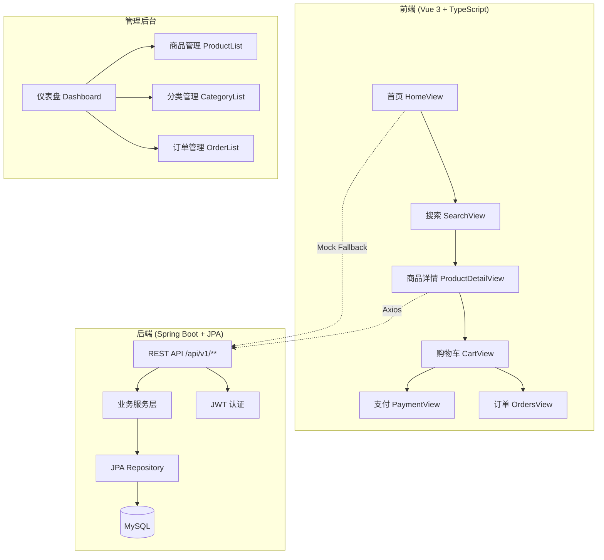

本文档面向初次接触 EcoLink 项目的开发者，帮助你在本地完成环境准备、前后端启动与首次功能体验。通过跟随以下步骤，你将在 15 分钟内运行起一个完整的绿色生态农产品电商系统。

## 系统概述

EcoLink 是一个前后端分离的全栈电商项目，包含两个核心使用场景：**C 端用户**（商品浏览、购物车、订单）和**管理后台**（商品管理、订单管理、运营仪表盘）。



**技术栈一览：**

| 层次 | 技术选型 | 说明 |
|---|---|---|
| 前端框架 | Vue 3 + TypeScript | 组合式 API（Composition API） |
| 构建工具 | Vite 7 | 开发服务器端口 3000 |
| 状态管理 | Pinia 3 | auth、cart、toast 三个 Store |
| 路由 | Vue Router 4 | 路由守卫实现登录与权限控制 |
| 样式 | Tailwind CSS 4 + @theme | 自定义 CSS 变量与组件类 |
| 后端框架 | Spring Boot 3.3.5 | Java 17 |
| 认证 | Spring Security + JWT | Token 有效期 24 小时 |
| 数据访问 | Spring Data JPA | Hibernate ORM |
| 数据库 | MySQL 8.x | Flyway 自动迁移 |
| 接口文档 | springdoc-openapi | Swagger UI 可视化 |

Sources: [package.json](package.json#L1-L28) [pom.xml](server/pom.xml#L1-L100) [Home.md](docs/wiki/Home.md#L48-L70)

## 前置条件

在开始之前，请确保本地已安装以下工具：

- **Node.js 18+**：用于运行前端项目
- **Maven 3.8+**：用于构建和运行后端项目
- **MySQL 8.0+**：数据库服务（可使用 Docker 或本地安装）

```bash
# 验证 Node.js 和 Maven 版本
node --version
npm --version
mvn --version
```

如果你的机器尚未安装 MySQL，项目提供了 **Mock 数据回退机制**——当后端服务不可用时，前端会自动切换到本地模拟数据，确保开发体验不受影响。
Sources: [http.ts](src/api/http.ts#L43-L50) [mock.ts](src/api/mock.ts#L1-L1122)

## 前端启动

### 第一步：安装依赖

```bash
npm install
```

这条命令会读取 `package.json` 中的依赖声明，安装 Vue 3、Pinia、Vue Router、Axios、Tailwind CSS 等核心包。

### 第二步：启动开发服务器

```bash
npm run dev
```

Vite 开发服务器将在 `http://localhost:3000` 启动。你会看到终端输出类似以下信息：

```
  VITE v7.1.3  ready in 312 ms

  ➜  Local:   http://localhost:3000/
  ➜  Network: http://192.168.x.x:3000/
```

### 第三步：验证运行

在浏览器中打开 `http://localhost:3000`，你应该能看到 EcoLink 首页。如果后端未启动，系统会自动回退到 Mock 数据模式，所有功能（浏览商品、加入购物车等）仍可正常使用。
Sources: [package.json](package.json#L5-L12) [index.html](index.html#L1-L21)

## 后端启动（可选）

如果你希望体验完整功能（持久化数据、真实 API 调用、Swagger 文档），需要启动后端服务。

### 第一步：创建数据库

```sql
CREATE DATABASE ecolink DEFAULT CHARACTER SET utf8mb4;
```

### 第二步：配置环境变量

在后端目录中创建 `.env` 文件：

```bash
cd server
cp .env.example .env
```

编辑 `.env`，修改数据库密码：

```properties
DB_PASSWORD=你的MySQL密码
# 若 8080 端口被占用，可调整
SERVER_PORT=8081
```

### 第三步：启动后端服务

```bash
cd server
mvn spring-boot:run
```

Flyway 会自动执行 `server/src/main/resources/db/migration/` 下的 SQL 脚本，完成数据库表结构创建和种子数据初始化。

### 第四步：验证接口

后端启动成功后，可访问以下地址：

| 资源 | 地址 |
|---|---|
| Swagger UI | http://localhost:8080/swagger-ui/index.html |
| OpenAPI 文档 | http://localhost:8080/v3/api-docs |

Sources: [application.yml](server/src/main/resources/application.yml#L1-L36) [README.md](README.md#L40-L62)

## 默认体验账号

项目预置了两个角色账号，供快速体验使用：

| 角色 | 用户名 | 密码 | 说明 |
|---|---|---|---|
| 普通用户 | demo | 123456 | 可浏览商品、管理购物车和订单 |
| 管理员 | admin | admin123 | 可进入 `/admin` 后台管理所有数据 |

**普通用户体验路径：**
1. 使用 `demo / 123456` 登录
2. 首页或搜索页选品
3. 商品详情页加入购物车
4. 购物车创建订单
5. 支付页模拟支付
6. 订单页查看状态流转

**管理员体验路径：**
1. 使用 `admin / admin123` 登录
2. 点击顶部「管理员后台」入口进入 `/admin`
3. 在仪表盘查看数据统计
4. 试用商品管理与分类管理
5. 打开订单详情抽屉，执行发货或完成操作
Sources: [README.md](README.md#L64-L73)

## 项目结构概览

```
Ecolink/
├── src/                          # Vue 前端源码
│   ├── main.ts                   # 应用入口，初始化 Pinia + Router
│   ├── App.vue                   # 根组件，控制 Header/Footer 显示
│   ├── api/                      # API 封装层
│   │   ├── http.ts               # Axios 实例，含 Token 拦截与 Mock 回退
│   │   ├── index.ts              # 各业务模块 API 函数导出
│   │   └── mock.ts               # 离线 Mock 数据库（IndexedDB 持久化）
│   ├── stores/                   # Pinia 状态管理
│   │   ├── auth.ts               # 认证状态（登录/登出/用户信息）
│   │   ├── cart.ts               # 购物车状态
│   │   └── toast.ts              # 全局消息提示状态
│   ├── router/index.ts           # 路由配置与权限守卫
│   ├── views/                    # 页面视图
│   │   ├── HomeView.vue          # 首页
│   │   ├── SearchView.vue        # 搜索与筛选
│   │   ├── ProductDetailView.vue # 商品详情
│   │   ├── CartView.vue          # 购物车
│   │   ├── OrdersView.vue        # 订单列表
│   │   ├── PaymentView.vue       # 支付页面
│   │   ├── LoginView.vue         # 登录页
│   │   ├── RegisterView.vue      # 注册页
│   │   ├── ProfileView.vue       # 个人中心
│   │   └── admin/                # 管理后台页面
│   └── components/               # 可复用组件
│
├── server/                       # Spring Boot 后端源码
│   └── src/main/
│       ├── java/com/ecolink/     # Java 源码
│       └── resources/
│           ├── application.yml   # Spring Boot 配置
│           └── db/migration/     # Flyway 迁移脚本
│
└── docs/wiki/                    # 技术文档 Wiki
```

**前端关键文件说明：**

| 文件 | 职责 |
|---|---|
| `src/api/http.ts` | Axios 实例配置，Token 自动注入，401 自动跳转登录，Mock 回退 |
| `src/stores/auth.ts` | 用户登录状态、角色判断、Token 持久化到 localStorage |
| `src/router/index.ts` | 路由表定义，`beforeEach` 守卫校验登录态和管理员权限 |
| `src/index.css` | Tailwind CSS 4 配置、自定义 CSS 变量、组件样式类 |
Sources: [main.ts](src/main.ts#L1-L8) [http.ts](src/api/http.ts#L1-L83) [auth.ts](src/stores/auth.ts#L1-L52) [router/index.ts](src/router/index.ts#L1-L62)

## 核心 API 路由

所有 API 请求均通过 `http.ts` 中的 Axios 实例发起，基础路径为 `/api/v1`。

| 功能模块 | 接口路径 | 认证要求 |
|---|---|---|
| 认证 | `/auth/login`、`/auth/register`、`/users/me` | 可选 |
| 商品 | `/products`、`/products/{id}`、`/categories` | 可选 |
| 购物车 | `/cart`、`/cart/items` | 需登录 |
| 订单 | `/orders`、`/orders/{id}`、`/orders/{id}/pay` | 需登录 |
| 地址 | `/addresses` | 需登录 |
| 收藏 | `/favorites` | 需登录 |
| 后台管理 | `/admin/**` | 需 ADMIN 角色 |

Sources: [index.ts](src/api/index.ts#L1-L103) [router/index.ts](src/router/index.ts#L22-L42)

## 下一步阅读建议

完成本地启动并熟悉基础操作后，建议按以下路径深入学习：

| 学习目标 | 推荐文档 |
|---|---|
| 理解系统整体架构与模块划分 | [系统架构总览](3-xi-tong-jia-gou-zong-lan) |
| 掌握前端目录结构与模块职责 | [前端目录结构与模块划分](4-qian-duan-mu-lu-jie-gou-yu-mo-kuai-hua-fen) |
| 理解路由守卫与权限校验原理 | [Vue Router 路由与权限守卫](5-vue-router-lu-you-yu-quan-xian-shou-wei) |
| 了解状态管理与认证存储机制 | [Pinia 状态管理与认证存储](6-pinia-zhuang-tai-guan-li-yu-ren-zheng-cun-chu) |
| 掌握 Axios 封装与 Mock 回退细节 | [Axios 封装与 Mock 回退机制](7-axios-feng-zhuang-yu-mock-hui-tui-ji-zhi) |
| 了解后端分层架构与核心服务 | [后端分层架构设计](8-hou-duan-fen-ceng-jia-gou-she-ji) |
| 理解 JWT 认证与 Token 生成解析 | [JWT 认证与 Token 生成解析](10-jwt-ren-zheng-yu-token-sheng-cheng-jie-xi) |
| 查看数据库表结构与 ER 模型 | [数据库表结构与 ER 模型](11-shu-ju-ku-biao-jie-gou-yu-er-mo-xing) |
| 了解核心业务流程与时序 | [核心业务流程与时序](7-he-xin-ye-wu-liu-cheng-yu-shi-xu) |
| 掌握部署配置与工程说明 | [环境配置与部署方案](23-huan-jing-pei-zhi-yu-bu-shu-fang-an) |