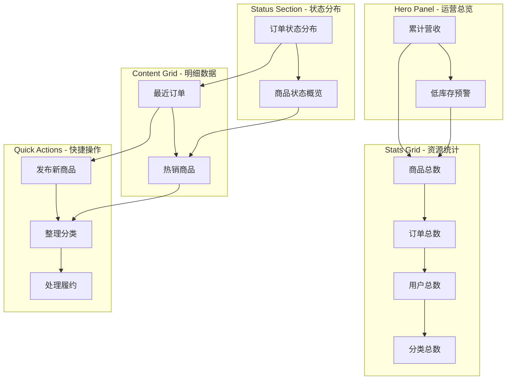
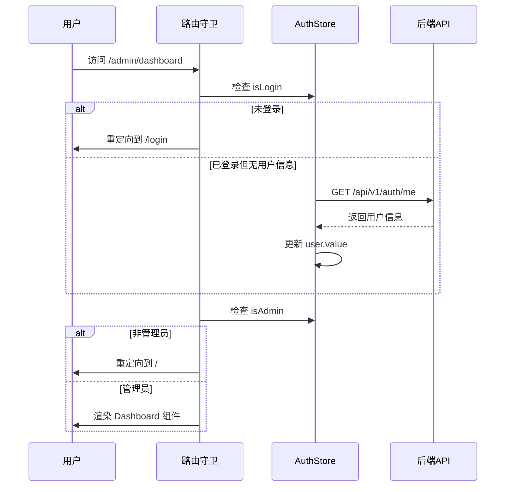
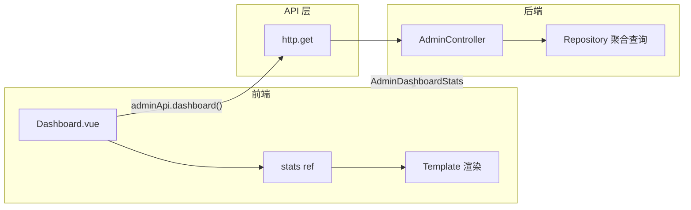

管理员仪表盘是 EcoLink 后台管理系统的核心入口页面，承载运营数据聚合展示与快速操作引导两大核心职责。通过单一视图呈现订单状态分布、商品库存风险、热销商品排行等关键指标，帮助管理员快速掌握平台整体运营状况，减少跨页面切换成本。

Sources: [Dashboard.vue](src/views/admin/Dashboard.vue#L1-L100)

## 1. 页面架构与组件布局

管理员仪表盘采用垂直流式布局，将信息按优先级从高到低依次排列。页面由以下视觉区块组成：

| 区块 | 功能定位 | 视觉特征 |
|------|----------|----------|
| Hero Panel | 核心KPI展示 | 深绿色渐变背景，毛玻璃效果指标卡 |
| Stats Grid | 基础资源统计 | 四列等宽卡片，图标+数值组合 |
| Status Section | 订单与商品状态分布 | 双栏面板，色点+数值指示器 |
| Content Grid | 最近订单与热销商品 | 双栏面板，带图片商品卡片 |
| Quick Actions | 快捷操作入口 | 三列等宽渐变卡片，图标+描述 |

Sources: [Dashboard.vue](src/views/admin/Dashboard.vue#L11-L130)

### 1.1 页面布局流程图



## 2. 权限控制与路由守卫

访问管理员仪表盘需要同时满足两个条件：已登录状态且用户角色为 `ADMIN`。路由配置通过嵌套路由实现父级布局共享，子路由按需加载对应页面组件。

Sources: [router/index.ts](src/router/index.ts#L19-L29)

### 2.1 路由守卫执行流程



管理员标识通过 Pinia store 的计算属性判定：

```typescript
// src/stores/auth.ts
const isAdmin = computed(() => user.value?.role === 'ADMIN');
```

Sources: [stores/auth.ts](src/stores/auth.ts#L8-L9)

## 3. 数据获取与状态管理

仪表盘在组件挂载时通过 `onMounted` 生命周期钩子触发数据请求，所有统计数据通过单一接口聚合获取，避免多次请求带来的延迟累积。

Sources: [Dashboard.vue](src/views/admin/Dashboard.vue#L185-L191)

### 3.1 API 接口定义

```typescript
// src/api/admin.ts
export interface AdminDashboardStats {
  productCount: number;           // 商品总数
  orderCount: number;             // 订单总数
  userCount: number;              // 用户总数
  categoryCount: number;          // 分类总数
  onSaleProductCount: number;     // 在售商品数
  offSaleProductCount: number;    // 下架商品数
  lowStockProductCount: number;   // 低库存商品数
  unpaidOrderCount: number;       // 待支付订单数
  paidOrderCount: number;         // 已支付订单数
  shippedOrderCount: number;      // 已发货订单数
  completedOrderCount: number;    // 已完成订单数
  revenueAmount: number;          // 累计营收
  recentOrders: Array<{...}>;     // 最近5条订单
  hotProducts: Array<{...}>;      // 热销5个商品
}

export const adminApi = {
  dashboard() {
    return http.get<AdminDashboardStats>('/admin/dashboard');
  }
};
```

Sources: [admin.ts](src/api/admin.ts#L1-L32)

### 3.2 响应式状态初始化

仪表盘使用 Vue 3 的 `ref` 创建响应式引用，并通过完整的初始值结构确保模板渲染时不会出现 undefined 错误：

```typescript
const stats = ref<AdminDashboardStats>({
  productCount: 0,
  orderCount: 0,
  // ... 其他字段初始化为 0 或空数组
  recentOrders: [],
  hotProducts: [],
});
```

数据获取采用同步 try-catch 捕获错误，失败时通过 Toast 组件向用户反馈：

```typescript
onMounted(async () => {
  try {
    stats.value = await adminApi.dashboard();
  } catch (error) {
    toast.error((error as Error).message);
  }
});
```

Sources: [Dashboard.vue](src/views/admin/Dashboard.vue#L100-L191)

## 4. 统计卡片渲染机制

核心统计卡片通过声明式配置数组驱动渲染，每个卡片包含键名、标签、图标和背景渐变色：

```typescript
const coreCards = [
  { key: 'productCount', label: '商品总数', icon: 'inventory_2', 
    bg: 'linear-gradient(135deg, #14532d, #22c55e)', hint: '可运营商品池' },
  { key: 'orderCount', label: '订单总数', icon: 'receipt_long',
    bg: 'linear-gradient(135deg, #0f766e, #14b8a6)', hint: '全部履约记录' },
  { key: 'userCount', label: '用户总数', icon: 'group',
    bg: 'linear-gradient(135deg, #1d4ed8, #60a5fa)', hint: '注册用户规模' },
  { key: 'categoryCount', label: '分类总数', icon: 'category',
    bg: 'linear-gradient(135deg, #9a3412, #fb923c)', hint: '当前分类结构' },
] as const;
```

模板通过动态绑定 `stats[card.key]` 实现值渲染，`?? 0` 操作符提供默认值保护：

```html
<article v-for="card in coreCards" :key="card.key" class="stat-card">
  <div class="stat-icon" :style="{ background: card.bg }">
    <span class="material-symbols-outlined">{{ card.icon }}</span>
  </div>
  <div>
    <p class="stat-label">{{ card.label }}</p>
    <p class="stat-value">{{ stats[card.key] ?? 0 }}</p>
    <p class="stat-hint">{{ card.hint }}</p>
  </div>
</article>
```

Sources: [Dashboard.vue](src/views/admin/Dashboard.vue#L100-L145)

## 5. 订单状态分布计算

订单状态分布使用 `computed` 属性根据后端返回的各状态计数动态生成：

```typescript
const orderStatusCards = computed(() => [
  { label: '待支付', value: stats.value.unpaidOrderCount || 0, color: '#f59e0b' },
  { label: '已支付', value: stats.value.paidOrderCount || 0, color: '#3b82f6' },
  { label: '已发货', value: stats.value.shippedOrderCount || 0, color: '#8b5cf6' },
  { label: '已完成', value: stats.value.completedOrderCount || 0, color: '#22c55e' },
]);
```

状态颜色编码遵循语义化设计原则：

| 状态 | 颜色代码 | 背景色 | 文字色 |
|------|----------|--------|--------|
| 待支付 | `#f59e0b` | `#fef3c7` | `#92400e` |
| 已支付 | `#3b82f6` | `#dbeafe` | `#1d4ed8` |
| 已发货 | `#8b5cf6` | `#ede9fe` | `#6d28d9` |
| 已完成 | `#22c55e` | `#dcfce7` | `#166534` |
| 已取消 | `#94a3b8` | `#e2e8f0` | `#475569` |

Sources: [Dashboard.vue](src/views/admin/Dashboard.vue#L147-L157)

## 6. 最近订单与热销商品展示

### 6.1 最近订单卡片

订单卡片展示订单号、收货人、下单时间和状态标签。状态标签通过函数映射动态应用样式类：

```typescript
function statusLabel(status: string) {
  return {
    UNPAID: '待支付',
    PAID: '已支付',
    SHIPPED: '已发货',
    COMPLETED: '已完成',
    CANCELLED: '已取消',
  }[status] || status;
}

function statusClass(status: string) {
  return {
    UNPAID: 'status-yellow',
    PAID: 'status-blue',
    SHIPPED: 'status-purple',
    COMPLETED: 'status-green',
    CANCELLED: 'status-gray',
  }[status] || 'status-gray';
}
```

时间格式化将 ISO 字符串转换为可读格式：

```typescript
function formatTime(value: string | undefined) {
  if (!value) return '-';
  return value.replace('T', ' ').slice(0, 16);  // "2024-01-15T10:30:00" -> "2024-01-15 10:30"
}
```

Sources: [Dashboard.vue](src/views/admin/Dashboard.vue#L159-L184)

### 6.2 热销商品卡片

商品卡片包含主图、名称、销售量和库存数据。图片加载失败时使用 fallback 兜底：

```typescript
const fallbackImage = 'https://images.unsplash.com/photo-1542838132-92c53300491e?auto=format&fit=crop&w=1200&q=80';
```

上下架状态通过三元表达式动态绑定样式类：

```html
<span class="mini-badge" :class="item.status === 'ON_SALE' ? 'mini-badge-green' : 'mini-badge-gray'">
  {{ item.status === 'ON_SALE' ? '在售' : '下架' }}
</span>
```

Sources: [Dashboard.vue](src/views/admin/Dashboard.vue#L63-L80)

## 7. 快捷操作入口设计

页面底部提供三个快捷操作入口，分别对应高频管理场景：

| 入口 | 图标 | 跳转路由 | 功能描述 |
|------|------|----------|----------|
| 发布新商品 | `add_box` | `/admin/products/new` | 创建商品表单 |
| 整理分类 | `category` | `/admin/categories` | 分类列表管理 |
| 处理履约 | `local_shipping` | `/admin/orders` | 订单发货/完成 |

快捷操作区采用渐变背景卡片设计，与主内容区形成视觉层级区分：

```css
.quick-card {
  background: linear-gradient(180deg, #ffffff 0%, #f8fafc 100%);
  border: 1px solid #e7efe8;
  box-shadow: 0 10px 30px rgba(15, 23, 42, 0.04);
}
```

Sources: [Dashboard.vue](src/views/admin/Dashboard.vue#L105-L130)

## 8. 父级布局组件结构

仪表盘作为子路由渲染在 `AdminLayout` 父布局中，布局组件提供全局侧边栏导航和顶部栏：

```html
<div class="admin-layout">
  <aside class="sidebar">
    <!-- Logo + 导航菜单 -->
  </aside>
  <main class="main-content">
    <header class="topbar">
      <!-- 页面标题 + 用户信息 -->
    </header>
    <div class="content-body">
      <RouterView />  <!-- Dashboard 在此渲染 -->
    </div>
  </main>
</div>
```

侧边栏导航项与路由映射关系：

| 菜单项 | 路由 | 图标 |
|--------|------|------|
| 仪表盘 | `/admin/dashboard` | `dashboard` |
| 商品管理 | `/admin/products` | `inventory_2` |
| 分类管理 | `/admin/categories` | `category` |
| 订单管理 | `/admin/orders` | `receipt_long` |

Sources: [AdminLayout.vue](src/layouts/AdminLayout.vue#L1-L60)

## 9. 页面数据流架构



数据流关键节点：

1. **组件挂载** → `onMounted` 触发异步请求
2. **接口调用** → `GET /api/v1/admin/dashboard`
3. **后端聚合** → 多表 count/sum/limit 查询
4. **响应解析** → `http.get` 自动解包 `data` 字段
5. **状态更新** → `stats.value = response`
6. **视图刷新** → Vue 响应式触发重渲染

Sources: [Dashboard.vue](src/views/admin/Dashboard.vue#L185-L191)

## 10. 错误处理与用户反馈

API 请求失败时，错误通过 Toast 组件以非阻塞方式通知用户：

```typescript
try {
  stats.value = await adminApi.dashboard();
} catch (error) {
  toast.error((error as Error).message);
}
```

空数据状态通过 `v-if/v-else` 处理，避免空数组遍历导致渲染异常：

```html
<div v-if="stats.recentOrders?.length" class="order-list">
  <!-- 订单列表渲染 -->
</div>
<p v-else class="empty-text">暂无订单数据</p>
```

Sources: [Dashboard.vue](src/views/admin/Dashboard.vue#L71-L77)

---

## 下一步阅读

完成管理员仪表盘学习后，建议继续深入以下模块：

- [商品与分类管理](21-shang-pin-yu-fen-lei-guan-li) — 了解商品列表筛选、上下架操作和分类 CRUD
- [订单管理与状态操作](22-ding-dan-guan-li-yu-zhuang-tai-cao-zuo) — 掌握订单详情抽屉和发货/完成操作流程