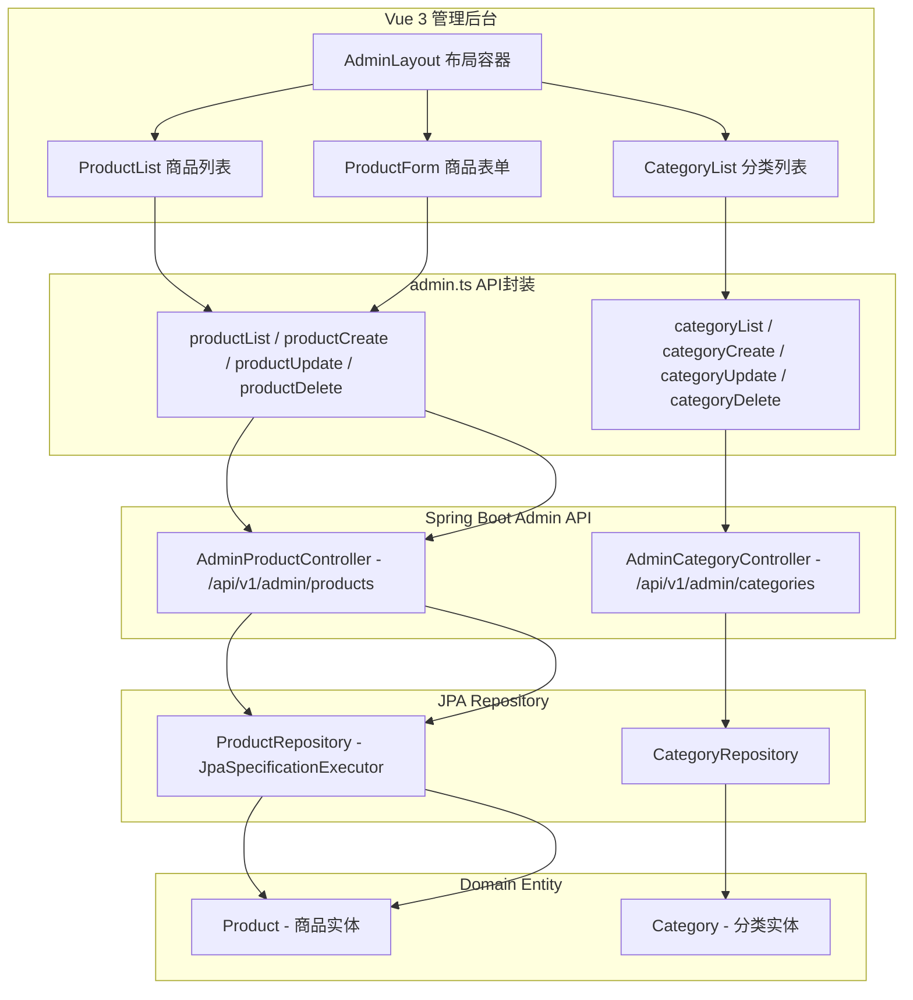
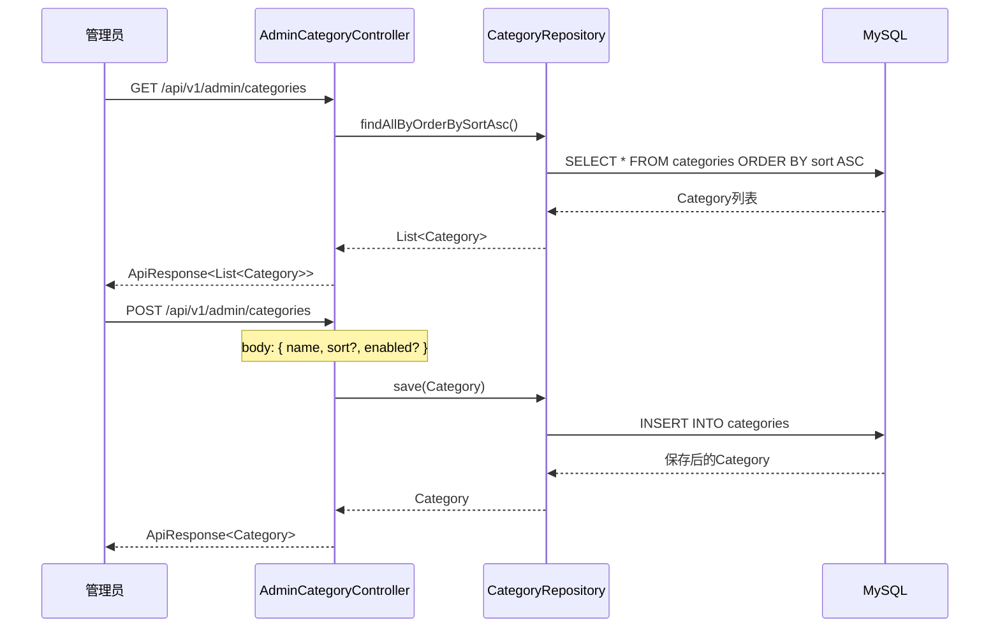
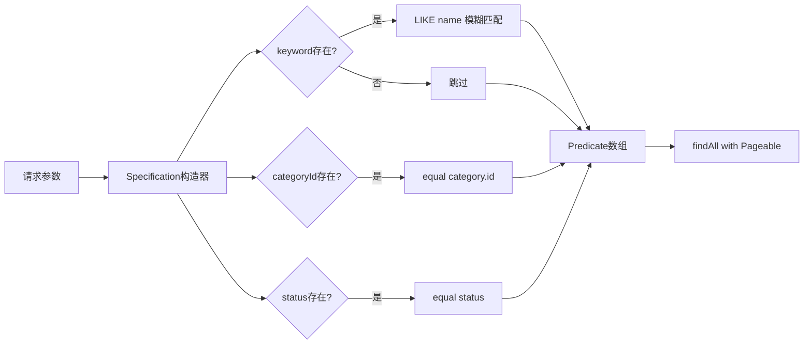
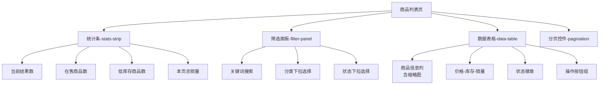
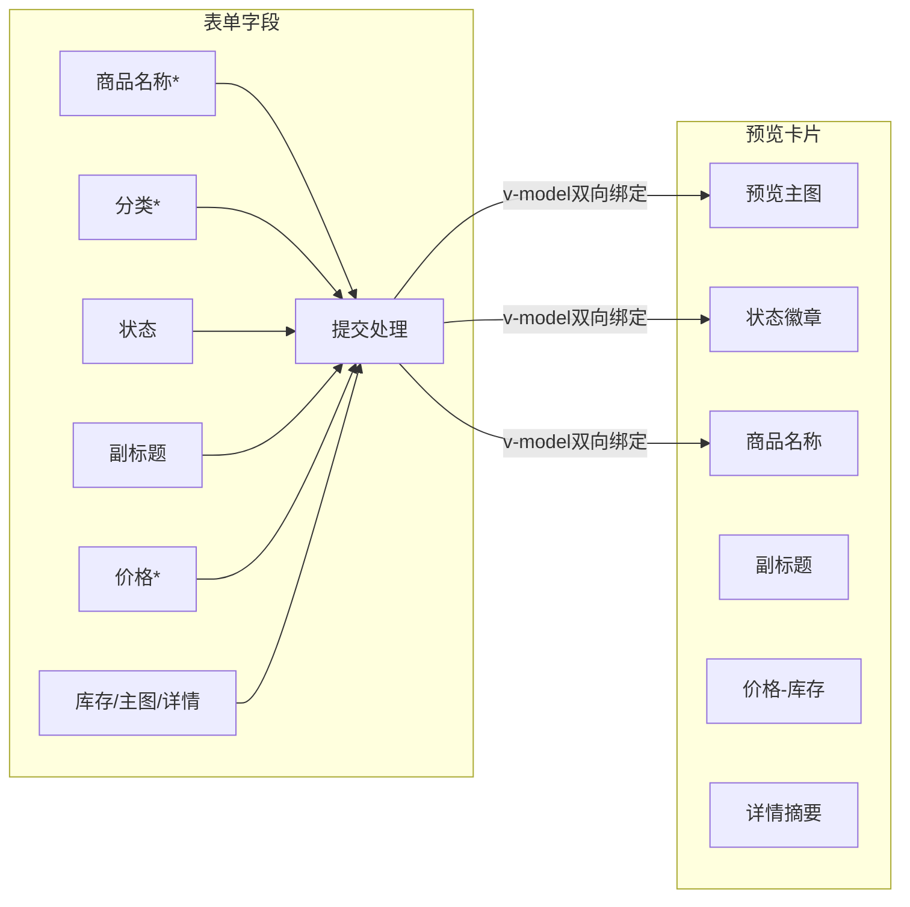
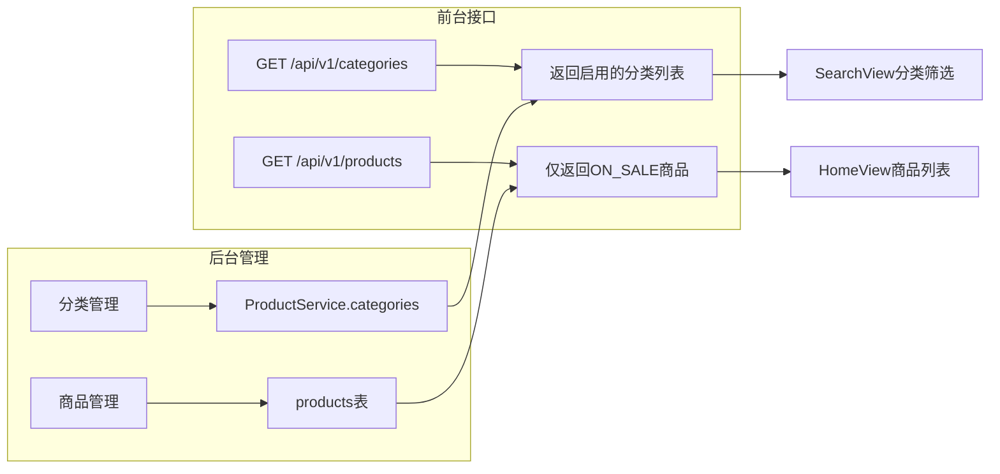

商品与分类管理模块是 EcoLink 电商后台系统的核心运营模块，为管理员提供商品 CRUD 操作和分类维度的组织管理能力。该模块通过 Vue 3 Composition API 构建前端交互界面，Spring Data JPA 提供后端持久化支持，配合 Spring Security 的 ADMIN 角色校验形成完整的业务闭环。

---

## 系统架构总览



前端组件通过 `adminApi` 对象统一封装 HTTP 请求，后端 `AdminProductController` 和 `AdminCategoryController` 分别处理商品和分类的 RESTful 接口，最终由 JPA Repository 与数据库交互完成持久化操作。

Sources: [src/api/admin.ts](src/api/admin.ts#L1-L93)
Sources: [src/views/admin/ProductList.vue](src/views/admin/ProductList.vue#L1-L200)
Sources: [src/views/admin/CategoryList.vue](src/views/admin/CategoryList.vue#L1-L114)

---

## 分类管理功能详解

### 数据模型与实体定义

分类（Category）是商品分类体系的基础单元，采用扁平化设计，支持排序和启用状态控制。

```java
// Category.java 核心字段
@Entity
@Table(name = "categories")
public class Category extends BaseEntity {
    @Id
    @GeneratedValue(strategy = GenerationType.IDENTITY)
    private Long id;

    @Column(nullable = false, length = 50)
    private String name;              // 分类名称，必填

    @Column(nullable = false)
    private Integer sort = 0;         // 排序权重，数值越小越靠前

    @Column(nullable = false)
    private Boolean enabled = true;   // 启用状态，控制前端分类下拉选项
}
```

前端 `CategoryList.vue` 组件通过表格形式展示所有分类，支持编辑和删除操作。列表按 `sort` 字段升序排列，直观呈现分类优先级。

Sources: [server/src/main/java/com/ecolink/server/domain/Category.java](server/src/main/java/com/ecolink/server/domain/Category.java#L1-L25)

### 后端接口设计



后端 `AdminCategoryController` 提供四个标准 REST 操作：列表查询（按 sort 升序）、创建、编辑更新和删除。接口采用 Spring Validation 进行参数校验，`name` 字段为必填项，`sort` 和 `enabled` 为可选字段。

Sources: [server/src/main/java/com/ecolink/server/controller/admin/AdminCategoryController.java](server/src/main/java/com/ecolink/server/controller/admin/AdminCategoryController.java#L1-L61)

### 前端交互流程

分类管理页面包含列表展示和弹窗表单两个核心视图：

| 视图状态 | 触发方式 | 表单字段 |
|---------|---------|---------|
| 新增分类 | 点击"新增分类"按钮 | name、sort、enabled |
| 编辑分类 | 点击行内"编辑"按钮 | 同上，预填充现有值 |

```typescript
// CategoryList.vue 核心逻辑
const list = ref<any[]>([]);
const showModal = ref(false);
const editId = ref<number | null>(null);
const form = ref({ name: '', sort: 0, enabled: true });

async function handleSubmit() {
  if (editId.value) {
    await adminApi.categoryUpdate(editId.value, form.value);
  } else {
    await adminApi.categoryCreate(form.value);
  }
  showModal.value = false;
  load();
}
```

表单采用双向绑定模式，提交时根据 `editId` 是否存在判断执行创建或更新操作。删除操作通过 `confirm()` 确认后直接调用 `categoryDelete` 接口。

Sources: [src/views/admin/CategoryList.vue](src/views/admin/CategoryList.vue#L40-L62)

---

## 商品管理功能详解

### 数据模型与实体定义

商品（Product）实体包含丰富的业务字段，通过 `ManyToOne` 关联分类实体：

```java
// Product.java 核心字段
@Entity
@Table(name = "products")
public class Product extends BaseEntity {
    @ManyToOne(fetch = FetchType.LAZY)
    @JoinColumn(name = "category_id", nullable = false)
    private Category category;        // 必填关联分类

    @Column(nullable = false, length = 120)
    private String name;             // 商品名称，必填

    @Column(length = 500)
    private String subtitle;         // 副标题/卖点

    @Column(nullable = false, precision = 10, scale = 2)
    private BigDecimal price;        // 价格，精确到分

    @Column(nullable = false)
    private Integer stock = 0;       // 库存

    @Column(nullable = false)
    private Integer sales = 0;        // 销量

    @Column(name = "main_image", length = 500)
    private String mainImage;         // 主图URL

    @Column(columnDefinition = "TEXT")
    private String detail;           // 详情描述

    @Enumerated(EnumType.STRING)
    @Column(nullable = false, length = 20)
    private ProductStatus status = ProductStatus.ON_SALE;  // 在售/下架
}
```

Sources: [server/src/main/java/com/ecolink/server/domain/Product.java](server/src/main/java/com/ecolink/server/domain/Product.java#L1-L46)

### 后端接口与动态查询

商品列表接口支持多条件组合筛选，底层采用 JPA Specification 实现动态查询：



核心查询逻辑位于 `AdminProductController.list()` 方法，通过 `Specification<Product>` 动态组装查询条件，支持按商品名称关键词、分类 ID 和商品状态三重过滤。

Sources: [server/src/main/java/com/ecolink/server/controller/admin/AdminProductController.java](server/src/main/java/com/ecolink/server/controller/admin/AdminProductController.java#L37-L60)

### 商品列表前端实现

`ProductList.vue` 采用分页列表设计，集成筛选面板和统计概览：



统计条通过 `computed` 属性实时计算列表数据：

```typescript
const onSaleCount = computed(() => 
  list.value.filter((item) => item.status === 'ON_SALE').length
);
const lowStockCount = computed(() => 
  list.value.filter((item) => Number(item.stock) <= 50).length
);
```

Sources: [src/views/admin/ProductList.vue](src/views/admin/ProductList.vue#L1-L130)

### 商品表单与实时预览

`ProductForm.vue` 采用双栏布局，左侧为表单输入区，右侧为实时预览卡片：



表单提交逻辑区分新增和编辑两种场景：

```typescript
async function handleSubmit() {
  loading.value = true;
  try {
    if (isEdit.value) {
      await adminApi.productUpdate(Number(route.params.id), form.value);
    } else {
      await adminApi.productCreate(form.value);
    }
    router.push('/admin/products');
  } finally {
    loading.value = false;
  }
}
```

Sources: [src/views/admin/ProductForm.vue](src/views/admin/ProductForm.vue#L1-L150)

---

## 权限控制与安全机制

后台管理接口统一受 Spring Security 保护，需要 ADMIN 角色才能访问：

```java
// SecurityConfig.java 权限配置
.authorizeHttpRequests(auth -> auth
    .requestMatchers("/api/v1/admin/**").hasRole("ADMIN")
    // ... 其他公开接口
)
```

前端路由同样配置了 `requiresAdmin` 守卫，未授权用户访问 `/admin/*` 路径时将被重定向至首页：

```typescript
// router/index.ts 权限守卫
if (to.meta.requiresAdmin && !auth.isAdmin) {
  return { name: 'home' };
}
```

Sources: [server/src/main/java/com/ecolink/server/config/SecurityConfig.java](server/src/main/java/com/ecolink/server/config/SecurityConfig.java#L35-L50)
Sources: [src/router/index.ts](src/router/index.ts#L44-L46)

---

## API 接口速查表

### 分类管理接口

| 方法 | 路径 | 功能 | 请求体 |
|------|------|------|--------|
| GET | `/api/v1/admin/categories` | 分类列表（按 sort 排序） | - |
| POST | `/api/v1/admin/categories` | 创建分类 | `{ name, sort?, enabled? }` |
| PUT | `/api/v1/admin/categories/{id}` | 更新分类 | `{ name, sort?, enabled? }` |
| DELETE | `/api/v1/admin/categories/{id}` | 删除分类 | - |

### 商品管理接口

| 方法 | 路径 | 功能 | 参数 |
|------|------|------|------|
| GET | `/api/v1/admin/products` | 商品列表（分页） | `page, size, keyword?, categoryId?, status?` |
| GET | `/api/v1/admin/products/{id}` | 商品详情 | - |
| POST | `/api/v1/admin/products` | 创建商品 | `{ categoryId, name, subtitle?, price, stock?, mainImage?, detail?, status? }` |
| PUT | `/api/v1/admin/products/{id}` | 更新商品 | 同创建 |
| DELETE | `/api/v1/admin/products/{id}` | 删除商品 | - |

Sources: [src/api/admin.ts](src/api/admin.ts#L30-L55)
Sources: [server/src/main/java/com/ecolink/server/controller/admin/AdminCategoryController.java](server/src/main/java/com/ecolink/server/controller/admin/AdminCategoryController.java#L19-L60)
Sources: [server/src/main/java/com/ecolink/server/controller/admin/AdminProductController.java](server/src/main/java/com/ecolink/server/controller/admin/AdminProductController.java#L25-L100)

---

## 与前台业务的关联

商品与分类管理模块并非孤立存在，其数据直接服务于前台 C 端用户：



`ProductService.categories()` 方法仅查询 `enabled=true` 的分类供前台使用，而 `listProducts()` 方法默认过滤 `ON_SALE` 状态的商品，确保前台展示的商品均为可售卖状态。

Sources: [server/src/main/java/com/ecolink/server/service/ProductService.java](server/src/main/java/com/ecolink/server/service/ProductService.java#L25-L30)

---

## 后续学习路径

完成商品与分类管理的学习后，建议继续深入以下模块：

- **[订单管理与状态操作](22-ding-dan-guan-li-yu-zhuang-tai-cao-zuo)** — 了解管理员如何处理用户订单，包括发货、退款等状态流转操作
- **[管理员仪表盘](20-guan-li-yuan-yi-biao-pan)** — 掌握后台首页的统计数据来源和热卖商品分析
- **[商品浏览与搜索过滤](13-shang-pin-liu-lan-yu-sou-suo-guo-lu)** — 了解前台用户如何通过分类和搜索发现商品