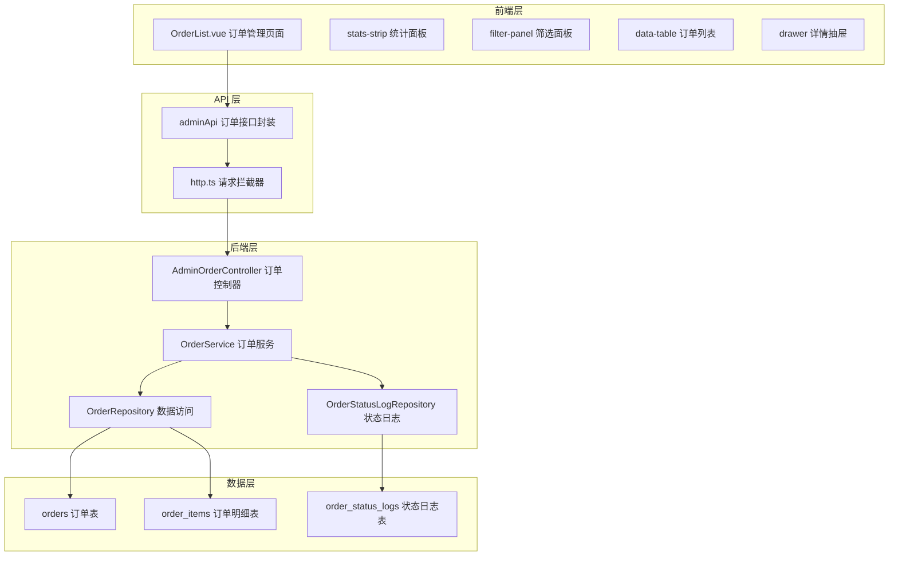
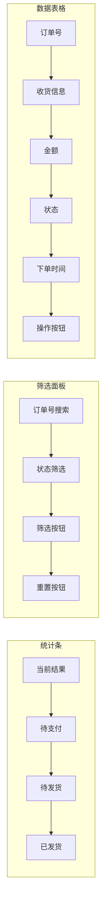
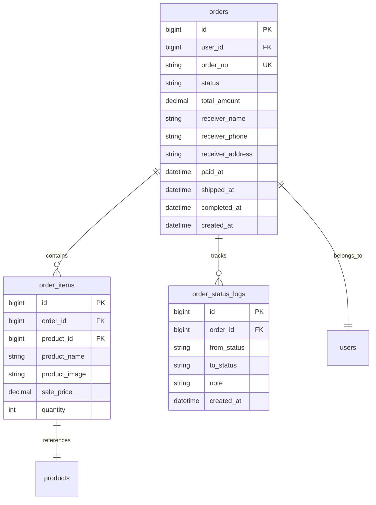

订单管理模块是 EcoLink 商城后台管理系统的核心功能之一，为管理员提供订单检索、状态流转控制与全链路详情查看能力。该模块与[订单状态自动流转机制](16-ding-dan-zhuang-tai-zi-dong-liu-zhuan-ji-zhi)协同工作，共同支撑订单的全生命周期管理。

## 模块架构概览

订单管理模块采用经典的前后端分离架构，通过 RESTful API 实现数据交互。前端基于 Vue 3 Composition API 构建响应式管理界面，后端采用 Spring Boot + JPA 技术栈处理业务逻辑与数据持久化。



## 订单状态流转设计

### 状态枚举定义

系统定义了五种订单状态，构成完整的状态机模型：

| 状态值 | 中文标签 | 含义 | 允许的后续操作 |
|--------|----------|------|----------------|
| `UNPAID` | 待支付 | 订单已创建，等待用户完成支付 | 确认支付 |
| `PAID` | 已支付 | 用户已完成支付，等待商家发货 | 发货 |
| `SHIPPED` | 已发货 | 商家已发货，等待用户确认收货 | 完成 |
| `COMPLETED` | 已完成 | 用户确认收货或系统自动完成 | — |
| `CANCELLED` | 已取消 | 订单已取消 | — |

Sources: [OrderStatus.java](server/src/main/java/com/ecolink/server/domain/enums/OrderStatus.java#L1-L10)

### 状态流转规则

管理员可执行的状态操作遵循严格的状态机规则：

```typescript
function getActions(status: string) {
  if (status === 'UNPAID') return [{ status: 'PAID', label: '确认支付' }];
  if (status === 'PAID') return [{ status: 'SHIPPED', label: '发货' }];
  if (status === 'SHIPPED') return [{ status: 'COMPLETED', label: '完成' }];
  return [];
}
```

状态只能向前推进（UNPAID → PAID → SHIPPED → COMPLETED），不允许回退。取消操作通过状态日志记录，订单保持 `CANCELLED` 状态。

Sources: [OrderList.vue](src/views/admin/OrderList.vue#L229-L234)

### 时间戳自动记录

订单实体包含四个关键时间戳字段，用于追踪订单生命周期：

```java
@Column(name = "paid_at")
private LocalDateTime paidAt;

@Column(name = "shipped_at")
private LocalDateTime shippedAt;

@Column(name = "completed_at")
private LocalDateTime completedAt;
```

当管理员执行状态变更时，系统自动记录对应时间戳：

```java
OrderStatus newStatus = OrderStatus.valueOf(req.status());
order.setStatus(newStatus);
if (newStatus == OrderStatus.SHIPPED) order.setShippedAt(LocalDateTime.now());
if (newStatus == OrderStatus.COMPLETED) order.setCompletedAt(LocalDateTime.now());
orderRepository.save(order);
```

Sources: [AdminOrderController.java](server/src/main/java/com/ecolink/server/controller/admin/AdminOrderController.java#L82-L92)

## 前端实现详解

### 页面布局结构

管理页面采用模块化布局设计，包含四个主要区域：

1. **页头区域** (`page-hero`)：展示页面标题与功能说明，采用渐变背景突出视觉层级
2. **统计条** (`stats-strip`)：实时显示当前筛选结果数量及各状态订单分布
3. **筛选面板** (`filter-panel`)：支持订单号模糊搜索与状态过滤
4. **数据表格** (`data-table`)：订单列表展示与操作入口
5. **详情抽屉** (`drawer`)：侧滑展示订单完整信息



Sources: [OrderList.vue](src/views/admin/OrderList.vue#L11-L46)

### 状态筛选与统计

状态统计与筛选功能通过前端计算实现，筛选条件同时发送给后端进行精确过滤：

```typescript
function statusCount(status: string) {
  return list.value.filter((item) => item.status === status).length;
}

async function load() {
  const data = await adminApi.orderList({
    page: page.value,
    size: 10,
    orderNo: orderNo.value || undefined,
    status: statusFilter.value || undefined,
  });
  list.value = data.content;
}
```

状态徽章采用语义化颜色编码，便于快速识别订单状态：

| 状态 | CSS 类 | 背景色 | 文字色 |
|------|--------|--------|--------|
| UNPAID | `badge-yellow` | `#fef3c7` | `#92400e` |
| PAID | `badge-blue` | `#dbeafe` | `#1d4ed8` |
| SHIPPED | `badge-purple` | `#ede9fe` | `#6d28d9` |
| COMPLETED | `badge-green` | `#dcfce7` | `#166534` |
| CANCELLED | `badge-gray` | `#e2e8f0` | `#475569` |

Sources: [OrderList.vue](src/views/admin/OrderList.vue#L219-L238)

### 详情抽屉组件

详情抽屉采用右滑弹出设计，包含四个信息模块：

1. **摘要网格** (`summary-grid`)：订单状态、金额、下单时间、完成时间
2. **收货信息** (`detail-card`)：收货人姓名、电话、详细地址
3. **商品明细** (`item-list`)：商品图片、名称、单价、数量、小计
4. **快捷处理** (`drawer-actions`)：根据当前状态显示可执行操作

```typescript
async function openDetail(id: number) {
  detailVisible.value = true;
  detailLoading.value = true;
  try {
    selectedOrder.value = await adminApi.orderDetail(id);
  } catch (error) {
    detailVisible.value = false;
    toast.error((error as Error).message);
  } finally {
    detailLoading.value = false;
  }
}
```

Sources: [OrderList.vue](src/views/admin/OrderList.vue#L272-L284)

### 状态更新流程

状态更新采用乐观更新策略，先更新本地状态再刷新服务端数据：

```typescript
async function updateStatus(id: number, status: string, refreshDetail = false) {
  updatingId.value = id;
  try {
    await adminApi.orderUpdateStatus(id, status);
    toast.success(`订单已更新为${statusLabel(status)}`);
    await load();
    if (refreshDetail || (selectedOrder.value && selectedOrder.value.order.id === id)) {
      selectedOrder.value = await adminApi.orderDetail(id);
    }
  } catch (error) {
    toast.error((error as Error).message);
  } finally {
    updatingId.value = 0;
  }
}
```

操作按钮在请求过程中显示 `处理中...` 状态，防止重复提交。

Sources: [OrderList.vue](src/views/admin/OrderList.vue#L291-L305)

## 后端接口设计

### API 端点概览

| 方法 | 路径 | 功能 | 鉴权要求 |
|------|------|------|----------|
| GET | `/api/v1/admin/orders` | 分页查询订单列表 | ADMIN |
| GET | `/api/v1/admin/orders/{id}` | 获取订单详情与商品明细 | ADMIN |
| PUT | `/api/v1/admin/orders/{id}/status` | 更新订单状态 | ADMIN |

所有管理端点通过 Spring Security 配置强制要求 `ADMIN` 角色：

```java
.requestMatchers("/api/v1/admin/**").hasRole("ADMIN")
```

Sources: [SecurityConfig.java](server/src/main/java/com/ecolink/server/config/SecurityConfig.java#L48)

### 分页查询实现

订单列表查询支持多维度组合筛选：

```java
@GetMapping
public ApiResponse<Map<String, Object>> list(
        @RequestParam(defaultValue = "0") int page,
        @RequestParam(defaultValue = "10") int size,
        @RequestParam(required = false) String orderNo,
        @RequestParam(required = false) String status) {
    PageRequest pageReq = PageRequest.of(page, size, Sort.by(Sort.Direction.DESC, "id"));
    Page<Order> result;
    if (orderNo != null && !orderNo.isBlank() && status != null && !status.isBlank()) {
        result = orderRepository.findByOrderNoContainingAndStatus(orderNo, OrderStatus.valueOf(status), pageReq);
    } else if (orderNo != null && !orderNo.isBlank()) {
        result = orderRepository.findByOrderNoContaining(orderNo, pageReq);
    } else if (status != null && !status.isBlank()) {
        result = orderRepository.findByStatus(OrderStatus.valueOf(status), pageReq);
    } else {
        result = orderRepository.findAll(pageReq);
    }
    // 返回分页数据
}
```

查询优先级：订单号+状态 > 仅订单号 > 仅状态 > 全量

Sources: [AdminOrderController.java](server/src/main/java/com/ecolink/server/controller/admin/AdminOrderController.java#L37-L60)

### 订单详情查询

详情接口返回订单完整信息及关联的商品明细：

```java
@GetMapping("/{id}")
public ApiResponse<Map<String, Object>> detail(@PathVariable long id) {
    Order order = orderRepository.findById(id)
            .orElseThrow(() -> new BizException(4040, "订单不存在"));
    List<OrderItem> items = orderItemRepository.findByOrderIdOrderByIdAsc(order.getId());
    Map<String, Object> data = Map.of(
            "order", toMap(order),
            "items", items.stream().map(item -> Map.of(
                    "id", item.getId(),
                    "productName", item.getProductName(),
                    "productImage", item.getProductImage() != null ? item.getProductImage() : "",
                    "salePrice", item.getSalePrice(),
                    "quantity", item.getQuantity(),
                    "subtotal", item.getSalePrice().multiply(BigDecimal.valueOf(item.getQuantity()))
            )).toList()
    );
    return ApiResponse.ok(data);
}
```

商品小计金额 `subtotal` 在后端计算，确保数据一致性。

Sources: [AdminOrderController.java](server/src/main/java/com/ecolink/server/controller/admin/AdminOrderController.java#L63-L80)

### 状态更新接口

状态更新采用请求体验证与时间戳自动维护：

```java
@PutMapping("/{id}/status")
public ApiResponse<Void> updateStatus(@PathVariable long id,
                                      @Valid @RequestBody StatusReq req) {
    Order order = orderRepository.findById(id)
            .orElseThrow(() -> new BizException(4040, "订单不存在"));
    OrderStatus newStatus = OrderStatus.valueOf(req.status());
    order.setStatus(newStatus);
    if (newStatus == OrderStatus.SHIPPED) order.setShippedAt(LocalDateTime.now());
    if (newStatus == OrderStatus.COMPLETED) order.setCompletedAt(LocalDateTime.now());
    orderRepository.save(order);
    return ApiResponse.ok(null);
}

public record StatusReq(@NotBlank String status) {}
```

Sources: [AdminOrderController.java](server/src/main/java/com/ecolink/server/controller/admin/AdminOrderController.java#L82-L112)

## 数据模型设计

### 核心实体关系



### 订单表结构

订单表 `orders` 是系统的核心交易表，包含以下关键设计：

- **订单号** (`order_no`)：唯一约束，格式为 `ECO` + 时间戳 + 4位随机数
- **状态字段**：`UNPAID`、`PAID`、`SHIPPED`、`COMPLETED`、`CANCELLED`
- **收货信息**：冗余存储用户下单时的地址快照
- **时间戳**：创建时间自动维护，支付/发货/完成时间按需记录

Sources: [Order.java](server/src/main/java/com/ecolink/server/domain/Order.java#L1-L52)

### 订单明细表

订单明细表 `order_items` 采用快照设计：

```java
@Column(name = "product_name", nullable = false, length = 120)
private String productName;

@Column(name = "product_image", length = 500)
private String productImage;

@Column(name = "sale_price", nullable = false, precision = 10, scale = 2)
private BigDecimal salePrice;
```

商品名称、图片、销售价格均从下单时的商品快照保存，避免商品信息变更影响历史订单。

Sources: [OrderItem.java](server/src/main/java/com/ecolink/server/domain/OrderItem.java#L26-L33)

### 状态日志表

订单状态日志表 `order_status_logs` 记录完整的状态流转轨迹：

```java
@Enumerated(EnumType.STRING)
@Column(name = "from_status", length = 20)
private OrderStatus fromStatus;

@Enumerated(EnumType.STRING)
@Column(name = "to_status", nullable = false, length = 20)
private OrderStatus toStatus;

@Column(length = 255)
private String note;
```

日志记录包括：来源状态、目标状态、操作备注（订单创建、模拟支付成功、系统自动发货等）。

Sources: [OrderStatusLog.java](server/src/main/java/com/ecolink/server/domain/OrderStatusLog.java#L1-L32)

## 仪表盘统计集成

订单统计功能集成于管理员仪表盘，提供全局订单健康度视图：

```java
Map<String, Object> data = Map.ofEntries(
        Map.entry("unpaidOrderCount", orderRepository.countByStatus(OrderStatus.UNPAID)),
        Map.entry("paidOrderCount", orderRepository.countByStatus(OrderStatus.PAID)),
        Map.entry("shippedOrderCount", orderRepository.countByStatus(OrderStatus.SHIPPED)),
        Map.entry("completedOrderCount", orderRepository.countByStatus(OrderStatus.COMPLETED)),
        Map.entry("revenueAmount", revenue)
);
```

收入金额 `revenueAmount` 仅统计非待支付订单（排除已取消和未支付的订单）。

Sources: [AdminDashboardController.java](server/src/main/java/com/ecolink/server/controller/admin/AdminDashboardController.java#L40-L63)

## 与自动流转机制的协同

管理员手动操作与系统自动流转机制协同工作：

| 操作场景 | 触发方式 | 状态记录 |
|----------|----------|----------|
| 订单创建 | 用户前端操作 | `writeStatusLog(order, null, OrderStatus.UNPAID, "订单创建")` |
| 用户支付 | 用户前端操作 | `writeStatusLog(order, from, OrderStatus.PAID, "模拟支付成功")` |
| 管理员发货 | 管理员手动操作 | `order.setShippedAt(LocalDateTime.now())` |
| 系统自动发货 | `@Scheduled` 定时任务 | `writeStatusLog(order, from, OrderStatus.SHIPPED, "系统自动发货")` |
| 系统自动完成 | `@Scheduled` 定时任务 | `writeStatusLog(order, from, OrderStatus.COMPLETED, "系统自动完成")` |

Sources: [OrderService.java](server/src/main/java/com/ecolink/server/service/OrderService.java#L115-L136)

## 总结

订单管理与状态操作模块通过清晰的状态机设计、完善的 API 接口与响应式的前端界面，为管理员提供了高效的订单履约能力。模块设计遵循以下原则：

1. **状态安全**：严格的状态流转规则防止非法状态转换
2. **数据一致性**：订单明细快照保存，确保历史订单可追溯
3. **操作可追溯**：状态日志完整记录每次变更操作
4. **用户体验**：实时统计、详情抽屉、乐观更新等交互优化