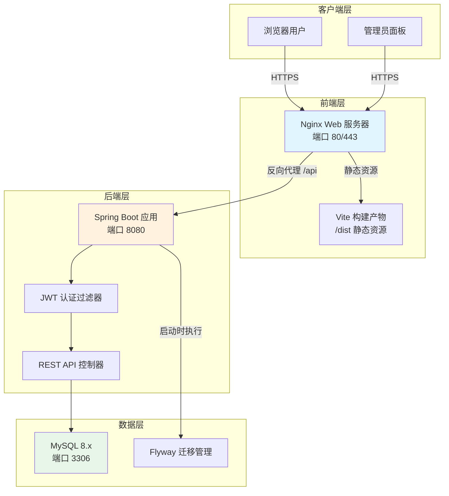
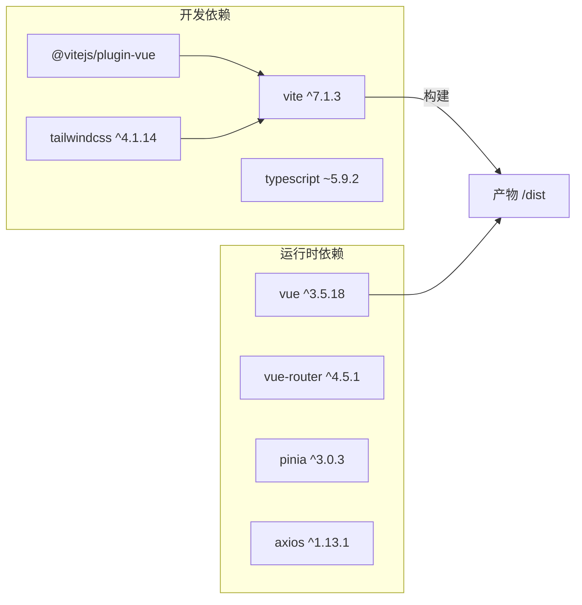
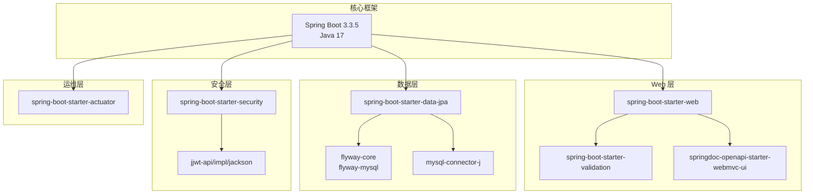
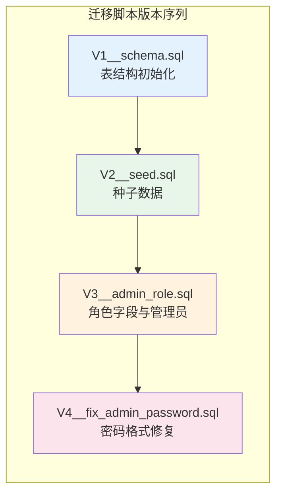
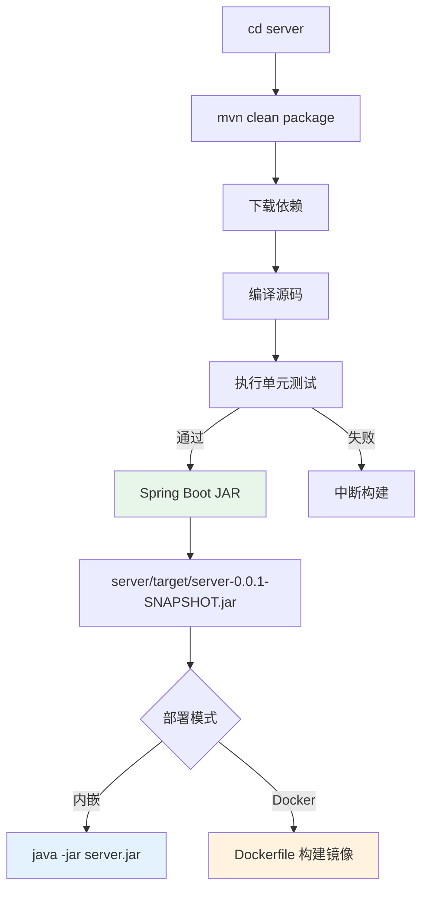

本页面详细说明 EcoLink 全栈项目的环境配置、构建流程与部署方案，涵盖前端 Vue 3 工程与后端 Spring Boot 服务的完整部署生命周期。文档面向具备一定 DevOps 经验的高级开发人员，提供可落地实施的部署指南。

## 1. 系统架构与部署拓扑

EcoLink 采用前后端分离部署架构，各组件职责明确，可根据业务规模选择单机部署或分布式部署方案。



### 1.1 组件端口规划

| 组件 | 默认端口 | 用途 | 可配置环境变量 |
|------|---------|------|---------------|
| 前端开发服务器 | 3000 | Vite 热重载开发 | `npm run dev -- --port` |
| 前端生产构建 | 80/443 | Nginx 静态服务 | Nginx 配置 |
| 后端 REST API | 8080 | Spring Boot 应用 | `SERVER_PORT` |
| MySQL 数据库 | 3306 | 数据持久化 | `DB_URL` 中的端口段 |
| Swagger UI | 8080 | API 文档 | 内嵌于后端 |

Sources: [package.json#L5](package.json#L5), [application.yml#L20](server/src/main/resources/application.yml#L20)

## 2. 前端环境配置

### 2.1 技术栈与构建工具

前端采用 Vue 3 + TypeScript + Vite 构建，依赖声明集中在 `package.json` 中。



Sources: [package.json#L8-L28](package.json#L8-L28)

### 2.2 环境变量配置

前端通过 `.env` 文件或 `import.meta.env` 对象注入配置参数。

| 变量名 | 默认值 | 说明 |
|--------|--------|------|
| `VITE_API_BASE_URL` | `http://localhost:8080/api/v1` | 后端 API 地址 |
| `VITE_ENABLE_MOCK` | `false` | 是否启用 Mock 数据回退 |

```typescript
// src/api/http.ts - 环境变量读取
const client = axios.create({
  baseURL: import.meta.env.VITE_API_BASE_URL || 'http://localhost:8080/api/v1',
  timeout: 15000,
});

const useMock = import.meta.env.VITE_ENABLE_MOCK !== 'false';
```

Sources: [http.ts#L5](src/api/http.ts#L5), [env.d.ts](src/env.d.ts)

### 2.3 构建脚本与命令

| NPM 命令 | 功能 | 适用场景 |
|---------|------|---------|
| `npm run dev` | 启动 Vite 开发服务器 | 本地开发 |
| `npm run build` | 类型检查 + 生产构建 | 部署前构建 |
| `npm run preview` | 预览构建产物 | 部署验证 |
| `npm run lint` | 执行 vue-tsc 类型检查 | CI/CD 质量门禁 |

```bash
# 开发环境
npm install
npm run dev

# 生产构建
npm run build
# 产物输出至 dist/ 目录

# 构建产物预览
npm run preview -- --port 4173
```

Sources: [package.json#L5-L10](package.json#L5-L10)

### 2.4 Vite 配置解析

```typescript
// vite.config.ts
import tailwindcss from '@tailwindcss/vite';
import vue from '@vitejs/plugin-vue';
import path from 'path';

export default defineConfig({
  plugins: [vue(), tailwindcss()],
  resolve: {
    alias: {
      '@': path.resolve(__dirname, './src'),  // 路径别名 @ 指向 src/
    },
  },
});
```

关键配置项说明：

- **路径别名**：`@` 指向 `./src`，便于模块导入时使用相对路径
- **Tailwind CSS**：通过 `@tailwindcss/vite` 插件集成 v4 版本
- **Vue 插件**：支持 SFC 单文件组件的 `<template>`、`<script>`、`<style>` 解析

Sources: [vite.config.ts](vite.config.ts), [tsconfig.json#L12-L17](tsconfig.json#L12-L17)

## 3. 后端环境配置

### 3.1 技术栈与依赖结构

后端基于 Spring Boot 3.3.5 构建，采用标准分层架构，依赖关系清晰。



Sources: [pom.xml#L1-L100](server/pom.xml#L1-L100)

### 3.2 application.yml 核心配置

```yaml
spring:
  config:
    # 支持从 .env 或 server/.env 文件加载环境变量
    import: optional:file:.env[.properties],optional:file:server/.env[.properties]
  application:
    name: ecolink-server
  
  datasource:
    url: ${DB_URL:jdbc:mysql://localhost:3306/ecolink?useUnicode=true&characterEncoding=utf8&serverTimezone=Asia/Shanghai}
    username: ${DB_USERNAME:root}
    password: ${DB_PASSWORD:root}
  
  jpa:
    open-in-view: false
    hibernate:
      ddl-auto: validate  # 表结构由 Flyway 管理
  
  flyway:
    enabled: true
    locations: classpath:db/migration

server:
  port: ${SERVER_PORT:8080}

app:
  cors:
    allowed-origins: ${CORS_ALLOWED_ORIGINS:http://localhost:3000,http://localhost:5173}
  jwt:
    issuer: ecolink
    secret: ${JWT_SECRET:ecolink-super-secret-key-for-local-dev-please-change}
    expire-hours: 24
```

Sources: [application.yml](server/src/main/resources/application.yml)

### 3.3 环境变量配置指南

| 变量名 | 默认值 | 说明 | 生产环境必改 |
|--------|--------|------|------------|
| `DB_URL` | `jdbc:mysql://localhost:3306/ecolink?...` | 数据库连接 URL | ✅ |
| `DB_USERNAME` | `root` | 数据库用户名 | ✅ |
| `DB_PASSWORD` | `root` | 数据库密码 | ✅ 强制修改 |
| `SERVER_PORT` | `8080` | 后端服务端口 | 可选 |
| `CORS_ALLOWED_ORIGINS` | `http://localhost:3000,...` | 允许的跨域来源 | ✅ |
| `JWT_SECRET` | `ecolink-super-secret-key...` | JWT 签名密钥 | ✅ 强制修改 |

```bash
# server/.env 文件示例（从项目根目录启动时读取）
DB_URL=jdbc:mysql://localhost:3306/ecolink?useUnicode=true&characterEncoding=utf8&serverTimezone=Asia/Shanghai
DB_USERNAME=ecolink_user
DB_PASSWORD=SecureP@ssw0rd2024
SERVER_PORT=8080
CORS_ALLOWED_ORIGINS=https://www.yourdomain.com,https://admin.yourdomain.com
JWT_SECRET=YourSuperSecretKeyThatShouldBeAtLeast256BitsLong!
```

Sources: [application.yml#L2-L5](server/src/main/resources/application.yml#L2-L5), [application.yml#L32-L36](server/src/main/resources/application.yml#L32-L36)

## 4. 数据库迁移管理

### 4.1 Flyway 迁移策略

EcoLink 使用 Flyway 管理数据库版本迁移，所有迁移脚本位于 `server/src/main/resources/db/migration/` 目录。



### 4.2 迁移脚本概览

| 版本 | 脚本名 | 功能 | 适用场景 |
|------|--------|------|---------|
| V1 | `V1__schema.sql` | 创建 users、categories、products、product_images、favorites、addresses、cart_items、orders、order_items、order_status_logs 共 10 张表及索引 | 首次部署 |
| V2 | `V2__seed.sql` | 插入 4 个分类、6 个商品、1 个演示用户、地址、购物车数据 | 首次部署 |
| V3 | `V3__admin_role.sql` | 为 users 表添加 role 字段，插入管理员账号 | 功能升级 |
| V4 | `V4__fix_admin_password.sql` | 修复管理员密码编码格式 | Bug 修复 |

Sources: [V1__schema.sql](server/src/main/resources/db/migration/V1__schema.sql), [V2__seed.sql](server/src/main/resources/db/migration/V2__seed.sql), [V3__admin_role.sql](server/src/main/resources/db/migration/V3__admin_role.sql), [V4__fix_admin_password.sql](server/src/main/resources/db/migration/V4__fix_admin_password.sql)

### 4.3 核心表结构索引

| 表名 | 索引字段 | 用途 |
|------|---------|------|
| products | `(category_id, status, price)` | 商品分类筛选与价格排序 |
| cart_items | `(user_id)` | 购物车快速查询 |
| orders | `(user_id, created_at)` | 用户订单列表查询 |
| favorites | `(user_id, product_id)` UNIQUE | 收藏去重校验 |
| cart_items | `(user_id, product_id)` UNIQUE | 购物车商品合并 |

Sources: [V1__schema.sql#L20](server/src/main/resources/db/migration/V1__schema.sql#L20), [V1__schema.sql#L44](server/src/main/resources/db/migration/V1__schema.sql#L44), [V1__schema.sql#L78](server/src/main/resources/db/migration/V1__schema.sql#L78)

## 5. 安全配置与生产加固

### 5.1 Spring Security 端点策略

```java
// SecurityConfig.java 关键配置
@Bean
public SecurityFilterChain securityFilterChain(HttpSecurity http) throws Exception {
    http
        .csrf(AbstractHttpConfigurer::disable)  // 前后端分离，API 无状态
        .cors(Customizer.withDefaults())         // CORS 由 corsConfigurationSource 处理
        .sessionManagement(session -> session
            .sessionCreationPolicy(SessionCreationPolicy.STATELESS))  // 无状态会话
        .authorizeHttpRequests(auth -> auth
            .requestMatchers(
                "/swagger-ui/**",
                "/v3/api-docs/**",
                "/actuator/health",
                "/api/v1/auth/**",           // 登录注册
                "/api/v1/categories/**",    // 分类浏览
                "/api/v1/products/**"       // 商品浏览
            ).permitAll()
            .requestMatchers("/api/v1/admin/**").hasRole("ADMIN")  // 后台需管理员
            .anyRequest().authenticated()
        );
    return http.build();
}
```

Sources: [SecurityConfig.java#L29-L54](server/src/main/java/com/ecolink/server/config/SecurityConfig.java#L29-L54)

### 5.2 CORS 生产配置

```java
@Bean
public CorsConfigurationSource corsConfigurationSource() {
    CorsConfiguration config = new CorsConfiguration();
    config.setAllowedOrigins(Arrays.stream(allowedOrigins.split(","))
        .map(String::trim).toList());
    config.setAllowedMethods(List.of("GET", "POST", "PUT", "DELETE", "OPTIONS"));
    config.setAllowedHeaders(List.of("*"));
    config.setAllowCredentials(true);  // 允许携带 Cookie 和 Authorization 头
    // 生产环境建议设置 maxAge 和 exposedHeaders
    UrlBasedCorsConfigurationSource source = new UrlBasedCorsConfigurationSource();
    source.registerCorsConfiguration("/**", config);
    return source;
}
```

### 5.3 生产环境安全检查清单

| 检查项 | 当前状态 | 生产加固建议 |
|--------|---------|-------------|
| JWT 密钥强度 | 默认 128 位字符 | 替换为 256 位以上随机密钥 |
| CORS 来源白名单 | 本地开发端口 | 仅允许正式域名 |
| 密码编码 | `{noop}` 和 `{bcrypt}` 混用 | 统一使用 bcrypt |
| Actuator 端点 | 健康检查对外开放 | 生产环境限制访问 |
| Swagger UI | 开发环境开放 | 生产环境禁用 |

Sources: [SecurityConfig.java#L66-L79](server/src/main/java/com/ecolink/server/config/SecurityConfig.java#L66-L79), [application.yml#L33-L36](server/src/main/resources/application.yml#L33-L36)

## 6. 构建与部署流程

### 6.1 前端构建流程

```mermaid
flowchart TD
    A[npm install] --> B{构建模式}
    B -->|开发| C[npm run dev<br/>Vite Dev Server :3000]
    B -->|生产| D[npm run build]
    D --> E[vue-tsc 类型检查]
    E -->|通过| F[Vite 打包产物]
    E -->|失败| G[中断构建]
    F --> H[/dist 目录]
    H --> I[部署至 Nginx]
    
    style C fill:#e3f2fd
    style H fill:#e8f5e9
    style I fill:#fff3e0
```

```bash
# 前端构建命令
npm install
npm run build

# 构建产物结构
dist/
├── assets/
│   ├── index-[hash].css
│   └── index-[hash].js
├── favicon.ico
└── index.html
```

Sources: [package.json#L9](package.json#L9), [.gitignore#L3](.gitignore#L3)

### 6.2 后端构建流程



```bash
# 后端构建命令（必须在 server/ 目录执行）
cd server
mvn clean package -DskipTests

# 启动后端
java -jar target/server-0.0.1-SNAPSHOT.jar

# 或使用 Maven 启动
mvn spring-boot:run
```

Sources: [pom.xml#L82-L90](server/pom.xml#L82-L90), [.gitignore#L4](.gitignore#L4)

### 6.3 完整部署流程

| 步骤 | 操作 | 验证方式 |
|------|------|---------|
| 1 | 创建 MySQL 数据库 | `mysql -u root -p -e "CREATE DATABASE ecolink DEFAULT CHARACTER SET utf8mb4;"` |
| 2 | 配置环境变量 | 检查 `.env` 文件或系统环境变量 |
| 3 | 构建前端 | `npm run build` 生成 `/dist` |
| 4 | 构建后端 | `mvn package` 生成 JAR 文件 |
| 5 | 启动后端 | `java -jar server.jar`，观察 Flyway 执行迁移 |
| 6 | 配置 Nginx | 反向代理静态资源和 API |
| 7 | 验证部署 | 访问 Swagger UI 和前端页面 |

Sources: [README.md#L37-L60](README.md#L37-L60)

## 7. Nginx 部署配置

### 7.1 典型 Nginx 配置

```nginx
# /etc/nginx/sites-available/ecolink

upstream backend {
    server 127.0.0.1:8080;
    keepalive 32;
}

server {
    listen 80;
    server_name www.yourdomain.com;
    return 301 https://$server_name$request_uri;
}

server {
    listen 443 ssl http2;
    server_name www.yourdomain.com;
    
    # SSL 配置
    ssl_certificate /etc/ssl/certs/ecolink.crt;
    ssl_certificate_key /etc/ssl/private/ecolink.key;
    ssl_protocols TLSv1.2 TLSv1.3;
    ssl_ciphers HIGH:!aNULL:!MD5;
    
    # 前端静态资源
    root /var/www/ecolink/dist;
    index index.html;
    
    # SPA 路由支持
    location / {
        try_files $uri $uri/ /index.html;
    }
    
    # 静态资源缓存
    location ~* \.(js|css|png|jpg|jpeg|gif|ico|svg|woff|woff2)$ {
        expires 1y;
        add_header Cache-Control "public, immutable";
    }
    
    # API 反向代理
    location /api/ {
        proxy_pass http://backend;
        proxy_http_version 1.1;
        proxy_set_header Host $host;
        proxy_set_header X-Real-IP $remote_addr;
        proxy_set_header X-Forwarded-For $proxy_add_x_forwarded_for;
        proxy_set_header X-Forwarded-Proto $scheme;
        
        # 超时配置
        proxy_connect_timeout 60s;
        proxy_send_timeout 60s;
        proxy_read_timeout 60s;
    }
    
    # Swagger 文档（可选，生产环境建议禁用）
    location /swagger-ui/ {
        proxy_pass http://backend;
        proxy_set_header Host $host;
    }
}
```

### 7.2 部署目录结构

```
/var/www/ecolink/
├── dist/                    # 前端构建产物
│   ├── index.html
│   └── assets/
├── logs/                    # Nginx 日志
│   ├── access.log
│   └── error.log
└── backup/                  # 备份文件
```

## 8. Docker 容器化部署（可选）

### 8.1 后端 Dockerfile

```dockerfile
# server/Dockerfile
FROM eclipse-temurin:17-jre-alpine

WORKDIR /app

# 复制构建产物
COPY target/server-0.0.1-SNAPSHOT.jar app.jar

# 从环境变量或 .env 读取配置
ENV DB_URL=jdbc:mysql://mysql:3306/ecolink
ENV DB_USERNAME=ecolink
ENV DB_PASSWORD=SecureP@ssw0rd
ENV SERVER_PORT=8080
ENV JWT_SECRET=ProductionSecretKeyChangeMePlease

EXPOSE 8080

ENTRYPOINT ["java", "-jar", "app.jar"]
```

### 8.2 Docker Compose 编排

```yaml
# docker-compose.yml
version: '3.8'

services:
  mysql:
    image: mysql:8.0
    environment:
      MYSQL_ROOT_PASSWORD: rootpass
      MYSQL_DATABASE: ecolink
      MYSQL_USER: ecolink
      MYSQL_PASSWORD: ecolinkpass
    volumes:
      - mysql_data:/var/lib/mysql
    ports:
      - "3306:3306"
    healthcheck:
      test: ["CMD", "mysqladmin", "ping", "-h", "localhost"]
      interval: 10s
      timeout: 5s
      retries: 5

  backend:
    build: ./server
    depends_on:
      mysql:
        condition: service_healthy
    environment:
      DB_URL: jdbc:mysql://mysql:3306/ecolink?useUnicode=true&characterEncoding=utf8&serverTimezone=Asia/Shanghai
      DB_USERNAME: ecolink
      DB_PASSWORD: ecolinkpass
      SERVER_PORT: 8080
      JWT_SECRET: ${JWT_SECRET}
      CORS_ALLOWED_ORIGINS: https://www.yourdomain.com
    ports:
      - "8080:8080"

  nginx:
    image: nginx:alpine
    volumes:
      - ./dist:/usr/share/nginx/html:ro
      - ./deploy/nginx.conf:/etc/nginx/conf.d/default.conf:ro
    depends_on:
      - backend
    ports:
      - "80:80"
      - "443:443"

volumes:
  mysql_data:
```

Sources: [.gitignore#L2-L3](.gitignore#L2-L3)

## 9. 默认账号与验证

### 9.1 系统内置账号

| 角色 | 用户名 | 密码 | 权限 |
|------|--------|------|------|
| 普通用户 | `demo` | `123456` | 浏览商品、购物车、订单、个人中心 |
| 管理员 | `admin` | `admin123` | 后台仪表盘、商品管理、分类管理、订单管理 |

密码存储格式说明：

- `demo` 用户：`{noop}123456` — NoOp 编码（明文，开发环境）
- `admin` 用户：`{noop}admin123` — NoOp 编码（与 V4 迁移脚本一致）

Sources: [V2__seed.sql#L26](server/src/main/resources/db/migration/V2__seed.sql#L26), [V4__fix_admin_password.sql](server/src/main/resources/db/migration/V4__fix_admin_password.sql), [SecurityConfig.java#L74-L77](server/src/main/java/com/ecolink/server/config/SecurityConfig.java#L74-L77)

### 9.2 接口文档访问

后端启动后，通过以下地址访问 API 文档：

| 地址 | 说明 |
|------|------|
| `http://localhost:8080/swagger-ui/index.html` | Swagger UI 可视化界面 |
| `http://localhost:8080/v3/api-docs` | OpenAPI 3.0 规范 JSON |

Sources: [pom.xml#L66-L69](server/pom.xml#L66-L69), [SecurityConfig.java#L36](server/src/main/java/com/ecolink/server/config/SecurityConfig.java#L36)

## 10. 部署检查清单

### 10.1 部署前检查

- [ ] MySQL 数据库已创建（`CREATE DATABASE ecolink DEFAULT CHARACTER SET utf8mb4;`）
- [ ] 环境变量文件 `.env` 已配置（数据库连接、JWT 密钥）
- [ ] 前端 `VITE_API_BASE_URL` 已更新为正式 API 地址
- [ ] `CORS_ALLOWED_ORIGINS` 已限制为正式域名
- [ ] `JWT_SECRET` 已替换为强随机密钥

### 10.2 部署后验证

| 检查项 | 验证方法 |
|--------|---------|
| 后端健康检查 | `curl http://localhost:8080/actuator/health` |
| 数据库迁移 | 检查日志中 "Successfully applied X migrations" |
| 前端页面 | 访问 HTTPS 域名，确认首页加载正常 |
| 用户登录 | 使用 demo/admin 账号验证登录功能 |
| API 调用 | 通过浏览器开发者工具 Network 面板确认 API 请求成功 |
| Swagger 文档 | 访问 `/swagger-ui/index.html` 确认接口列表 |

### 10.3 生产环境关键配置

| 配置项 | 推荐值 | 说明 |
|--------|--------|------|
| Java 堆内存 | `-Xms512m -Xmx1024m` | 根据 QPS 调整 |
| MySQL 连接池 | `spring.datasource.hikari.maximum-pool-size=20` | 并发连接数 |
| JWT 密钥长度 | ≥256 位随机字符 | 防止暴力破解 |
| 日志级别 | `logging.level.org.springframework.security=WARN` | 减少敏感日志 |

Sources: [application.yml#L29](server/src/main/resources/application.yml#L29), [EcoLinkServerApplication.java](server/src/main/java/com/ecolink/server/EcoLinkServerApplication.java)

## 11. 扩展阅读路径

完成部署配置后，建议继续阅读以下文档深入理解系统：

- **[系统架构总览](3-xi-tong-jia-gou-zong-lan)** — 理解整体架构设计与组件关系
- **[前端实现设计](4-qian-duan-mu-lu-jie-gou-yu-mo-kuai-hua-fen)** — 前端模块划分与组件结构
- **[后端实现设计](8-hou-duan-fen-ceng-jia-gou-she-ji)** — 后端分层架构与核心服务
- **[性能与扩展性分析](24-xing-neng-you-hua-yu-kuo-zhan-xing-fen-xi)** — 了解系统性能特征与扩展方向
- **[非功能需求与质量目标](11-fei-gong-neng-xu-qiu-yu-zhi-liang-mu-biao)** — 可靠性、安全性、可维护性指标