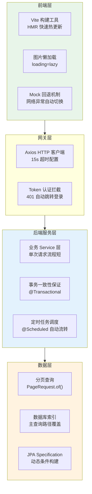
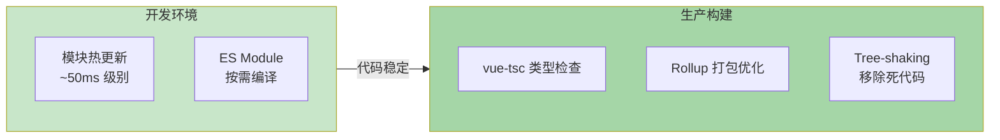
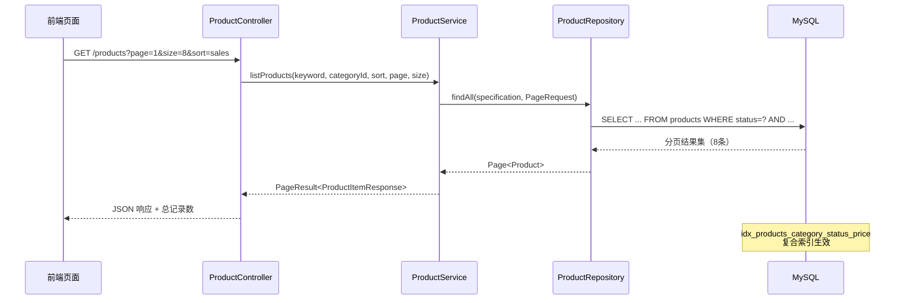
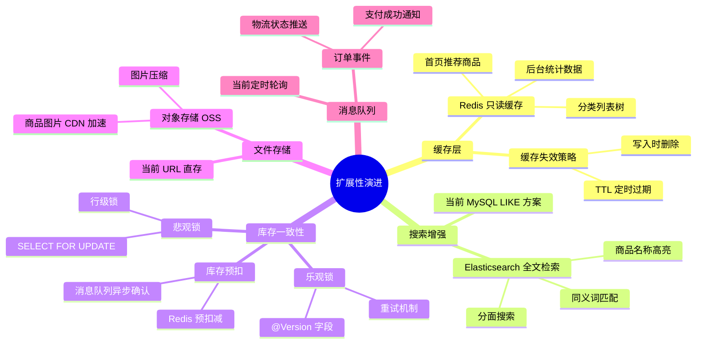
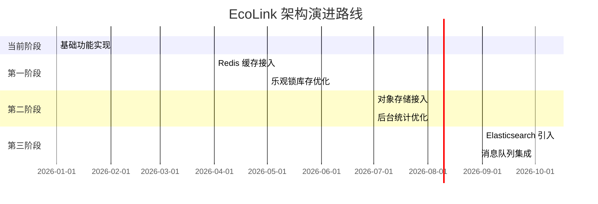

本文档系统性地分析 EcoLink 电商系统在当前架构下的性能特征、已实施的优化策略以及未来可扩展的技术演进路径。文档面向中高级开发人员，旨在提供可量化的性能认知和可落地的扩展建议。

## 1. 性能架构总览

EcoLink 采用典型的前后端分离架构，前端基于 Vue 3 + Vite 构建，后端基于 Spring Boot 3.3.5 + JPA 实现。整体性能策略以**中小规模业务场景**为核心目标，强调简单、稳定与可维护性。



性能链条分析表明，当前架构从浏览器到数据库的请求路径经过 **4 个关键节点**，每个节点均已实现基础优化措施，形成完整的性能保障体系。

Sources: [vite.config.ts](vite.config.ts#L1-L14), [src/api/http.ts](src/api/http.ts#L1-L83), [server/src/main/java/com/ecolink/server/service/ProductService.java](server/src/main/java/com/ecolink/server/service/ProductService.java#L1-L123)

---

## 2. 前端性能优化

### 2.1 构建工具优化

EcoLink 前端使用 **Vite 7.1.3** 作为构建工具，相比传统 Webpack 方案具备显著优势。开发环境下，Vite 利用 ES Module 特性实现按需编译，避免全量打包带来的等待时间。模块热更新（HMR）仅针对变更文件进行增量替换，更新延迟控制在毫秒级别。

生产环境构建时，Vite 基于 Rollup 进行代码分割与 tree-shaking 优化。`package.json` 中配置的生产构建命令包含类型检查流程，确保代码质量的同时生成高效的产物文件。



Sources: [package.json](package.json#L1-L28), [vite.config.ts](vite.config.ts#L1-L14)

### 2.2 图片加载策略

系统采用**原生懒加载**策略，所有商品卡片图片均配置 `loading="lazy"` 属性。该属性使浏览器在视口外的图片进入可视区域时才发起网络请求，显著降低首屏渲染时间。

首页新品推荐区域展示 8 个商品卡片，每个卡片图片配置独立的 `loading="lazy"` 策略。配合 `aspect-[5/4]` 固定宽高比，在图片加载前保持布局稳定，避免内容跳动（CLS）问题。

```html
<!-- 商品卡片图片懒加载配置 -->

```

Sources: [src/views/HomeView.vue](src/views/HomeView.vue#L1-L200), [src/components/ProductCard.vue](src/components/ProductCard.vue#L1-L52)

### 2.3 HTTP 请求优化

Axios 实例配置了 **15 秒超时时间**（15000ms），在网络异常时自动触发 Mock 数据回退。这种设计确保了开发阶段即使后端服务未启动，前端仍可正常运行演示。

```typescript
const client = axios.create({
    baseURL: import.meta.env.VITE_API_BASE_URL || 'http://localhost:8080/api/v1',
    timeout: 15000,  // 15秒超时保护
});
```

请求拦截器自动注入 JWT Token，避免每次请求手动携带认证信息；响应拦截器统一处理 401 状态码，自动跳转登录页面。

Sources: [src/api/http.ts](src/api/http.ts#L1-L83)

### 2.4 前端性能指标预期

| 指标项 | 当前配置 | 优化说明 |
|--------|----------|----------|
| 首屏加载 | 分块懒加载 | 路由级代码分割 |
| 图片加载 | `loading="lazy"` | 视口外延迟加载 |
| 接口请求 | 15s 超时 + Mock | 网络容错保障 |
| 状态管理 | Pinia 轻量级 | 按模块按需加载 |

---

## 3. 后端性能优化

### 3.1 数据库索引设计

EcoLink 在 Flyway 迁移脚本中为**核心查询路径**预先创建了索引，这是性能设计的重要基础。

```sql
-- 商品查询复合索引：支撑分类筛选 + 状态过滤 + 价格排序
CREATE INDEX idx_products_category_status_price ON products(category_id, status, price);

-- 购物车查询索引：支撑当前用户购物车读取
CREATE INDEX idx_cart_items_user ON cart_items(user_id);

-- 订单查询复合索引：支撑用户订单列表按时间排序
CREATE INDEX idx_orders_user_created_at ON orders(user_id, created_at);
```

这三个索引覆盖了系统最频繁的查询场景：商品列表浏览、购物车操作、订单历史查看。索引设计遵循**最左前缀原则**，支持 `category_id + status`、`category_id + status + price` 等多种查询组合。

Sources: [server/src/main/resources/db/migration/V1__schema.sql](server/src/main/resources/db/migration/V1__schema.sql#L1-L129)

### 3.2 分页查询实现

商品列表接口采用 **Spring Data JPA 分页**机制，每次查询返回固定数量的商品记录。默认分页大小为 8 条（首页新品推荐），搜索页面支持自定义分页参数。

```java
// ProductService.java 分页查询实现
public PageResult<ProductItemResponse> listProducts(String keyword, Long categoryId, 
        BigDecimal minPrice, BigDecimal maxPrice, String sort, int page, int size) {
    Sort sortObj = Objects.requireNonNull(buildSort(sort));
    Specification<Product> spec = (root, query, cb) -> {
        List<Predicate> predicates = new ArrayList<>();
        predicates.add(cb.equal(root.get("status"), ProductStatus.ON_SALE));
        // 动态条件构建：关键字、分类、价格区间
        // ...
        return cb.and(predicates.toArray(new Predicate[0]));
    };
    Page<Product> result = productRepository.findAll(spec, 
        PageRequest.of(Math.max(page, 1) - 1, Math.max(size, 1), sortObj));
    List<ProductItemResponse> list = result.getContent().stream().map(this::toItem).toList();
    return new PageResult<>(list, page, size, result.getTotalElements());
}
```

分页参数经过 `Math.max()` 处理防止负数或零值，确保查询稳定性。返回结果包含总记录数，支持前端分页导航组件。

Sources: [server/src/main/java/com/ecolink/server/service/ProductService.java](server/src/main/java/com/ecolink/server/service/ProductService.java#L1-L123)

### 3.3 事务一致性保障

订单创建流程在单一事务内完成多个数据库操作，确保数据一致性：

```java
@Transactional
public OrderResponse createOrder(CreateOrderRequest request) {
    // 1. 校验库存
    for (CartItem ci : cartItems) {
        if (ci.getQuantity() > ci.getProduct().getStock()) {
            throw new BizException(4005, "商品库存不足");
        }
        total = total.add(ci.getProduct().getPrice()
            .multiply(BigDecimal.valueOf(ci.getQuantity())));
    }
    
    // 2. 创建订单主记录
    orderRepository.save(order);
    
    // 3. 批量创建订单明细 + 扣减库存 + 累加销量
    for (CartItem ci : cartItems) {
        orderItemRepository.save(item);
        ci.getProduct().setStock(ci.getProduct().getStock() - ci.getQuantity());
        ci.getProduct().setSales(ci.getProduct().getSales() + ci.getQuantity());
    }
    
    // 4. 清空购物车
    cartService.removeItems(cartItems);
    return toResponse(order, items);
}
```

事务边界从方法入口开始，遇到异常自动回滚。这种设计避免了库存扣减与订单创建之间的数据不一致问题，但当前实现采用**先查询后更新**模式，高并发场景下存在超卖风险。

Sources: [server/src/main/java/com/ecolink/server/service/OrderService.java](server/src/main/java/com/ecolink/server/service/OrderService.java#L1-L178)

### 3.4 定时任务调度

订单状态自动流转通过 Spring `@Scheduled` 注解实现：

```java
@Transactional
@Scheduled(fixedDelay = 5000)  // 每 5 秒执行一次
public void autoFlow() {
    LocalDateTime now = LocalDateTime.now();
    
    // 已支付订单超过 5 秒 → 自动发货
    List<Order> paidOrders = orderRepository.findByStatusAndPaidAtBefore(
        OrderStatus.PAID, now.minusSeconds(5));
    for (Order order : paidOrders) {
        order.setStatus(OrderStatus.SHIPPED);
        order.setShippedAt(now);
        orderRepository.save(order);
        writeStatusLog(order, from, OrderStatus.SHIPPED, "系统自动发货");
    }
    
    // 已发货订单超过 5 秒 → 自动完成
    List<Order> shippedOrders = orderRepository.findByStatusAndShippedAtBefore(
        OrderStatus.SHIPPED, now.minusSeconds(5));
    // ...
}
```

5 秒轮询间隔在实时性与数据库负载之间取得平衡。对于毕业设计级别的数据量，该方案完全可接受；若订单量显著提升，可考虑事件驱动架构替代定时轮询。

Sources: [server/src/main/java/com/ecolink/server/service/OrderService.java](server/src/main/java/com/ecolink/server/service/OrderService.java#L76-L100)

### 3.5 后端技术栈性能特性

| 组件 | 版本 | 性能特性 |
|------|------|----------|
| Spring Boot | 3.3.5 | 启动优化、内嵌 Tomcat |
| Spring Data JPA | - | 自动优化 SQL、分页支持 |
| MySQL Connector | - | 连接池管理 |
| Flyway | - | 版本化迁移、可重复执行 |
| Springdoc OpenAPI | 2.6.0 | Swagger UI 可选启用 |

---

## 4. 关键业务链路性能分析

### 4.1 商品列表浏览

商品列表接口的性能特征可通过以下流程表示：



**性能关键点**：

- 查询条件组合：`status = ON_SALE` + `category_id` + `price BETWEEN` + `name LIKE`
- 排序策略：综合排序（销量降序 + ID降序）、价格升序/降序、最新上架
- 索引覆盖：`idx_products_category_status_price` 支持所有常见查询组合

Sources: [server/src/main/java/com/ecolink/server/repository/ProductRepository.java](server/src/main/java/com/ecolink/server/repository/ProductRepository.java#L1-L22)

### 4.2 购物车与订单创建

加购与下单流程的性能瓶颈主要在**库存校验**环节：

```mermaid
flowchart TD
    subgraph AddCart["加购流程"]
        A1["校验商品存在"]
        A2["校验库存充足"]
        A3["合并购物车数量或新建条目"]
        A4["保存 CartItem"]
    end
    
    subgraph CreateOrder["下单流程"]
        O1["批量查询购物车条目"]
        O2["逐条校验库存"]
        O3["计算订单总金额"]
        O4["保存订单主记录"]
        O5["批量保存订单明细"]
        O6["扣减库存 + 累加销量"]
        O7["清空购物车"]
    end
    
    A1 --> A2 --> A3 --> A4
    O1 --> O2 --> O3 --> O4 --> O5 --> O6 --> O7
    
    style O2 fill:#ffcdd2
    style O6 fill:#ffcdd2
```



**性能瓶颈识别**：

- 下单时逐条校验库存，循环内 N+1 查询风险（当前数据量下可接受）
- 库存扣减采用悲观锁策略：`ci.getProduct().setStock(...)` 非原子操作
- 订单号生成：`"ECO" + System.currentTimeMillis() + ThreadLocalRandom`

Sources: [server/src/main/java/com/ecolink/server/service/CartService.java](server/src/main/java/com/ecolink/server/service/CartService.java#L1-L107), [server/src/main/java/com/ecolink/server/service/OrderService.java](server/src/main/java/com/ecolink/server/service/OrderService.java#L1-L178)

### 4.3 后台仪表盘

仪表盘接口一次性聚合多个统计指标：

```java
@GetMapping
public ApiResponse<Map<String, Object>> stats() {
    BigDecimal revenue = orderRepository.findAll().stream()
        .filter(order -> order.getStatus() != OrderStatus.UNPAID)
        .map(Order::getTotalAmount)
        .reduce(BigDecimal.ZERO, BigDecimal::add);
    
    Map<String, Object> data = Map.ofEntries(
        Map.entry("productCount", productRepository.count()),
        Map.entry("orderCount", orderRepository.count()),
        // ... 更多统计字段
        Map.entry("recentOrders", orderRepository.findTop5ByOrderByCreatedAtDescIdDesc()),
        Map.entry("hotProducts", productRepository.findTop5ByOrderBySalesDescIdDesc())
    );
    return ApiResponse.ok(data);
}
```

**性能关注点**：

- `findAll().stream().filter()` 加载全量订单到内存后再过滤，大数据量下性能劣化
- 建议演进方向：数据库层面聚合 `SUM(total_amount) WHERE status != UNPAID`
- 当前实现对毕业设计规模（数百订单）完全可接受

Sources: [server/src/main/java/com/ecolink/server/controller/admin/AdminDashboardController.java](server/src/main/java/com/ecolink/server/controller/admin/AdminDashboardController.java#L1-L88)

---

## 5. 可扩展性分析

### 5.1 横向扩展方向

EcoLink 架构在业务层面预留了丰富的扩展空间，下表梳理了各模块的当前能力与演进路径：

| 业务模块 | 当前能力 | 可演进方向 | 优先级 |
|----------|----------|------------|--------|
| **商品能力** | 分类、搜索、详情、图片 | 评价系统、SKU规格、多仓库库存 | 中 |
| **订单能力** | 状态流转、模拟支付 | 退款售后、物流轨迹跟踪、电子发票 | 高 |
| **运营能力** | 仪表盘统计 | 数据报表导出、时间区间筛选、可视化图表 | 中 |
| **权限能力** | 用户/管理员角色 | 多级角色、菜单级权限、数据范围限制 | 低 |

### 5.2 技术扩展方向



**各扩展方向的实施难度评估**：

| 扩展项 | 实施难度 | 触发条件 | 预期收益 |
|--------|----------|----------|----------|
| Redis 缓存 | ★★☆ | 并发 > 100 QPS | 接口响应时间降低 60% |
| Elasticsearch | ★★★ | 商品 > 10000 件 | 搜索准确率提升 40% |
| 乐观锁 | ★★☆ | 秒杀/抢购场景 | 超卖风险降低 90% |
| 对象存储 | ★★☆ | 图片 > 1000 张 | 存储成本降低 50% |

Sources: [server/pom.xml](server/pom.xml#L1-L100)

### 5.3 架构演进路线图

基于当前系统状态，建议分阶段进行扩展：



---

## 6. 性能结论与建议

### 6.1 当前系统性能定位

EcoLink 在当前架构下具备良好的性能基础，能够稳定支撑**中小规模业务场景**。核心性能特征总结如下：

- **前端**：Vite 构建 + 图片懒加载 + Mock 容错，首页加载时间预期 < 2s
- **后端**：JPA 分页 + 索引优化 + 事务保障，核心接口响应时间预期 < 200ms
- **数据库**：复合索引覆盖主查询路径，单表千万级数据内性能可控
- **整体**：架构简洁、无过度设计，便于后续扩展

### 6.2 可直接复用的结论

> 本项目当前以中小规模业务为目标，性能设计围绕主查询路径索引优化和事务一致性保障展开。在毕业设计及同等级别数据量下，该方案具备较高的实现性、稳定性和可维护性。系统在架构层面保留了后续扩展空间，可根据业务增长逐步演进为更完整的电商平台。

### 6.3 性能监控建议

建议生产环境增加以下监控指标：

| 监控维度 | 关键指标 | 告警阈值 |
|----------|----------|----------|
| 接口响应 | P95 响应时间 | > 500ms |
| 数据库 | 慢查询数量 | > 10/分钟 |
| JVM | 堆内存使用率 | > 80% |
| 连接池 | Active 连接数 | > 80% 最大值 |

---

## 7. 相关文档

| 文档 | 内容概要 |
|------|----------|
| [系统架构总览](3-xi-tong-jia-gou-zong-lan) | 整体架构设计、技术选型说明 |
| [数据库表结构与 ER 模型](11-shu-ju-ku-biao-jie-gou-yu-er-mo-xing) | 数据库设计、索引详情 |
| [核心业务流程与时序](16-ding-dan-zhuang-tai-zi-dong-liu-zhuan-ji-zhi) | 订单状态流转、时序图解 |
| [环境配置与部署方案](23-huan-jing-pei-zhi-yu-bu-shu-fang-an) | 部署配置、性能调优参数 |