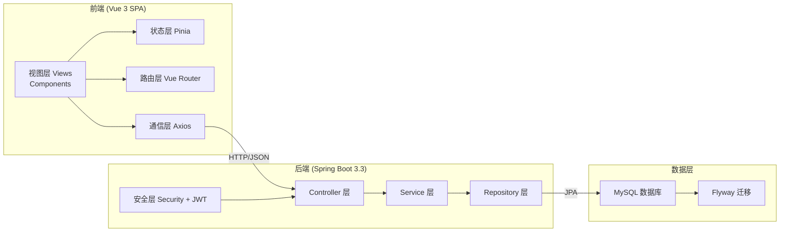
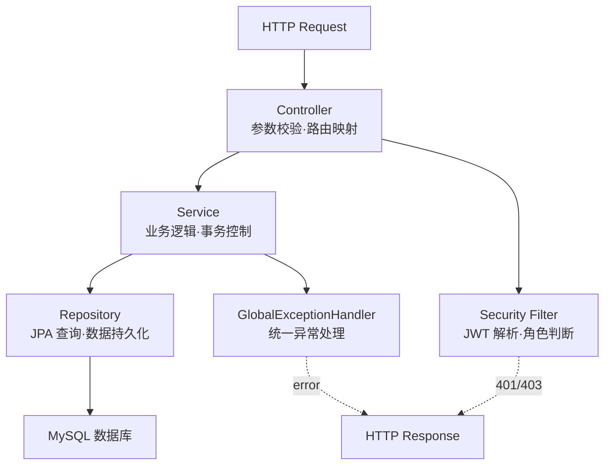
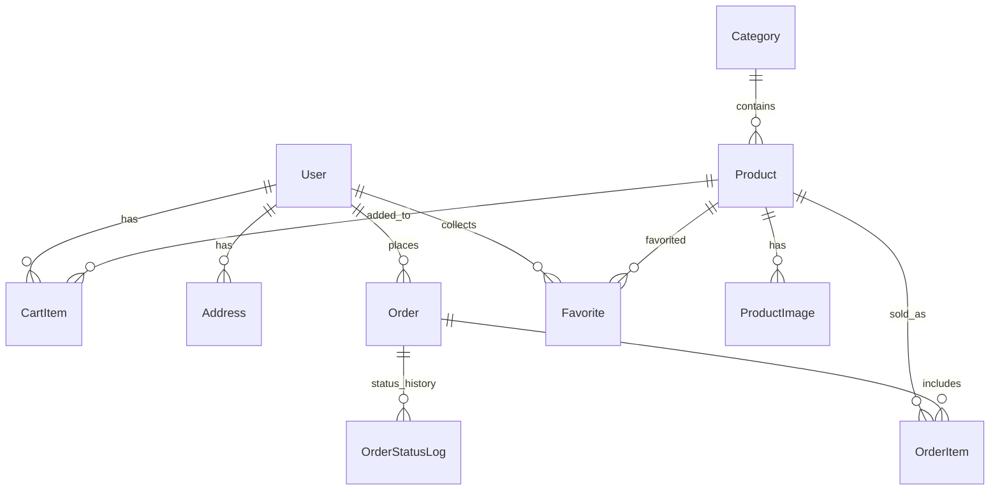
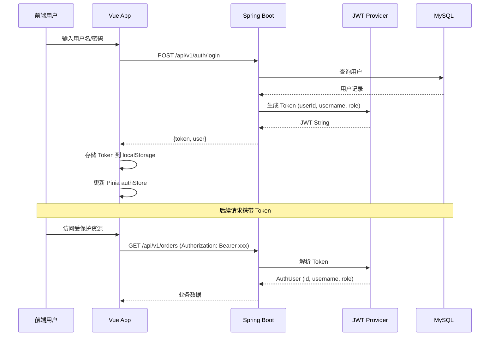
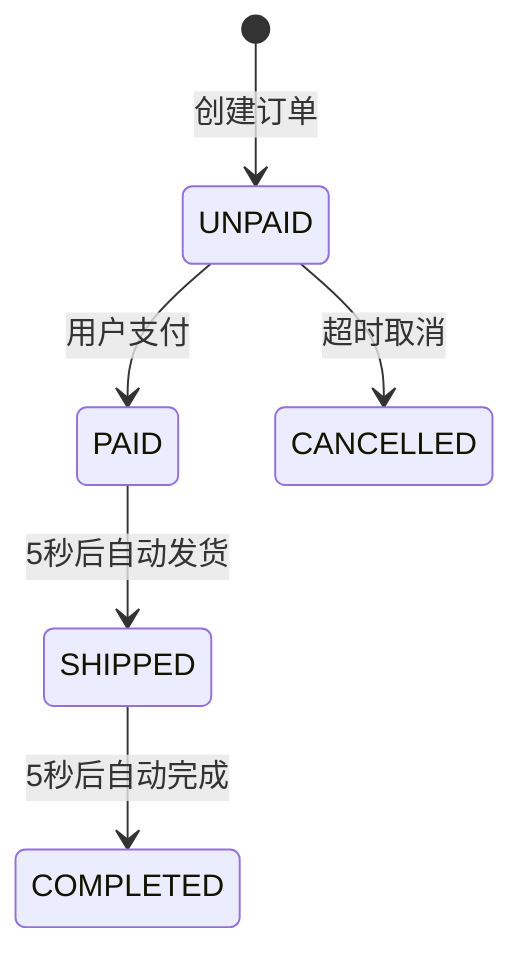
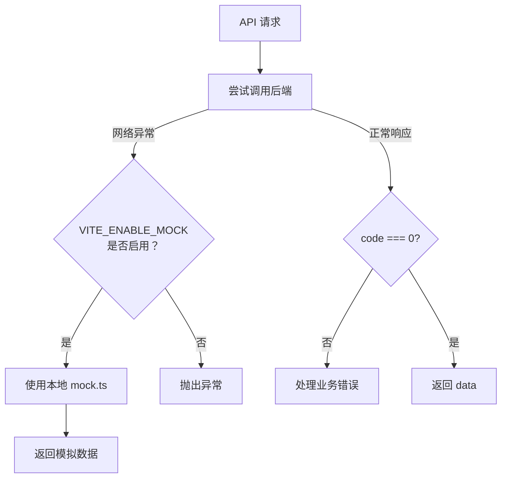

本文档全面介绍 EcoLink 绿色生态农产品销售系统的技术架构、模块划分与核心调用关系。EcoLink 是一个典型的**前后端分离**电商系统，采用 Vue 3 + Spring Boot 技术栈构建，前端负责用户交互与页面渲染，后端以 REST API 形式提供业务能力，数据库负责持久化存储，JWT 实现跨请求身份认证。

## 1. 架构风格与技术选型

### 1.1 整体架构

EcoLink 采用经典的前后端分离架构，前后端通过 HTTP/JSON 进行通信。前端运行于浏览器环境，采用单页应用（SPA）模式；后端以 Spring Boot 为核心，提供标准 RESTful API 服务。



Sources: [package.json](package.json#L1-L28), [pom.xml](server/pom.xml#L1-L100), [main.ts](src/main.ts#L1-L8)

### 1.2 技术栈对比

| 层级 | 技术选型 | 版本 | 职责 |
|------|---------|------|------|
| **前端框架** | Vue 3 (Composition API) | 3.5.18 | 响应式 UI 与组件化开发 |
| **构建工具** | Vite | 7.1.3 | 快速开发与生产构建 |
| **路由管理** | Vue Router | 4.5.1 | 前端路由与导航守卫 |
| **状态管理** | Pinia | 3.0.3 | 认证状态、购物车状态持久化 |
| **HTTP 客户端** | Axios | 1.13.1 | API 请求、拦截器、Mock 回退 |
| **样式框架** | Tailwind CSS | 4.1.14 | 原子化 CSS 样式方案 |
| **后端框架** | Spring Boot | 3.3.5 | RESTful 服务端开发 |
| **数据访问** | Spring Data JPA | - | ORM 映射与数据持久化 |
| **安全框架** | Spring Security | - | 认证授权、CORS、角色控制 |
| **令牌机制** | JJWT | 0.12.6 | JWT 生成与解析 |
| **数据库** | MySQL | 8.x | 业务数据存储 |
| **迁移工具** | Flyway | - | 数据库版本化管理 |
| **文档生成** | SpringDoc OpenAPI | 2.6.0 | API 文档自动生成 |

Sources: [package.json](package.json#L1-L28), [pom.xml](server/pom.xml#L1-L100)

### 1.3 前端工程结构

```
src/
├── main.ts                 # 应用入口，创建 Vue 实例
├── App.vue                 # 根组件，控制 Header/Footer 显示逻辑
├── api/                    # API 封装层
│   ├── http.ts            # Axios 实例、拦截器、Mock 回退
│   ├── index.ts           # 业务 API（商品、购物车、订单等）
│   ├── admin.ts           # 后台管理 API
│   └── mock.ts            # 本地 Mock 数据与模拟服务
├── stores/                 # Pinia 状态管理
│   ├── auth.ts           # 认证状态、登录/登出、用户信息
│   ├── cart.ts           # 购物车状态与数量
│   └── toast.ts          # Toast 通知状态
├── views/                  # 页面视图
│   ├── HomeView.vue       # 首页
│   ├── SearchView.vue     # 商品搜索
│   ├── ProductDetailView.vue
│   ├── CartView.vue
│   ├── OrdersView.vue
│   ├── PaymentView.vue
│   ├── ProfileView.vue
│   ├── LoginView.vue
│   ├── RegisterView.vue
│   └── admin/             # 后台管理页面
│       ├── Dashboard.vue
│       ├── ProductList.vue
│       ├── ProductForm.vue
│       ├── CategoryList.vue
│       └── OrderList.vue
├── layouts/
│   └── AdminLayout.vue    # 后台管理布局（侧边栏 + 主内容）
├── components/             # 可复用组件
│   ├── AppHeader.vue      # 全局页头
│   ├── AppFooter.vue      # 全局页脚
│   ├── AppToast.vue       # Toast 通知组件
│   └── ProductCard.vue    # 商品卡片组件
├── router/
│   └── index.ts           # 路由配置与导航守卫
├── types/
│   └── api.ts             # TypeScript 类型定义
└── index.css              # Tailwind CSS 入口与全局样式
```

Sources: [get_dir_structure](src#L1-L50), [App.vue](src/App.vue#L1-L23)

### 1.4 后端工程结构

```
server/src/main/java/com/ecolink/server/
├── EcoLinkServerApplication.java   # Spring Boot 启动类
├── common/                         # 通用响应封装
│   ├── ApiResponse.java           # 统一返回体 {code, message, data, timestamp}
│   └── PageResult.java            # 分页结果封装
├── config/                         # 配置类
│   └── SecurityConfig.java        # Spring Security 配置、CORS、JWT 过滤器
├── controller/                     # 控制器层
│   ├── AuthController.java        # 认证接口
│   ├── ProductController.java     # 商品/分类接口
│   ├── CartController.java        # 购物车接口
│   ├── OrderController.java        # 订单接口
│   ├── AddressController.java     # 收货地址接口
│   ├── FavoriteController.java    # 收藏接口
│   └── admin/                     # 后台管理接口
│       ├── AdminDashboardController.java
│       ├── AdminProductController.java
│       ├── AdminCategoryController.java
│       └── AdminOrderController.java
├── service/                        # 业务逻辑层
│   ├── AuthService.java           # 登录注册、用户信息
│   ├── ProductService.java        # 商品查询、分类列表
│   ├── CartService.java           # 购物车增删改
│   ├── OrderService.java          # 订单创建、支付、自动流转
│   ├── AddressService.java        # 地址管理
│   └── FavoriteService.java       # 收藏管理
├── repository/                    # 数据访问层（Spring Data JPA）
│   ├── UserRepository.java
│   ├── ProductRepository.java
│   ├── CategoryRepository.java
│   ├── CartItemRepository.java
│   ├── OrderRepository.java
│   ├── OrderItemRepository.java
│   ├── OrderStatusLogRepository.java
│   ├── AddressRepository.java
│   └── FavoriteRepository.java
├── domain/                         # 实体类
│   ├── BaseEntity.java           # 抽象基类（createdAt/updatedAt）
│   ├── User.java                 # 用户实体
│   ├── Product.java              # 商品实体
│   ├── Category.java             # 分类实体
│   ├── CartItem.java             # 购物车项
│   ├── Order.java                # 订单主表
│   ├── OrderItem.java            # 订单明细
│   ├── OrderStatusLog.java       # 订单状态日志
│   ├── Address.java              # 收货地址
│   ├── Favorite.java             # 收藏
│   └── enums/                    # 枚举类型
│       ├── OrderStatus.java      # UNPAID/PAID/SHIPPED/COMPLETED/CANCELLED
│       ├── ProductStatus.java    # ON_SALE/OFF_SALE
│       └── UserStatus.java       # ACTIVE/DISABLED
├── dto/                           # 数据传输对象
│   ├── auth/                     # 认证相关 DTO
│   ├── product/                  # 商品相关 DTO
│   ├── cart/                     # 购物车相关 DTO
│   ├── order/                    # 订单相关 DTO
│   ├── address/                  # 地址相关 DTO
│   ├── favorite/                 # 收藏相关 DTO
│   └── user/                     # 用户相关 DTO
├── security/                      # 安全相关
│   ├── JwtTokenProvider.java     # JWT 生成与解析
│   ├── JwtAuthFilter.java        # JWT 认证过滤器
│   ├── JwtProperties.java        # JWT 配置属性
│   ├── AuthUser.java             # 认证用户信息
│   └── SecurityUtils.java        # 安全上下文工具
└── exception/                     # 异常处理
    ├── BizException.java         # 业务异常（code + message）
    └── GlobalExceptionHandler.java # 全局异常处理器
```

Sources: [get_dir_structure](server/src/main/java/com/ecolink/server#L1-L50)

## 2. 分层架构详解

### 2.1 前端分层

前端采用 **Vue 3 组合式 API** 构建，遵循清晰的层级分离：

**视图层（Views/Components）**：负责 UI 渲染与用户交互，调用 Pinia Store 或直接发起 API 请求。

**状态层（Pinia Stores）**：管理全局状态，包括 `authStore`（认证信息）、`cartStore`（购物车数据）、`toastStore`（通知提示）。状态变更驱动视图自动更新。

**路由层（Vue Router）**：通过路由守卫实现访问控制。登录态检查、角色校验、登录页重定向均在路由级别完成。

**通信层（Axios）**：统一封装 HTTP 请求，自动携带 JWT Token，自动处理 401 响应，网络异常时自动回落到 Mock 数据。

Sources: [auth.ts](src/stores/auth.ts#L1-L52), [cart.ts](src/stores/cart.ts#L1-L24), [router/index.ts](src/router/index.ts#L1-L62)

### 2.2 后端分层

后端采用经典的三层架构 + 安全层：



**Controller 层**：接收 HTTP 请求，进行参数绑定与校验，调用 Service 层处理业务逻辑，返回统一格式的 `ApiResponse<T>`。

**Service 层**：承载核心业务逻辑，包括业务规则校验、事务管理、多表关联操作。一个 Service 可组合调用多个 Repository。

**Repository 层**：基于 Spring Data JPA 的接口代理模式，通过方法名约定自动生成 SQL 查询，简化数据访问代码。

**安全层（Security + JWT）**：JwtAuthFilter 在请求进入 Controller 前拦截，解析 Authorization Header 中的 Bearer Token，提取用户信息并设置 Security Context。

Sources: [SecurityConfig.java](server/src/main/java/com/ecolink/server/config/SecurityConfig.java#L1-L79), [OrderService.java](server/src/main/java/com/ecolink/server/service/OrderService.java#L1-L178)

### 2.3 数据层

数据库使用 MySQL，通过 Flyway 管理数据库版本变更，确保环境一致性。



数据库核心表结构：

| 表名 | 说明 | 关键字段 |
|------|------|----------|
| `users` | 用户表 | id, username, password_hash, nickname, phone, role, status |
| `categories` | 商品分类 | id, name, sort, enabled |
| `products` | 商品表 | id, category_id, name, subtitle, price, stock, sales, main_image, detail, status |
| `product_images` | 商品图片 | id, product_id, image_url, sort |
| `cart_items` | 购物车 | id, user_id, product_id, quantity |
| `orders` | 订单主表 | id, user_id, order_no, status, total_amount, receiver_*, paid_at, shipped_at, completed_at |
| `order_items` | 订单明细 | id, order_id, product_id, product_name, sale_price, quantity |
| `order_status_logs` | 状态变更日志 | id, order_id, from_status, to_status, note |
| `addresses` | 收货地址 | id, user_id, receiver_name, receiver_phone, detail, is_default |
| `favorites` | 商品收藏 | id, user_id, product_id |

Sources: [V1__schema.sql](server/src/main/resources/db/migration/V1__schema.sql#L1-L129)

## 3. 核心模块设计

### 3.1 认证与权限模块

认证模块是整个系统的安全入口，采用 **JWT 无状态认证** 方案。

**认证流程**：



**JWT Token 结构**包含三个核心 Claim：`subject`（用户 ID）、`username`（用户名）、`role`（角色标识）。Token 有效期默认为 24 小时。

**双重权限防护**：前端 Vue Router 通过 `meta.requiresAuth` 和 `meta.requiresAdmin` 进行体验层拦截，后端通过 Spring Security 的 `.requestMatchers("/api/v1/admin/**").hasRole("ADMIN")` 进行安全层最终判定。

Sources: [AuthService.java](server/src/main/java/com/ecolink/server/service/AuthService.java#L1-L72), [JwtTokenProvider.java](server/src/main/java/com/ecolink/server/security/JwtTokenProvider.java#L1-L54), [JwtAuthFilter.java](server/src/main/java/com/ecolink/server/security/JwtAuthFilter.java#L1-L54)

### 3.2 订单自动流转机制

订单状态流转是系统的核心业务流程，采用 **Spring @Scheduled 定时任务** 实现自动状态推进：



定时任务 `autoFlow()` 每 5 秒执行一次，扫描已支付待发货、已发货待完成的订单，自动更新状态并记录状态变更日志。

Sources: [OrderService.java](server/src/main/java/com/ecolink/server/service/OrderService.java#L78-L100)

### 3.3 Mock 回退机制

前端通信层实现了智能的 Mock 回退机制，确保后端不可用时仍能进行功能演示：



Mock 数据存储在 `localStorage` 中（键名 `ecolink_demo_db_v2`），支持用户登录注册、商品浏览、购物车操作、订单创建等核心流程的本地模拟。

Sources: [http.ts](src/api/http.ts#L1-L83), [mock.ts](src/api/mock.ts#L1-L200)

### 3.4 统一响应封装

前后端采用统一的响应格式，降低接口调用层的重复代码：

```typescript
// 前端类型定义
interface ApiResponse<T> {
  code: number;      // 0 = 成功，非0 = 错误
  message: string;  // 状态描述
  data: T;          // 业务数据
  timestamp?: string;
}
```

```java
// 后端实现
public record ApiResponse<T>(
    int code,
    String message,
    T data,
    LocalDateTime timestamp
) {
    public static <T> ApiResponse<T> ok(T data) {
        return new ApiResponse<>(0, "OK", data, LocalDateTime.now());
    }
    
    public static ApiResponse<Void> fail(int code, String message) {
        return new ApiResponse<>(code, message, null, LocalDateTime.now());
    }
}
```

Sources: [ApiResponse.java](server/src/main/java/com/ecolink/server/common/ApiResponse.java#L1-L27), [api.ts](src/types/api.ts#L1-L10)

## 4. 环境配置与启动

### 4.1 前端配置

```env
# .env 文件
VITE_API_BASE_URL=http://localhost:8080/api/v1
VITE_ENABLE_MOCK=false  # 设为 true 启用本地 Mock
```

前端开发环境通过 `npm run dev` 启动于 `http://localhost:3000`，支持热模块替换（HMR）。

Sources: [vite.config.ts](vite.config.ts#L1-L14)

### 4.2 后端配置

```yaml
# application.yml
spring:
  datasource:
    url: jdbc:mysql://localhost:3306/ecolink
    username: root
    password: root
  flyway:
    enabled: true
    locations: classpath:db/migration

app:
  cors:
    allowed-origins: http://localhost:3000,http://localhost:5173
  jwt:
    issuer: ecolink
    secret: ${JWT_SECRET:your-secret-key}
    expire-hours: 24
```

后端通过 `./mvnw spring-boot:run` 启动于 `http://localhost:8080`，Flyway 会在首次启动时自动执行 `db/migration/` 目录下的 SQL 脚本完成数据库初始化。

Sources: [application.yml](server/src/main/resources/application.yml#L1-L36)

### 4.3 端口对应关系

| 服务 | 默认端口 | 说明 |
|------|---------|------|
| 前端开发服务器 | 3000 | Vite 热更新服务 |
| 后端 API 服务 | 8080 | Spring Boot 应用 |
| MySQL 数据库 | 3306 | 数据持久化存储 |

## 5. 关键设计亮点

### 5.1 单工程双端复用

前台商城与后台管理共用同一 Vue 工程，通过路由前缀 `/admin` 区分功能模块。这种设计实现了认证状态、HTTP 客户端、类型定义的完全共享，降低了多工程维护成本。

### 5.2 DTO 模式隔离接口契约

后端严格区分 Domain 实体与接口 DTO：Domain 实体仅用于 JPA 持久化映射，DTO 用于 Controller 与前端的数据交换。这种隔离保证了接口契约的稳定性，数据库表结构变更不会直接影响 API 响应格式。

### 5.3 实体基类统一审计字段

所有业务实体继承 `BaseEntity`，自动维护 `created_at` 和 `updated_at` 字段，通过 JPA 生命周期回调（`@PrePersist`、`@PreUpdate`）自动赋值，避免了重复的审计字段处理代码。

### 5.4 业务异常统一处理

`BizException` 携带业务错误码与描述信息，`GlobalExceptionHandler` 统一捕获并转换为标准 `ApiResponse<Void>` 返回，实现了业务错误的标准化处理流程。

## 6. 下一步阅读建议

建议按以下顺序深入了解各模块实现细节：

| 顺序 | 文档 | 内容 |
|------|------|------|
| 1 | [前端实现设计](3-xi-tong-jia-gou-zong-lan) | Vue 组合式 API、组件化开发模式 |
| 2 | [前端目录结构与模块划分](4-qian-duan-mu-lu-jie-gou-yu-mo-kuai-hua-fen) | 目录组织、模块职责划分 |
| 3 | [Vue Router 路由与权限守卫](5-vue-router-lu-you-yu-quan-xian-shou-wei) | 路由配置、守卫逻辑 |
| 4 | [Pinia 状态管理与认证存储](6-pinia-zhuang-tai-guan-li-yu-ren-zheng-cun-chu) | 状态管理、持久化策略 |
| 5 | [Axios 封装与 Mock 回退机制](7-axios-feng-zhuang-yu-mock-hui-tui-ji-zhi) | 请求封装、拦截器、Mock 实现 |
| 6 | [后端分层架构设计](8-hou-duan-fen-ceng-jia-gou-she-ji) | Controller-Service-Repository 分层 |
| 7 | [Spring Data JPA 数据持久化](9-spring-data-jpa-shu-ju-chi-jiu-hua) | JPA 查询方法、数据操作 |
| 8 | [JWT 认证与 Token 生成解析](10-jwt-ren-zheng-yu-token-sheng-cheng-jie-xi) | JWT 机制、安全配置 |
| 9 | [数据库表结构与 ER 模型](11-shu-ju-ku-biao-jie-gou-yu-er-mo-xing) | 数据库设计、实体关系 |
| 10 | [环境配置与部署方案](23-huan-jing-pei-zhi-yu-bu-shu-fang-an) | 开发环境、部署配置 |