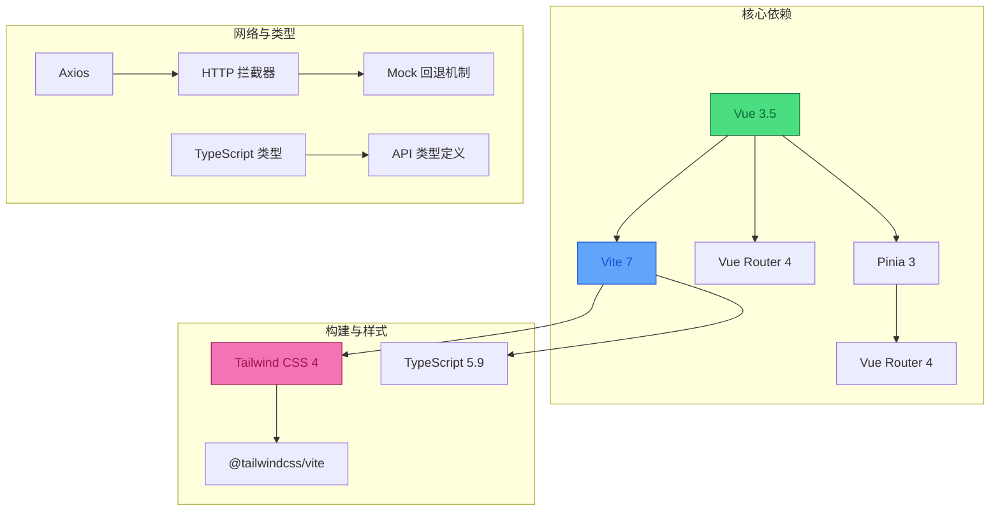
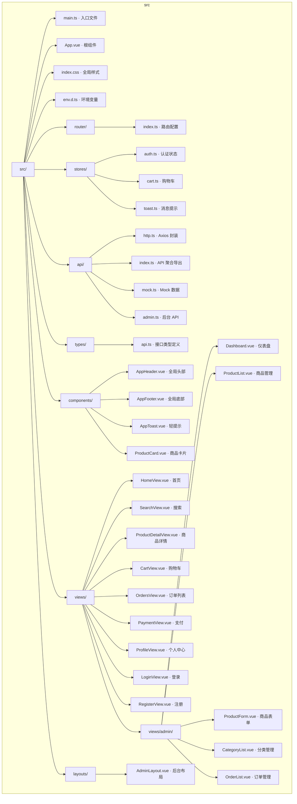
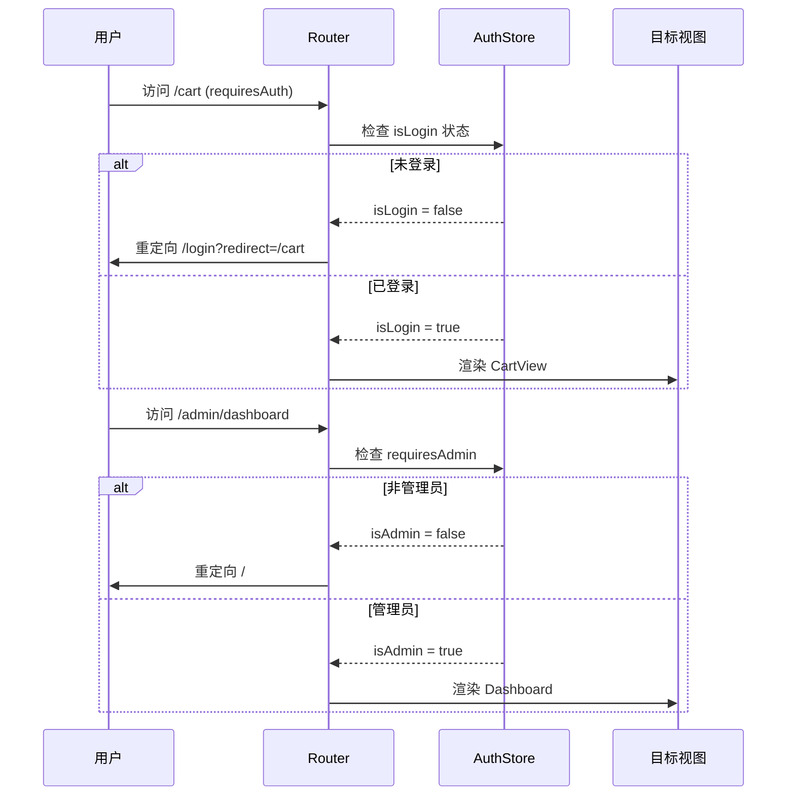
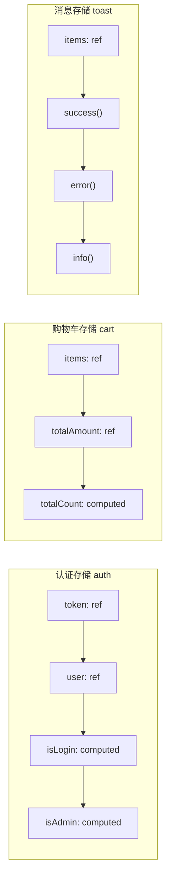
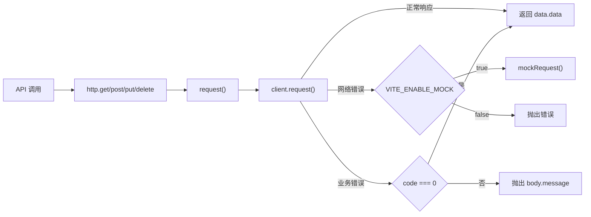
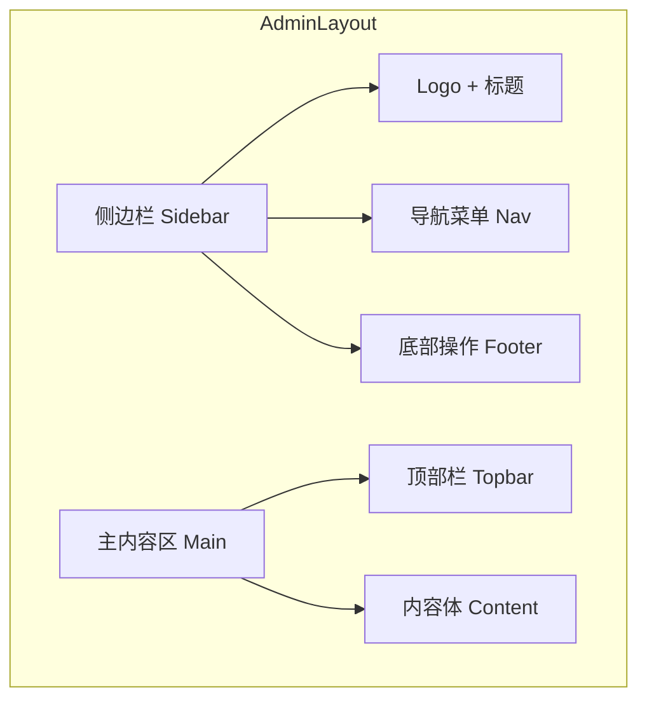
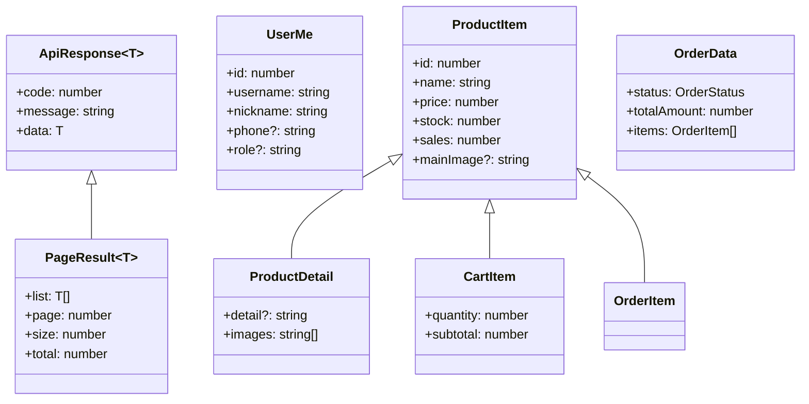
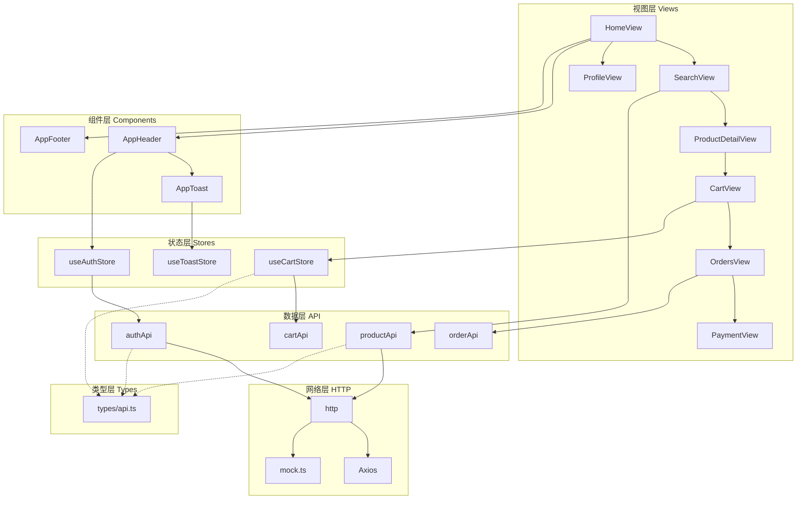

本文档详细介绍 EcoLink 生态商城前端项目的目录组织架构与核心模块划分，帮助开发者快速理解代码布局、定位功能入口，并为后续功能扩展提供清晰的参照。

## 技术栈概览

EcoLink 前端基于 **Vue 3 + Vite + TypeScript** 构建，采用 **Composition API** 进行组件逻辑组织。状态管理使用 **Pinia**，路由管理依赖 **Vue Router 4**，样式方案以 **Tailwind CSS v4** 为主，配合自定义 CSS 变量实现主题定制。



**关键依赖版本**：
- Vue: `^3.5.18`
- Pinia: `^3.0.3`
- Vue Router: `^4.5.1`
- Axios: `^1.13.1`
- Tailwind CSS: `^4.1.14`
- Vite: `^7.1.3`

Sources: [package.json](package.json#L1-L25)

## 目录结构全景图



## 入口与根组件

**`main.ts`** 是整个前端应用的启动入口，负责创建 Vue 实例、注册插件、挂载应用等核心操作。

```typescript
import { createApp } from 'vue';
import { createPinia } from 'pinia';
import App from './App.vue';
import router from './router';
import './index.css';

createApp(App).use(createPinia()).use(router).mount('#app');
```

从代码可见，插件注册顺序为：**Pinia（状态管理）→ Router（路由）**，这一顺序确保了路由守卫中可以正常使用 Pinia Store。

Sources: [src/main.ts](src/main.ts#L1-L8)

**`App.vue`** 作为根组件，承担全局布局与路由视图渲染的职责：

```typescript
const showChrome = computed(() =>
  !['login', 'register'].includes(route.name as string) &&
  !route.path.startsWith('/admin')
);
```

该组件根据当前路由动态控制 Header、Footer 的显示——登录/注册页面以及后台管理路由使用独立布局，不显示公共头部和底部。

Sources: [src/App.vue](src/App.vue#L1-L25)

## 路由模块

**`src/router/index.ts`** 采用了典型的 **嵌套路由** 与 **路由守卫** 组合架构，将 C 端用户界面与后台管理系统完全隔离：



**路由配置要点**：

| 路由特征 | 实现方式 |
|---------|---------|
| 懒加载视图 | `component: () => import('@/views/...')` |
| 权限控制 | `meta: { requiresAuth: true }` |
| 管理员专属 | `meta: { requiresAdmin: true }` |
| 后台子路由 | 嵌套在 `/admin` 下的 `children` 数组 |

路由守卫在每次导航前自动处理以下逻辑：
1. 已登录但无用户信息时自动调用 `/users/me` 获取用户资料
2. 未登录访问受保护路由时携带 `redirect` 参数重定向
3. 非管理员访问后台路由时强制跳转首页
4. 已登录用户访问登录/注册页时自动跳转首页

Sources: [src/router/index.ts](src/router/index.ts#L1-L59)

## 状态管理模块

项目使用 **Pinia** 进行状态管理，定义了三个核心 Store：



### 认证存储 (auth.ts)

`useAuthStore` 承担整个应用的登录态管理职责，采用 **双端同步** 策略——内存中的 `ref` 与 `localStorage` 实时保持一致：

```typescript
function setSession(newToken: string, newUser: UserMe) {
  token.value = newToken;
  user.value = newUser;
  localStorage.setItem('ecolink_token', newToken);
}

function clearSession() {
  token.value = '';
  user.value = null;
  localStorage.removeItem('ecolink_token');
}
```

导出方法包括 `login()`、`register()`、`fetchMe()`，路由守卫中通过 `useAuthStore()` 调用 `fetchMe()` 实现会话自动续期。

Sources: [src/stores/auth.ts](src/stores/auth.ts#L1-L43)

### 购物车存储 (cart.ts)

`useCartStore` 采用 **响应式引用 + 计算属性** 的组合模式：

```typescript
const totalCount = computed(() => 
  items.value.reduce((sum, item) => sum + item.quantity, 0)
);
```

`reload()` 方法从服务端拉取最新购物车数据，`clear()` 方法在用户退出登录时清空本地状态。

Sources: [src/stores/cart.ts](src/stores/cart.ts#L1-L24)

### 消息提示存储 (toast.ts)

`useToastStore` 提供三种级别的消息提示（success、error、info），每条消息带有唯一 `id` 和自动销毁定时器：

```typescript
function push(type: ToastType, message: string, duration = 2600) {
  const id = sequence++;
  items.value.push({ id, type, message, duration });
  window.setTimeout(() => remove(id), duration);
}
```

Sources: [src/stores/toast.ts](src/stores/toast.ts#L1-L47)

## API 请求模块

### HTTP 封装层 (http.ts)

`http.ts` 是整个网络请求的 **核心抽象层**，实现了请求拦截、响应拦截、Mock 回退三位一体的机制：



**关键设计点**：

1. **请求拦截器**：自动注入 `Authorization: Bearer ${token}` 头
2. **Token 过期处理**：响应 401 状态码时清除本地会话并跳转登录页
3. **网络错误回退**：检测 `ERR_NETWORK`、`ECONNABORTED`、`ECONNREFUSED` 时自动降级到 Mock 数据
4. **统一错误处理**：非 0 状态码抛出 `body.message` 供调用方捕获

Sources: [src/api/http.ts](src/api/http.ts#L1-L77)

### API 聚合导出 (index.ts)

采用 **命名空间导出** 模式，将不同业务域的 API 聚合到统一入口：

```typescript
export const authApi = { register, login, me };
export const productApi = { categories, list, detail };
export const cartApi = { list, add, update, remove };
export const orderApi = { create, list, detail, pay };
export const addressApi = { list, create, update, remove };
export const favoriteApi = { list, add, remove };
```

Sources: [src/api/index.ts](src/api/index.ts#L1-L103)

### 后台管理 API (admin.ts)

独立模块负责后台管理的所有接口：

```typescript
export const adminApi = {
  dashboard(),        // 仪表盘统计
  categoryList(),     // 分类 CRUD
  productList(),      // 商品 CRUD
  orderList(),        // 订单管理
  orderUpdateStatus() // 订单状态流转
};
```

Sources: [src/api/admin.ts](src/api/admin.ts#L1-L79)

### Mock 数据层 (mock.ts)

`mock.ts` 是一个完整的 **内存数据库模拟系统**，实现了除后台管理外的所有业务逻辑：

**数据持久化策略**：使用 `localStorage` 存储模拟数据库，支持数据持久化与重置。

```typescript
interface DemoDb {
  users: DemoUser[];
  categories: Category[];
  products: ProductDetail[];
  carts: Record<string, CartItem[]>;
  favorites: Record<string, FavoriteItem[]>;
  addresses: Record<string, Address[]>;
  orders: Record<string, OrderData[]>;
  seq: { ... }  // 自增 ID 序列
}
```

**预置数据**：
- 2 个用户：`demo/123456`（普通用户）、`admin/admin123`（管理员）
- 6 个商品分类
- 12 个商品（含图片、详情、库存信息）
- 初始购物车、收藏、地址、订单数据

Sources: [src/api/mock.ts](src/api/mock.ts#L1-L100)

## 组件模块

### 共享组件 (`src/components/`)

| 组件 | 职责 | 关键特性 |
|------|------|---------|
| `AppHeader.vue` | 全局导航头部 | 购物车计数徽章、登录状态切换、移动端菜单 |
| `AppFooter.vue` | 全局底部 | 公司信息、版权声明 |
| `AppToast.vue` | 轻提示 | 全局消息队列渲染、状态图标 |
| `ProductCard.vue` | 商品卡片 | 快速加入购物车、销量标签、悬停缩放 |

**ProductCard 组件示例**展示了典型的 **Props + Emits** 模式：

```typescript
const props = defineProps<{ product: ProductItem }>();
const emit = defineEmits<{ added: [] }>();

async function addCart() {
  // ...
  emit('added');  // 通知父组件刷新
}
```

Sources: [src/components/ProductCard.vue](src/components/ProductCard.vue#L1-L60)

### 视图组件 (`src/views/`)

C 端视图按业务场景分为：

| 视图 | 路由 | 核心功能 |
|------|------|---------|
| `HomeView.vue` | `/` | 首页 Banner、分类导航、商品推荐 |
| `SearchView.vue` | `/search` | 商品搜索、分类过滤、价格排序 |
| `ProductDetailView.vue` | `/product/:id` | 商品详情、规格选择、加入购物车 |
| `CartView.vue` | `/cart` | 购物车列表、数量修改、结算入口 |
| `OrdersView.vue` | `/orders` | 订单列表、状态筛选、详情查看 |
| `PaymentView.vue` | `/payment/:id` | 订单支付、支付结果展示 |
| `ProfileView.vue` | `/profile` | 个人信息、收货地址、收藏管理 |
| `LoginView.vue` | `/login` | 用户登录 |
| `RegisterView.vue` | `/register` | 用户注册 |

### 后台管理组件 (`src/views/admin/`)

| 组件 | 路由 | 核心功能 |
|------|------|---------|
| `Dashboard.vue` | `/admin/dashboard` | 运营统计、订单分布、热销商品 |
| `ProductList.vue` | `/admin/products` | 商品列表、上下架管理、编辑删除 |
| `ProductForm.vue` | `/admin/products/new`<br>`/admin/products/:id/edit` | 商品新增/编辑表单 |
| `CategoryList.vue` | `/admin/categories` | 分类列表、增删改、排序调整 |
| `OrderList.vue` | `/admin/orders` | 订单列表、状态筛选、发货操作 |

### 后台布局 (`src/layouts/AdminLayout.vue`)

采用 **侧边栏固定 + 内容区自适应** 的经典后台布局模式：



侧边栏宽度固定 `240px`，背景采用深色渐变，导航项支持高亮状态显示。顶部栏展示当前页面标题和管理员信息。

Sources: [src/layouts/AdminLayout.vue](src/layouts/AdminLayout.vue#L1-L60)

## 类型定义模块

**`src/types/api.ts`** 统一管理所有接口相关的 TypeScript 类型定义：



**关键类型说明**：

| 类型 | 用途 |
|------|------|
| `ApiResponse<T>` | 统一响应包装，code=0 表示成功 |
| `PageResult<T>` | 分页查询结果，包含列表与分页元信息 |
| `OrderStatus` | 订单状态枚举：`UNPAID` `PAID` `SHIPPED` `COMPLETED` `CANCELLED` |
| `UserMe` | 当前登录用户信息，含 role 字段判断管理员权限 |

Sources: [src/types/api.ts](src/types/api.ts#L1-L111)

## 全局样式模块

**`src/index.css`** 是样式系统的入口文件，通过 Tailwind CSS v4 的 `@import "tailwindcss"` 导入核心功能，并定义了项目的设计系统变量：

```css
@theme {
  --color-primary: #2e8a56;
  --color-background-light: #f6f8f7;
  --color-secondary: #ca8a04;
  --font-display: "Work Sans", "Noto Sans SC", sans-serif;
}
```

**自定义组件类**：

| 类名 | 用途 | 典型使用场景 |
|------|------|------------|
| `.btn .btn-primary` | 按钮样式 | 表单提交、关键操作 |
| `.input-control` | 输入框样式 | 搜索框、表单输入 |
| `.surface-card` | 卡片容器 | 内容区块包装 |
| `.chip-tag` | 标签样式 | 状态标识、分类标签 |
| `.status-pill` | 状态药丸 | 订单状态、上下架状态 |
| `.product-grid` | 商品网格 | 商品列表自适应布局 |

Sources: [src/index.css](src/index.css#L1-L140)

## 路径别名配置

项目配置了 `@` 作为 `src/` 目录的路径别名，简化导入路径：

```typescript
// vite.config.ts
export default defineConfig({
  resolve: {
    alias: {
      '@': path.resolve(__dirname, './src'),
    },
  },
});
```

这一配置贯穿整个项目，例如：
- `@/api` → `src/api`
- `@/views/HomeView.vue` → `src/views/HomeView.vue`
- `@/stores/auth` → `src/stores/auth.ts`

Sources: [vite.config.ts](vite.config.ts#L1-L12)

## 模块关联总览



## 后续阅读建议

完成本章节后，建议按以下顺序继续深入：

1. **[Vue Router 路由与权限守卫](5-vue-router-lu-you-yu-quan-xian-shou-wei)** — 深入了解路由守卫的完整实现逻辑
2. **[Pinia 状态管理与认证存储](6-pinia-zhuang-tai-guan-li-yu-ren-zheng-cun-chu)** — 深入理解 Store 的响应式机制与持久化策略
3. **[Axios 封装与 Mock 回退机制](7-axios-feng-zhuang-yu-mock-hui-tui-ji-zhi)** — 深入理解网络请求层与降级策略