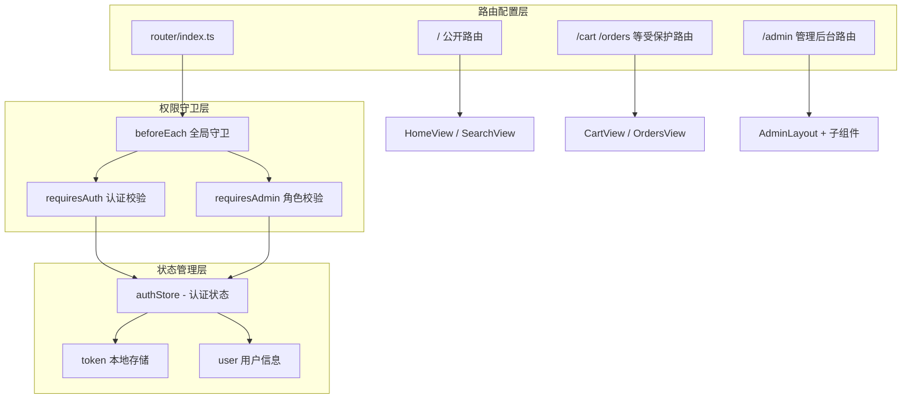
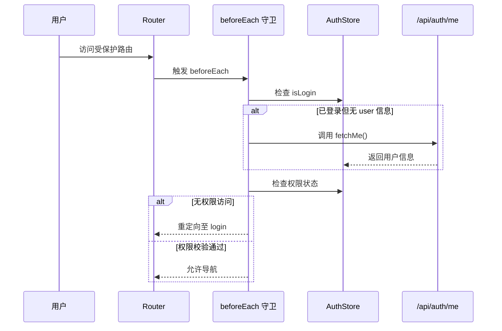
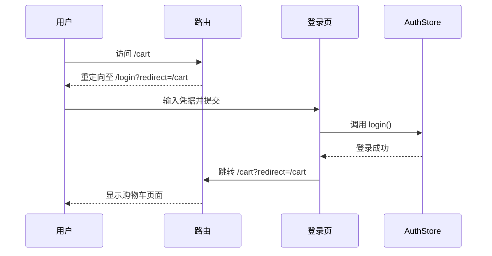

本文档详细阐述 EcoLink 电商平台前端路由系统的架构设计与权限守卫实现机制。该系统采用 Vue Router 4.x 版本，通过全局前置守卫实现认证鉴权与页面访问控制，同时利用路由元信息（meta）区分公开页面与受保护资源。

## 路由架构总览

EcoLink 前端路由采用**两级结构**：面向消费者的 C 端路由与面向运营人员的后台管理路由。两类路由共享同一路由器实例，但通过不同的布局组件与权限级别实现隔离。



## 路由配置详解

### 路由定义结构

路由配置定义于 `src/router/index.ts`，采用静态导入与动态导入混合策略：

| 路由类型 | 导入方式 | 说明 |
|---------|---------|------|
| 首页/搜索等高频页面 | 静态导入 | 预加载，减少白屏时间 |
| 受保护页面 | 动态导入 `() => import()` | 按需加载，减小首屏体积 |
| 管理后台页面 | 动态导入 | 管理员使用频率较低 |

```typescript
// src/router/index.ts#L1-L34
const router = createRouter({
  history: createWebHistory(),
  routes: [
    // === C端路由 ===
    { path: '/', name: 'home', component: () => import('@/views/HomeView.vue') },
    { path: '/search', name: 'search', component: () => import('@/views/SearchView.vue') },
    { path: '/product/:id', name: 'product', component: () => import('@/views/ProductDetailView.vue') },
    { path: '/cart', name: 'cart', component: () => import('@/views/CartView.vue'), meta: { requiresAuth: true } },
    { path: '/orders', name: 'orders', component: () => import('@/views/OrdersView.vue'), meta: { requiresAuth: true } },
    { path: '/payment/:id', name: 'payment', component: () => import('@/views/PaymentView.vue'), meta: { requiresAuth: true } },
    { path: '/profile', name: 'profile', component: () => import('@/views/ProfileView.vue'), meta: { requiresAuth: true } },
    { path: '/login', name: 'login', component: () => import('@/views/LoginView.vue') },
    { path: '/register', name: 'register', component: () => import('@/views/RegisterView.vue') },

    // === 后台管理路由 ===
    {
      path: '/admin',
      component: () => import('@/layouts/AdminLayout.vue'),
      meta: { requiresAuth: true, requiresAdmin: true },
      children: [
        { path: '', redirect: '/admin/dashboard' },
        { path: 'dashboard', name: 'admin-dashboard', component: () => import('@/views/admin/Dashboard.vue') },
        { path: 'products', name: 'admin-products', component: () => import('@/views/admin/ProductList.vue') },
        { path: 'products/new', name: 'admin-product-new', component: () => import('@/views/admin/ProductForm.vue') },
        { path: 'products/:id/edit', name: 'admin-product-edit', component: () => import('@/views/admin/ProductForm.vue') },
        { path: 'categories', name: 'admin-categories', component: () => import('@/views/admin/CategoryList.vue') },
        { path: 'orders', name: 'admin-orders', component: () => import('@/views/admin/OrderList.vue') },
      ],
    },
  ],
});
```

### 路由元信息（meta）字段定义

| 字段 | 类型 | 作用 | 应用场景 |
|-----|------|------|---------|
| `requiresAuth` | `boolean` | 标记需要登录才能访问的路由 | 购物车、订单、个人中心 |
| `requiresAdmin` | `boolean` | 标记需要管理员角色的路由 | 后台管理所有页面 |

## 全局守卫实现

### 守卫执行流程



### 守卫代码实现

守卫在 `src/router/index.ts` 第 36-59 行实现，包含四个核心校验逻辑：

```typescript
// src/router/index.ts#L36-L59
router.beforeEach(async (to) => {
  const auth = useAuthStore();
  
  // 已登录但未获取用户信息时自动刷新
  if (auth.isLogin && !auth.user) {
    try {
      await auth.fetchMe();
    } catch {
      auth.clearSession();
    }
  }
  
  // 需要登录
  if (to.meta.requiresAuth && !auth.isLogin) {
    return { name: 'login', query: { redirect: to.fullPath } };
  }
  
  // 需要管理员权限
  if (to.meta.requiresAdmin && !auth.isAdmin) {
    return { name: 'home' };
  }
  
  // 已登录用户不允许访问登录/注册
  if ((to.name === 'login' || to.name === 'register') && auth.isLogin) {
    return { name: 'home' };
  }
  
  return true;
});
```

### 守卫校验优先级

守卫按照以下顺序执行校验：

1. **Token 刷新**：检测到已登录但缺少用户信息时，自动调用 `/api/auth/me` 获取最新用户数据
2. **登录状态校验**：`requiresAuth: true` 的路由，若未登录则重定向至登录页
3. **角色权限校验**：`requiresAdmin: true` 的路由，若用户角色非 `ADMIN` 则跳转首页
4. **会话状态反制**：已登录用户尝试访问登录/注册页时，自动跳转首页

## 认证状态管理

### AuthStore 结构

认证状态通过 Pinia 管理，定义于 `src/stores/auth.ts`：

```typescript
// src/stores/auth.ts#L6-L51
export const useAuthStore = defineStore('auth', () => {
  const token = ref(localStorage.getItem('ecolink_token') || '');
  const user = ref<UserMe | null>(null);

  const isLogin = computed(() => Boolean(token.value));
  const isAdmin = computed(() => user.value?.role === 'ADMIN');

  function setSession(newToken: string, newUser: UserMe) {
    token.value = newToken;
    user.value = newUser;
    localStorage.setItem('ecolink_token', newToken);
  }

  function clearSession() {
    token.value = '';
    user.value = null;
    localStorage.removeItem('ecolink_token');
  }

  async function login(username: string, password: string) {
    const result = await authApi.login({ username, password });
    setSession(result.token, result.user);
  }

  async function fetchMe() {
    if (!token.value) return;
    user.value = await authApi.me();
  }

  return { token, user, isLogin, isAdmin, login, register, fetchMe, clearSession, setSession };
});
```

### 关键计算属性

| 属性 | 计算逻辑 | 用途 |
|-----|---------|------|
| `isLogin` | `Boolean(token.value)` | 判断用户是否已认证 |
| `isAdmin` | `user.value?.role === 'ADMIN'` | 判断用户是否具备管理权限 |

## 页面布局与路由联动

### 全局布局组件

`App.vue` 根据当前路由动态控制页面布局：

```vue
<!-- src/App.vue#L1-L22 -->
<template>
  <div class="flex min-h-screen flex-col">
    <AppToast />
    <AppHeader v-if="showChrome" />
    <RouterView />
    <AppFooter v-if="showChrome" />
  </div>
</template>

<script setup lang="ts">
const route = useRoute();
const showChrome = computed(() =>
  !['login', 'register'].includes(route.name as string) &&
  !route.path.startsWith('/admin')
);
</script>
```

### 布局显示规则

| 路由条件 | AppHeader | AppFooter | 说明 |
|---------|-----------|-----------|------|
| `route.name === 'login'` | ❌ 隐藏 | ❌ 隐藏 | 登录页独立布局 |
| `route.name === 'register'` | ❌ 隐藏 | ❌ 隐藏 | 注册页独立布局 |
| `route.path.startsWith('/admin')` | ❌ 隐藏 | ❌ 隐藏 | 后台使用独立布局 |
| 其他路由 | ✅ 显示 | ✅ 显示 | 标准商城布局 |

### 后台管理布局

后台管理使用独立布局组件 `AdminLayout.vue`，该组件在路由配置中作为父级路由的组件：

```vue
<!-- src/layouts/AdminLayout.vue#L1-L56 -->
<template>
  <div class="admin-layout">
    <!-- 侧边栏 -->
    <aside class="sidebar">
      <div class="sidebar-header">
        <span class="material-symbols-outlined logo-icon">eco</span>
        <h1 class="logo-text">EcoLink 后台</h1>
      </div>
      <nav class="sidebar-nav">
        <RouterLink to="/admin/dashboard" class="nav-item" active-class="active">仪表盘</RouterLink>
        <RouterLink to="/admin/products" class="nav-item" active-class="active">商品管理</RouterLink>
        <RouterLink to="/admin/categories" class="nav-item" active-class="active">分类管理</RouterLink>
        <RouterLink to="/admin/orders" class="nav-item" active-class="active">订单管理</RouterLink>
      </nav>
      <div class="sidebar-footer">
        <button class="nav-item logout-btn" @click="handleLogout">退出登录</button>
      </div>
    </aside>
    <!-- 主内容 -->
    <main class="main-content">
      <header class="topbar">
        <div>
          <h2 class="page-title">{{ pageTitle }}</h2>
          <p class="page-subtitle">EcoLink 管理后台</p>
        </div>
        <div class="user-info">
          <span class="admin-badge">ADMIN</span>
          <span>{{ auth.user?.nickname || '管理员' }}</span>
        </div>
      </header>
      <div class="content-body">
        <RouterView />
      </div>
    </main>
  </div>
</template>
```

## 路由与页面组件映射

| 路由路径 | 路由名称 | 组件路径 | 权限要求 |
|---------|---------|---------|---------|
| `/` | home | `views/HomeView.vue` | 公开 |
| `/search` | search | `views/SearchView.vue` | 公开 |
| `/product/:id` | product | `views/ProductDetailView.vue` | 公开 |
| `/cart` | cart | `views/CartView.vue` | requiresAuth |
| `/orders` | orders | `views/OrdersView.vue` | requiresAuth |
| `/payment/:id` | payment | `views/PaymentView.vue` | requiresAuth |
| `/profile` | profile | `views/ProfileView.vue` | requiresAuth |
| `/login` | login | `views/LoginView.vue` | 公开（已登录跳转首页） |
| `/register` | register | `views/RegisterView.vue` | 公开（已登录跳转首页） |
| `/admin` | admin | `layouts/AdminLayout.vue` | requiresAuth + requiresAdmin |
| `/admin/dashboard` | admin-dashboard | `views/admin/Dashboard.vue` | requiresAuth + requiresAdmin |
| `/admin/products` | admin-products | `views/admin/ProductList.vue` | requiresAuth + requiresAdmin |
| `/admin/products/new` | admin-product-new | `views/admin/ProductForm.vue` | requiresAuth + requiresAdmin |
| `/admin/products/:id/edit` | admin-product-edit | `views/admin/ProductForm.vue` | requiresAuth + requiresAdmin |
| `/admin/categories` | admin-categories | `views/admin/CategoryList.vue` | requiresAuth + requiresAdmin |
| `/admin/orders` | admin-orders | `views/admin/OrderList.vue` | requiresAuth + requiresAdmin |

## 登录重定向机制

登录页面支持**来源页面重定向**功能，用户在未登录状态下访问受保护页面时，系统会将目标路径作为查询参数传递：

```typescript
// 守卫中重定向配置 - src/router/index.ts#L47-L48
if (to.meta.requiresAuth && !auth.isLogin) {
  return { name: 'login', query: { redirect: to.fullPath } };
}
```

```typescript
// 登录成功后跳转 - src/views/LoginView.vue#L126-L132
async function submit() {
  errorMessage.value = '';
  loading.value = true;
  try {
    await auth.login(username.value, password.value);
    const redirect = (route.query.redirect as string) || '/';
    router.replace(redirect);
  } catch (error) {
    errorMessage.value = (error as Error).message;
  } finally {
    loading.value = false;
  }
}
```

### 重定向流程示意



## 头部导航权限联动

`AppHeader.vue` 根据用户权限动态渲染后台入口：

```vue
<!-- src/components/AppHeader.vue#L27-L34 -->
<RouterLink
  v-if="auth.isAdmin"
  to="/admin/dashboard"
  class="hidden items-center gap-1 rounded-xl bg-primary/10 px-3 py-1.5 text-xs font-bold text-primary transition-colors hover:bg-primary/20 lg:inline-flex"
>
  <span class="material-symbols-outlined text-sm">admin_panel_settings</span>
  后台
</RouterLink>
```

仅当 `auth.isAdmin` 为 `true`（即 `user.value?.role === 'ADMIN'`）时，后台入口按钮才会渲染。

## 退出登录处理

退出登录时需要同时清理认证状态与购物车状态：

```typescript
// src/components/AppHeader.vue#L112-L116
function logout() {
  auth.clearSession();  // 清除 token 和 user
  cart.clear();         // 清除购物车数据
  router.push('/login');
}
```

```typescript
// src/layouts/AdminLayout.vue#L79-L82
function handleLogout() {
  auth.clearSession();
  router.push('/login');
}
```

## 相关文档

- [Pinia 状态管理与认证存储](6-pinia-zhuang-tai-guan-li-yu-ren-zheng-cun-chu) — 深入了解 AuthStore 设计与持久化策略
- [Axios 封装与 Mock 回退机制](7-axios-feng-zhuang-yu-mock-hui-tui-ji-zhi) — HTTP 请求拦截器与 Token 自动注入
- [前端目录结构与模块划分](4-qian-duan-mu-lu-jie-gou-yu-mo-kuai-hua-fen) — 项目整体架构与模块职责

## 源码索引

| 文件 | 关键内容 | 行号 |
|-----|---------|------|
| `src/router/index.ts` | 路由配置与全局守卫 | 1-62 |
| `src/stores/auth.ts` | 认证状态管理 | 1-52 |
| `src/App.vue` | 动态布局控制 | 1-23 |
| `src/layouts/AdminLayout.vue` | 后台管理布局 | 1-83 |
| `src/components/AppHeader.vue` | 导航权限联动 | 27-34, 112-116 |
| `src/views/LoginView.vue` | 登录重定向处理 | 126-138 |