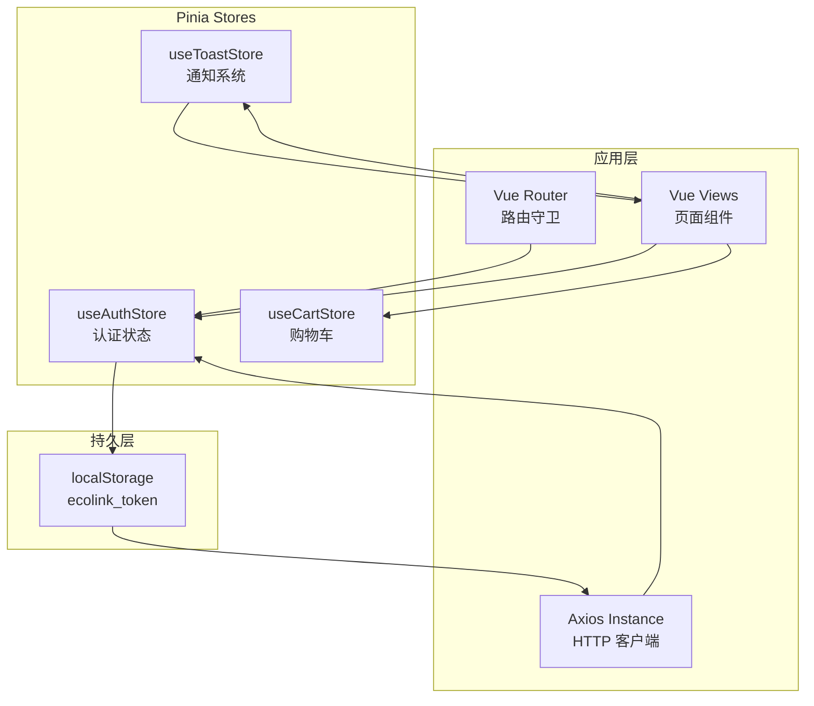
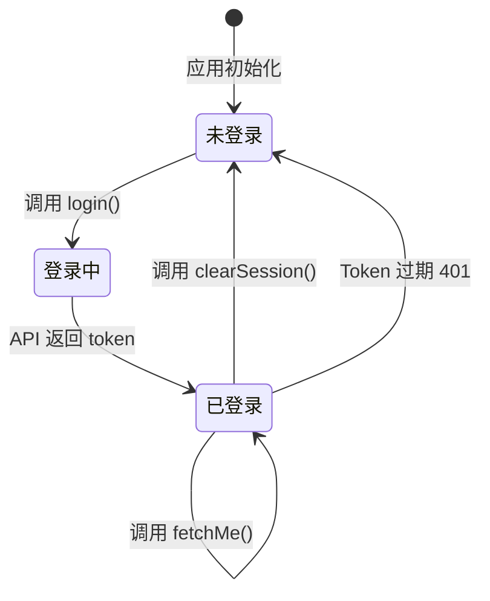
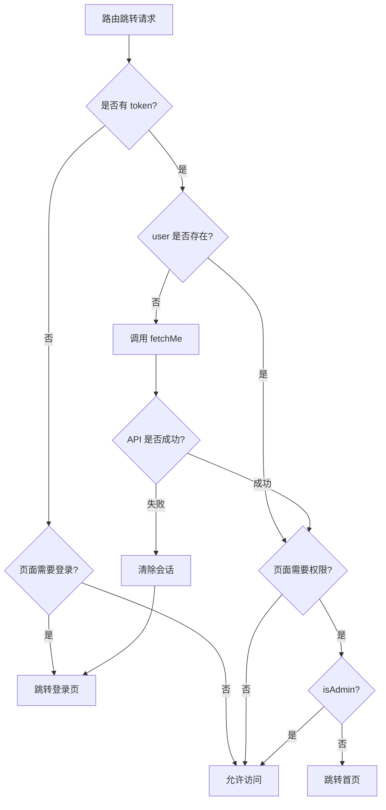
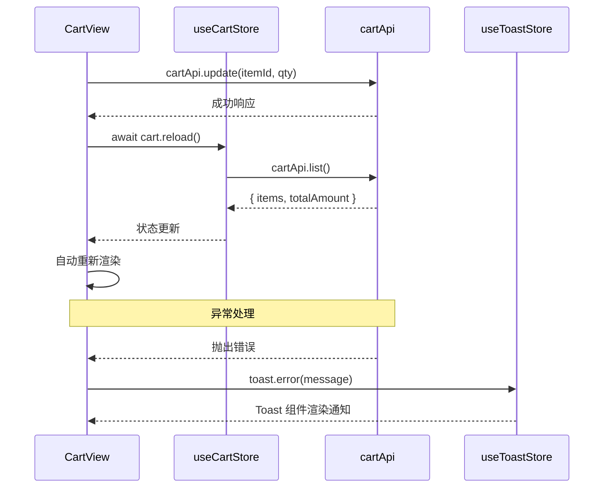
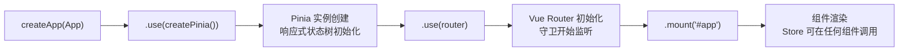

EcoLink 前端应用采用 **Pinia** 作为统一状态管理解决方案，通过三个核心 Store 模块分别管理认证状态、购物车数据和全局通知。三者协同工作，构成从用户登录到购物流程的完整状态链路。

---

## 1. 架构总览

EcoLink 的 Pinia 架构遵循**职责分离**原则，每个 Store 专注于单一领域的状态管理：



**核心设计特征**：

| 特征 | 实现方式 |
|------|----------|
| 语法风格 | Composition API (`ref`/`computed`) |
| 类型安全 | TypeScript 泛型 + 接口定义 |
| 持久化 | `localStorage` 存储 JWT Token |
| 解耦方式 | API 层与 Store 层分离 |

Sources: [src/stores/auth.ts](src/stores/auth.ts#L1-L51), [src/stores/cart.ts](src/stores/cart.ts#L1-L23), [src/stores/toast.ts](src/stores/toast.ts#L1-L48)

---

## 2. 认证状态存储 (`useAuthStore`)

### 2.1 核心数据结构

认证 Store 是整个应用状态管理的核心，负责用户身份验证与会话生命周期管理：

```typescript
export const useAuthStore = defineStore('auth', () => {
  const token = ref(localStorage.getItem('ecolink_token') || '');
  const user = ref<UserMe | null>(null);

  const isLogin = computed(() => Boolean(token.value));
  const isAdmin = computed(() => user.value?.role === 'ADMIN');

  // ... methods
});
```

**状态变量说明**：

| 变量 | 类型 | 说明 |
|------|------|------|
| `token` | `Ref<string>` | JWT 认证令牌，初始值从 localStorage 读取 |
| `user` | `Ref<UserMe \| null>` | 当前登录用户信息，包含角色标识 |
| `isLogin` | `ComputedRef<boolean>` | 计算属性，判定登录状态 |
| `isAdmin` | `ComputedRef<boolean>` | 计算属性，判定管理员权限 |

Sources: [src/stores/auth.ts](src/stores/auth.ts#L6-L11)

### 2.2 会话管理方法

认证 Store 提供了完整的会话生命周期操作：

```typescript
function setSession(newToken: string, newUser: UserMe) {
  token.value = newToken;
  user.value = newUser;
  localStorage.setItem('ecolink_token', newToken);
}

function clearSession() {
  token.value = '';
  user.value = null;
  localStorage.removeItem('ecolink_token');
}
```

**会话状态流转**：



Sources: [src/stores/auth.ts](src/stores/auth.ts#L13-L23)

### 2.3 异步认证方法

```typescript
async function login(username: string, password: string) {
  const result = await authApi.login({ username, password });
  setSession(result.token, result.user);
}

async function register(payload) {
  const result = await authApi.register(payload);
  setSession(result.token, result.user);
}

async function fetchMe() {
  if (!token.value) return;
  user.value = await authApi.me();
}
```

这三个异步方法对应三个 API 端点：

| 方法 | API 端点 | 功能 |
|------|----------|------|
| `login()` | `POST /auth/login` | 用户名密码登录 |
| `register()` | `POST /auth/register` | 用户注册 |
| `fetchMe()` | `GET /users/me` | 获取当前用户信息 |

Sources: [src/stores/auth.ts](src/stores/auth.ts#L25-L38), [src/api/index.ts](src/api/index.ts#L15-L25)

### 2.4 与路由守卫的集成

路由守卫是认证状态的主要消费者，通过 `useAuthStore` 实现页面访问控制：

```typescript
router.beforeEach(async (to) => {
  const auth = useAuthStore();
  
  // 已登录但未获取用户信息时自动刷新
  if (auth.isLogin && !auth.user) {
    try {
      await auth.fetchMe();
    } catch {
      auth.clearSession();
    }
  }
  
  // 需要登录
  if (to.meta.requiresAuth && !auth.isLogin) {
    return { name: 'login', query: { redirect: to.fullPath } };
  }
  
  // 需要管理员权限
  if (to.meta.requiresAdmin && !auth.isAdmin) {
    return { name: 'home' };
  }
  
  return true;
});
```

**路由守卫决策流程**：



**路由元信息定义**示例：

```typescript
// 需要登录的路由
{ path: '/cart', name: 'cart', component: CartView, meta: { requiresAuth: true } }

// 需要管理员权限的路由
{ path: '/admin', component: AdminLayout, meta: { requiresAuth: true, requiresAdmin: true } }
```

Sources: [src/router/index.ts](src/router/index.ts#L36-L59), [src/router/index.ts](src/router/index.ts#L11-L14)

---

## 3. 购物车存储 (`useCartStore`)

### 3.1 状态结构

购物车 Store 采用简洁的设计，仅管理商品项列表和金额汇总：

```typescript
export const useCartStore = defineStore('cart', () => {
  const items = ref<CartItem[]>([]);
  const totalAmount = ref(0);
  const totalCount = computed(() => 
    items.value.reduce((sum, item) => sum + item.quantity, 0)
  );

  async function reload() {
    const data = await cartApi.list();
    items.value = data.items;
    totalAmount.value = data.totalAmount;
  }

  function clear() {
    items.value = [];
    totalAmount.value = 0;
  }

  return { items, totalAmount, totalCount, reload, clear };
});
```

**CartItem 数据结构**：

```typescript
interface CartItem {
  id: number;           // 购物车项ID
  productId: number;    // 商品ID
  productName: string;  // 商品名称
  productImage?: string;// 商品图片
  price: number;        // 单价
  quantity: number;     // 数量
  stock: number;        // 库存
  subtotal: number;     // 小计
}
```

Sources: [src/stores/cart.ts](src/stores/cart.ts#L1-L23), [src/types/api.ts](src/types/api.ts#L53-L62)

### 3.2 购物车 API 映射

购物车 Store 与后端 API 的交互关系：

| Store 方法 | API 调用 | HTTP 方法 |
|------------|----------|-----------|
| `reload()` | `cartApi.list()` | GET /cart |
| 组件内调用 | `cartApi.add()` | POST /cart/items |
| 组件内调用 | `cartApi.update()` | PUT /cart/items/{id} |
| 组件内调用 | `cartApi.remove()` | DELETE /cart/items/{id} |

Sources: [src/api/index.ts](src/api/index.ts#L47-L60)

### 3.3 购物车视图集成模式

`CartView.vue` 展示了 Store 与视图的典型集成模式：

```typescript
const cart = useCartStore();
const selectedIds = ref<number[]>([]);

async function reload() {
  await cart.reload();
  selectedIds.value = cart.items.map((item) => item.id);
}

async function changeQty(itemId: number, qty: number) {
  if (qty < 1) return;
  try {
    await cartApi.update(itemId, { quantity: qty });
    await reload();
  } catch (error) {
    toast.error((error as Error).message);
  }
}
```

**视图更新流程**：



Sources: [src/views/CartView.vue](src/views/CartView.vue#L151-L190)

---

## 4. 通知系统 (`useToastStore`)

### 4.1 设计理念

Toast Store 采用**队列式管理**，支持多条通知并行显示，并通过自动过期机制实现自我清理：

```typescript
let sequence = 1;

export const useToastStore = defineStore('toast', () => {
  const items = ref<ToastItem[]>([]);

  function push(type: ToastType, message: string, duration = 2600) {
    const id = sequence++;
    items.value.push({ id, type, message, duration });
    window.setTimeout(() => remove(id), duration);
  }

  function success(message: string, duration?: number) { push('success', message, duration); }
  function error(message: string, duration = 3200) { push('error', message, duration); }
  function info(message: string, duration?: number) { push('info', message, duration); }

  return { items, push, success, error, info, remove };
});
```

**Toast 类型定义**：

```typescript
export type ToastType = 'success' | 'error' | 'info';

export interface ToastItem {
  id: number;        // 唯一标识
  type: ToastType;   // 通知类型
  message: string;   // 通知内容
  duration: number;  // 显示时长(ms)
}
```

**通知样式配置**：

| 类型 | 默认时长 | 样式类 | 图标 |
|------|----------|--------|------|
| `success` | 2600ms | `border-emerald-200 bg-white/95 text-emerald-700` | `check_circle` |
| `error` | 3200ms | `border-red-200 bg-white/95 text-red-600` | `error` |
| `info` | 2600ms | `border-sky-200 bg-white/95 text-sky-700` | `info` |

Sources: [src/stores/toast.ts](src/stores/toast.ts#L1-L48), [src/components/AppToast.vue](src/components/AppToast.vue#L29-L43)

### 4.2 组件渲染

`AppToast.vue` 通过 Vue 的 `<Teleport>` 组件将通知渲染到 `body` 层级，确保不受父组件样式影响：

```vue
<Teleport to="body">
  <div class="pointer-events-none fixed inset-x-0 top-4 z-[120] flex justify-center px-4">
    <div class="flex w-full max-w-md flex-col gap-3">
      <transition-group name="toast">
        <article v-for="item in toast.items" :key="item.id" ...>
          <span class="material-symbols-outlined">{{ toastIcon(item.type) }}</span>
          <p>{{ item.message }}</p>
          <button @click="toast.remove(item.id)">×</button>
        </article>
      </transition-group>
    </div>
  </div>
</Teleport>
```

**动画效果**：

```css
.toast-enter-active, .toast-leave-active {
  transition: all 0.24s ease;
}
.toast-enter-from, .toast-leave-to {
  opacity: 0;
  transform: translateY(-12px) scale(0.98);
}
```

Sources: [src/components/AppToast.vue](src/components/AppToast.vue#L1-L57)

### 4.3 使用模式

Toast Store 的典型使用模式——在异步操作中处理成功与失败：

```typescript
async function checkout() {
  if (selectedIds.value.length === 0) {
    toast.info('请选择要下单的商品');
    return;
  }
  
  try {
    const order = await orderApi.create({ addressId, cartItemIds });
    await reload();
    toast.success('订单创建成功，正在前往支付');
    router.push(`/payment/${order.id}`);
  } catch (error) {
    toast.error((error as Error).message);
  }
}
```

---

## 5. Pinia 初始化与挂载

Pinia 在应用入口处完成初始化：

```typescript
// src/main.ts
import { createPinia } from 'pinia';

createApp(App)
  .use(createPinia())  // 注册 Pinia
  .use(router)
  .mount('#app');
```

Sources: [src/main.ts](src/main.ts#L1-L7)

**挂载流程**：



---

## 6. 核心模式总结

### 6.1 Store 定义模式

EcoLink 统一采用 **Composition API 风格** 定义 Store：

```typescript
// 模板
export const useXxxStore = defineStore('xxx', () => {
  // 1. 状态 (ref/computed)
  const state = ref<T>(initial);
  const computed = computed(() => /* ... */);
  
  // 2. 方法 (async/sync)
  async function action() { /* ... */ }
  
  // 3. 导出
  return { state, computed, action };
});
```

### 6.2 组件使用模式

```typescript
// 在 <script setup> 中使用
import { useXxxStore } from '@/stores/xxx';

const store = useXxxStore();

// 模板中直接访问
// {{ store.state }}
// @click="store.action()"
```

### 6.3 三层状态流转

| 层级 | 存储位置 | 生命周期 | 用途 |
|------|----------|----------|------|
| **内存状态** | `ref`/`computed` | 应用运行期间 | 组件响应式渲染 |
| **本地持久化** | `localStorage` | 跨会话保留 | Token 持久化 |
| **服务端持久化** | 后端数据库 | 跨设备共享 | 用户、订单等数据 |

---

## 7. 扩展阅读

- **[Axios 封装与 Mock 回退机制](7-axios-feng-zhuang-yu-mock-hui-tui-ji-zhi)** — HTTP 层如何携带 Token、处理 401 响应
- **[Vue Router 路由与权限守卫](5-vue-router-lu-you-yu-quan-xian-shou-wei)** — 路由守卫的完整实现逻辑
- **[商品浏览与搜索过滤](13-shang-pin-liu-lan-yu-sou-suo-guo-lu)** — 商品数据的状态管理实践

---

## 8. 相关源文件

| 文件路径 | 说明 |
|----------|------|
| [src/stores/auth.ts](src/stores/auth.ts) | 认证状态管理 |
| [src/stores/cart.ts](src/stores/cart.ts) | 购物车状态管理 |
| [src/stores/toast.ts](src/stores/toast.ts) | 通知系统状态管理 |
| [src/types/api.ts](src/types/api.ts) | TypeScript 类型定义 |
| [src/router/index.ts](src/router/index.ts) | 路由配置与守卫 |
| [src/api/index.ts](src/api/index.ts) | API 接口封装 |
| [src/api/http.ts](src/api/http.ts) | Axios 实例与拦截器 |
| [src/views/LoginView.vue](src/views/LoginView.vue) | 登录视图集成示例 |
| [src/views/CartView.vue](src/views/CartView.vue) | 购物车视图集成示例 |
| [src/components/AppToast.vue](src/components/AppToast.vue) | Toast 组件实现 |
| [src/main.ts](src/main.ts) | Pinia 初始化入口 |