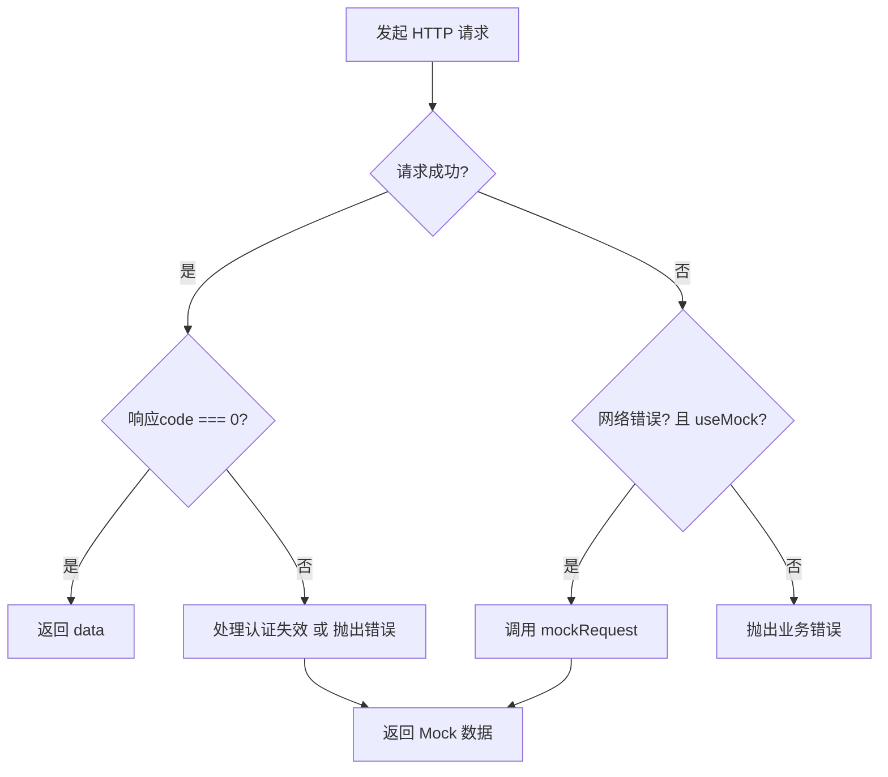

本文档详细阐述 EcoLink 项目中 HTTP 请求层的架构设计，包括 Axios 实例封装、请求拦截器机制、网络错误检测以及 Mock 数据回退机制。该设计实现了前端开发环境与后端服务的解耦，确保在无后端服务时仍能完成全流程功能演示。

## 核心架构概览

```
┌─────────────────────────────────────────────────────────────────────┐
│                         视图层 (Views)                                │
├─────────────────────────────────────────────────────────────────────┤
│  HomeView │ ProductDetailView │ CartView │ OrdersView │ ...        │
└─────────────────────────────────┬───────────────────────────────────┘
                                  │ 调用
                                  ▼
┌─────────────────────────────────────────────────────────────────────┐
│                      API 门面层 (src/api/index.ts)                   │
│  authApi │ productApi │ cartApi │ orderApi │ addressApi │ favoriteApi│
└─────────────────────────────────┬───────────────────────────────────┘
                                  │ 调用
                                  ▼
┌─────────────────────────────────────────────────────────────────────┐
│                    HTTP 封装层 (src/api/http.ts)                     │
│  ┌─────────────────┐  ┌─────────────────┐  ┌─────────────────────┐  │
│  │ 请求拦截器        │  │  核心request()  │  │   响应拦截器         │  │
│  │ 添加Token        │  │  统一错误处理    │  │   401认证失效处理     │  │
│  └─────────────────┘  └────────┬────────┘  └─────────────────────┘  │
│                                │                                     │
│                    ┌───────────┴───────────┐                        │
│                    │   网络错误检测         │                        │
│                    │  isAxiosNetworkError │                        │
│                    └───────────┬───────────┘                        │
└────────────────────────────────┼────────────────────────────────────┘
                                 │
              ┌──────────────────┴──────────────────┐
              │           环境变量控制               │
              │    VITE_ENABLE_MOCK (默认true)       │
              └──────────────────┬──────────────────┘
                                 │
              ┌──────────────────┴──────────────────┐
              │                 │                    │
              ▼                 │                    ▼
     ┌─────────────────┐        │         ┌─────────────────┐
     │  真实后端服务     │        │         │   Mock 数据层    │
     │  localhost:8080 │        │         │  (src/api/mock) │
     └─────────────────┘        │         └─────────────────┘
                                │
                                ▼
                    ┌─────────────────────┐
                    │   localStorage      │
                    │   (持久化Mock数据)   │
                    └─────────────────────┘
```

## HTTP 封装层详解

### Axios 实例创建

`http.ts` 模块首先创建 Axios 实例，配置基础 URL 和超时时间：

```typescript
const client = axios.create({
  baseURL: import.meta.env.VITE_API_BASE_URL || 'http://localhost:8080/api/v1',
  timeout: 15000,
});
```

| 配置项 | 默认值 | 说明 |
|-------|--------|------|
| `baseURL` | `http://localhost:8080/api/v1` | 可通过环境变量覆盖 |
| `timeout` | 15000ms | 请求超时阈值 |

Sources: [src/api/http.ts](src/api/http.ts#L5-L8)

### 请求拦截器：自动注入 Token

请求拦截器在每次请求发送前自动检查 localStorage 中的认证令牌，并将其添加到 Authorization 请求头：

```typescript
client.interceptors.request.use((config) => {
  const token = localStorage.getItem('ecolink_token');
  if (token) {
    config.headers.Authorization = `Bearer ${token}`;
  }
  return config;
});
```

这种设计确保用户登录后，所有后续请求自动携带认证信息，无需在每个 API 调用处手动处理。

Sources: [src/api/http.ts](src/api/http.ts#L10-L16)

### 响应拦截器：认证失效处理

响应拦截器捕获 401 状态码（认证失效），自动清除本地令牌并重定向至登录页面：

```typescript
client.interceptors.response.use(
  (response) => response,
  (error) => {
    if (error.response?.status === 401) {
      handleAuthExpired();
    }
    return Promise.reject(error);
  },
);
```

| 触发条件 | 处理动作 |
|---------|---------|
| `error.response?.status === 401` | 清除 `ecolink_token`，跳转 `/login` |

Sources: [src/api/http.ts](src/api/http.ts#L18-L26)

### 网络错误检测机制

`isAxiosNetworkError` 函数用于识别真正的网络连接失败，与服务端返回的业务错误区分：

```typescript
function isAxiosNetworkError(error: unknown): boolean {
  const err = error as { code?: string; response?: unknown };
  if (err?.code === 'ERR_NETWORK' || err?.code === 'ECONNABORTED') return true;
  if (!err?.response && err?.code === 'ECONNREFUSED') return true;
  return false;
}
```

| 错误码 | 含义 | 触发场景 |
|--------|------|---------|
| `ERR_NETWORK` | 网络不可达 | 断网、跨域阻止、CORS 限制 |
| `ECONNABORTED` | 连接超时 | 请求超过 15 秒未响应 |
| `ECONNREFUSED` | 连接被拒绝 | 后端服务未启动或端口错误 |

Sources: [src/api/http.ts](src/api/http.ts#L35-L40)

### 统一请求函数与 Mock 回退

`request` 函数是整个 HTTP 层的核心，实现了「尝试真实请求 → 捕获网络错误 → 回退 Mock」的链路：

```typescript
async function request<T>(
  method: 'get' | 'post' | 'put' | 'delete',
  url: string,
  data?: unknown,
  params?: unknown
): Promise<T> {
  const useMock = import.meta.env.VITE_ENABLE_MOCK !== 'false';

  let response;
  try {
    response = await client.request<ApiResponse<T>>({ method, url, data, params });
  } catch (networkError: unknown) {
    if (isAxiosNetworkError(networkError) && useMock) {
      return mockRequest<T>(method, url, data, params);  // 回退到 Mock
    }
    // 非网络错误或禁用Mock时，抛出业务错误
    const axiosErr = networkError as {
      response?: { data?: { message?: string }; status?: number };
      message?: string;
    };
    const message = axiosErr?.response?.data?.message || axiosErr?.message || '请求失败';
    throw new Error(message);
  }

  const body = response.data;
  if (body.code !== 0) {
    if (body.code === 4010) {
      handleAuthExpired();
    }
    throw new Error(body.message || '请求失败');
  }
  return body.data;
}
```

**执行流程图：**



**关键决策点：**

| 条件 | 行为 |
|------|------|
| `response.data.code === 0` | 返回 `response.data.data` |
| `response.data.code === 4010` | 调用 `handleAuthExpired()` 后抛出错误 |
| `response.data.code !== 0` | 抛出 `body.message` 错误 |
| 网络错误 + `useMock === true` | 调用 `mockRequest()` |
| 网络错误 + `useMock === false` | 抛出网络错误 |

Sources: [src/api/http.ts](src/api/http.ts#L42-L65)

### HTTP 门面导出

最终导出统一封装的对象，简化 API 调用方式：

```typescript
const http = {
  get<T>(url: string, params?: unknown) {
    return request<T>('get', url, undefined, params);
  },
  post<T>(url: string, data?: unknown) {
    return request<T>('post', url, data);
  },
  put<T>(url: string, data?: unknown) {
    return request<T>('put', url, data);
  },
  delete<T>(url: string) {
    return request<T>('delete', url);
  },
};
```

Sources: [src/api/http.ts](src/api/http.ts#L67-L82)

## Mock 数据层架构

### 数据持久化策略

Mock 层采用 localStorage 作为数据存储载体，通过版本化键名实现数据隔离：

```typescript
const STORAGE_KEY = 'ecolink_demo_db_v2';
```

初始化时通过 `readDb()` 函数从 localStorage 读取数据，若无数据则调用 `buildInitialDb()` 生成种子数据：

```typescript
function readDb(): DemoDb {
  const raw = localStorage.getItem(STORAGE_KEY);
  if (!raw) {
    const seed = buildInitialDb();
    localStorage.setItem(STORAGE_KEY, JSON.stringify(seed));
    return seed;
  }
  try {
    return JSON.parse(raw) as DemoDb;
  } catch {
    const seed = buildInitialDb();
    localStorage.setItem(STORAGE_KEY, JSON.stringify(seed));
    return seed;
  }
}
```

Sources: [src/api/mock.ts](src/api/mock.ts#L40-L385)

### 数据模型定义

```typescript
interface DemoDb {
  users: DemoUser[];
  categories: Category[];
  products: ProductDetail[];
  carts: Record<string, CartItem[]>;        // 按用户ID索引
  favorites: Record<string, FavoriteItem[]>; // 按用户ID索引
  addresses: Record<string, Address[]>;    // 按用户ID索引
  orders: Record<string, OrderData[]>;      // 按用户ID索引
  seq: {
    userId: number;
    cartItemId: number;
    addressId: number;
    orderId: number;
    orderItemId: number;
    favoriteId: number;
  };
}
```

Sources: [src/api/mock.ts](src/api/mock.ts#L22-L38)

### 种子数据初始化

初始数据库包含预置用户和商品数据：

| 用户名 | 密码 | 角色 | 预置数据 |
|--------|------|------|---------|
| `demo` | `123456` | USER | 购物车含1件商品、1个收货地址、1个已支付订单、1条收藏 |
| `admin` | `admin123` | ADMIN | 无预置数据 |

商品数据包含 12 个精选生态农产品，涵盖新鲜瓜果、时令蔬菜、肉禽蛋奶、地方特产、优质粮油、茶饮冲调六大分类。

Sources: [src/api/mock.ts](src/api/mock.ts#L278-L369)

### Token 解析机制

Mock 层使用简化的 Token 格式 `mock-{userId}-{timestamp}`，通过 `parseToken` 函数提取用户ID：

```typescript
function parseToken(token?: string | null) {
  if (!token) return 0;
  const [, id] = token.split('-');
  const userId = Number(id);
  return Number.isInteger(userId) ? userId : 0;
}
```

Sources: [src/api/mock.ts](src/api/mock.ts#L63-L68)

### 路由分发与请求处理

`mockRequest` 函数作为 Mock 数据的统一入口，通过 URL 路径模式匹配分发到具体处理函数：

```typescript
export async function mockRequest<T>(
  method: HttpMethod,
  url: string,
  data?: unknown,
  params?: unknown,
): Promise<T> {
  const db = readDb();
  const route = normalizePath(url);
  const chunks = route.split('/').filter(Boolean);
  // ... 路由匹配逻辑
}
```

**支持的路由模式：**

| 路由模式 | HTTP方法 | 描述 |
|----------|---------|------|
| `/auth/login` | POST | 用户登录 |
| `/auth/register` | POST | 用户注册 |
| `/users/me` | GET | 获取当前用户信息 |
| `/categories` | GET | 获取分类列表 |
| `/products` | GET | 商品列表（支持分页、搜索、筛选、排序） |
| `/products/{id}` | GET | 商品详情 |
| `/cart` | GET | 购物车列表 |
| `/cart/items` | POST | 添加购物车商品 |
| `/cart/items/{id}` | PUT | 更新购物车商品数量 |
| `/cart/items/{id}` | DELETE | 删除购物车商品 |
| `/addresses` | GET/POST | 收货地址列表/新增 |
| `/addresses/{id}` | PUT/DELETE | 修改/删除收货地址 |
| `/favorites` | GET | 收藏列表 |
| `/favorites/{productId}` | POST | 添加收藏 |
| `/favorites/{productId}` | DELETE | 取消收藏 |
| `/orders` | GET/POST | 订单列表/创建订单 |
| `/orders/{id}` | GET | 订单详情 |
| `/orders/{id}/pay` | POST | 模拟支付 |
| `/admin/dashboard` | GET | 管理后台统计 |
| `/admin/categories` | GET/POST | 分类管理 |
| `/admin/categories/{id}` | PUT/DELETE | 修改/删除分类 |
| `/admin/products` | GET/POST | 商品管理 |
| `/admin/products/{id}` | GET/PUT/DELETE | 商品CRUD |
| `/admin/orders` | GET | 订单列表（后台视图） |
| `/admin/orders/{id}/status` | PUT | 更新订单状态 |

Sources: [src/api/mock.ts](src/api/mock.ts#L583-L1121)

### 业务逻辑模拟

**商品列表过滤与排序：**

```typescript
function listProducts(db: DemoDb, params: Record<string, unknown>) {
  let rows = db.products.slice();
  
  // 关键词搜索
  if (keyword) {
    rows = rows.filter((item) => {
      const text = `${item.name} ${item.subtitle || ''} ${item.categoryName}`.toLowerCase();
      return text.includes(keyword);
    });
  }
  
  // 分类筛选
  if (categoryId) {
    rows = rows.filter((item) => item.categoryId === categoryId);
  }
  
  // 价格区间
  if (!Number.isNaN(minPrice)) {
    rows = rows.filter((item) => Number(item.price) >= minPrice);
  }
  if (!Number.isNaN(maxPrice)) {
    rows = rows.filter((item) => Number(item.price) <= maxPrice);
  }
  
  // 排序
  if (sort === 'latest') rows.sort((a, b) => b.id - a.id);
  else if (sort === 'price_asc') rows.sort((a, b) => Number(a.price) - Number(b.price));
  else if (sort === 'price_desc') rows.sort((a, b) => Number(b.price) - Number(a.price));
  else rows.sort((a, b) => b.sales - a.sales);  // 默认综合排序
}
```

Sources: [src/api/mock.ts](src/api/mock.ts#L501-L542)

**订单创建与状态流转：**

```typescript
function createOrder(db: DemoDb, userId: number, payload: { addressId: number; cartItemIds: number[] }) {
  // 1. 验证收货地址存在
  const address = getUserAddressList(db, userId).find((item) => item.id === payload.addressId);
  
  // 2. 筛选购物车选中商品
  const selected = cart.filter((item) => payload.cartItemIds.includes(item.id));
  
  // 3. 构建订单项
  const orderItems: OrderItem[] = selected.map((item) => ({
    id: db.seq.orderItemId++,
    productId: item.productId,
    productName: item.productName,
    salePrice: item.price,
    quantity: item.quantity,
    subtotal: Number((item.price * item.quantity).toFixed(2)),
  }));
  
  // 4. 创建订单
  const order: OrderData = {
    id: db.seq.orderId++,
    orderNo: formatOrderNo(db.seq.orderId - 1),
    status: 'UNPAID',
    // ...
  };
  
  // 5. 清除已结算的购物车商品
  db.carts[keyByUser(userId)] = remain;
  return order;
}
```

Sources: [src/api/mock.ts](src/api/mock.ts#L544-L581)

## API 门面层设计

### 分层 API 对象

`src/api/index.ts` 导出多个业务域 API 对象，每个对象封装对应业务领域的 HTTP 调用：

```typescript
export const authApi = {
  register(payload: { username: string; password: string; nickname: string; phone?: string }) {
    return http.post<AuthResult>('/auth/register', payload);
  },
  login(payload: { username: string; password: string }) {
    return http.post<AuthResult>('/auth/login', payload);
  },
  me() {
    return http.get<UserMe>('/users/me');
  },
};

export const productApi = {
  categories() {
    return http.get<Category[]>('/categories');
  },
  list(params: { keyword?: string; categoryId?: number; minPrice?: number; maxPrice?: number; sort?: string; page?: number; size?: number }) {
    return http.get<PageResult<ProductItem>>('/products', params);
  },
  detail(id: number) {
    return http.get<ProductDetail>(`/products/${id}`);
  },
};
```

Sources: [src/api/index.ts](src/api/index.ts#L15-L45)

### 类型定义

所有 API 响应类型在 `src/types/api.ts` 中统一定义：

```typescript
export interface ApiResponse<T> {
  code: number;
  message: string;
  data: T;
  timestamp?: string;
}

export interface PageResult<T> {
  list: T[];
  page: number;
  size: number;
  total: number;
}

export interface ProductDetail extends ProductItem {
  detail?: string;
  images: string[];
}
```

Sources: [src/types/api.ts](src/types/api.ts#L1-L51)

## 环境配置

### 环境变量说明

| 变量名 | 默认值 | 说明 |
|--------|--------|------|
| `VITE_API_BASE_URL` | `http://localhost:8080/api/v1` | 后端 API 基础地址 |
| `VITE_ENABLE_MOCK` | `'true'` (字符串) | 是否启用 Mock 回退 |

**使用方式：**

```bash
# 启用 Mock（默认）
VITE_ENABLE_MOCK=true npm run dev

# 连接真实后端
VITE_ENABLE_MOCK=false VITE_API_BASE_URL=http://api.example.com npm run dev
```

Sources: [src/api/http.ts](src/api/http.ts#L43)

## 关键设计模式

### 1. 门面模式（Facade Pattern）

API 层通过 `authApi`、`productApi` 等门面对象封装 HTTP 调用细节，上层组件无需感知底层请求是 Axios 还是 Mock：

```typescript
// 组件中使用
const { data } = await authApi.login({ username, password });
```

### 2. 策略模式（Strategy Pattern）

`request` 函数根据网络状态动态选择「真实请求」或「Mock 回退」策略：

```typescript
if (isAxiosNetworkError(networkError) && useMock) {
  return mockRequest<T>(method, url, data, params);
}
```

### 3. 仓储模式（Repository Pattern）

Mock 层 `readDb`/`writeDb` 封装数据持久化逻辑，对上层屏蔽存储细节：

```typescript
function writeDb(db: DemoDb) {
  localStorage.setItem(STORAGE_KEY, JSON.stringify(db));
}
```

### 4. 工厂模式（Factory Pattern）

`buildInitialDb()` 工厂函数负责创建初始种子数据：

```typescript
function buildInitialDb(): DemoDb {
  return {
    users: [...],
    categories: [...],
    products: buildSeedProducts(),
    // ...
  };
}
```

## 扩展指南

### 添加新的 Mock 接口

在 `mockRequest` 函数中添加新的路由匹配逻辑：

```typescript
// 示例：添加评分接口
if (method === 'post' && route === '/ratings') {
  const payload = data as { productId: number; score: number };
  const product = getProductOrThrow(db, payload.productId);
  // 更新商品评分逻辑
  writeDb(db);
  await sleep();
  return deepClone({ ok: true }) as T;
}
```

### 切换 Mock 数据版本

修改 `STORAGE_KEY` 强制刷新 Mock 数据：

```typescript
const STORAGE_KEY = 'ecolink_demo_db_v3';  // 升级版本号
```

清除浏览器 localStorage 后重启应用即可加载新的种子数据。

## 后续学习路径

本篇文档介绍了前端 HTTP 请求层的完整设计。进一步学习建议：

- **认证机制**：[Pinia 状态管理与认证存储](6-pinia-zhuang-tai-guan-li-yu-ren-zheng-cun-chu) — 了解 Token 如何与状态管理结合
- **路由守卫**：[Vue Router 路由与权限守卫](5-vue-router-lu-you-yu-quan-xian-shou-wei) — 了解如何在路由层拦截未授权访问
- **后端接口**：[RESTful API 设计规范](17-restful-api-she-ji-gui-fan) — 了解后端接口的契约设计
- **安全策略**：[Spring Security 权限配置](18-spring-security-quan-xian-pei-zhi) — 了解后端如何验证前端请求