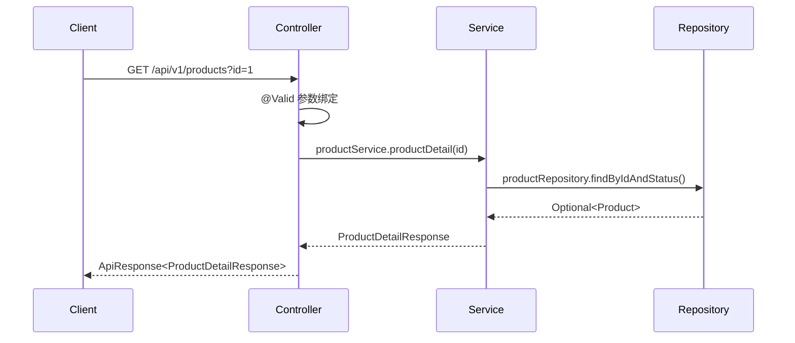
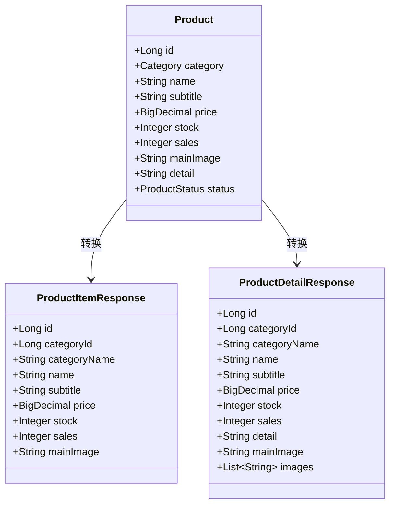
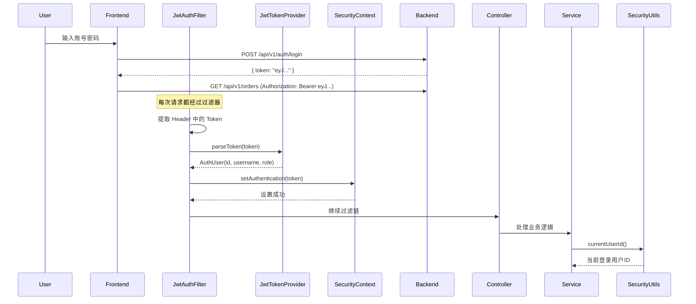

本文档详细阐述 EcoLink 后端服务基于 Spring Boot 3.3.5 构建的**标准四层架构**（Controller → Service → Repository → Domain），以及安全认证、数据传输、统一响应等横切关注点的实现模式。该架构遵循**关注点分离**原则，确保业务逻辑与基础设施解耦，同时通过 Spring Security + JWT 实现无状态认证。

## 整体架构概览

```mermaid
flowchart TB
    subgraph Client["客户端层"]
        Browser["浏览器 / 前端应用"]
    end
    
    subgraph Gateway["安全层"]
        SecurityConfig["SecurityConfig<br/>CORS 配置"]
        JwtAuthFilter["JwtAuthFilter<br/>JWT 认证过滤器"]
    end
    
    subgraph Controller["表现层 Controller"]
        PublicAPI["公开 API<br/>/api/v1/auth/**<br/>/api/v1/products/**"]
        AdminAPI["管理 API<br/>/api/v1/admin/**"]
    end
    
    subgraph Service["业务逻辑层 Service"]
        AuthService["AuthService"]
        ProductService["ProductService"]
        OrderService["OrderService"]
        CartService["CartService"]
    end
    
    subgraph Repository["数据访问层 Repository"]
        JPA["Spring Data JPA<br/>JpaRepository + Specification"]
    end
    
    subgraph Domain["领域模型层 Domain"]
        Entity["Entity 实体"]
        BaseEntity["BaseEntity<br/>时间戳抽象基类"]
        Enum["枚举类<br/>OrderStatus/ProductStatus"]
    end
    
    subgraph Infrastructure["基础设施层"]
        DB[(["MySQL 数据库"])]
        Flyway["Flyway 迁移"]
    end
    
    Client -->|HTTPS| SecurityConfig
    SecurityConfig --> JwtAuthFilter
    JwtAuthFilter --> PublicAPI
    JwtAuthFilter --> AdminAPI
    PublicAPI --> ProductService
    PublicAPI --> AuthService
    PublicAPI --> OrderService
    AdminAPI --> ProductService
    AdminAPI --> OrderService
    ProductService --> ProductRepository
    AuthService --> UserRepository
    OrderService --> OrderRepository
    ProductRepository --> JPA
    JPA --> Entity
    Entity --> BaseEntity
    BaseEntity --> DB
```

Sources: [server/src/main/java/com/ecolink/server/EcoLinkServerApplication.java](server/src/main/java/com/ecolink/server/EcoLinkServerApplication.java#L1-L15)
[server/src/main/java/com/ecolink/server/config/SecurityConfig.java](server/src/main/java/com/ecolink/server/config/SecurityConfig.java#L1-L79)

## 依赖技术栈

| 组件 | 技术选型 | 版本 | 职责 |
|------|---------|------|------|
| 核心框架 | Spring Boot | 3.3.5 | 应用框架 |
| Web 层 | Spring MVC | 内嵌 | RESTful API |
| 安全框架 | Spring Security | 6.x | 认证授权 |
| 数据访问 | Spring Data JPA | 3.x | ORM 映射 |
| 数据库 | MySQL Connector/J | runtime | JDBC 驱动 |
| 数据库迁移 | Flyway | 9.x | 版本化迁移 |
| JWT 库 | jjwt | 0.12.6 | Token 生成解析 |
| 验证框架 | Hibernate Validator | 内嵌 | 参数校验 |
| API 文档 | springdoc-openapi | 2.6.0 | Swagger UI |
| 工具库 | Lombok | optional | 简化代码 |

Sources: [server/pom.xml](server/pom.xml#L1-L100)

## 分层职责详解

### 1. Controller 层 — 请求入口

Controller 层作为**展现层**，仅负责接收 HTTP 请求、调用 Service 层处理业务、封装响应数据。该层**不包含任何业务逻辑**，遵循"瘦 Controller"原则。

**职责边界**：
- 参数绑定与基本校验（通过 `@Valid` 触发 Jakarta Validation）
- 路由映射与 HTTP 方法分发
- 调用 Service 层并捕获业务异常
- 统一响应格式包装（`ApiResponse<T>`）



**典型实现模式**：

```java
@RestController
@RequestMapping("/api/v1")
public class ProductController {
    private final ProductService productService;

    // 构造器注入（强制依赖不可变）
    public ProductController(ProductService productService) {
        this.productService = productService;
    }

    @GetMapping("/products/{id}")
    public ApiResponse<ProductDetailResponse> detail(@PathVariable Long id) {
        return ApiResponse.ok(productService.productDetail(id));
    }
}
```

Sources: [server/src/main/java/com/ecolink/server/controller/ProductController.java](server/src/main/java/com/ecolink/server/controller/ProductController.java#L1-L50)
[server/src/main/java/com/ecolink/server/controller/OrderController.java](server/src/main/java/com/ecolink/server/controller/OrderController.java#L1-L41)

**API 分组策略**：

| 路径前缀 | 访问控制 | 用途 |
|---------|---------|------|
| `/api/v1/auth/**` | 公开 | 登录/注册 |
| `/api/v1/products/**` | 公开 | 商品浏览 |
| `/api/v1/categories/**` | 公开 | 分类查询 |
| `/api/v1/orders/**` | 需登录 | 用户订单 |
| `/api/v1/admin/**` | 需 ADMIN 角色 | 后台管理 |

Sources: [server/src/main/java/com/ecolink/server/config/SecurityConfig.java](server/src/main/java/com/ecolink/server/config/SecurityConfig.java#L40-L52)

### 2. Service 层 — 业务逻辑核心

Service 层是**业务逻辑的核心承载层**，包含所有业务规则处理、事务边界定义、数据转换逻辑。该层通过 `@Service` 注解标识，采用构造器注入依赖。

**职责边界**：
- 业务规则校验与状态流转
- 多 Repository 协调操作
- 事务管理（`@Transactional`）
- 领域模型与 DTO 双向转换
- 异常抛出（`BizException`）

**事务配置策略**：

```java
@Service
@Transactional(readOnly = true)  // 默认只读事务
public class ProductService {
    // 查询方法继承只读事务配置
    
    @Transactional  // 写操作覆盖默认配置
    public ProductDetailResponse productDetail(Long id) {
        // 复杂查询逻辑
    }
}
```

Sources: [server/src/main/java/com/ecolink/server/service/ProductService.java](server/src/main/java/com/ecolink/server/service/ProductService.java#L1-L123)
[server/src/main/java/com/ecolink/server/service/OrderService.java](server/src/main/java/com/ecolink/server/service/OrderService.java#L1-L178)

**复杂业务场景示例（OrderService）**：

订单创建涉及多表操作，必须保证原子性：

```java
@Transactional
public OrderResponse createOrder(CreateOrderRequest request) {
    // 1. 验证收货地址归属
    Address address = addressService.findByIdForCurrentUser(request.addressId());
    
    // 2. 验证购物车商品
    List<CartItem> cartItems = cartService.findItemsForCurrentUser(request.cartItemIds());
    
    // 3. 计算总价并验证库存
    BigDecimal total = BigDecimal.ZERO;
    for (CartItem ci : cartItems) {
        if (ci.getQuantity() > ci.getProduct().getStock()) {
            throw new BizException(4005, "商品库存不足");
        }
        total = total.add(ci.getProduct().getPrice().multiply(...));
    }
    
    // 4. 创建订单
    Order order = new Order();
    order.setUser(authService.getCurrentUserEntity());
    order.setOrderNo(generateOrderNo());
    orderRepository.save(order);
    
    // 5. 创建订单项并扣减库存
    for (CartItem ci : cartItems) {
        OrderItem item = new OrderItem();
        // ... 保存订单项
        ci.getProduct().setStock(ci.getProduct().getStock() - ci.getQuantity());
    }
    
    // 6. 清理购物车
    cartService.removeItems(cartItems);
    
    return toResponse(order, items);
}
```

Sources: [server/src/main/java/com/ecolink/server/service/OrderService.java](server/src/main/java/com/ecolink/server/service/OrderService.java#L21-L65)

**定时任务自动流转**：

```java
@Service
public class OrderService {
    @Transactional
    @Scheduled(fixedDelay = 5000)  // 每 5 秒执行
    public void autoFlow() {
        // PAID → SHIPPED：支付后 5 秒自动发货
        List<Order> paidOrders = orderRepository.findByStatusAndPaidAtBefore(
            OrderStatus.PAID, now.minusSeconds(5));
        
        // SHIPPED → COMPLETED：发货后 5 秒自动完成
        List<Order> shippedOrders = orderRepository.findByStatusAndShippedAtBefore(
            OrderStatus.SHIPPED, now.minusSeconds(5));
    }
}
```

Sources: [server/src/main/java/com/ecolink/server/service/OrderService.java](server/src/main/java/com/ecolink/server/service/OrderService.java#L87-L104)
[server/src/main/java/com/ecolink/server/EcoLinkServerApplication.java](server/src/main/java/com/ecolink/server/EcoLinkServerApplication.java#L7)

### 3. Repository 层 — 数据访问抽象

Repository 层基于 **Spring Data JPA** 构建，提供标准 CRUD 操作及自定义查询方法。该层是**数据访问的唯一入口**，Service 层不应直接操作 EntityManager。

**核心接口模式**：

```java
public interface ProductRepository extends JpaRepository<Product, Long>, 
                                          JpaSpecificationExecutor<Product> {
    // 方法名派生查询
    Optional<Product> findByIdAndStatus(Long id, ProductStatus status);
    Page<Product> findByCategoryId(Long categoryId, Pageable pageable);
    
    // 自定义聚合查询
    long countByStatus(ProductStatus status);
    long countByStockLessThanEqual(Integer stock);
    
    // 排序查询
    List<Product> findTop5ByOrderBySalesDescIdDesc();
}
```

Sources: [server/src/main/java/com/ecolink/server/repository/ProductRepository.java](server/src/main/java/com/ecolink/server/repository/ProductRepository.java#L1-L22)
[server/src/main/java/com/ecolink/server/repository/OrderRepository.java](server/src/main/java/com/ecolink/server/repository/OrderRepository.java#L1-L24)

**动态查询 Specification 模式**：

当查询条件不确定时，使用 `JpaSpecificationExecutor` 构建动态查询：

```java
Specification<Product> spec = (root, query, cb) -> {
    List<Predicate> predicates = new ArrayList<>();
    
    // 固定条件：只查询上架商品
    predicates.add(cb.equal(root.get("status"), ProductStatus.ON_SALE));
    
    // 可选条件：关键词搜索
    if (keyword != null && !keyword.isBlank()) {
        predicates.add(cb.or(
            cb.like(root.get("name"), "%" + keyword + "%"),
            cb.like(root.get("subtitle"), "%" + keyword + "%")
        ));
    }
    
    // 范围条件：价格区间
    if (minPrice != null) {
        predicates.add(cb.greaterThanOrEqualTo(root.get("price"), minPrice));
    }
    
    return cb.and(predicates.toArray(new Predicate[0]));
};

Page<Product> result = productRepository.findAll(spec, PageRequest.of(page, size, sortObj));
```

Sources: [server/src/main/java/com/ecolink/server/service/ProductService.java](server/src/main/java/com/ecolink/server/service/ProductService.java#L34-L61)

### 4. Domain 层 — 领域模型

Domain 层包含所有 JPA 实体类，映射数据库表结构。采用 **Lombok** 简化 Getter/Setter，通过 `@MappedSuperclass` 提取公共字段。

**基类设计**：

```java
@MappedSuperclass
public abstract class BaseEntity {
    @Column(name = "created_at", nullable = false)
    private LocalDateTime createdAt;

    @Column(name = "updated_at", nullable = false)
    private LocalDateTime updatedAt;

    @PrePersist
    public void onCreate() {
        LocalDateTime now = LocalDateTime.now();
        this.createdAt = now;
        this.updatedAt = now;
    }

    @PreUpdate
    public void onUpdate() {
        this.updatedAt = LocalDateTime.now();
    }
}
```

Sources: [server/src/main/java/com/ecolink/server/domain/BaseEntity.java](server/src/main/java/com/ecolink/server/domain/BaseEntity.java#L1-L34)

**实体关联模式**：

```java
@Getter
@Setter
@Entity
@Table(name = "products")
public class Product extends BaseEntity {
    @Id
    @GeneratedValue(strategy = GenerationType.IDENTITY)
    private Long id;

    @ManyToOne(fetch = FetchType.LAZY)
    @JoinColumn(name = "category_id", nullable = false)
    private Category category;

    @Enumerated(EnumType.STRING)
    @Column(nullable = false, length = 20)
    private ProductStatus status = ProductStatus.ON_SALE;
}
```

Sources: [server/src/main/java/com/ecolink/server/domain/Product.java](server/src/main/java/com/ecolink/server/domain/Product.java#L1-L46)

## 横切关注点

### DTO 数据传输对象

使用 **Java Record** 定义不可变 DTO，分离内部实体与外部接口，避免直接暴露 Entity。



Sources: [server/src/main/java/com/ecolink/server/dto/product/ProductItemResponse.java](server/src/main/java/com/ecolink/server/dto/product/ProductItemResponse.java#L1-L16)
[server/src/main/java/com/ecolink/server/dto/auth/LoginRequest.java](server/src/main/java/com/ecolink/server/dto/auth/LoginRequest.java#L1-L11)

### 统一响应格式

所有 API 响应使用 `ApiResponse<T>` 统一封装：

```java
public record ApiResponse<T>(
        int code,           // 状态码：0=成功，非0=失败
        String message,     // 消息描述
        T data,             // 响应数据
        LocalDateTime timestamp  // 时间戳
) {
    public static <T> ApiResponse<T> ok(T data) {
        return new ApiResponse<>(0, "OK", data, LocalDateTime.now());
    }

    public static ApiResponse<Void> fail(int code, String message) {
        return new ApiResponse<>(code, message, null, null);
    }
}
```

Sources: [server/src/main/java/com/ecolink/server/common/ApiResponse.java](server/src/main/java/com/ecolink/server/common/ApiResponse.java#L1-L27)

**响应码规范**：

| 区间 | 含义 |
|------|------|
| 0 | 成功 |
| 4001 | 参数校验失败 |
| 4002-4009 | 业务校验异常 |
| 4010 | 未认证/登录失效 |
| 4040-4049 | 资源不存在 |
| 5000 | 服务器内部错误 |

Sources: [server/src/main/java/com/ecolink/server/exception/GlobalExceptionHandler.java](server/src/main/java/com/ecolink/server/exception/GlobalExceptionHandler.java#L1-L41)

### 统一异常处理

```java
@RestControllerAdvice
public class GlobalExceptionHandler {

    @ExceptionHandler(BizException.class)
    public ApiResponse<Void> handleBiz(BizException ex) {
        return ApiResponse.fail(ex.getCode(), ex.getMessage());
    }

    @ExceptionHandler(MethodArgumentNotValidException.class)
    public ApiResponse<Void> handleValidation(MethodArgumentNotValidException ex) {
        FieldError fieldError = ex.getBindingResult().getFieldErrors().stream().findFirst().orElse(null);
        String msg = fieldError == null ? "参数校验失败" : fieldError.getDefaultMessage();
        return ApiResponse.fail(4001, msg);
    }

    @ExceptionHandler(Exception.class)
    public ApiResponse<Void> handleUnexpected(Exception ex) {
        return ApiResponse.fail(5000, "服务器内部错误");
    }
}
```

Sources: [server/src/main/java/com/ecolink/server/exception/BizException.java](server/src/main/java/com/ecolink/server/exception/BizException.java#L1-L15)
[server/src/main/java/com/ecolink/server/exception/GlobalExceptionHandler.java](server/src/main/java/com/ecolink/server/exception/GlobalExceptionHandler.java#L1-L41)

### JWT 认证流程



Sources: [server/src/main/java/com/ecolink/server/security/JwtAuthFilter.java](server/src/main/java/com/ecolink/server/security/JwtAuthFilter.java#L1-L54)
[server/src/main/java/com/ecolink/server/security/JwtTokenProvider.java](server/src/main/java/com/ecolink/server/security/JwtTokenProvider.java#L1-L54)
[server/src/main/java/com/ecolink/server/security/SecurityUtils.java](server/src/main/java/com/ecolink/server/security/SecurityUtils.java#L1-L19)

**Token 生成与解析**：

```java
@Component
public class JwtTokenProvider {
    public String generateToken(Long userId, String username, String role) {
        Instant now = Instant.now();
        Instant exp = now.plus(jwtProperties.getExpireHours(), ChronoUnit.HOURS);
        return Jwts.builder()
                .issuer(jwtProperties.getIssuer())
                .subject(String.valueOf(userId))
                .claim("username", username)
                .claim("role", role)
                .issuedAt(Date.from(now))
                .expiration(Date.from(exp))
                .signWith(secretKey())
                .compact();
    }

    public AuthUser parseToken(String token) {
        Claims claims = Jwts.parser().verifyWith(secretKey()).build()
                .parseSignedClaims(token).getPayload();
        return new AuthUser(Long.parseLong(claims.getSubject()), 
                           claims.get("username", String.class),
                           claims.get("role", String.class));
    }
}
```

Sources: [server/src/main/java/com/ecolink/server/security/JwtTokenProvider.java](server/src/main/java/com/ecolink/server/security/JwtTokenProvider.java#L15-L40)

### 安全配置策略

```java
@Configuration
public class SecurityConfig {
    @Bean
    public SecurityFilterChain securityFilterChain(HttpSecurity http) throws Exception {
        http.csrf(AbstractHttpConfigurer::disable)           // 禁用 CSRF（前后端分离）
            .cors(Customizer.withDefaults())                  // 启用 CORS
            .sessionManagement(session -> session
                .sessionCreationPolicy(SessionCreationPolicy.STATELESS))  // 无状态会话
            .authorizeHttpRequests(auth -> auth
                .requestMatchers("/api/v1/auth/**", "/api/v1/products/**").permitAll()
                .requestMatchers("/api/v1/admin/**").hasRole("ADMIN")
                .anyRequest().authenticated()
            )
            .addFilterBefore(jwtAuthFilter, UsernamePasswordAuthenticationFilter.class);
        return http.build();
    }
}
```

Sources: [server/src/main/java/com/ecolink/server/config/SecurityConfig.java](server/src/main/java/com/ecolink/server/config/SecurityConfig.java#L27-L55)

## 包结构规范

```
com.ecolink.server
├── EcoLinkServerApplication.java    # 启动入口
├── common                            # 公共组件
│   ├── ApiResponse.java              # 统一响应封装
│   └── PageResult.java               # 分页结果封装
├── config                            # 配置类
│   └── SecurityConfig.java           # 安全配置
├── controller                        # 控制器层
│   ├── AuthController.java          # 认证接口
│   ├── ProductController.java       # 商品接口
│   ├── OrderController.java          # 订单接口
│   └── admin/                         # 管理后台控制器
│       ├── AdminDashboardController.java
│       ├── AdminProductController.java
│       ├── AdminOrderController.java
│       └── AdminCategoryController.java
├── service                           # 业务逻辑层
│   ├── AuthService.java
│   ├── ProductService.java
│   ├── OrderService.java
│   ├── CartService.java
│   ├── AddressService.java
│   └── FavoriteService.java
├── repository                        # 数据访问层
│   ├── ProductRepository.java
│   ├── UserRepository.java
│   ├── OrderRepository.java
│   └── ...
├── domain                            # 领域模型
│   ├── BaseEntity.java               # 抽象基类
│   ├── Product.java
│   ├── User.java
│   ├── Order.java
│   ├── OrderItem.java
│   └── enums/
│       ├── OrderStatus.java
│       └── ProductStatus.java
├── dto                               # 数据传输对象
│   ├── auth/
│   ├── product/
│   └── order/
├── security                          # 安全认证
│   ├── JwtTokenProvider.java
│   ├── JwtAuthFilter.java
│   ├── SecurityUtils.java
│   └── AuthUser.java
└── exception                         # 异常处理
    ├── BizException.java
    └── GlobalExceptionHandler.java
```

Sources: [server/src/main/java/com/ecolink/server/controller/admin/AdminDashboardController.java](server/src/main/java/com/ecolink/server/controller/admin/AdminDashboardController.java#L1-L88)
[server/src/main/java/com/ecolink/server/controller/admin/AdminOrderController.java](server/src/main/java/com/ecolink/server/controller/admin/AdminOrderController.java#L1-L113)

## 关键设计决策

### 1. 构造器注入优先

所有 Service 和 Controller 采用**构造器注入**而非 `@Autowired` 字段注入：

```java
// 推荐方式
public class ProductService {
    private final ProductRepository productRepository;
    
    public ProductService(ProductRepository productRepository) {
        this.productRepository = productRepository;
    }
}

// 不推荐
@Autowired
private ProductRepository productRepository;
```

**优势**：依赖关系在编译期确定，便于单元测试，无法绕开依赖注入。

### 2. 读写分离事务策略

Service 层默认配置 `@Transactional(readOnly = true)`，仅在写操作方法上显式标注 `@Transactional`：

```java
@Service
@Transactional(readOnly = true)
public class ProductService {
    // 查询方法 - 只读
    public PageResult<ProductItemResponse> listProducts(...) { }
    
    // 写操作 - 覆盖默认
    @Transactional
    public void updateStock(Long productId, Integer quantity) { }
}
```

### 3. 延迟加载配置

Entity 关联默认使用 `FetchType.LAZY`，避免 N+1 查询问题：

```java
@ManyToOne(fetch = FetchType.LAZY)
@JoinColumn(name = "category_id")
private Category category;
```

同时在 `application.yml` 中禁用 Open-in-view 模式，防止懒加载异常：

```yaml
spring:
  jpa:
    open-in-view: false
```

Sources: [server/src/main/resources/application.yml](server/src/main/resources/application.yml#L10-L12)

### 4. 枚举存储策略

所有枚举字段使用 `@Enumerated(EnumType.STRING)` 存储枚举名称而非序号：

```java
@Enumerated(EnumType.STRING)
@Column(nullable = false, length = 20)
private ProductStatus status = ProductStatus.ON_SALE;
```

**优势**：数据库可读性强，版本迁移安全，无需重建数据。

## 进阶阅读

- **[Spring Data JPA 数据持久化](9-spring-data-jpa-shu-ju-chi-jiu-hua)** — Repository 查询方法详解与 Specification 高级用法
- **[JWT 认证与 Token 生成解析](10-jwt-ren-zheng-yu-token-sheng-cheng-jie-xi)** — Token 安全机制与刷新策略
- **[Spring Security 权限配置](18-spring-security-quan-xian-pei-zhi)** — 细粒度权限控制与 OAuth2 扩展
- **[RESTful API 设计规范](17-restful-api-she-ji-gui-fan)** — 接口设计原则与版本管理