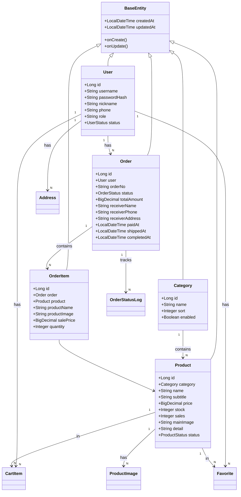

本文档详细阐述 EcoLink 后端系统中 Spring Data JPA 的数据持久化实现架构，涵盖实体建模、Repository 层设计、查询方法规范以及事务管理策略。该模块是[后端分层架构设计](8-hou-duan-fen-ceng-jia-gou-she-ji)的关键组成部分，为业务逻辑层提供统一的数据访问抽象。

## 1. 领域模型架构

EcoLink 系统采用标准的 JPA 实体设计模式，所有业务实体均继承自 `BaseEntity` 抽象类。该基类通过 `@MappedSuperclass` 注解实现字段映射继承，为所有实体注入 `createdAt` 和 `updatedAt` 两个审计字段，配合 `@PrePersist` 和 `@PreUpdate` 生命周期回调自动维护时间戳。



实体类统一使用 Lombok 注解 (`@Getter`, `@Setter`) 简化样板代码，主键生成策略采用 `GenerationType.IDENTITY` 以兼容 MySQL 的 AUTO_INCREMENT 特性。

Sources: [BaseEntity.java](server/src/main/java/com/ecolink/server/domain/BaseEntity.java#L1-L34), [User.java](server/src/main/java/com/ecolink/server/domain/User.java#L1-L36), [Product.java](server/src/main/java/com/ecolink/server/domain/Product.java#L1-L46), [Order.java](server/src/main/java/com/ecolink/server/domain/Order.java#L1-L52)

## 2. 实体关系映射规范

### 2.1 关联关系配置

系统严格遵循以下关联关系设计规范：

| 关联类型 | 抓取策略 | 使用场景 |
|---------|---------|---------|
| `@ManyToOne` | `FetchType.LAZY` | 所有多对一关系，避免 N+1 查询问题 |
| `@Enumerated(EnumType.STRING)` | — | 枚举字段存储为字符串而非序号 |

在 `Product` 实体中可以看到典型的多对一关联配置：商品必须关联一个分类，通过 `category_id` 外键建立关系。由于设置了懒加载，访问 `product.getCategory()` 时才会触发额外查询。

```java
@ManyToOne(fetch = FetchType.LAZY)
@JoinColumn(name = "category_id", nullable = false)
private Category category;
```

对于需要保证数据唯一性的场景（如用户不能重复收藏同一商品），使用 `@Table` 的 `uniqueConstraints` 定义联合唯一约束：

```java
@Table(name = "cart_items", uniqueConstraints = {
        @UniqueConstraint(columnNames = {"user_id", "product_id"})
})
public class CartItem extends BaseEntity { ... }
```

Sources: [Product.java](server/src/main/java/com/ecolink/server/domain/Product.java#L17-L19), [CartItem.java](server/src/main/java/com/ecolink/server/domain/CartItem.java#L10-L12), [Favorite.java](server/src/main/java/com/ecolink/server/domain/Favorite.java#L10-L12)

### 2.2 枚举类型映射

系统定义了三个业务枚举类，均采用 `@Enumerated(EnumType.STRING)` 将枚举值存储为数据库字符串：

```java
// OrderStatus 订单状态流转
public enum OrderStatus {
    UNPAID,    // 待支付
    PAID,      // 已支付
    SHIPPED,   // 已发货
    COMPLETED, // 已完成
    CANCELLED  // 已取消
}

// ProductStatus 商品上下架
public enum ProductStatus {
    ON_SALE,   // 上架
    OFF_SALE   // 下架
}

// UserStatus 用户账号状态
public enum UserStatus {
    ACTIVE,    // 正常
    DISABLED   // 禁用
}
```

这种设计使得数据库中的枚举值具有可读性，便于直接查询和调试，同时也支持未来枚举值的扩展而无需修改数据库结构。

Sources: [OrderStatus.java](server/src/main/java/com/ecolink/server/domain/enums/OrderStatus.java#L1-L10), [ProductStatus.java](server/src/main/java/com/ecolink/server/domain/enums/ProductStatus.java#L1-L7), [UserStatus.java](server/src/main/java/com/ecolink/server/domain/enums/UserStatus.java#L1-L7)

## 3. Repository 层设计

### 3.1 Repository 接口层次

系统为每个实体创建专属的 Repository 接口，继承 Spring Data JPA 的 `JpaRepository` 以获得标准 CRUD 操作。`ProductRepository` 还实现了 `JpaSpecificationExecutor<Product>` 接口以支持动态查询构建。

```java
public interface ProductRepository extends JpaRepository<Product, Long>, JpaSpecificationExecutor<Product> { }
```

这种接口组合的设计使得 `ProductRepository` 同时具备：
- **JpaRepository**：基础增删改查、分页、排序
- **JpaSpecificationExecutor**：支持 `Specification` 动态查询

### 3.2 方法命名查询规范

Repository 中大量使用 Spring Data JPA 的方法命名解析机制，通过方法名自动生成查询：

| 方法命名模式 | 示例 | 生成 SQL 片段 |
|------------|------|-------------|
| `findBy` + 属性 | `findByUsername(String)` | `WHERE username = ?` |
| `findBy` + 属性 + `Containing` | `findByNameContaining(String)` | `WHERE name LIKE '%?%'` |
| `findBy` + 多属性 + `Or` | `findByStatusAndPaidAtBefore(...)` | `WHERE status = ? AND paid_at < ?` |
| `countBy` + 属性 | `countByStatus(OrderStatus)` | `SELECT COUNT(*) WHERE status = ?` |
| `existsBy` + 属性 | `existsByUsername(String)` | `SELECT CASE WHEN COUNT(*) > 0 THEN true` |
| `deleteBy` + 属性 | `deleteByUserIdAndProductId(...)` | `DELETE WHERE user_id = ? AND product_id = ?` |

```java
// 基础查询方法
Optional<User> findByUsername(String username);
boolean existsByUsername(String username);

// 分页查询
Page<Product> findByNameContaining(String name, Pageable pageable);
Page<Product> findByCategoryId(Long categoryId, Pageable pageable);

// 条件计数
long countByStatus(ProductStatus status);
long countByStockLessThanEqual(Integer stock);

// 组合条件查询
Page<Order> findByOrderNoContainingAndStatus(String orderNo, OrderStatus status, Pageable pageable);

// 排序取前 N 条
List<Product> findTop5ByOrderBySalesDescIdDesc();
List<Order> findTop5ByOrderByCreatedAtDescIdDesc();
```

Sources: [ProductRepository.java](server/src/main/java/com/ecolink/server/repository/ProductRepository.java#L1-L22), [OrderRepository.java](server/src/main/java/com/ecolink/server/repository/OrderRepository.java#L1-L24), [UserRepository.java](server/src/main/java/com/ecolink/server/repository/UserRepository.java#L1-L12), [FavoriteRepository.java](server/src/main/java/com/ecolink/server/repository/FavoriteRepository.java#L1-L15)

### 3.3 JpaSpecification 动态查询

对于需要组合多个条件的动态查询场景，系统使用 JPA Criteria API 的 `Specification` 接口。以下是 `ProductService.listProducts()` 方法中构建商品过滤查询的完整实现：

```java
public PageResult<ProductItemResponse> listProducts(String keyword, Long categoryId, 
        BigDecimal minPrice, BigDecimal maxPrice, String sort, int page, int size) {
    
    Sort sortObj = Objects.requireNonNull(buildSort(sort));
    
    // 使用 Specification 构建动态查询条件
    Specification<Product> spec = (root, query, cb) -> {
        List<Predicate> predicates = new ArrayList<>();
        
        // 必须条件：商品必须处于上架状态
        predicates.add(cb.equal(root.get("status"), ProductStatus.ON_SALE));
        
        // 可选条件：关键词模糊匹配（商品名或副标题）
        if (keyword != null && !keyword.isBlank()) {
            String like = "%" + keyword.trim() + "%";
            predicates.add(cb.or(
                    cb.like(root.get("name"), like),
                    cb.like(root.get("subtitle"), like)
            ));
        }
        
        // 可选条件：分类筛选
        if (categoryId != null) {
            predicates.add(cb.equal(root.get("category").get("id"), categoryId));
        }
        
        // 可选条件：价格区间
        if (minPrice != null) {
            predicates.add(cb.greaterThanOrEqualTo(root.get("price"), minPrice));
        }
        if (maxPrice != null) {
            predicates.add(cb.lessThanOrEqualTo(root.get("price"), maxPrice));
        }
        
        return cb.and(predicates.toArray(new Predicate[0]));
    };
    
    Page<Product> result = productRepository.findAll(spec, 
            PageRequest.of(Math.max(page, 1) - 1, Math.max(size, 1), sortObj));
    
    return new PageResult<>(list, page, size, result.getTotalElements());
}
```

在后台管理端 `AdminProductController` 中也采用了相同的 `Specification` 模式来支持商品列表的多条件筛选：

```java
Specification<Product> specification = (root, query, cb) -> {
    var predicates = new ArrayList<Predicate>();
    if (keyword != null && !keyword.isBlank()) {
        predicates.add(cb.like(root.get("name"), "%" + keyword.trim() + "%"));
    }
    if (categoryId != null) {
        predicates.add(cb.equal(root.get("category").get("id"), categoryId));
    }
    if (status != null && !status.isBlank()) {
        predicates.add(cb.equal(root.get("status"), ProductStatus.valueOf(status)));
    }
    return cb.and(predicates.toArray(new Predicate[0]));
};
```

Sources: [ProductService.java](server/src/main/java/com/ecolink/server/service/ProductService.java#L45-L71), [AdminProductController.java](server/src/main/java/com/ecolink/server/controller/admin/AdminProductController.java#L47-L59)

## 4. JPA 配置与集成

### 4.1 配置文件解析

`application.yml` 中配置了 JPA 相关参数，采用了环境变量优先的配置策略：

```yaml
spring:
  datasource:
    url: ${DB_URL:jdbc:mysql://localhost:3306/ecolink?useUnicode=true&characterEncoding=utf8&serverTimezone=Asia/Shanghai}
    username: ${DB_USERNAME:root}
    password: ${DB_PASSWORD:root}
  jpa:
    open-in-view: false                          # 禁用 OSIV，避免懒加载异常延迟到视图层
    hibernate:
      ddl-auto: validate                        # 仅验证 schema，不自动创建/更新表
    properties:
      hibernate:
        format_sql: true                         # 格式化输出 SQL，便于调试
```

关键配置项说明：

| 配置项 | 值 | 说明 |
|-------|-----|------|
| `jpa.open-in-view` | `false` | 禁用 Open Session In View 模式，防止懒加载异常在 Controller 层被吞掉 |
| `hibernate.ddl-auto` | `validate` | 仅验证实体与数据库表结构是否匹配，实际表管理由 Flyway 负责 |
| `flyway.enabled` | `true` | 启用 Flyway 数据库迁移管理 |

Sources: [application.yml](server/src/main/resources/application.yml#L1-L36)

### 4.2 Flyway 迁移集成

系统使用 Flyway 管理数据库版本化迁移，SQL 脚本存放于 `resources/db/migration/` 目录。`ddl-auto: validate` 确保 Hibernate 不会覆盖 Flyway 创建的表结构。

```sql
-- V1__schema.sql 示例片段
CREATE TABLE orders (
    id BIGINT PRIMARY KEY AUTO_INCREMENT,
    user_id BIGINT NOT NULL,
    order_no VARCHAR(40) NOT NULL UNIQUE,
    status VARCHAR(20) NOT NULL,
    total_amount DECIMAL(10,2) NOT NULL,
    receiver_name VARCHAR(50) NOT NULL,
    receiver_phone VARCHAR(20) NOT NULL,
    receiver_address VARCHAR(500) NOT NULL,
    paid_at DATETIME,
    shipped_at DATETIME,
    completed_at DATETIME,
    created_at DATETIME NOT NULL,
    updated_at DATETIME NOT NULL,
    CONSTRAINT fk_orders_user FOREIGN KEY (user_id) REFERENCES users(id)
);

CREATE INDEX idx_orders_user_created_at ON orders(user_id, created_at);
```

这种分工模式的优势在于：
- **Hibernate 负责**：实体与表结构的语义验证
- **Flyway 负责**：精确的 DDL 执行和版本控制

Sources: [V1__schema.sql](server/src/main/resources/db/migration/V1__schema.sql#L86-L104)

### 4.3 Maven 依赖结构

`spring-boot-starter-data-jpa` 是 JPA 功能的核心依赖，它传递引入了 Hibernate 作为 JPA 实现 provider。

```xml
<dependency>
    <groupId>org.springframework.boot</groupId>
    <artifactId>spring-boot-starter-data-jpa</artifactId>
</dependency>
<dependency>
    <groupId>com.mysql</groupId>
    <artifactId>mysql-connector-j</artifactId>
    <scope>runtime</scope>
</dependency>
<dependency>
    <groupId>org.flywaydb</groupId>
    <artifactId>flyway-core</artifactId>
</dependency>
<dependency>
    <groupId>org.flywaydb</groupId>
    <artifactId>flyway-mysql</artifactId>
</dependency>
```

Sources: [pom.xml](server/src/main/java/com/ecolink/server/pom.xml#L32-L51)

## 5. 事务管理与服务层集成

### 5.1 事务边界划分

系统采用 Spring 的声明式事务管理，通过 `@Transactional` 注解在 Service 层方法上划分事务边界。事务传播遵循以下原则：

```java
@Service
@Transactional(readOnly = true)  // 类级别：默认所有方法为只读事务
public class ProductService {
    
    // 查询方法继承类级别只读配置
    public List<CategoryResponse> categories() { ... }
    
    public ProductDetailResponse productDetail(Long id) { ... }
    
    // 写操作需显式声明 readOnly = false
    @Transactional
    public void updateStock(Long productId, int delta) {
        Product product = productRepository.findById(productId);
        product.setStock(product.getStock() + delta);
        productRepository.save(product);
    }
}
```

`OrderService` 中的 `createOrder()` 方法展示了复杂业务场景下的事务管理：

```java
@Transactional
public OrderResponse createOrder(CreateOrderRequest request) {
    // 1. 验证收货地址
    Address address = addressService.findByIdForCurrentUser(request.addressId());
    
    // 2. 获取购物车商品
    List<CartItem> cartItems = cartService.findItemsForCurrentUser(request.cartItemIds());
    
    // 3. 计算订单总额（遍历商品）
    BigDecimal total = BigDecimal.ZERO;
    for (CartItem ci : cartItems) {
        // 4. 扣减库存操作在事务内完成
        ci.getProduct().setStock(ci.getProduct().getStock() - ci.getQuantity());
        ci.getProduct().setSales(ci.getProduct().getSales() + ci.getQuantity());
        total = total.add(ci.getProduct().getPrice().multiply(...));
    }
    
    // 5. 创建订单主体
    Order order = new Order();
    order.setUser(authService.getCurrentUserEntity());
    orderRepository.save(order);
    
    // 6. 创建订单明细
    for (CartItem ci : cartItems) {
        OrderItem item = new OrderItem();
        item.setOrder(order);
        orderItemRepository.save(item);
    }
    
    // 7. 记录状态变更日志
    writeStatusLog(order, null, OrderStatus.UNPAID, "订单创建");
    
    // 8. 清空已结算的购物车项
    cartService.removeItems(cartItems);
    
    return toResponse(order, ...);
}
```

整个下单流程（包括库存扣减、订单创建、状态记录、购物车清空）在一个事务内执行，任何步骤失败都会导致整体回滚，保证数据一致性。

Sources: [ProductService.java](server/src/main/java/com/ecolink/server/service/ProductService.java#L27-L122), [OrderService.java](server/src/main/java/com/ecolink/server/service/OrderService.java#L40-L83)

### 5.2 定时任务与事务

`OrderService.autoFlow()` 方法展示了定时任务与事务的结合使用，实现订单状态的自动流转：

```java
@Transactional
@Scheduled(fixedDelay = 5000)  // 每 5 秒执行一次
public void autoFlow() {
    LocalDateTime now = LocalDateTime.now();
    
    // 查找已支付超过 5 秒的订单 → 自动发货
    List<Order> paidOrders = orderRepository.findByStatusAndPaidAtBefore(
            OrderStatus.PAID, now.minusSeconds(5));
    for (Order order : paidOrders) {
        order.setStatus(OrderStatus.SHIPPED);
        order.setShippedAt(now);
        orderRepository.save(order);
        writeStatusLog(order, OrderStatus.PAID, OrderStatus.SHIPPED, "系统自动发货");
    }
    
    // 查找已发货超过 5 秒的订单 → 自动完成
    List<Order> shippedOrders = orderRepository.findByStatusAndShippedAtBefore(
            OrderStatus.SHIPPED, now.minusSeconds(5));
    for (Order order : shippedOrders) {
        order.setStatus(OrderStatus.COMPLETED);
        order.setCompletedAt(now);
        orderRepository.save(order);
        writeStatusLog(order, OrderStatus.SHIPPED, OrderStatus.COMPLETED, "系统自动完成");
    }
}
```

Sources: [OrderService.java](server/src/main/java/com/ecolink/server/service/OrderService.java#L115-L136)

## 6. 审计字段自动维护

`BaseEntity` 通过 JPA 生命周期回调实现审计字段的自动填充，无需在业务代码中手动维护 `createdAt` 和 `updatedAt`：

```java
@MappedSuperclass
public abstract class BaseEntity {
    @Column(name = "created_at", nullable = false)
    private LocalDateTime createdAt;

    @Column(name = "updated_at", nullable = false)
    private LocalDateTime updatedAt;

    @PrePersist
    public void onCreate() {
        LocalDateTime now = LocalDateTime.now();
        this.createdAt = now;
        this.updatedAt = now;
    }

    @PreUpdate
    public void onUpdate() {
        this.updatedAt = LocalDateTime.now();
    }
}
```

当调用 `productRepository.save(product)` 时：
- **新增操作**：JPA 自动触发 `@PrePersist`，设置 `createdAt` 和 `updatedAt`
- **更新操作**：JPA 自动触发 `@PreUpdate`，仅更新 `updatedAt`

这种设计确保了所有业务实体的时间审计字段被统一管理，避免遗漏。

Sources: [BaseEntity.java](server/src/main/java/com/ecolink/server/domain/BaseEntity.java#L14-L33)

## 7. 完整实体清单

系统共包含 10 个业务实体，其 Repository 接口一览：

| 实体类 | 表名 | 关联关系 | 特有 Repository 方法 |
|-------|------|---------|---------------------|
| **User** | users | 被 Order, CartItem, Favorite, Address 引用 | `findByUsername`, `existsByUsername` |
| **Category** | categories | 被 Product 引用 | `findByEnabledTrueOrderBySortAscIdAsc` |
| **Product** | products | 引用 Category，被 OrderItem, CartItem, Favorite 引用 | `findByIdAndStatus`, `findByNameContaining`, `findTop5ByOrderBySalesDescIdDesc` |
| **ProductImage** | product_images | 引用 Product | `findByProductIdOrderBySortAscIdAsc` |
| **CartItem** | cart_items | 引用 User, Product | `findByUserIdOrderByUpdatedAtDesc`, `findByIdInAndUserId` |
| **Favorite** | favorites | 引用 User, Product | `existsByUserIdAndProductId`, `deleteByUserIdAndProductId` |
| **Address** | addresses | 引用 User | `findByUserIdOrderByIsDefaultDescUpdatedAtDesc` |
| **Order** | orders | 引用 User，被 OrderItem, OrderStatusLog 引用 | `findByUserIdOrderByCreatedAtDesc`, `findByStatusAndPaidAtBefore` |
| **OrderItem** | order_items | 引用 Order, Product | `findByOrderIdOrderByIdAsc` |
| **OrderStatusLog** | order_status_logs | 引用 Order | （无自定义方法） |

Sources: [ProductImageRepository.java](server/src/main/java/com/ecolink/server/repository/ProductImageRepository.java#L1-L11), [AddressRepository.java](server/src/main/java/com/ecolink/server/repository/AddressRepository.java#L1-L14), [OrderItemRepository.java](server/src/main/java/com/ecolink/server/repository/OrderItemRepository.java#L1-L11), [OrderStatusLogRepository.java](server/src/main/java/com/ecolink/server/repository/OrderStatusLogRepository.java#L1-L7)

## 8. 进阶阅读

完成本文档后，建议继续学习以下内容：

- [JWT 认证与 Token 生成解析](10-jwt-ren-zheng-yu-token-sheng-cheng-jie-xi) — 了解与 JPA 结合的认证机制
- [数据库表结构与 ER 模型](11-shu-ju-ku-biao-jie-gou-yu-er-mo-xing) — 深入理解表设计细节
- [Spring Security 权限配置](18-spring-security-quan-xian-pei-zhi) — JPA 实体与安全框架的集成