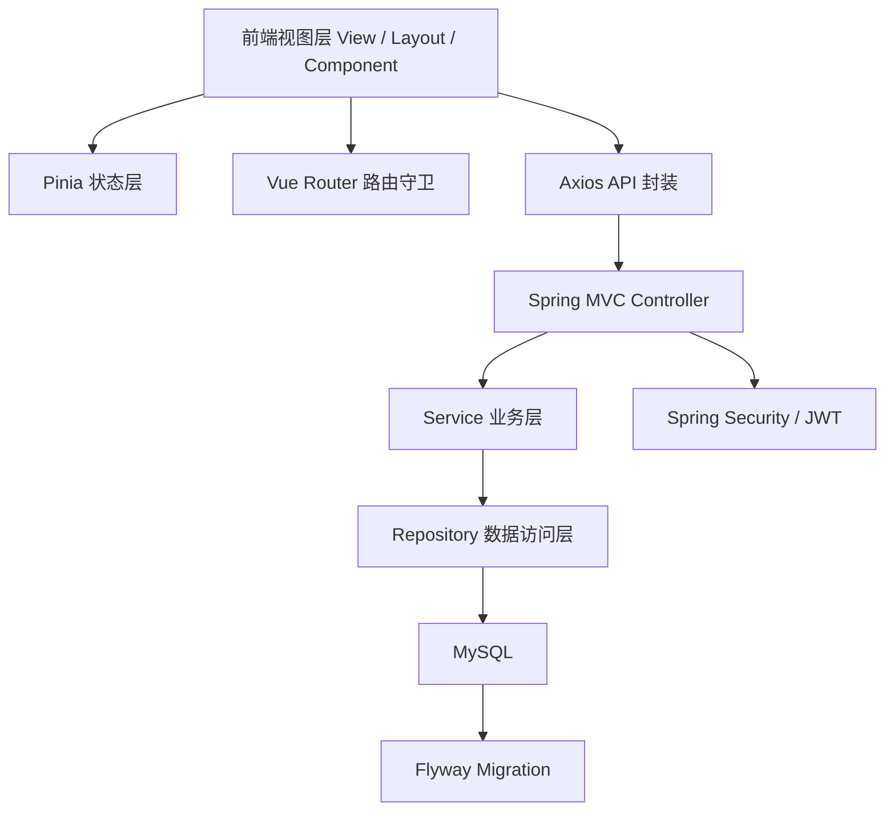

# 系统架构总览

> 文档定位：说明 EcoLink 的总体架构、模块边界与核心调用关系  
> 同步依据：前端路由、HTTP 封装、后端控制器、服务层、安全配置、数据库迁移脚本  
> 推荐用途：项目总体设计与架构说明

## 1. 架构风格

EcoLink 采用前后端分离架构。前端承担页面渲染、状态管理与用户交互；后端以 REST API 形式提供认证、商品、购物车、订单、收藏、地址和后台管理能力；数据库负责持久化业务数据；JWT 负责跨请求认证。

其架构特征如下：

- 前端与后端通过 HTTP/JSON 进行通信，接口前缀统一为 `/api/v1`
- C 端与后台端共用一套 Vue 工程，但通过不同布局与路由前缀进行隔离
- 后端采用典型的 Controller-Service-Repository 三层结构
- 数据库结构由 Flyway 管理，保证可重复迁移与环境一致性
- 安全策略采用“JWT + Spring Security + 角色控制”组合

## 2. 分层设计



### 2.1 前端层

- 使用 Vue 3 组合式 API 组织页面逻辑
- 使用 Vue Router 管理前台与后台路由
- 使用 Pinia 持久化登录态与用户信息
- 使用统一 `http.ts` 封装请求、鉴权、401 处理与 mock 回退

### 2.2 后端层

- Controller 层负责 URL 映射与请求参数绑定
- Service 层负责核心业务计算、校验与事务控制
- Repository 层依赖 Spring Data JPA 完成数据库访问
- DTO 层用于接口输入输出建模，隔离数据库实体与接口契约

### 2.3 数据层

- MySQL 负责业务数据持久化
- Flyway 负责表结构、种子数据与管理员账户初始化
- 核心实体包括用户、商品、分类、订单、订单明细、购物车、收藏、地址等

## 3. 模块划分

| 模块 | 职责 | 关键目录 |
|---|---|---|
| 前台商城模块 | 商品浏览、搜索、下单、收藏、地址、个人中心 | `src/views/*.vue` |
| 后台管理模块 | 仪表盘、商品管理、分类管理、订单管理 | `src/views/admin/` |
| 认证与权限模块 | 注册、登录、JWT 生成解析、角色判定 | `server/.../service/AuthService.java` `server/.../security/` |
| 商品模块 | 分类列表、商品检索、商品详情 | `ProductController` `ProductService` |
| 订单模块 | 创建订单、支付、自动流转 | `OrderController` `OrderService` |
| 支撑模块 | 全局异常、统一响应、数据库迁移 | `common/` `exception/` `db/migration/` |

## 4. 路由与访问边界

### 4.1 前端路由边界

```ts
// 摘录自 src/router/index.ts
{ path: '/cart', meta: { requiresAuth: true } }
{
  path: '/admin',
  meta: { requiresAuth: true, requiresAdmin: true }
}
```

可以看出：

- `/cart`、`/orders`、`/profile` 等页面要求登录
- `/admin/**` 不仅要求登录，还要求管理员角色
- 登录后若用户信息尚未拉取，路由守卫会先调用 `fetchMe()`

### 4.2 后端接口边界

```java
.requestMatchers("/api/v1/admin/**").hasRole("ADMIN")
.anyRequest().authenticated()
```

后端通过 Spring Security 再次校验管理员权限，实现“双重防护”：

- 前端负责体验层拦截
- 后端负责安全层最终判定

## 5. 关键设计特点

### 5.1 单工程双端复用

前台和后台管理都位于同一 Vue 工程中，这种做法的优点是：

- 共享认证状态、HTTP 客户端与类型定义
- 降低多工程维护成本
- 保持前台与后台接口模型一致

### 5.2 统一返回体

后端通过 `ApiResponse<T>` 统一封装返回数据，前端 `http.ts` 中对 `code` 和 `message` 做统一处理，这有助于：

- 降低页面层重复错误处理代码
- 提高接口风格一致性
- 便于后期统一接入日志或监控

### 5.3 可切换 mock 机制

前端在网络异常且开启 mock 时，会自动回落到本地 `mock.ts`。该设计适合本地开发、联调兜底和功能验证：

- 后端不可用时仍可查看完整业务流程
- 有利于前端并行开发
- 便于离线调试与功能验证

## 6. 可直接复用的架构描述

可将本系统架构总结为：

> EcoLink 采用基于 Vue 3 与 Spring Boot 的前后端分离架构，前端负责视图渲染、状态管理与权限感知，后端负责业务逻辑、数据持久化与接口安全控制，数据库迁移由 Flyway 统一管理，身份认证基于 JWT 机制完成。这种架构具有模块边界清晰、前后端解耦程度高、便于扩展与部署的特点。

## 7. 来源说明

### 代码依据

- [src/router/index.ts](/E:/HTML+CSS/EcoLink/src/router/index.ts)
- [src/api/http.ts](/E:/HTML+CSS/EcoLink/src/api/http.ts)
- [SecurityConfig.java](/E:/HTML+CSS/EcoLink/server/src/main/java/com/ecolink/server/config/SecurityConfig.java)
- [AuthService.java](/E:/HTML+CSS/EcoLink/server/src/main/java/com/ecolink/server/service/AuthService.java)
- [V1__schema.sql](/E:/HTML+CSS/EcoLink/server/src/main/resources/db/migration/V1__schema.sql)
