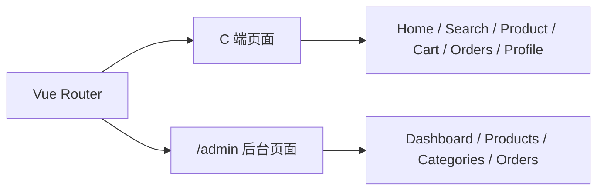
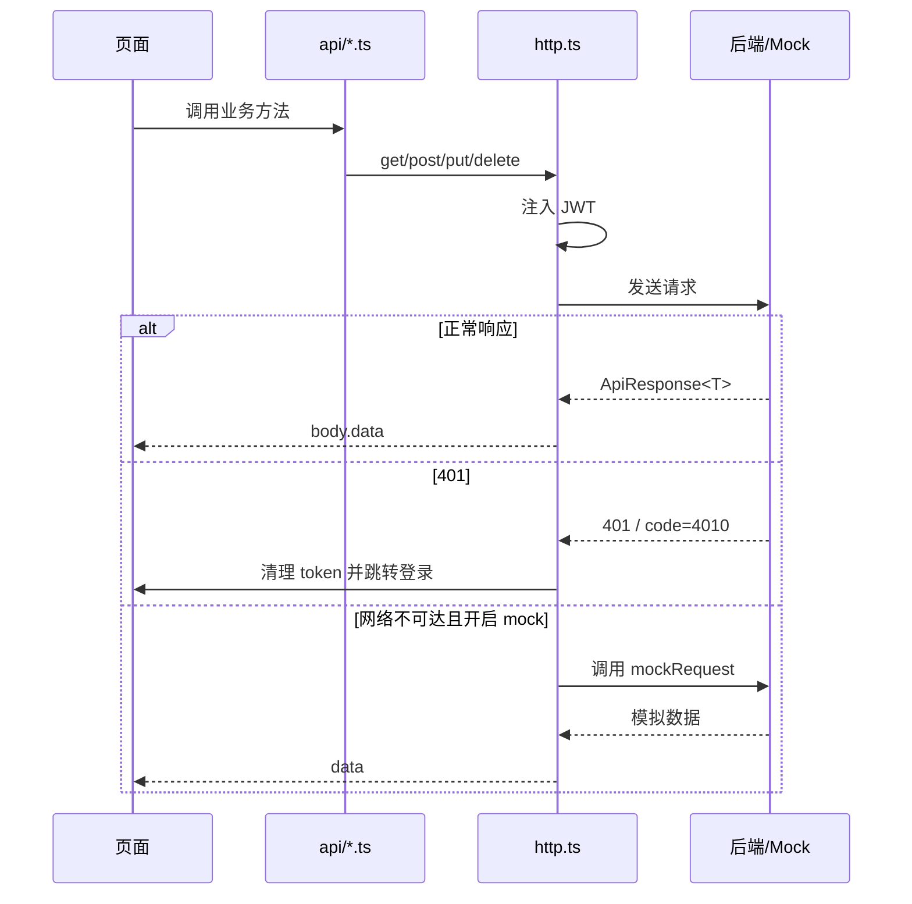
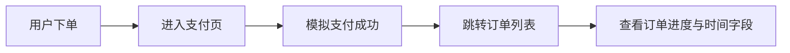

# 前端实现设计

> 文档定位：说明前端工程结构、状态管理、页面组织和请求机制  
> 同步依据：`src/` 下路由、状态、API、页面与布局代码  
> 推荐用途：前端设计与实现说明

## 1. 前端技术选型

前端采用以下技术栈：

| 技术 | 用途 |
|---|---|
| Vue 3 | 构建组件化页面 |
| TypeScript | 提高类型约束与可维护性 |
| Vite | 提供快速构建与开发服务器 |
| Vue Router | 实现路由跳转与导航守卫 |
| Pinia | 管理登录态和用户信息 |
| Axios | 封装 HTTP 请求 |
| Tailwind CSS | 构建页面样式与后台界面 |

## 2. 工程结构

```text
src
├─api/           # 接口封装、HTTP 客户端、mock
├─components/    # 公共组件
├─layouts/       # 前后台布局
├─router/        # 路由定义与守卫
├─stores/        # Pinia 状态仓库
├─types/         # 前后端共享类型
└─views/         # 页面视图（前台 + 后台）
```

该结构体现出按职责分层的设计思想：

- `views` 关注页面呈现
- `api` 关注后端通信
- `stores` 关注状态共享
- `router` 关注导航与权限
- `types` 关注接口契约约束

## 3. 路由组织方式

前端路由同时承载前台商城与后台管理两类页面：



### 3.1 前台路由

- `/` 首页
- `/search` 搜索页
- `/product/:id` 商品详情页
- `/cart` 购物车
- `/orders` 订单页
- `/payment/:id` 支付页
- `/profile` 个人中心
- `/login` 登录页
- `/register` 注册页

### 3.2 后台路由

- `/admin/dashboard`
- `/admin/products`
- `/admin/products/new`
- `/admin/products/:id/edit`
- `/admin/categories`
- `/admin/orders`

## 4. 登录态管理

Pinia 仓库 `useAuthStore` 负责管理登录态和用户信息：

```ts
const token = ref(localStorage.getItem('ecolink_token') || '');
const user = ref<UserMe | null>(null);
const isLogin = computed(() => Boolean(token.value));
const isAdmin = computed(() => user.value?.role === 'ADMIN');
```

其设计特点如下：

- Token 持久化到 `localStorage`
- 登录和注册成功后统一调用 `setSession`
- 管理员身份由 `user.role === 'ADMIN'` 计算得出
- 页面刷新后若仅有 token 无用户信息，则路由守卫自动拉取 `/users/me`

## 5. 请求封装设计

`src/api/http.ts` 是前端请求总入口。

### 5.1 核心能力

- 自动附带 `Authorization: Bearer <token>`
- 统一处理业务返回 `code`
- 统一处理 401 过期并跳转登录页
- 网络异常时可自动切换到本地 mock

### 5.2 请求生命周期



### 5.3 统一错误处理优势

- 页面层代码更简洁
- 降低重复判断接口成功与否的成本
- 更适合课程项目中多页面快速迭代

## 6. 页面组织与复用

前端已有基础映射文档：[页面-组件-接口映射](../page-component-api-mapping.md)。

从工程结构看，页面复用主要体现在：

- 公共头部与底部：`AppHeader`、`AppFooter`
- 后台统一布局：`AdminLayout`
- 类型复用：`src/types/api.ts`
- 同一商品表单兼容新增与编辑两种模式

## 7. 交互反馈与稳定性设计

为提升日常使用与功能验证过程中的稳定性，前端在“可正常使用”之外，还额外强化了统一反馈与关键流程可见性。

### 7.1 统一消息提示机制

项目新增了基于 Pinia 的全局消息仓库 `toast`，并通过 `AppToast` 组件挂载到根应用。

```ts
export const useToastStore = defineStore('toast', () => {
  const items = ref<ToastItem[]>([]);

  function success(message: string, duration?: number) {
    push('success', message, duration);
  }
});
```

该机制替代了页面零散的原生弹窗，统一承接以下高频反馈：

- 登录成功或失败
- 加入购物车成功
- 收藏成功
- 支付成功
- 后台订单状态更新成功或失败

其价值在于：

- 降低原生 `alert` 对交互节奏的打断
- 保持前台与后台提示风格一致
- 提高页面交互的现代化程度与可截图性

### 7.2 页面状态设计

当前关键页面均补充了以下状态：

| 状态 | 典型页面 | 作用 |
|---|---|---|
| `loading` | 首页、商品详情、订单页、支付页 | 防止请求期间出现空白区域 |
| `empty` | 订单列表、后台订单列表 | 明确提示当前条件下无数据 |
| `error` | 页面级 catch + toast | 将失败原因转为可视提示 |
| `success` | 支付页、购物车、后台订单管理 | 让关键动作有明确反馈 |

### 7.3 常用入口优化

围绕用户购买与管理操作，前端增加了三类显式入口：

1. 首页增加“前台用户链路 + 后台运营链路”展示卡片。
2. 登录页增加默认账号一键填充，减少角色切换时的重复输入。
3. 管理员登录态下，顶部导航和移动端菜单均显示后台入口。

## 8. 订单页与支付页可视化增强

订单与支付相关页面承载主要交易流程，因此单独进行了可视化增强。

### 8.1 支付页

- 展示购物车、确认订单、支付三段式步骤条
- 支付成功后显示成功态页面
- 支持倒计时文案与自动跳转订单页

### 8.2 订单页

- 通过状态进度条展示 `UNPAID -> PAID -> SHIPPED -> COMPLETED`
- 支持展开订单详情
- 可直接显示支付时间、发货时间、完成时间



## 9. mock 机制设计

`src/api/mock.ts` 用于在后端不可用时模拟接口行为，包含：

- 用户登录、注册、获取当前用户
- 商品、分类、购物车、收藏、地址、订单
- 后台管理接口与管理员账号

该机制的价值在于：

- 降低联调依赖
- 适合原型验证和页面截图采集
- 为接口测试提供无服务端替代路径

## 10. 类型约束与前后端字段同步

前端通过 `src/types/api.ts` 对核心接口返回进行建模，近期重点同步了订单时间字段：

- `paidAt`
- `shippedAt`
- `completedAt`
- `receiverAddress`

这类类型同步的作用包括：

- 降低页面访问未定义字段的风险
- 提高 `vue-tsc` 静态检查有效性
- 让订单详情页、支付页和后台订单管理页可共享同一组状态时间语义

## 11. 可直接复用的前端实现描述

> 前端采用 Vue 3 组合式 API 与 TypeScript 实现，使用 Vue Router 组织商城端与后台端页面，使用 Pinia 管理登录态和用户信息，使用 Axios 统一处理请求与异常，并通过本地 mock 机制增强系统在后端不可用情况下的可用性和开发效率。

## 12. 来源说明

### 代码依据

- [package.json](/E:/HTML+CSS/EcoLink/package.json)
- [src/router/index.ts](/E:/HTML+CSS/EcoLink/src/router/index.ts)
- [src/stores/auth.ts](/E:/HTML+CSS/EcoLink/src/stores/auth.ts)
- [src/stores/toast.ts](/E:/HTML+CSS/EcoLink/src/stores/toast.ts)
- [src/components/AppToast.vue](/E:/HTML+CSS/EcoLink/src/components/AppToast.vue)
- [src/api/http.ts](/E:/HTML+CSS/EcoLink/src/api/http.ts)
- [src/api/mock.ts](/E:/HTML+CSS/EcoLink/src/api/mock.ts)
- [src/layouts/AdminLayout.vue](/E:/HTML+CSS/EcoLink/src/layouts/AdminLayout.vue)
- [src/views/HomeView.vue](/E:/HTML+CSS/EcoLink/src/views/HomeView.vue)
- [src/views/LoginView.vue](/E:/HTML+CSS/EcoLink/src/views/LoginView.vue)
- [src/views/PaymentView.vue](/E:/HTML+CSS/EcoLink/src/views/PaymentView.vue)
- [src/views/OrdersView.vue](/E:/HTML+CSS/EcoLink/src/views/OrdersView.vue)
