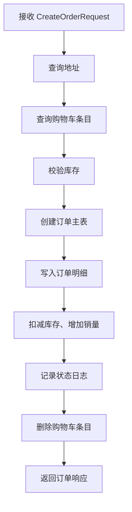
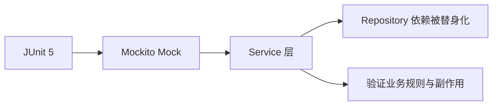

# 后端实现设计

> 文档定位：说明后端分层结构、业务模块与核心服务实现  
> 同步依据：`server/src/main/java/com/ecolink/server/` 下 Controller、Service、Repository、Security、DTO 代码  
> 推荐用途：后端设计与实现说明

## 1. 后端技术选型

后端基于 Spring Boot 3.3.5 与 Java 17 构建，主要依赖如下：

| 技术 | 用途 |
|---|---|
| Spring Web | REST API 开发 |
| Spring Validation | 请求参数校验 |
| Spring Data JPA | 数据访问层 |
| Spring Security | 认证与授权 |
| JJWT | JWT 生成与解析 |
| Flyway | 数据库迁移 |
| springdoc-openapi | Swagger/OpenAPI 文档 |
| Lombok | 简化实体类样板代码 |

## 2. 分层模型

后端采用典型三层结构：

```text
Controller -> Service -> Repository -> Database
```

### 2.1 Controller 层

负责：

- 路由映射
- 请求参数绑定
- 调用业务服务
- 返回统一响应对象

主要控制器包括：

- `AuthController`
- `ProductController`
- `OrderController`
- `AddressController`
- `CartController`
- `FavoriteController`
- `admin/*`

### 2.2 Service 层

负责：

- 业务规则处理
- 事务控制
- 多实体协同
- 业务异常抛出

### 2.3 Repository 层

负责：

- 基于实体对象完成数据库查询与持久化
- 使用 Spring Data JPA 自动生成常用查询
- 在部分复杂场景使用 `Specification` 动态拼装条件

### 2.4 包结构与职责映射

| 包路径 | 主要职责 | 代表类 |
|---|---|---|
| `common` | 通用响应与分页结构 | `ApiResponse` `PageResult` |
| `config` | 安全与跨域配置 | `SecurityConfig` |
| `controller` | 前台接口控制器 | `AuthController` `ProductController` |
| `controller.admin` | 后台接口控制器 | `AdminDashboardController` `AdminOrderController` |
| `service` | 业务逻辑与事务控制 | `AuthService` `OrderService` |
| `repository` | 数据访问层 | `ProductRepository` `OrderRepository` |
| `security` | JWT、过滤器、登录态工具 | `JwtTokenProvider` `JwtAuthFilter` `SecurityUtils` |
| `dto` | 请求与响应模型 | `LoginRequest` `OrderResponse` |
| `domain` | 持久化实体 | `User` `Product` `Order` |

## 3. 核心业务服务设计

## 3.1 认证服务 AuthService

认证服务包含三个核心能力：

- 用户注册
- 用户登录
- 获取当前登录用户信息

### 注册流程

1. 检查用户名是否重复
2. 对密码进行加密
3. 初始化用户状态
4. 保存用户
5. 签发 JWT
6. 返回 token 与用户信息

### 认证服务关键实现点

- 使用 `PasswordEncoder` 保存密码摘要，而非明文密码
- JWT 中同时携带 `userId`、`username`、`role`
- 通过 `SecurityUtils.currentUserId()` 从安全上下文提取当前用户
- 注册成功后直接返回已登录状态，减少二次登录操作

### 登录流程

1. 按用户名查询用户
2. 校验账号状态
3. 校验密码
4. 生成 JWT
5. 返回前端用户信息

## 3.2 商品服务 ProductService

商品服务包含三个核心接口：

- 分类列表
- 商品分页查询
- 商品详情

其实现特征：

- 分类只返回已启用分类
- 商品列表默认只查询 `ON_SALE`
- 支持关键词、分类、价格区间、排序策略组合筛选
- 商品详情优先查询商品图表 `product_images`

### 排序策略

```java
case "price_asc" -> Sort.by(Sort.Order.asc("price"), Sort.Order.desc("id"));
case "price_desc" -> Sort.by(Sort.Order.desc("price"), Sort.Order.desc("id"));
case "latest" -> Sort.by(Sort.Order.desc("id"));
default -> Sort.by(Sort.Order.desc("sales"), Sort.Order.desc("id"));
```

该策略表明系统支持常见的“综合排序、价格升序、价格降序、最新上架”四种电商检索方式。

### 动态查询的技术特点

商品检索使用 `Specification<Product>` 构造查询条件，这种方式有三个优势：

- 可以按需拼接查询条件，减少 Repository 固定方法爆炸
- 便于扩展更多筛选项，例如产地、品牌、标签
- 让查询逻辑集中在 Service 层，便于统一维护聚合查询规则

## 3.3 订单服务 OrderService

订单服务是后端最核心的业务模块之一，包含：

- 创建订单
- 查询订单列表
- 查询订单详情
- 模拟支付
- 订单自动流转

### 创建订单流程



### 自动流转机制

系统实现了一个基于定时任务的简化订单生命周期：

- `UNPAID -> PAID`：由用户调用模拟支付接口触发
- `PAID -> SHIPPED`：定时任务自动发货
- `SHIPPED -> COMPLETED`：定时任务自动完成

代码中通过 `@Scheduled(fixedDelay = 5000)` 每 5 秒检查一次可流转订单。

### 订单时间字段设计

订单实体中同时维护以下时间字段：

| 字段 | 触发时机 | 用途 |
|---|---|---|
| `createdAt` | 订单创建时 | 表示下单时间 |
| `paidAt` | 用户模拟支付成功 | 表示支付节点 |
| `shippedAt` | 自动流转或后台发货 | 表示履约发货节点 |
| `completedAt` | 自动流转或后台完成 | 表示订单结束节点 |

这组时间字段不仅用于前台订单页展示，也用于后台订单详情抽屉与状态流转说明。

### 订单服务中的一致性控制

- 下单前先校验库存
- 成功下单后同步扣减库存、增加销量
- 将下单时商品信息写入 `order_items` 快照
- 每次状态流转都写入 `order_status_logs`

这种设计兼顾了库存一致性、订单可回放性和状态可追溯性。

## 3.4 购物车服务 CartService

购物车服务实现了如下业务规则：

- 加购时校验库存
- 同一商品重复加入时合并数量
- 更新购物车数量时再次校验库存
- 下单完成后批量移除已购买条目

该实现体现了电商系统中“库存先校验，再落单，再扣减”的基本原则。

## 3.6 后台管理控制器设计

后台控制器位于 `controller.admin` 包下，负责支撑后台管理相关接口。

### AdminDashboardController

负责返回后台仪表盘统计数据，包括：

- 商品总数、订单总数、用户总数、分类总数
- 在售商品数、下架商品数、低库存商品数
- 各订单状态数量
- 累计营收
- 最近订单
- 热销商品

其设计特点是：

- 汇总字段集中返回，减少前端多次请求
- `recentOrders` 与 `hotProducts` 直接返回卡片所需最小字段集合
- 统计模型与前台用户接口分离，体现管理端接口专用化设计

### AdminOrderController

支持：

- 按订单号和状态筛选
- 分页返回订单列表
- 查询单个订单详情
- 推进订单状态

这使后台能够承担“履约工作台”角色，而不是仅做只读查询。

## 3.5 地址与收藏服务

### 地址服务 AddressService

地址服务除了增删改查外，还实现了“默认地址唯一化”规则：

- 若新增或编辑地址时 `isDefault=true`
- 系统会先清除当前用户已有默认地址
- 再将目标地址设为默认地址

这保证了一个用户在任意时刻最多只有一个默认地址。

### 收藏服务 FavoriteService

收藏服务实现了幂等化处理：

- 如果用户已收藏该商品，则直接返回，不重复插入
- 取消收藏通过 `userId + productId` 直接删除关系

这类实现能够体现“通过唯一关系判定避免重复业务数据”的设计思路。

## 4. DTO 与实体隔离

系统使用 DTO 作为接口层数据模型，例如：

- `LoginRequest`
- `RegisterRequest`
- `ProductItemResponse`
- `ProductDetailResponse`
- `OrderResponse`

这种设计避免了直接暴露数据库实体，优点包括：

- 降低接口与数据库强耦合
- 提高接口模型稳定性
- 便于隐藏内部字段

### DTO + 校验注解的组合设计

```java
public record RegisterRequest(
        @NotBlank(message = "用户名不能为空")
        @Size(min = 4, max = 30, message = "用户名长度需在 4-30 之间")
        String username,
        @NotBlank(message = "密码不能为空")
        @Size(min = 6, max = 30, message = "密码长度需在 6-30 之间")
        String password,
        @NotBlank(message = "昵称不能为空")
        @Size(max = 30, message = "昵称长度不能超过 30")
        String nickname,
        String phone
) {}
```

这一设计将“字段定义”和“输入校验”放在同一处，便于：

- 降低 Controller 层重复校验代码
- 统一约束规则
- 提高接口文档可读性

## 5. 异常处理机制

后端通过 `GlobalExceptionHandler` 实现统一异常返回。

### 已处理的异常类别

- `BizException`：业务异常
- `MethodArgumentNotValidException`：参数校验失败
- `ConstraintViolationException`：约束校验失败
- `HttpMessageNotReadableException`：请求体格式错误
- `Exception`：兜底异常

### 统一返回格式

```json
{
  "code": 4001,
  "message": "参数校验失败",
  "data": null
}
```

### 业务错误码的工程价值

根据现有实现，系统至少包含以下典型错误码：

| 错误码 | 说明 |
|---|---|
| `4001` | 参数校验失败 |
| `4002` | 用户名已存在 |
| `4003` | 账号或密码错误 |
| `4005` | 库存不足 |
| `4006` | 购物车为空 |
| `4010` | 未登录或登录已过期 |
| `4041` | 商品不存在 |
| `4042` | 地址不存在 |
| `4044` | 订单不存在 |
| `5000` | 服务器内部错误 |

## 6. 自动化测试支撑

为提高日常开发与回归检查的稳定性，项目新增了基于 Mockito 的服务层单元测试。

### 测试覆盖范围

| 测试类 | 覆盖重点 |
|---|---|
| `AuthServiceTest` | 注册、重复用户名、登录、密码错误 |
| `ProductServiceTest` | 启用分类映射、商品分页与排序 |
| `CartServiceTest` | 加购成功、库存不足、同商品数量合并 |
| `OrderServiceTest` | 创建订单、库存校验、支付成功、自动流转 |

### 测试设计特点

- 不依赖真实数据库
- 使用 mock 替代 Repository 与外部依赖
- 对订单、库存、销量和状态日志等关键副作用进行断言
- 通过 `TestSecurityContext` 构造登录上下文，验证依赖当前用户的服务逻辑



## 7. 可直接复用的后端实现描述

> 后端采用基于 Spring Boot 的分层架构实现，将接口控制、业务处理和数据访问分离。系统通过 Service 层封装核心业务逻辑，通过 Repository 层完成持久化访问，通过统一异常处理与统一响应格式保证接口风格一致性，通过 DTO 模型隔离数据库实体与接口契约，从而提高了系统的可维护性与可扩展性。

## 8. 来源说明

### 代码依据

- [pom.xml](/E:/HTML+CSS/EcoLink/server/pom.xml)
- [AuthService.java](/E:/HTML+CSS/EcoLink/server/src/main/java/com/ecolink/server/service/AuthService.java)
- [ProductService.java](/E:/HTML+CSS/EcoLink/server/src/main/java/com/ecolink/server/service/ProductService.java)
- [OrderService.java](/E:/HTML+CSS/EcoLink/server/src/main/java/com/ecolink/server/service/OrderService.java)
- [CartService.java](/E:/HTML+CSS/EcoLink/server/src/main/java/com/ecolink/server/service/CartService.java)
- [AddressService.java](/E:/HTML+CSS/EcoLink/server/src/main/java/com/ecolink/server/service/AddressService.java)
- [FavoriteService.java](/E:/HTML+CSS/EcoLink/server/src/main/java/com/ecolink/server/service/FavoriteService.java)
- [AdminDashboardController.java](/E:/HTML+CSS/EcoLink/server/src/main/java/com/ecolink/server/controller/admin/AdminDashboardController.java)
- [AdminOrderController.java](/E:/HTML+CSS/EcoLink/server/src/main/java/com/ecolink/server/controller/admin/AdminOrderController.java)
- [GlobalExceptionHandler.java](/E:/HTML+CSS/EcoLink/server/src/main/java/com/ecolink/server/exception/GlobalExceptionHandler.java)
- [ApiResponse.java](/E:/HTML+CSS/EcoLink/server/src/main/java/com/ecolink/server/common/ApiResponse.java)
- [AuthServiceTest.java](/E:/HTML+CSS/EcoLink/server/src/test/java/com/ecolink/server/service/AuthServiceTest.java)
- [ProductServiceTest.java](/E:/HTML+CSS/EcoLink/server/src/test/java/com/ecolink/server/service/ProductServiceTest.java)
- [CartServiceTest.java](/E:/HTML+CSS/EcoLink/server/src/test/java/com/ecolink/server/service/CartServiceTest.java)
- [OrderServiceTest.java](/E:/HTML+CSS/EcoLink/server/src/test/java/com/ecolink/server/service/OrderServiceTest.java)
