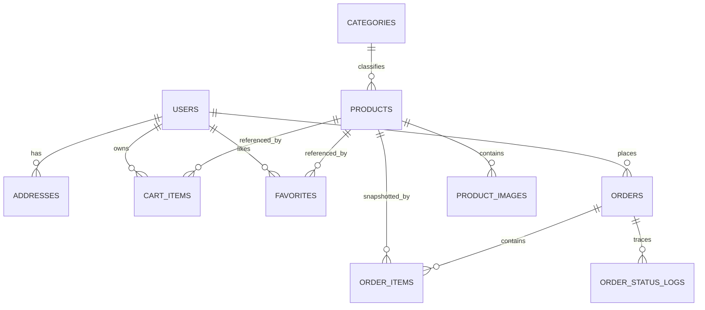
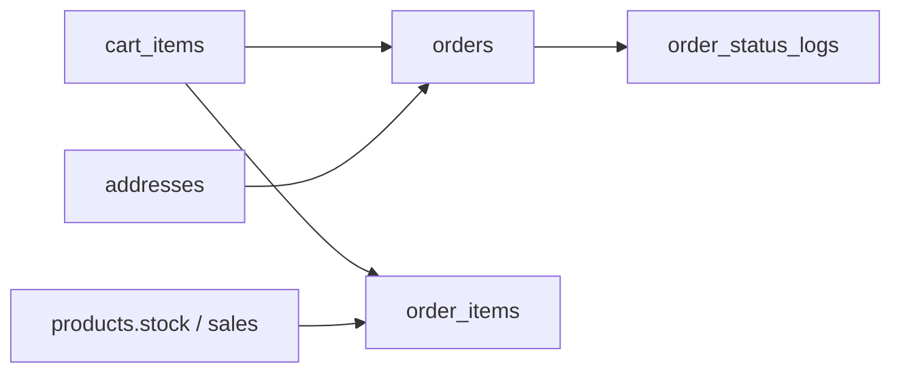

# 数据库设计与数据流

> 文档定位：说明 MySQL 表结构、实体关系、约束设计和典型数据流  
> 同步依据：Flyway 迁移脚本、实体类、订单与购物车服务实现  
> 推荐用途：数据库设计与数据模型说明

## 1. 数据库选型与迁移机制

项目数据库为 MySQL 8.x，表结构由 Flyway 自动迁移。  
迁移脚本位于：

- `V1__schema.sql`：建表与索引
- `V2__seed.sql`：初始化分类、商品、用户等种子数据
- `V3__admin_role.sql`：补充管理员角色和管理员账户
- `V4__fix_admin_password.sql`：修正管理员密码格式

这意味着系统支持：

- 初始化数据库结构
- 多环境重复部署
- 通过版本化 SQL 维护结构演进

## 2. 核心数据表

| 表名 | 功能 |
|---|---|
| `users` | 存储用户账号、密码摘要、昵称、手机号、状态 |
| `categories` | 商品分类 |
| `products` | 商品主表，记录价格、库存、销量、状态 |
| `product_images` | 商品图片扩展表 |
| `favorites` | 用户收藏关系 |
| `addresses` | 用户收货地址 |
| `cart_items` | 用户购物车条目 |
| `orders` | 订单主表 |
| `order_items` | 订单快照明细 |
| `order_status_logs` | 订单状态变化日志 |

## 3. ER 关系图



## 4. 关键字段设计

### 4.1 用户表 `users`

核心字段：

- `username`：唯一用户名
- `password_hash`：密码摘要
- `status`：用户状态
- `role`：用户角色，后续由迁移脚本补充

字段级说明：

| 字段 | 类型 | 说明 |
|---|---|---|
| `id` | `BIGINT` | 主键 |
| `username` | `VARCHAR(50)` | 登录名，唯一 |
| `password_hash` | `VARCHAR(255)` | 密码摘要 |
| `nickname` | `VARCHAR(50)` | 用户昵称 |
| `phone` | `VARCHAR(20)` | 手机号 |
| `status` | `VARCHAR(20)` | 用户状态 |
| `role` | `VARCHAR(20)` | 用户角色 |

### 4.2 商品表 `products`

核心字段：

- `category_id`：分类外键
- `price`：商品价格
- `stock`：库存
- `sales`：销量
- `status`：在售/下架状态

字段级说明：

| 字段 | 类型 | 说明 |
|---|---|---|
| `category_id` | `BIGINT` | 分类外键 |
| `name` | `VARCHAR(120)` | 商品名称 |
| `subtitle` | `VARCHAR(500)` | 副标题 |
| `price` | `DECIMAL(10,2)` | 单价 |
| `stock` | `INT` | 库存 |
| `sales` | `INT` | 销量 |
| `main_image` | `VARCHAR(500)` | 主图 |
| `detail` | `TEXT` | 详情文本 |
| `status` | `VARCHAR(20)` | 商品状态 |

### 4.3 订单表 `orders`

核心字段：

- `order_no`：唯一订单号
- `status`：订单状态
- `total_amount`：订单金额
- `receiver_name` / `receiver_phone` / `receiver_address`：下单时收货快照
- `paid_at` / `shipped_at` / `completed_at`：状态时间戳

字段级说明：

| 字段 | 类型 | 说明 |
|---|---|---|
| `order_no` | `VARCHAR(40)` | 订单编号，唯一 |
| `status` | `VARCHAR(20)` | 订单状态 |
| `total_amount` | `DECIMAL(10,2)` | 总金额 |
| `receiver_name` | `VARCHAR(50)` | 收货人 |
| `receiver_phone` | `VARCHAR(20)` | 收货电话 |
| `receiver_address` | `VARCHAR(500)` | 收货地址 |
| `paid_at` | `DATETIME` | 支付时间 |
| `shipped_at` | `DATETIME` | 发货时间 |
| `completed_at` | `DATETIME` | 完成时间 |

### 4.4 订单明细表 `order_items`

该表保留商品下单时快照，包括：

- 商品名称
- 商品图片
- 成交单价
- 数量

这避免了后续商品信息变化导致历史订单无法回放的问题。

## 5. 索引与约束设计

### 5.1 唯一约束

```sql
CONSTRAINT uk_favorites_user_product UNIQUE (user_id, product_id)
CONSTRAINT uk_cart_items_user_product UNIQUE (user_id, product_id)
```

作用：

- 防止同一用户对同一商品重复收藏
- 防止购物车中同一商品出现重复行

### 5.2 查询索引

```sql
CREATE INDEX idx_products_category_status_price ON products(category_id, status, price);
CREATE INDEX idx_orders_user_created_at ON orders(user_id, created_at);
CREATE INDEX idx_cart_items_user ON cart_items(user_id);
```

作用：

- 优化商品筛选与排序
- 优化用户订单列表倒序查询
- 优化购物车查询

### 5.3 迁移脚本的演进意义

| 迁移脚本 | 技术作用 |
|---|---|
| `V1__schema.sql` | 初始化表结构、外键和索引 |
| `V2__seed.sql` | 注入种子数据，便于快速初始化系统 |
| `V3__admin_role.sql` | 引入角色字段并初始化管理员账号 |
| `V4__fix_admin_password.sql` | 修正管理员密码格式以兼容当前认证逻辑 |

## 6. 典型数据流

## 6.1 下单数据流



### 下单过程中的写入动作

1. 从 `addresses` 中读取当前用户选定地址
2. 从 `cart_items` 中读取待下单商品
3. 向 `orders` 写入订单主记录
4. 向 `order_items` 写入订单明细快照
5. 更新 `products.stock` 与 `products.sales`
6. 向 `order_status_logs` 写入初始状态
7. 删除已购买的 `cart_items`

## 6.2 商品详情数据流

1. 从 `products` 查询商品主信息
2. 从 `product_images` 查询多图
3. 若无附图，则回退为 `main_image`
4. 拼装为 `ProductDetailResponse`

## 6.3 收藏与购物车数据流

### 收藏关系流

1. 前端发送收藏请求
2. 系统按 `user_id + product_id` 判重
3. 若不存在则插入收藏关系

### 购物车关系流

1. 前端发送加购请求
2. 系统检查是否已有同一商品条目
3. 已有则累加数量，无则创建新条目
4. 每次变更都校验库存

## 7. SQL 片段示例

### 商品与分类外键

```sql
CONSTRAINT fk_products_category
FOREIGN KEY (category_id) REFERENCES categories(id)
```

### 收藏唯一约束

```sql
CONSTRAINT uk_favorites_user_product UNIQUE (user_id, product_id)
```

### 购物车唯一约束

```sql
CONSTRAINT uk_cart_items_user_product UNIQUE (user_id, product_id)
```

## 7. 可直接复用的数据库描述

> 数据库设计采用关系型建模方法，将用户、商品、分类、订单、购物车、收藏、地址等核心业务对象拆分为独立数据表，并通过主外键约束维护实体关联。针对商品检索、订单查询和购物车访问等高频场景建立复合索引与唯一约束，从而在保证数据一致性的同时兼顾查询性能。

## 8. 来源说明

### 代码依据

- [V1__schema.sql](/E:/HTML+CSS/EcoLink/server/src/main/resources/db/migration/V1__schema.sql)
- [V2__seed.sql](/E:/HTML+CSS/EcoLink/server/src/main/resources/db/migration/V2__seed.sql)
- [OrderService.java](/E:/HTML+CSS/EcoLink/server/src/main/java/com/ecolink/server/service/OrderService.java)
- [ProductService.java](/E:/HTML+CSS/EcoLink/server/src/main/java/com/ecolink/server/service/ProductService.java)
- [database-er.md](/E:/HTML+CSS/EcoLink/docs/database-er.md)
