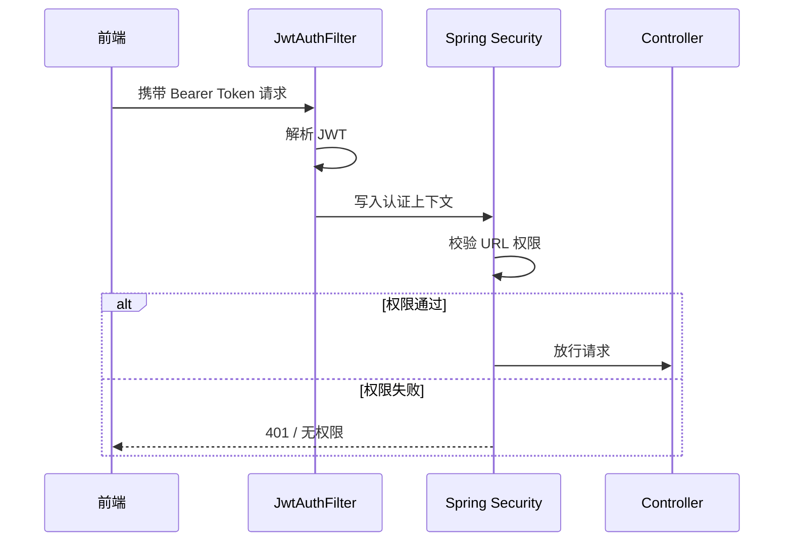

# 接口设计与安全机制

> 文档定位：说明 REST API 设计、统一响应结构、鉴权机制与权限边界  
> 同步依据：Controller、Security、JWT、HTTP 客户端与异常处理代码  
> 推荐用途：毕业论文“接口设计”“系统安全设计”章节

## 1. API 组织方式

系统接口统一以 `/api/v1` 为前缀，并分为两类：

| 类别 | 前缀 | 说明 |
|---|---|---|
| 前台接口 | `/api/v1/**` | 面向普通用户 |
| 后台接口 | `/api/v1/admin/**` | 面向管理员 |

## 2. 统一响应结构

后端使用 `ApiResponse<T>` 统一封装响应，结构如下：

```json
{
  "code": 0,
  "message": "success",
  "data": {}
}
```

错误时返回：

```json
{
  "code": 4010,
  "message": "未登录或登录已过期",
  "data": null
}
```

统一返回结构的优点：

- 前端可统一处理成功与失败
- 便于论文中定义“接口返回规范”
- 后续容易扩展 traceId、timestamp 等字段

## 3. 核心接口清单

## 3.1 认证接口

| 方法 | 路径 | 说明 |
|---|---|---|
| `POST` | `/api/v1/auth/register` | 用户注册 |
| `POST` | `/api/v1/auth/login` | 用户登录 |
| `GET` | `/api/v1/users/me` | 获取当前用户 |

示例：

```json
POST /api/v1/auth/login
{
  "username": "admin",
  "password": "admin123"
}
```

## 3.2 商品接口

| 方法 | 路径 | 说明 |
|---|---|---|
| `GET` | `/api/v1/categories` | 获取启用分类 |
| `GET` | `/api/v1/products` | 商品分页查询 |
| `GET` | `/api/v1/products/{id}` | 商品详情 |

支持参数：

- `keyword`
- `categoryId`
- `minPrice`
- `maxPrice`
- `sort`
- `page`
- `size`

## 3.3 订单接口

| 方法 | 路径 | 说明 |
|---|---|---|
| `POST` | `/api/v1/orders` | 创建订单 |
| `GET` | `/api/v1/orders` | 当前用户订单列表 |
| `GET` | `/api/v1/orders/{id}` | 当前用户订单详情 |
| `POST` | `/api/v1/orders/{id}/pay` | 模拟支付 |

## 3.4 后台接口

| 方法 | 路径 | 说明 |
|---|---|---|
| `GET` | `/api/v1/admin/dashboard` | 获取后台仪表盘指标 |
| `GET/POST/PUT/DELETE` | `/api/v1/admin/categories` | 分类管理 |
| `GET/POST/PUT/DELETE` | `/api/v1/admin/products` | 商品管理 |
| `GET/PUT` | `/api/v1/admin/orders` | 订单管理 |

### 3.5 接口语义补充

#### 用户订单响应

当前订单接口返回的核心时间字段包括：

- `paidAt`
- `shippedAt`
- `completedAt`
- `createdAt`

这意味着前台可以在订单列表和订单详情中展示完整状态时间轴，而不是只展示下单时间。

#### 后台订单详情响应

后台订单详情接口 `GET /api/v1/admin/orders/{id}` 返回结构为：

```json
{
  "order": {
    "id": 1,
    "orderNo": "ECO202603130001",
    "status": "SHIPPED",
    "totalAmount": 59.80,
    "receiverName": "张三",
    "receiverPhone": "13800000000",
    "receiverAddress": "北京市朝阳区绿色农业科技大厦 12F",
    "createdAt": "2026-03-13T10:00:00",
    "paidAt": "2026-03-13T10:03:00",
    "shippedAt": "2026-03-13T10:08:00",
    "completedAt": ""
  },
  "items": [
    {
      "id": 11,
      "productName": "高山阳光青提",
      "productImage": "https://...",
      "salePrice": 29.90,
      "quantity": 2,
      "subtotal": 59.80
    }
  ]
}
```

这种“订单头 + 商品明细”结构便于后台详情抽屉一次性渲染收货信息、状态信息和商品列表。

#### 仪表盘统计响应

后台仪表盘除基础计数字段外，还返回两组列表：

- `recentOrders`：最近订单卡片数据
- `hotProducts`：热销商品卡片数据

这使前端无需二次加工完整实体即可直接用于概览看板展示。

## 4. JWT 认证机制

JWT 由 `JwtTokenProvider` 生成和解析，token 中包含以下声明：

- `sub`：用户 ID
- `username`：用户名
- `role`：角色
- `iss`：签发者
- `iat`：签发时间
- `exp`：过期时间

生成逻辑示例：

```java
return Jwts.builder()
    .issuer(jwtProperties.getIssuer())
    .subject(String.valueOf(userId))
    .claim("username", username)
    .claim("role", role)
    .issuedAt(Date.from(now))
    .expiration(Date.from(exp))
    .signWith(secretKey())
    .compact();
```

## 5. 安全控制流程



## 6. 权限策略

### 6.1 放行资源

以下资源无需登录即可访问：

- Swagger UI
- OpenAPI 文档
- `/api/v1/auth/**`
- `/api/v1/categories/**`
- `/api/v1/products/**`
- `/actuator/health`

### 6.2 登录资源

除放行资源外，其他接口默认要求认证。

### 6.3 管理员资源

`/api/v1/admin/**` 要求角色为 `ADMIN`。

## 7. CORS 与前后端联调

后端在 `application.yml` 中配置了允许来源：

```yaml
app:
  cors:
    allowed-origins: ${CORS_ALLOWED_ORIGINS:http://localhost:3000,http://localhost:5173}
```

这说明系统默认支持前端本地开发常用端口联调。

## 8. 安全设计总结

系统安全机制具有以下特征：

- 通过 JWT 实现无状态认证
- 通过 Spring Security 实现接口级权限控制
- 通过角色字段区分普通用户与管理员
- 通过统一异常与 401 处理保证前后端行为一致

## 9. 前后端双重防护设计

除后端 Spring Security 外，前端也通过路由守卫承担了第一层访问控制：

1. 未登录访问受保护页面时，自动跳转登录页。
2. 登录页通过 `redirect` 参数保留回跳目标。
3. 非管理员用户访问 `/admin/**` 时，前端会先行拦截回首页。

这种双层防护策略的优点包括：

- 降低未登录用户进入受限页面后的空白或报错概率
- 提升交互连续性
- 让“权限控制”既体现在接口层，也体现在页面层

## 10. 论文可直接引用的安全描述

> 系统采用基于 JWT 的无状态认证机制，在用户登录后由后端签发包含用户身份与角色信息的访问令牌，前端在后续请求中通过 Authorization 头携带该令牌。后端结合 Spring Security 对接口访问进行统一拦截，并针对后台管理接口实施基于角色的访问控制，从而实现了认证与授权的一体化安全设计。

## 11. 来源说明

### 代码依据

- [AuthController.java](/E:/HTML+CSS/EcoLink/server/src/main/java/com/ecolink/server/controller/AuthController.java)
- [ProductController.java](/E:/HTML+CSS/EcoLink/server/src/main/java/com/ecolink/server/controller/ProductController.java)
- [OrderController.java](/E:/HTML+CSS/EcoLink/server/src/main/java/com/ecolink/server/controller/OrderController.java)
- [AdminDashboardController.java](/E:/HTML+CSS/EcoLink/server/src/main/java/com/ecolink/server/controller/admin/AdminDashboardController.java)
- [AdminOrderController.java](/E:/HTML+CSS/EcoLink/server/src/main/java/com/ecolink/server/controller/admin/AdminOrderController.java)
- [SecurityConfig.java](/E:/HTML+CSS/EcoLink/server/src/main/java/com/ecolink/server/config/SecurityConfig.java)
- [JwtTokenProvider.java](/E:/HTML+CSS/EcoLink/server/src/main/java/com/ecolink/server/security/JwtTokenProvider.java)
- [GlobalExceptionHandler.java](/E:/HTML+CSS/EcoLink/server/src/main/java/com/ecolink/server/exception/GlobalExceptionHandler.java)
- [src/api/http.ts](/E:/HTML+CSS/EcoLink/src/api/http.ts)
- [src/router/index.ts](/E:/HTML+CSS/EcoLink/src/router/index.ts)
