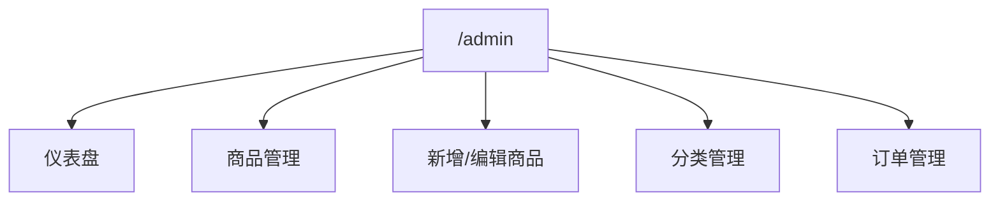
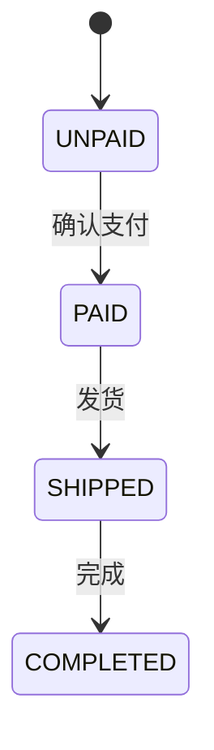

# 后台管理模块设计

> 文档定位：说明后台管理端的功能划分、前端页面组织、后端接口支撑与运营价值  
> 同步依据：后台路由、后台页面、后台控制器与管理 API  
> 推荐用途：后台管理模块说明

## 1. 后台模块定位

后台管理模块服务于管理员角色，主要承担以下职责：

- 查看整体运营指标
- 管理商品与商品状态
- 管理分类启用与排序
- 查询订单并推进履约状态

后台访问入口为：

- 前端路由：`/admin/**`
- 后端接口：`/api/v1/admin/**`

## 2. 后台前端页面结构

后台页面集中位于：

- `src/layouts/AdminLayout.vue`
- `src/views/admin/Dashboard.vue`
- `src/views/admin/ProductList.vue`
- `src/views/admin/ProductForm.vue`
- `src/views/admin/CategoryList.vue`
- `src/views/admin/OrderList.vue`

## 3. 仪表盘设计

仪表盘当前包含以下信息：

- 商品总数
- 订单总数
- 用户总数
- 分类总数
- 在售商品数
- 下架商品数
- 低库存商品数
- 各订单状态数量
- 累计营收
- 最近订单
- 热销商品

对应后端接口：

- `GET /api/v1/admin/dashboard`

这类设计能够支撑“运营总览界面”或“管理驾驶舱”部分的描述。

### 3.1 指标与数据来源映射

| 指标 | 数据来源 |
|---|---|
| 商品总数 | `productRepository.count()` |
| 在售/下架商品数 | `countByStatus(ProductStatus)` |
| 低库存商品数 | `countByStockLessThanEqual(50)` |
| 各订单状态数量 | `countByStatus(OrderStatus)` |
| 累计营收 | 过滤非 `UNPAID` 订单后汇总 `totalAmount` |
| 最近订单 | `findTop5ByOrderByCreatedAtDescIdDesc()` |
| 热销商品 | `findTop5ByOrderBySalesDescIdDesc()` |

这说明仪表盘不是静态页面，而是由后端聚合查询直接驱动的管理视图。

## 4. 商品管理设计

商品管理包含：

- 商品列表分页
- 关键词筛选
- 分类筛选
- 状态筛选
- 上下架切换
- 商品新增
- 商品编辑
- 商品删除

### 技术实现特点

- 列表页通过筛选器与分页组合查询后台接口
- 表单页复用新增与编辑逻辑
- 编辑页使用单商品详情接口，而不是全量扫描列表
- 页面展示实时预览卡片，提升录入效率

## 5. 分类管理设计

分类管理支持：

- 新增分类
- 编辑分类
- 删除分类
- 配置排序值
- 配置启用状态

分类在前台只返回“启用”数据，在后台返回完整数据，这体现了“同一基础数据、不同视角展示”的设计方式。

## 6. 订单管理设计

订单管理页实现了：

- 按订单号筛选
- 按状态筛选
- 查看订单详情抽屉
- 查看收货信息
- 查看商品明细
- 推进订单状态

### 6.1 详情抽屉模型

后台订单详情抽屉当前聚合展示三类信息：

1. 订单摘要  
包含订单状态、订单金额、下单时间和最近状态时间。

2. 收货信息  
包含收货人姓名、手机号和收货地址。

3. 商品明细  
包含商品名称、图片、单价、数量和小计。

该设计可以将原本分散在多个接口或页面中的信息集中展示，减少管理员处理订单时的页面切换成本。

### 订单状态流转

说明：

- 在前台，`UNPAID -> PAID` 可由用户模拟支付触发
- 在后台，管理员也可根据业务需要推进状态
- 订单状态时间字段会随状态变化同步更新

### 6.2 状态处理可见性

为了提升后台操作可见性，后台订单页同时提供：

- 列表行级“详情 / 发货 / 完成”按钮
- 详情抽屉中的快捷处理按钮
- 状态更新后的即时消息反馈

这样既便于快速执行管理动作，也更符合真实后台工作台的交互习惯。

## 7. 后台权限控制

后台管理采用前后端双重校验：

### 前端校验

- 路由 `meta.requiresAdmin = true`
- 非管理员用户自动跳回首页

### 后端校验

- `/api/v1/admin/**` 要求 `ADMIN` 角色

这保证了即使前端路由被绕过，后台接口仍不会被普通用户调用。

## 8. 后台模块的业务价值

对于项目整体来说，后台管理模块的价值体现在：

- 体现系统不仅具备用户侧功能，也具备运营维护能力
- 展示了基于角色的权限隔离思想
- 说明系统已考虑数据维护、订单履约和商品运营等管理场景

## 9. 后台使用建议

后台模块推荐按以下顺序展示：

1. 仪表盘：先讲整体运营指标和数据来源。
2. 商品管理：展示筛选、编辑、上下架等运营动作。
3. 分类管理：说明基础数据维护与前台分类展示的关系。
4. 订单管理：打开详情抽屉，再执行发货或完成操作。

## 10. 可直接引用的总结描述

> 后台管理模块以管理员为核心用户，采用独立路由前缀、独立布局和独立接口前缀进行功能隔离，实现了商品管理、分类管理、订单管理和运营仪表盘等功能。该模块在系统中承担运营支撑与数据维护职责，是前台业务闭环的重要补充。

## 11. 来源说明

### 代码依据

- [src/router/index.ts](/E:/HTML+CSS/EcoLink/src/router/index.ts)
- [AdminLayout.vue](/E:/HTML+CSS/EcoLink/src/layouts/AdminLayout.vue)
- [Dashboard.vue](/E:/HTML+CSS/EcoLink/src/views/admin/Dashboard.vue)
- [ProductList.vue](/E:/HTML+CSS/EcoLink/src/views/admin/ProductList.vue)
- [ProductForm.vue](/E:/HTML+CSS/EcoLink/src/views/admin/ProductForm.vue)
- [CategoryList.vue](/E:/HTML+CSS/EcoLink/src/views/admin/CategoryList.vue)
- [OrderList.vue](/E:/HTML+CSS/EcoLink/src/views/admin/OrderList.vue)
- [AdminDashboardController.java](/E:/HTML+CSS/EcoLink/server/src/main/java/com/ecolink/server/controller/admin/AdminDashboardController.java)
- [AdminProductController.java](/E:/HTML+CSS/EcoLink/server/src/main/java/com/ecolink/server/controller/admin/AdminProductController.java)
- [AdminCategoryController.java](/E:/HTML+CSS/EcoLink/server/src/main/java/com/ecolink/server/controller/admin/AdminCategoryController.java)
- [AdminOrderController.java](/E:/HTML+CSS/EcoLink/server/src/main/java/com/ecolink/server/controller/admin/AdminOrderController.java)
