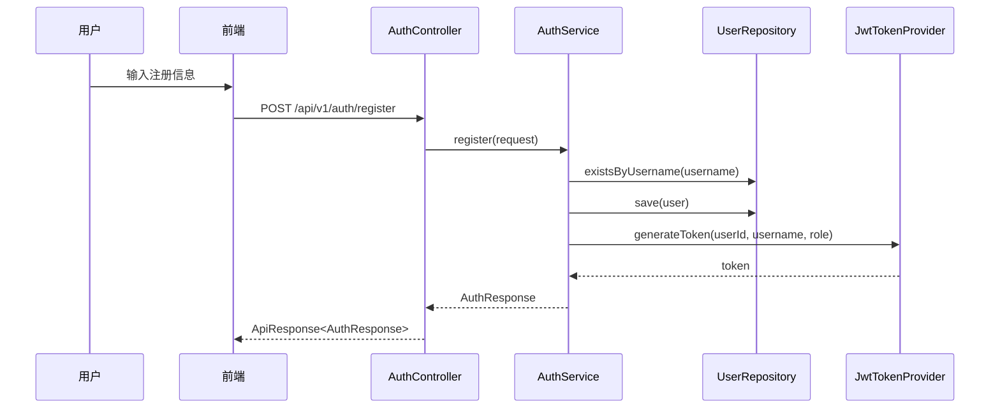
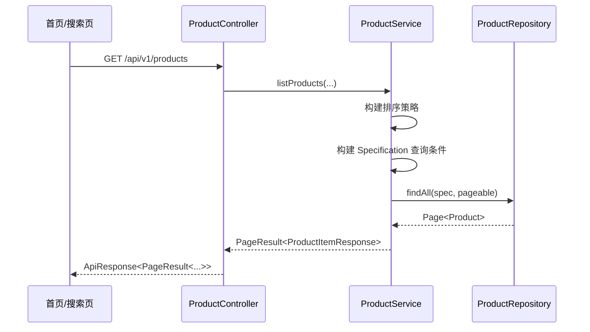
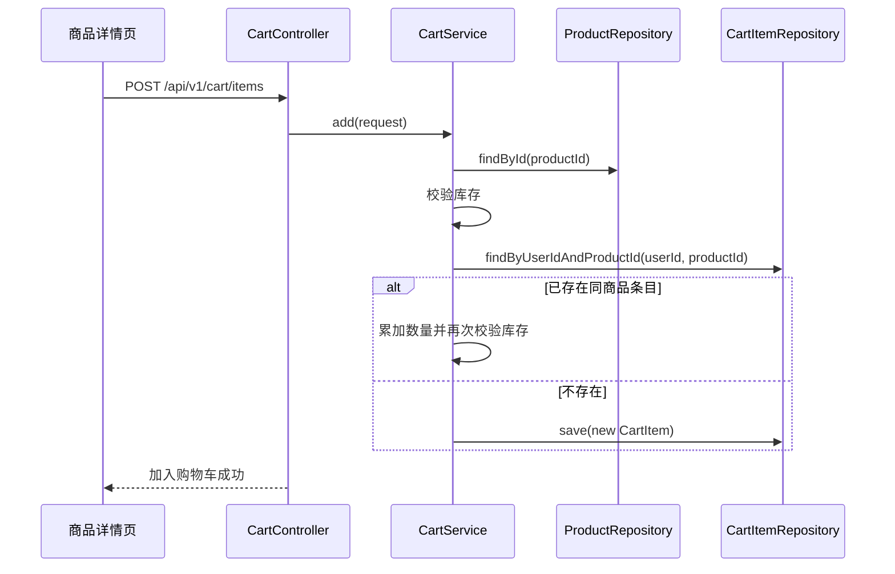
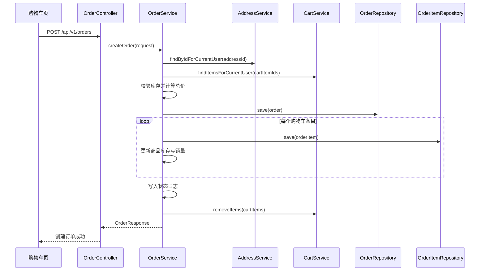

# 核心业务流程与时序

> 文档定位：对系统关键业务流程进行时序级分析  
> 同步依据：认证、购物车、订单、地址、收藏与后台订单相关代码  
> 推荐用途：毕业论文“系统关键流程设计”“业务流程分析”章节

## 1. 用户注册登录流程

### 关键技术点

- 注册成功后直接签发 JWT，前端可立即进入登录态
- 登录与注册共享统一的认证响应结构
- 角色信息在登录阶段即写入 JWT，用于后续后台权限控制

## 2. 商品检索流程

该流程体现了前台商品查询的三层职责分离：

- Controller 负责参数接收
- Service 负责筛选和排序规则
- Repository 负责数据库检索

## 3. 加入购物车流程

## 4. 创建订单流程

### 流程特征

- 订单创建使用地址表和购物车表的现有数据
- 下单成功后库存实时扣减
- 订单明细保留商品快照
- 创建完成后移除已结算购物车条目

## 5. 支付与自动流转流程

### 5.1 模拟支付

1. 前端调用 `POST /api/v1/orders/{id}/pay`
2. 后端校验订单归属与状态
3. 将状态改为 `PAID`
4. 写入支付时间和状态日志

### 5.2 自动流转

说明：

- `UNPAID -> PAID` 由接口显式触发
- `PAID -> SHIPPED` 与 `SHIPPED -> COMPLETED` 由 `@Scheduled` 定时任务触发

## 6. 默认地址处理流程

地址模块中有一个较典型的业务规则：默认地址唯一。

处理逻辑如下：

1. 用户新增或编辑地址
2. 若当前请求声明 `isDefault=true`
3. 系统先查询当前用户已有地址
4. 将原默认地址重置为非默认
5. 再保存当前地址为默认地址

## 7. 收藏流程

收藏模块实现较轻，但体现了幂等化设计：

1. 用户发起收藏请求
2. 系统先判断是否已存在对应收藏关系
3. 若已存在，则直接返回
4. 若不存在，则新增收藏记录

## 8. 后台订单处理流程

后台管理端不仅支持查看订单列表，还支持从详情视图继续推进状态：

- 待支付订单可标记为已支付
- 已支付订单可标记为已发货
- 已发货订单可标记为已完成

这使后台具有基本的履约支撑能力。

## 9. 论文可直接引用的流程总结

> 系统在关键业务流程中采用“先校验、后写入、再回写状态”的顺序化处理方式。以订单创建为例，系统先验证收货地址和库存，再生成订单主记录与订单明细，随后更新库存与销量，并记录状态日志，最终清理购物车数据，从而保证业务流程的一致性和可追踪性。

## 10. 来源说明

### 代码依据

- [AuthService.java](/E:/HTML+CSS/EcoLink/server/src/main/java/com/ecolink/server/service/AuthService.java)
- [ProductService.java](/E:/HTML+CSS/EcoLink/server/src/main/java/com/ecolink/server/service/ProductService.java)
- [CartService.java](/E:/HTML+CSS/EcoLink/server/src/main/java/com/ecolink/server/service/CartService.java)
- [OrderService.java](/E:/HTML+CSS/EcoLink/server/src/main/java/com/ecolink/server/service/OrderService.java)
- [AddressService.java](/E:/HTML+CSS/EcoLink/server/src/main/java/com/ecolink/server/service/AddressService.java)
- [FavoriteService.java](/E:/HTML+CSS/EcoLink/server/src/main/java/com/ecolink/server/service/FavoriteService.java)
- [AdminOrderController.java](/E:/HTML+CSS/EcoLink/server/src/main/java/com/ecolink/server/controller/admin/AdminOrderController.java)

