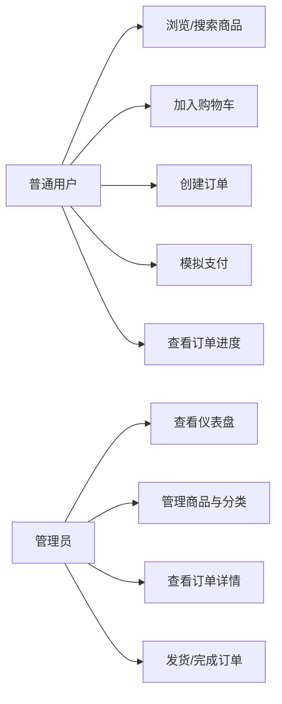

# 10. 需求分析与可行性评估

> 文档类型：项目分析文档  
> 同步时间：2026-03-13  
> 目标：从业务、角色、功能边界和实现条件四个层面，说明 EcoLink 为什么要做、做什么、为什么能做成

## 1. 项目背景

EcoLink 面向“生态农产品电商”这一典型垂直场景，核心问题有三类：

1. 线下农产品交易链条长，消费者难以直观感知商品来源与品质。
2. 小型农产品销售方缺少低成本的线上展示、订单处理和基础运营能力。
3. 项目需要一个既有用户侧业务闭环、又有后台管理深度的完整信息系统案例。

因此，本项目将目标聚焦为“一个可复现、可维护、业务链路完整的生态农产品电商系统”，而不是无限扩展到支付网关、复杂物流、退款结算等更大业务域。

## 2. 角色分析

### 2.1 普通用户

- 关注点：商品是否新鲜、是否可信、下单是否顺畅、订单状态是否清晰。
- 核心任务：浏览商品、搜索筛选、查看详情、加入购物车、提交订单、模拟支付、查看订单。

### 2.2 管理员

- 关注点：商品是否可维护、库存是否可观测、订单是否可履约、数据是否可汇总。
- 核心任务：查看仪表盘、管理商品、维护分类、查看订单详情、推进订单状态。

## 3. 功能需求拆解

### 3.1 前台用户侧需求

| 模块 | 需求说明 | 当前实现情况 |
|---|---|---|
| 用户认证 | 注册、登录、获取当前用户信息 | 已实现 |
| 商品浏览 | 首页推荐、分类浏览、详情页展示 | 已实现 |
| 商品检索 | 关键字搜索、分类筛选、价格排序 | 已实现 |
| 收藏能力 | 收藏商品、取消收藏、查看收藏列表 | 已实现 |
| 地址管理 | 新增、修改、删除、默认地址 | 已实现 |
| 购物车 | 加购、改数量、删除、金额汇总 | 已实现 |
| 订单管理 | 创建订单、列表、详情、模拟支付 | 已实现 |
| 状态可视化 | 支付、发货、完成等状态提示 | 已增强 |

### 3.2 后台管理侧需求

| 模块 | 需求说明 | 当前实现情况 |
|---|---|---|
| 仪表盘 | 商品数、订单数、低库存、营收、热销商品、最近订单 | 已实现 |
| 商品管理 | 新增、编辑、删除、上下架、条件筛选 | 已实现 |
| 分类管理 | 新增、修改、启停、删除 | 已实现 |
| 订单管理 | 列表筛选、详情抽屉、发货/完成操作 | 已实现 |
| 权限控制 | 后台路由与接口仅管理员可访问 | 已实现 |

## 4. 业务边界

本项目明确采用“当前版本可控范围”策略，以下内容不纳入本次实现：

- 真实第三方支付接口
- 退款、退货、售后仲裁
- 复杂物流轨迹同步
- 秒杀、大促、优惠券等高并发营销系统

这样做的原因是：毕业设计更强调系统分析、架构设计、核心流程落地与代码实现质量，而不是覆盖完整商业化电商平台的全部能力。

## 5. 可行性分析

### 5.1 技术可行性

- 前端采用 Vue 3 + TypeScript + Pinia + Vue Router，适合快速搭建响应式页面与前台/后台双视图。
- 后端采用 Spring Boot + Spring Security + JPA，能够高效支撑权限控制、业务分层和 REST API 输出。
- MySQL + Flyway 使数据结构和初始化数据具备可迁移、可复现能力。
- 当前项目已形成前后端分离架构，具备继续增强而非推倒重来的基础。

### 5.2 经济可行性

- 项目基于开源技术栈构建，无额外商业授权成本。
- 所需开发环境仅包括 Node.js、JDK 17、Maven、MySQL，适合常规本地开发与部署条件。
- 通过模拟支付和本地部署规避了真实支付网关与云资源成本。

### 5.3 实施可行性

- 核心实体数量适中，围绕用户、商品、购物车、订单、后台管理展开，复杂度适合毕业设计周期。
- 现有代码已经具备完整闭环，本轮优化主要是稳定性、展示力和文档化增强。
- Flyway 种子数据已提供默认用户、管理员、商品、分类、地址和购物车数据，初始化门槛低。

## 6. 用例视图

## 7. 可直接复用的结论

可将本章结论概括为：

1. EcoLink 的需求边界清晰，围绕生态农产品电商的核心交易闭环展开。
2. 项目同时覆盖 C 端交易流程与后台管理流程，具备较好的毕业设计展示完整性。
3. 所选技术栈成熟、成本低、开发效率高，能够满足项目在功能、性能和复现性方面的要求。

## 8. 来源说明

### 代码与文档依据

- [README.md](/E:/HTML+CSS/EcoLink/README.md)
- [src/router/index.ts](/E:/HTML+CSS/EcoLink/src/router/index.ts)
- [AuthService.java](/E:/HTML+CSS/EcoLink/server/src/main/java/com/ecolink/server/service/AuthService.java)
- [ProductService.java](/E:/HTML+CSS/EcoLink/server/src/main/java/com/ecolink/server/service/ProductService.java)
- [CartService.java](/E:/HTML+CSS/EcoLink/server/src/main/java/com/ecolink/server/service/CartService.java)
- [OrderService.java](/E:/HTML+CSS/EcoLink/server/src/main/java/com/ecolink/server/service/OrderService.java)
- [V2__seed.sql](/E:/HTML+CSS/EcoLink/server/src/main/resources/db/migration/V2__seed.sql)
