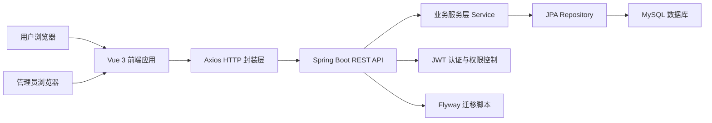

# EcoLink 技术 Wiki

> 文档类型：项目技术 Wiki  
> 同步范围：基于当前仓库前端 `src/`、后端 `server/`、数据库迁移 `server/src/main/resources/db/migration/` 与既有 `docs/` 文档整理  
> 同步时间：2026-03-13  
> 维护原则：只记录代码中已经实现或可直接验证的技术事实

## 1. Wiki 目标

本 Wiki 用于集中整理 EcoLink 项目的架构设计、功能实现、运行方式与配套说明。  
文档重点覆盖以下五类内容：

- 系统总体架构与模块划分
- 前端工程设计与交互实现
- 后端分层设计与核心业务流程
- 数据库结构、约束与数据流
- API 契约、安全控制与后台管理能力

## 2. 阅读导航

- [系统架构总览](./01-系统架构总览.md)
- [前端实现设计](./02-前端实现设计.md)
- [后端实现设计](./03-后端实现设计.md)
- [数据库设计与数据流](./04-数据库设计与数据流.md)
- [接口设计与安全机制](./05-接口设计与安全机制.md)
- [后台管理模块设计](./06-后台管理模块设计.md)
- [核心业务流程与时序](./07-核心业务流程与时序.md)
- [部署配置与工程说明](./08-部署配置与工程说明.md)
- [接口字段与返回模型字典](./09-接口字段与返回模型字典.md)
- [需求分析与可行性评估](./10-需求分析与可行性评估.md)
- [非功能需求与质量目标](./11-非功能需求与质量目标.md)
- [测试设计与验收方案](./12-测试设计与验收方案.md)
- [性能与扩展性分析](./13-性能与扩展性分析.md)
- [项目讲解提纲](./14-项目讲解提纲.md)
- [页面截图清单](./15-页面截图清单.md)
- [常见问题说明](./16-常见问题说明.md)
- [初始化数据说明](./17-初始化数据说明.md)

## 3. 项目概述

EcoLink 是一个前后端分离的生态农产品电商系统，面向两个使用场景：

- C 端用户场景：商品浏览、搜索筛选、购物车、订单、收藏、地址管理
- 管理端场景：商品管理、分类管理、订单管理、运营仪表盘

系统技术栈如下：

| 层次 | 技术选型 |
|---|---|
| 前端 | Vue 3、TypeScript、Vite、Pinia、Vue Router、Tailwind CSS |
| 后端 | Spring Boot 3.3.5、Java 17、Spring Security、Spring Data JPA、Flyway |
| 安全 | JWT、基于角色的路由与接口权限控制 |
| 数据库 | MySQL 8.x |
| 接口文档 | springdoc-openapi / Swagger UI |

## 4. 文档使用建议

如果你希望按不同阅读目标快速定位内容，可以参考下面的对应关系：

| 阅读目标 | 对应文档 |
|---|---|
| 快速了解系统架构 | [系统架构总览](./01-系统架构总览.md) |
| 查看前后端实现 | [前端实现设计](./02-前端实现设计.md)、[后端实现设计](./03-后端实现设计.md) |
| 核对数据库与接口设计 | [数据库设计与数据流](./04-数据库设计与数据流.md)、[接口设计与安全机制](./05-接口设计与安全机制.md) |
| 了解后台能力与业务流程 | [后台管理模块设计](./06-后台管理模块设计.md)、[核心业务流程与时序](./07-核心业务流程与时序.md) |
| 查看部署、字段和质量说明 | [部署配置与工程说明](./08-部署配置与工程说明.md)、[接口字段与返回模型字典](./09-接口字段与返回模型字典.md)、[测试设计与验收方案](./12-测试设计与验收方案.md) |
| 获取补充资料 | [项目讲解提纲](./14-项目讲解提纲.md)、[页面截图清单](./15-页面截图清单.md)、[常见问题说明](./16-常见问题说明.md)、[初始化数据说明](./17-初始化数据说明.md) |

## 5. 现有文档复用入口

仓库中已有两份基础技术文档，可作为本 Wiki 的补充材料：

- [页面-组件-接口映射](../page-component-api-mapping.md)
- [数据库 ER 说明（MVP）](../database-er.md)

## 6. 系统总览图

## 7. 来源说明

### 代码依据

- [README.md](/E:/HTML+CSS/EcoLink/README.md)
- [package.json](/E:/HTML+CSS/EcoLink/package.json)
- [pom.xml](/E:/HTML+CSS/EcoLink/server/pom.xml)
- [src/router/index.ts](/E:/HTML+CSS/EcoLink/src/router/index.ts)
- [SecurityConfig.java](/E:/HTML+CSS/EcoLink/server/src/main/java/com/ecolink/server/config/SecurityConfig.java)
- [V1__schema.sql](/E:/HTML+CSS/EcoLink/server/src/main/resources/db/migration/V1__schema.sql)
